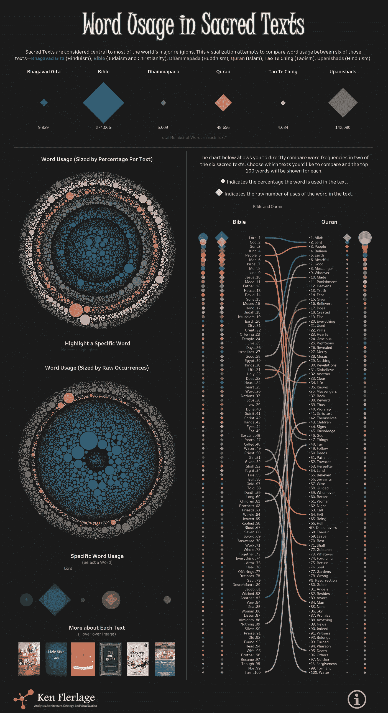

# 数据好奇 2017 年 7 月 24 日:上周的数据故事、数据集和可视化综述

> 原文：<https://towardsdatascience.com/data-curious-24-07-2017-a-roundup-of-data-stories-datasets-and-visualizations-from-last-week-9bc8d49e01ae?source=collection_archive---------8----------------------->

欢迎来到我上周在网上注意到的数据驱动事物的每周综述。这是第 15 周(上周的帖子是[这里是](https://medium.com/towards-data-science/data-curious-17-07-2017-a-roundup-of-data-stories-datasets-and-visualizations-from-last-week-2a6766ac54d6))。

每个星期，我都会剪辑、保存和收藏大量我在网上找到的关于用数据讲述故事的很酷的东西。以下是 6 月 19 日那一周吸引我眼球的内容。在典型的时事通讯中，我会包含一堆链接供你点击，保存起来以后再看(没关系，我们都这样做)。为了赶上下周的帖子，请在媒体上关注我的最新消息。我也是推特上的[。](https://twitter.com/bnj_cooley)

# 好的阅读、分析和教程

上周充满了有趣的学术和实践帖子，涵盖了数据科学、可视化和认知回忆。这是一个密集的综述:希望你能找到有用的东西！

华盛顿大学的研究人员总结了他们最近关于预测可视化如何提高读者的信息回忆和理解的研究。

> 被提示预测和/或解释数据的参与者比只检查数据但没有明确预测或解释的参与者更准确地回忆起单个数据点 24%。

这种允许用户猜测数据，然后从他们的结果中学习的想法已经在媒体格式中使用，以理解复杂的问题。好的例子包括[你画出来:在奥巴马总统任期内什么变得更好或更坏](https://www.nytimes.com/interactive/2017/01/15/us/politics/you-draw-obama-legacy.html?_r=0) (NYT)和[你如何画一个圆？](https://qz.com/994486/the-way-you-draw-circles-says-a-lot-about-you/)(石英)。我喜欢这种讲故事的方式，因为它让用户感觉他们在自己学习一些东西。现在， [UW 互动数据实验室](https://medium.com/@uwdata)已经表明，它实际上对回忆也更有效。

[Deborah Mesquita](https://medium.freecodecamp.org/@dehhmesquita) 使用自然语言处理对一所巴西和美国大学的学位论文进行了全面的数据分析。她发现，排名靠前的大学的论文比排名靠后的大学更容易被其他人考虑。在媒体上阅读她对[的完整报道。](https://medium.freecodecamp.org/comparing-brazilian-and-us-university-theses-using-natural-language-processing-47196a2f9d64)

Carto 发表了一篇关于[在网络上制作地图的 6 个设计原则](https://carto.com/blog/six-design-principles-making-maps-on-the-web/)的博文。这篇文章提供了一些创建清晰锐利的在线地图的好技巧。一些建议的例子:颜色应该与预期一致，标签应该有层次，位置应该符合地图的意图。

Pudding.cool 发表了一项数据分析，研究了近 35000 个漫画人物的性别表现。Amanda Shendruk 的这个庞大的项目在进行过程中有一些惊人的可视化。我也喜欢使用 8 位神奇女侠在悬停时显示工具提示信息。

公共诚信中心透露，联邦能源监管委员会一直在随意发放天然气管道许可证，丝毫不考虑科学家就环境影响发出的警告。他们的数据分析包括一些非常清晰的地图，显示了管道在阿巴拉契亚地区的分布。

虽然我自己还没有开始使用 R，但上周我偶然看到了这篇关于如何用 tidytext 描述 Twitter 追随者的[有用教程，并决定把它收藏起来。你知道，为了将来的某一天，当我有一堆自我完善的空闲时间的时候。本教程一步一步地向您介绍如何在 R 中使用 tidytext 和 ggplot 来分析您的关注者的 Twitter 描述文本。](https://shiring.github.io/text_analysis/2017/06/28/twitter_post?utm_content=buffer79da7&utm_medium=social&utm_source=twitter.com&utm_campaign=buffer)

哇，对于这个来自 ProPublica 的名为[移民效应](https://projects.propublica.org/graphics/gdp)的互动项目，我有太多的好话要说。我认为我最喜欢的部分是副标题讲述故事的方式:

Screenshot of [ProPublica analysis.](https://projects.propublica.org/graphics/gdp)

这是一个将新闻、数据分析和互动故事结合起来的绝佳例子。三赢。我强烈建议点击“驱逐所有非法移民”按钮，看看 GDP 图表会发生什么。

BBC 学院与 BBC 数据新闻编辑[约翰·沃顿](https://twitter.com/walt_jw)、卫报数据项目团队编辑[海伦娜·本特森](https://twitter.com/helenabengtsson) 以及伯明翰城市大学讲师兼记者[保罗·布拉德肖](https://twitter.com/paulbradshaw)在新闻编辑室共同主持了一场关于数据新闻重要性的[播客。这一集最喜欢的一句话:](http://www.bbc.co.uk/academy/en/articles/art20170714134847297)

> 没有数据故事。只有故事，使用数据。

这篇名为[你说数据，我说系统](https://hackernoon.com/you-say-data-i-say-system-54e84aa7a421)的中型文章以 Jer Thorp 如何创建连接 9/11 纪念墙上名字的算法为例，就如何整体处理数据项目提出了一些非常有见地的观点。

Quartz 发表了一篇关于制造业和繁荣之间关系的美丽的滚动特写。剧透:数据揭穿了唐纳德·特朗普关于健康制造业=健康经济的几乎所有主张。

有一个新的[免费在线教材用于学习数据可视化](https://www.gitbook.com/book/jackdougherty/datavizforall/details?utm_content=buffer24dfd&utm_medium=social&utm_source=twitter.com&utm_campaign=buffer)。你可以以 PDF 格式阅读，但在线版本有使用谷歌工作表、Tableau Public、Carto、Highcharts 等工具的教程视频和演练。

Paul Bradshaw 写了一篇关于如何在 Tableau 中制作树状图的简明教程。他还解释了为什么树形图对于某些类型的数据来说是一个好的选择，以及为什么它是简易饼图的一个好的替代品。

上周，在我的媒体推荐阅读部分，我偶然看到了这篇名为[的文章，将我所知道的一切](https://medium.com/towards-data-science/visualizing-everything-i-know-8400fe4f824f)可视化。这篇文章描述了 Tim Stock 和他的团队如何分析和可视化来自设计师和人文主义者 Buckminster Fuller 的 42 小时讲座。由此产生的[交互式可视化](https://everythingiknow.scenariodna.com/culture-map/signifier/truthful)是为大量内容带来背景和意义的一个极好的例子。通过使用自然语言处理，研究人员能够识别与富勒作品相关的四个主要原型，以及每个能指如何与原型相关联。

Screenshot of [Buckminster Fuller interactive](https://everythingiknow.scenariodna.com/culture-map/signifier/truthful)

如果你想开始用 Python 编程，[维哈尔·鞍马](https://medium.com/@vihar.kurama)在《走向数据科学》杂志上发表了一篇名为[15 分钟 Python 编程的系列文章。他刚刚发布了](https://medium.com/towards-data-science/python-programming-in-15-min-part-1-3ad2d773834c)[第 2 部分](https://medium.com/towards-data-science/python-programming-in-15-min-part-2-480f78713544)，第 3 部分也即将发布，所以请密切关注这款强大的数据处理语言的简单介绍。

[康纳·杜威](https://medium.com/@conordewey3)发布了一份[推特数据分析](https://medium.com/towards-data-science/game-of-thrones-s7e1-twitter-analysis-8dcd0bec958b)关于《权力的游戏》新一季发布前一周#GoT 标签的活动。他的代码和数据在 Github 上开源[。](https://github.com/conordewey3/GOTS7E1-EDA/blob/master/GOT%201%20EDA.ipynb)

最后，如果你正在寻找一篇关于可视化科学方面的长篇学术文章，我强烈推荐[这篇关于叙事可视化中的时间摘要图像和注释放置的文章](http://vis.cs.ucdavis.edu/~cjbryan/papers/tsi_paper.pdf?utm_content=buffer5b8d4&utm_medium=social&utm_source=twitter.com&utm_campaign=buffer)。

# 数据集和其他资源

本周最喜欢的数据集:[美国 19，000 家提供包含“taco”或“burrito”菜单项的餐馆和企业](https://data.world/datafiniti/restaurants-burritos-and-tacos)恨不得找个借口把这个作为映射的练习数据集。

《福布斯》上有一篇很棒的文章，列出了如何找到超过 85 个美国城市提供的开放数据门户。

最近发表在《新英格兰医学杂志》上的一项研究显示，全球有 22 亿人肥胖或超重。目前，这大约是世界人口的三分之一。数据和结果可视化可以在 Axios 上的[处找到。](https://www.axios.com/obesity-2449369435.html)

据《滚石》杂志报道，金属音乐爱好者应该看看 T2 有史以来最伟大的 100 张金属专辑的数据集。

该数据集包含[对全美无家可归者的估计](https://data.world/mschnars/2007-2016-homeless-point-in-time-count-by-coc)基于各州和历史上的国家时间点测量。

每年 9 月，联合国召集会员国进行一般性辩论，200 个不同的会员国发表演讲，概述政策偏好。一组研究人员创建了一个包含 1970 年至 2016 年 7701 次演讲的转录数据集。你可以在这里下载它[或者在这里](https://dataverse.harvard.edu/dataset.xhtml?persistentId=doi:10.7910/DVN/0TJX8Y)使用他们的分析和可视化工具[。](http://ungd.smikhaylov.net/)

国际货币基金组织发布了许多不同的报告，但是世界经济展望数据库是最有趣的一个。该数据库包含对一系列指标的预测，包括通货膨胀、失业率、国家间贸易等。你可以从这份报告中找到 1980 年以来的数据。

国家公园服务和间歇泉观察和研究协会合作创建了“互联网上最全面的间歇泉喷发和观察数据数据库”[间歇泉时代数据库](http://geysertimes.org/about.php)将喷发数据与历史日志和间歇泉喷发的目击者描述结合起来，构建这种炸药(😉)数据库。

还记得华盛顿邮报前几周推出的超级酷的日食地球仪吗？如果没有，请点击查看[。可视化很大程度上基于](https://twitter.com/rereevesfb/status/887312935420297216)[这个数据库](http://xjubier.free.fr/en/site_pages/solar_eclipses/5MCSE/xSE_Five_Millennium_Canon.html)，它可以让你生成地图和 KMZ 文件，显示从公元前 2000 年以来的近 12000 次日食。警告:这些文档非常专业。

# 数据可视化

英国《金融时报》将坡度图和越南地图结合在一起，我想知道为什么我以前从未见过这种情况。将 viz 类型与一些有品味的注释结合起来，给出随时间变化的上下文，这是一个很好的用法。

我很高兴试用这个 SVG 生成器工具，这是我上周在 Twitter feed 中偶然发现的。

从各方面来看，BBC 上周公布了一份显示人才薪酬的令人畏缩的条形图。Twitter 上了解更多的数据人员很快指出了这个误导性的错误:条形图从零开始。句号。以下是 BBC 版本的图表:

然后它看起来像是修正过的，所以 y 轴从零开始。差距不是很大，是吧？

John Burn-Murdoch 展示了 Mike Bostock 的命令行制图结合开放街道地图的强大功能。

这是一个很好的例子，展示了自 19 世纪以来全球月平均温度分布。

[Peter Yeung](https://medium.com/@peteryeung) 在 BBC 薪酬报告的后面制作了一些很好的数据分析和可视化。

这是一个很好的例子，它利用图表的页边空白来进行有帮助的注释，推动故事向前发展。

我喜欢这种在肯·弗勒拉格的神圣文本中使用词语的形象化。Tableau viz 使用起来很直观，并且真正鼓励了对数据的探索。寻找不同宗教文献之间的联系和相似之处的概念是可视化的一个伟大的非传统用途。

来自气候中心的互动令人印象深刻。搜索和过滤功能非常流畅，允许用户通过输入他们的家乡城市来个性化气候变化的影响。

我非常喜欢 Ken Flerlage 的《神圣文本》中单词用法的可视化。Tableau 可视化使用直观，并鼓励用户以清晰和引人入胜的方式探索数据。寻找不同宗教文献之间的联系和相似之处的概念是数据挖掘和分析的一个伟大的非传统用途。

Click image for interactive version on Tableau Public (by Ken Flerlage)

上周就这样了。你看到我应该包括的东西了吗？或者你只是想给我一个数字点头/击掌？[给我发微博](https://twitter.com/bnj_cooley)或者在下面留言。

如果你喜欢这个每周综述，拍上一张 ❤️️ *或者与你的朋友分享。我也很想知道你最近在做什么，所以* [*联系*](https://benjamincooley.me/contact/) *。下周会有更多的数据。*