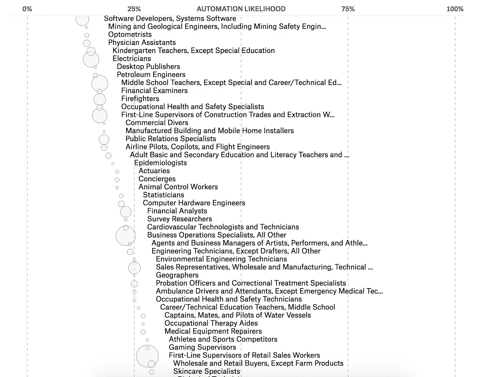

# 数据好奇 31.07.2017:上周的数据故事、数据集和可视化综述

> 原文：<https://towardsdatascience.com/data-curious-31-07-2017-a-roundup-of-data-stories-datasets-and-visualizations-from-last-week-da8b8cf5ea9b?source=collection_archive---------4----------------------->

欢迎来到我上周在网上注意到的数据驱动事物的每周综述。这是第 16 周(上周的帖子是[这里是](https://medium.com/towards-data-science/data-curious-24-07-2017-a-roundup-of-data-stories-datasets-and-visualizations-from-last-week-9bc8d49e01ae))。

每个星期，我都会剪辑、保存和收藏大量我在网上找到的关于用数据讲述故事的很酷的东西。以下是 7 月 24 日那一周吸引我眼球的内容。在典型的时事通讯中，我会包含一堆链接供你点击，保存起来以后再看(没关系，我们都这样做)。为了赶上下周的帖子，请在媒体上关注我的最新消息。我也是推特上的[。](https://twitter.com/bnj_cooley)

# 好的阅读、分析和教程

上周似乎是有趣的阅读和资源重，数据集轻。让我们看一看。

James Densmore 在这篇[关于网络抓取道德的博客文章](https://medium.com/towards-data-science/ethics-in-web-scraping-b96b18136f01)中总结了一套很好的原则。因为抓取立法完全是另一回事，这些自我采用的规则为道德抓取者和网站所有者提供了一个框架，以鼓励更公平和更公正的网络抓取环境。

这篇由 Aran Lunzer 和 Amelia McNamara 撰写的互动文章通过使用一些漂亮的 d3.js scrollytelling，采用了一种超级元、深入的方法来解释直方图的 DNA。他们的数据可视化是基于 Jim Vallandingham 的[的，所以你想要建立一个 Scroller](http://vallandingham.me/scroller.html) ，他们的代码可以在 Github 的这里[找到。](https://github.com/AmeliaMN/histogram_essay)

我真的很喜欢这篇关于从 10 亿个 Shazam 音乐识别中创建数据可视化的文章[。生成的地图是使用社交应用程序中的地理数据的一个很好的例子。我也喜欢阅读作者如何创建同一张地图的不同版本(静态和交互式)。](https://medium.com/@umaar/data-visualisation-with-1-billion-shazam-music-recognitions-90728df3a8c9)

艾琳·加拉格尔在推特上自我发布了一篇对虚假 antifa 账户的精彩分析，这些账户意在制造虚假新闻报道。利用 Gephi 可视化技术，她展示了一个围绕一个主要用户名 OfficialAntifa 的虚假账户网络如何产生足够的可信度，以至于多家报纸在网上文章中引用了它们。

既然我们谈到了自助出版的话题，那就来点无耻的自我宣传吧:我写了一篇关于[的反思，这是我在从头开始编写、编码和设计一个长格式数据驱动功能](https://medium.com/@37240f6b6698/e8500ff10b43)时学到的东西。如果你在一个类似的领域，或者只是想要一些关于为网络编写故事/文章的见解，我希望你能从我的经历中找到一些有用的东西。

数据可视化大师安迪·基尔克上周发布了他的新[图表制作者目录](http://chartmaker.visualisingdata.com/)的测试版。交互式矩阵允许用户根据图表系列选择图表类型，然后点击进入大量不同的教程，学习如何在各种不同的程序(D3.js、Vega、Plotly、Excel 等)中构建该图表。).该目录有超过 200+的参考和计数，所以这绝对是一个网页书签，供未来使用。

Kirk 还发布了他对自今年 1 月以来数据可视化领域最重要的发展的 6 个月综述。许多条目之前已经出现在数据好奇(英雄所见略同)上，但有些对我来说是新的，所以来看看吧。

说到值得收藏的页面，我上周在 Twitter 上看到了一个新的网络项目，名为[数据驱动的叙事模式](http://napa-cards.net/#info)。该网站展示了用数据讲述故事的不同叙事技巧，并将每张卡片分为五类:移情、参与、框架、心流和论点。每张数据卡都有基本原理，说明为什么这是一种展示数据的聪明方法，并举例说明了有效使用该技术的方法。

我很高兴看到这个博客如何使用 xkcd 漫画来解释希尔对数据科学家的标准。谁不爱 xkcd？

上周我最喜欢的文章是伊娃·康斯坦塔斯的这篇文章，标题是《T2 利用数据重建对媒体的信任》。在她与 Mozilla 的一次较长采访的摘录中，Constantaras 写道，她通过在发展中国家教授数据新闻学的经验，学到了“提供信息，让公民生活得更好”。在她的文章中，她向新闻界发出挑战，要求他们认真审视我们如何优先考虑数据新闻:与其把我们所有的数据资源都投入到报道民意调查和制作现场选举地图上，不如我们把更多的数据新闻集中在促进当地公共利益的问题上？

这篇关于[为什么数据人种学家掌握着未来最重要的设计工作](https://www.fastcodesign.com/90134155/the-most-crucial-design-job-of-the-future)的文章有趣地审视了数据集背后的文化和偏见，以及我们如何克服它们。

我喜欢 NYT 在这篇互动文章中使用的数据标题:[夏天越来越热](https://www.nytimes.com/interactive/2017/07/28/climate/more-frequent-extreme-summer-heat.html)。整篇文章有一些很棒的气候数据分析。

Daniele Palumbo 创建了一个最佳数据记者和#ddj 数据工作故事的 Twitter 列表。需要注意的一点是:

这篇中型文章解释了如何使用气泡图来探索复杂的数据集。 [Shir Meir Lador](https://medium.com/@DataLady) 展示了如何使用这个包([可在 Github](https://github.com/shirmeir/bubble_plot#dependencies) 上获得)以及 Python 中的 pandas、numpy 和 matplotlib 来帮助揭示人口普查收入数据的模式。

Mapbox 发布了一篇关于位置的 [7 数据可视化技术的博客，很好地概述了可视化地理数据的不同选项。](https://blog.mapbox.com/7-data-visualizations-techniques-for-location-544c558cc960)

消费者旅游公司 TripHappy 创建了一张世界地图，该地图仅根据提交到其网站的 17，000 多条路线绘制而成。该团队使用 Gephi 中的聚类分析，将同一旅行中经常访问的国家指定为相同的颜色。我认为这是一个商业公司充分利用他们的数据来讲述一个有趣故事的很酷的例子。看下面的地图，阅读它是如何制作的[这里](https://triphappy.com/blog/world-drawn-by-travelers/21)。

Created by [TripHappy](https://triphappy.com/blog/world-drawn-by-travelers/21)

Data.world 为从事数据工作的数据记者和新闻编辑室开发了一些非常有用的工具。[这个登陆页面](https://data.world/data-journalism?utm_source=hootsuite&utm_medium=social&utm_content=170726&utm_campaign=social_media_post)很好地总结了专门为数据记者定制的工具。

# 数据集和其他资源

上周，我在 data.world 上发现了一个有趣的数据项目，探索[党代表实际上代表了他们所属政党](https://data.world/chrowe/party-representation?utm_source=autopilot&utm_medium=email&utm_content=170728&utm_campaign=data_digest)的人民有多好。自己探索数据，并通过发布查询和见解为项目做出贡献。

国家档案馆存有二战期间被送往集中营的日裔美国人的数据集。

看看这个来自 NBC 新闻的数据库:[追踪特朗普对特朗普房产的访问](http://www.nbcnews.com/politics/donald-trump/how-much-time-trump-spending-trump-properties-n753366)。数据包括哪些物业被访问，以及该物业是否有高尔夫球场。到目前为止，总统每个月大约有 10 天会去他的房产。

博士生 Peter Bucchianeri 一直在分析影响女性候选人竞选美国众议院的因素。为了他的研究，他收集了一个从 1972 年到 2010 年众议院初选中女性候选人的数据集，其中包括候选人政党，地区人口统计，席位的在职状态等等。

当你需要证据证明你的工作很重要时，这里有一个很好的资源可以收藏:[data . world 上不断增长的关于数据科学和开放数据的可分享事实和数据列表](https://data.world/data-science-by-the-numbers?utm_source=hootsuite&utm_medium=social&utm_content=170726&utm_campaign=social_media_post)。

# 数据可视化

《每日电讯报》通过让读者猜测某些经济结果背后的原因，很好地利用了“令人惊讶”的统计数据。

我认为 Martin Stabe 对手机地图的评论非常有趣。来自 NYT 的[数据分析显示了伦敦提议的交叉铁路计划，包括一些详细的标注地图，显示了新线路的路线。但是当你为移动设备调整屏幕大小时，地图会翻转为垂直布局。](https://www.nytimes.com/2017/07/31/world/europe/london-crossrail-uk-brexit.html?_r=0)

这张斜率图显示了随着食品和饮料价格的飞涨，委内瑞拉人饮食中的食物变化。

即将到来的日食激发了推特上更多的旋转地球仪和 gif 图片。这张来自《科学美国人》的照片显示了离你最近的日食。

我真的很喜欢看到这张并排组合的径向图，它显示了自 1980 年以来的气温异常。

以下来自 pudding.cool 的视觉短文讲述了[为什么当机器人抢走你的工作时共和党会赢](https://pudding.cool/2017/07/jobs/)有一些出色的数据，即工作。我最喜欢的是长长的滚动气泡图，显示每项工作自动化的可能性。数据来自弗雷和奥斯本进行的关于工作自动化的流行研究。

Screenshot of bubble plot. [Full story here.](https://pudding.cool/2017/07/jobs/)

上周就这样了。你看到我应该包括的东西了吗？或者你只是想给我一个数字点头/击掌？给我发推特或者在下面留言。

*如果你喜欢这个每周综述，拍上一张* ❤️️ *或者与你的朋友分享。我也很想知道你最近在忙些什么，所以请联系我。下周会有更多的数据。*