# 数据，数据

> 原文：<https://towardsdatascience.com/data-data-1fedfac91c79?source=collection_archive---------13----------------------->

## 通过对荷西·德克勒音乐和歌词的统计探索，对他的世界进行身临其境的分析。

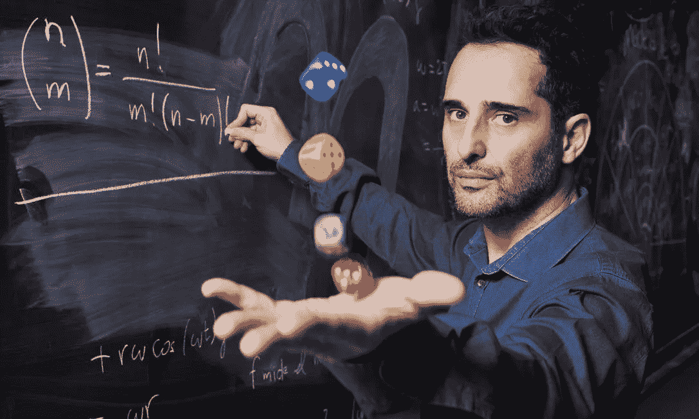

网上不乏关于数据分析所揭示的见解的酷文章，在这些文章中，像我这样的音乐发烧友可以满足我们对我们最喜爱的艺术家的随机事实的渴望。尽管前面提到的文章背后的数据英雄已经广泛覆盖了过多的艺术家，但同样不能说西班牙语(或唱歌？)音乐人。

当选择某人的作品进行分析时，这个问题很早就出现了。从那时起，选择**荷西·德克勒**的音乐的决定几乎是自动的。我最喜欢的艺术家之一，乔治的音乐来自乌拉圭；但是整个拉丁美洲都有这种感觉。从阿根延到加勒比海的民间音乐节奏和从莱昂纳德·科恩到卡耶塔诺·费洛索的影响混合在一起，他的职业生涯跨越了二十多年，他的专辑也越来越好。他的歌词被称赞为非常有文化和诗意，他的散文有时会变得非常独特。我希望通过写这篇文章，他的一点点音乐能传到非西班牙人的耳朵里，这样他们就能享受它，也许甚至像我一样。

Most probably my favorite song by him (but really, who can decide?)

# 技术

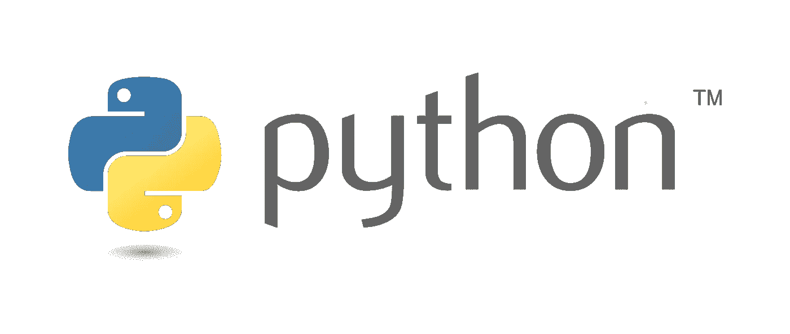

**整个项目是用 Python 3** 开发的。
我用 [pandas](https://pandas.pydata.org/) 、 [BeautifulSoup](https://www.crummy.com/software/BeautifulSoup/bs4/doc/) 、[spot ipy](https://spotipy.readthedocs.io/en/latest/)(Web Spotify API 的惊人 Python 包装器) [Genius API](https://genius.com/developers) 和 [Web Spotify API](https://developer.spotify.com/documentation/web-api/) 创建并清理了数据库。

此外，当我放弃时，我用谷歌工作表和 MS Excel 对它们进行了修改并给出了最终的调整。

关于数据分析和数据可视化，我用了[熊猫](https://pandas.pydata.org/)、 [NumPy](http://www.numpy.org/) 、 [Matplotlib](https://matplotlib.org/) 、 [Seaborn](https://seaborn.pydata.org/) 、 [scikit-learn](http://scikit-learn.org/) 、 [SciPy](https://www.scipy.org/) 、[自然语言工具包](https://www.nltk.org/)、 [wordcloud](https://github.com/amueller/word_cloud) 和 [py-lex](https://github.com/dropofwill/py-lex) 。整个项目都是用 Git 版本化的，它可以在我的 Github 账户中公开获得。

如果你想知道一切是如何计算和编码的，如果你想看到探索的细节而不仅仅是亮点，如果你想克隆或派生项目，下载数据库或简单地运行代码[只需点击这里](https://github.com/alexing/datadata)访问资源库。

# **数据提取、创建数据库和&数据清洗**预处理

就像每个数据科学家/分析师都知道(或者应该知道)的那样，获取数据并不总是容易的。然而，有一点是绝对肯定的，那就是**耗时**。如果我们可以谷歌*“Jorge drexler 数据库”*并且通过一些现代奇迹在 3 分钟后完成一次漂亮的清洁，我们的生活会变得多好。硬盘上的 csv 文件。

回顾过去，这是我开始犯菜鸟错误的时刻。我没有计划我的最终目标是什么，以及达到目标的最佳途径是什么。这开始只是一个用 Matplotlib 和 pandas 鬼混的小项目，它经历了不同的阶段和想法，直到我专注于这个特定的项目。当我决定哪种探索是我想要进行的时候，我已经做了一些开发，我必须把它们引向我想要的方向。我应该事先问自己的问题是:我需要什么样的数据？我能在哪里得到它？会是哪种格式？怎么才能轻松改造？如果我从源头 A 得到它会有多干净？源 B 是否会更好并节省我的时间？
话虽如此，我最终还是到达了我需要的地方，然而肯定有更容易、更直接的方法可以节省我很多时间。

首先，我使用 [Genius API](https://genius.com/developers) 进行数据提取，以获取 Jorge 的所有歌词。API 给你的是属于艺术家的每一句歌词的 url，而不是真正的歌词。因此，一些 http 请求，美丽的汤，并删除了大量的 *< div >* s 之后，我最终得到了一个包含重复，翻唱，现场版本和一些根本不属于 Jorge 的歌曲列表。

在删除了很多没用的功能和很多葡萄牙语的歌(？)，我开始手动丰富数据(好吧，不是真的手动，而是通过使用 Python 脚本)，给每首歌添加年份和专辑。

随着时间的推移，我决定也从 Web Spotify API 获取数据。这一刻，我意识到如果我一开始就决定这么做，我会更快乐。Spotify 的数据有序、整洁，不包含重复和垃圾歌曲。他们没有歌词，对吧，但有一个包含专辑中所有歌曲的数据框架会让一切变得更容易。在去除了无用的特征后，我决定了研究扩展的规则和定义。

*   **这项研究只集中在官方唱片发行上:没有合辑，也没有现场专辑。分别是:*拉鲁兹克萨贝罗巴尔* (1992 年)*雷达* (1994 年)*瓦伊文* (1996 年)*卢伊夫* (1997 年)*弗龙特拉* (1999 年)*海洋* (2001 年)*生态* (2004 年) *12 段***
*   没有独立发行的单曲或歌曲。乔治的歌曲没有出现在各种艺术家的专辑中，也没有出现在其他艺术家的专辑中。
*   **没有其他语言的歌曲。这就淘汰了*高&干*的版本在 *12 segundos de oscuridad* 和*我一点都不担心*的版本在 *Amar la trama。***
*   Jorge 在乌拉圭独立发行了他的前两张专辑，然后在 Virgin 下发行了他的第三张专辑，这张专辑得到了更广泛的发行。这张专辑中有很多歌曲重复出现，如*偷窥狂*，*伊甸园* & *月光女神*。其中一些被重新录制。虽然我跟踪了这个事实，但在分析中我并没有考虑到什么特别的地方。**分析所有专辑*和*它们最初包含的歌曲，不考虑重复。**

在这一点上，我放弃了 Python 和 pandas 来继续我的使命，开始转向 MS Excel，然后 Google Sheets 用 Spotify db 加入歌词。令我惊讶的是，微软和谷歌都需要加强他们的 csv 管理解决方案。 **MS Excel for Mac 不支持 Unicode！如果我得到的每一个“é”或“ó”都被转换成像“o”或“o”这样的废话，我怎么能分析西班牙语歌词呢？。另一方面，将 csv 导入和导出到 Google Sheets 的选项非常有限。**

走完这条漫长曲折的路，我终于准备好开始分析了。

# 数据分析

第一个重点放在了**字数上。**

一旦西班牙语的停用词被删除(还有一些非感官术语，如合唱中的“na”)，我就找到了乔治歌曲中最常用的词。

**使用最多的 5 个词是“mar”、“tiempo”、“noche”、“luna”和“corazón”**；分别表示“海”、“时间”、“夜晚”、“月亮”和“心”。

对于已经知道他的歌的人来说，仅此一点就说明了很多。让我们更上一层楼，把这五个字当作一个主题，在听他的歌的时候呈现出来。这样我们就可以分析随着时间的推移，它们的用法是如何变化的。让我们看看他所有的专辑。

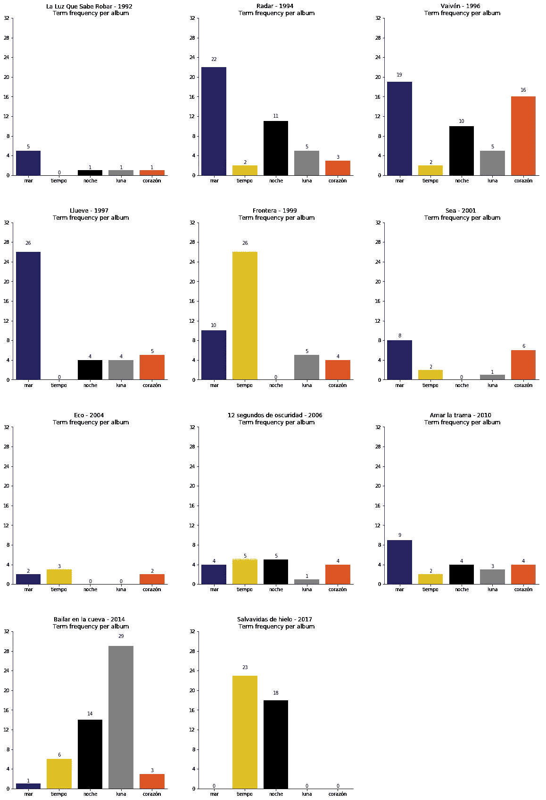

**来看看！有趣的见解！**

*   90 年代，他喜欢谈论大海(“mar”)，但随着时间的推移，他变得厌倦了。
*   在 *Vaivén* (1996)中，心脏(“corazón”)作为一个几乎全新的主题出现。之后它再也没有恢复领先。夜(“noche”)也是存在的。这会是一个令人心碎的记录吗？
*   在新千年的第一个十年，他没有太多地重温他最喜欢的主题。
*   *Bailar en la cueva* (2014)超级聚焦月亮(“露娜”)和黑夜(“诺切”)。
*   Salvavidas de hielo (2017 年)是关于时间的流逝(《时代报》)，这是他从 *Frontera* (1999 年)和《夜晚》(noche)中恢复的趋势。

我们可以把这些图表变成一种不同的视觉效果，来证实我们从上一个图表中得到的结果，也许会发现一些新的东西。

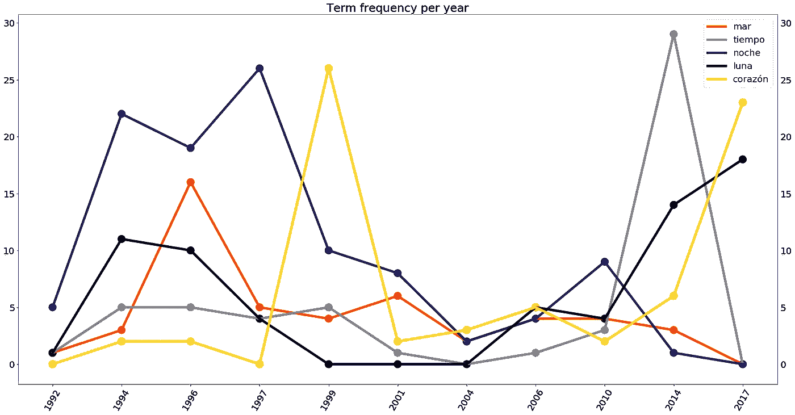

*   在这个图表中，我们实际上可以看到他最流行的主题在 00 年代的低谷。
*   《月亮》(luna)在《T4》(2014)中创下历史新高。
*   时间(' tiempo ')在 *Frontera* (1999)，海(' mar ')在 Llueve (1997)和夜晚(' noche ')在他的最后一张专辑 *Salvavidas de hielo* (2017)中达到顶峰。

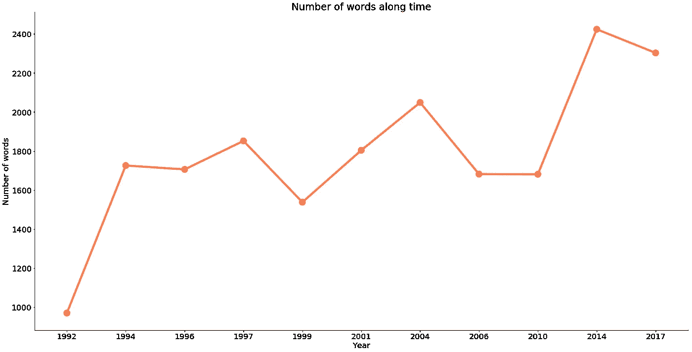

如果我们分析他在歌曲中的用词量是如何随时间变化的，就会发现一个有趣的趋势。最上面是他 2014 年的专辑 **Bailar en la cueva** 超过 2400 字。

尽管并不单调，但曲线的价值确实在增长:**随着时间的推移，他倾向于在歌曲中加入更多的词。**

哪首歌的词比较多？以下内容:

***Guitarra y vos* 以近 400 字高居歌曲字数榜首。**以下是*拉卢纳·德·拉斯奎*(367)*贝拉·恩拉·库埃瓦*(359)*运动* (331)。

Yo, check that rappin’

如果没有一个漂亮的小单词云，字数统计部分是不完整的:

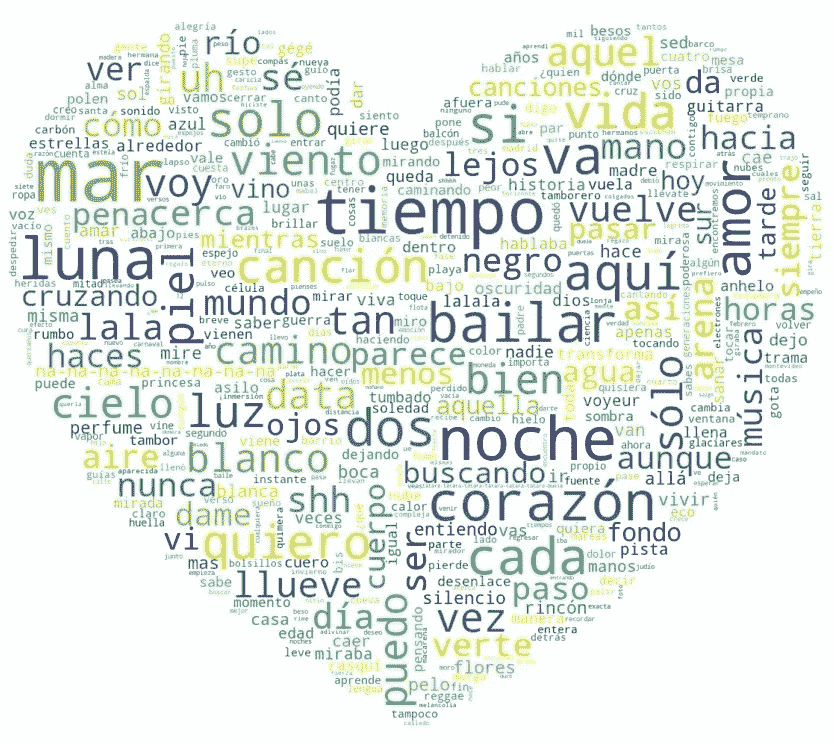

Most popular 500 words in his songs. The size indicates ranking.

# 词汇和抒情密度

在处理严格的内容分析的情况下，词汇密度的概念被认为是内容词的数量占总词数量的比例的度量——一个范围从 0 到 100 的值。一般来说，如果一篇文章的词汇密度越大，它的内容就越重——词汇密度低的文章更容易理解。

根据[维基百科](https://en.wikipedia.org/wiki/Lexical_density)的公式如下:

其中 **Ld** 是被分析文本的词汇密度， **Nlex** 是被分析文本中词汇单词标记(名词、形容词、动词、副词)的数量，N 是被分析文本中所有标记的数量(单词总数)。

我不知道这有多正统，但是根据 Myles Harrison 对电台司令 T35 惊人的数据分析，听起来这只是非停用词占总数的比率——或者至少可以用它来近似。让我们看看结果如何。

所以，看看这个！随时间减少的趋势很大。从 1992 年的 T2 到 2017 年的 T4，词汇密度实际上是下降的。
*Frontera* (1999)在词汇密度上似乎是一张相当一致的专辑，而 *Sea* (2001)则是遍地开花。在得出更多结论之前，让我们继续。

现在，迈尔斯发明了另一种度量标准。基本上**抒情密度**就是单位时间内的字数。信息传播的速度有多快？你一秒钟能表达多少语言单位？分布如下所示:

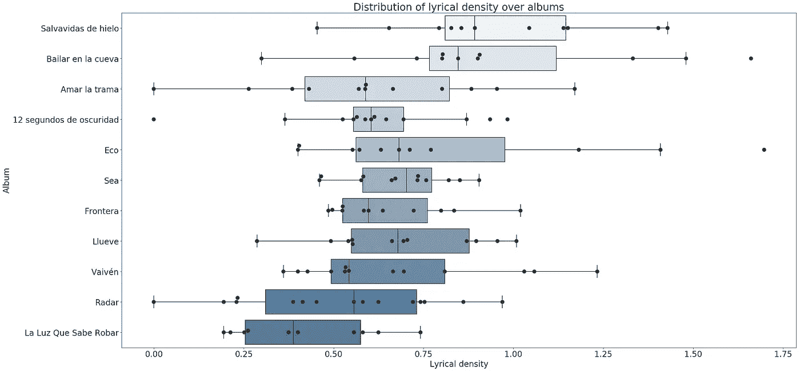

这太神奇了。让我们回顾一下过去的经验来分析这个问题。

*   抒情密度的趋势随着时间和专辑而上升。
*   还记得单词数显示出相同的趋势吗？它们是线性相关的..所以这里的相关性肯定很高。不过，有趣的是词汇密度有相反的效果:**随着时间的推移，乔治写的歌词内容密度越小，他唱得越快**。他的歌词越容易理解，他唱得越快。可能是这样吗？

现在，如果我们将它们相互对照，会发生什么呢？

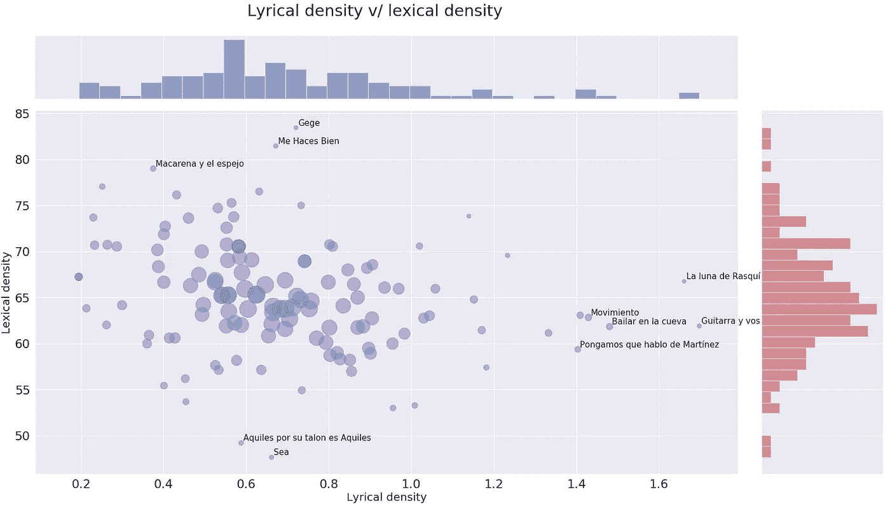

通过检查这个小图的异常值，我们可以看到:

*   就像我们之前说的，像 *Movimiento* 、 *La luna de Rasquí* 、*guitar ra y vos*y*Pongamos que hablo de martínez*这样的歌曲带有很大的抒情密度，而词汇密度相对较低。这意味着他们每秒钟吐出很多单词(每秒钟超过 1.4 个单词！)虽然这些歌词的内容并不少见:它们既不容易理解，也不复杂。
*   “格格”、 *Me haces bien* 和 *Macarena y el espejo* 这几首歌的歌词含义丰富，但唱得相当慢。
*   ***Aquiles，por su talon es Aquiles*和 *Sea* 唱的比较慢，含率也不是很大。基本上是德雷克斯勒作品中最容易理解的歌曲。**

May not be a specially difficult song to comprehend, but it certainly is difficult not to enjoy ❤

# 情感分析

好了，现在我们有了一些比计算单词更有趣的东西。根据[维基百科](https://en.wikipedia.org/wiki/Sentiment_analysis)的说法，情感分析是使用自然语言处理、文本分析、计算语言学和生物统计学来系统地识别、提取、量化和研究情感状态和主观信息。

在这种情况下，我使用了一些非常好的资源来完成这项工作。首先也是最重要的， [NRC 单词-情绪联想词典(又名 EmoLex)](http://saifmohammad.com/WebPages/NRC-Emotion-Lexicon.htm) 。

**NRC 情感词典是一个英语单词列表，以及它们与八种基本情感(愤怒、恐惧、期待、信任、惊讶、悲伤、喜悦和厌恶)和两种情绪(消极和积极)**的关联。注释是通过众包手动完成的。最明显的问题是，至少对我来说，Jorge 的歌词不是英文的。EmoLex 还发布了自己的词典，通过谷歌翻译(Google Translate)自动翻译成 100 多种语言。
这是 ***肯定不是 100%准确的*** 并且会让我的结果有点偏离，但最终足以获得一些更有趣的见解。理想情况下，我会有一个愿意众包西班牙语注释的团队…也许下次吧:)。

py-lex 是一个很棒的 python 库，可以解析这个词典。

检查所有歌曲中的所有情绪，然后汇总，我想出了一个可视化的解决第一个也是最明显的问题:乔治的歌曲感觉如何？

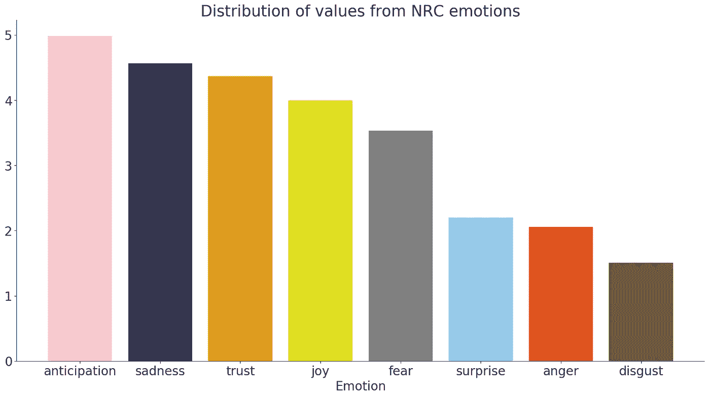

Jorge 的歌曲表现出很多期待和悲伤。这可以被看作是渴望、兴奋、渴望、忧郁、悲伤、忧伤、荒凉或者仅仅是单纯的悲伤。对于听过他音乐的人来说，毫不奇怪，这些歌曲很少表现出愤怒或厌恶。

## 对于情感，他的歌曲也是积极的多于消极的。

让我们来看看是哪些词引发了每一种情绪和观点。

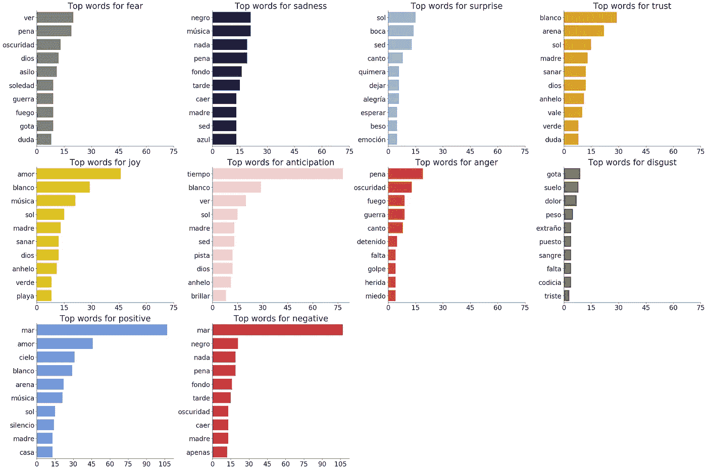

*   *母亲带着信任、喜悦和期待出现。标记了积极和消极。*
*   Sol(sun)似乎与积极情绪有关:惊讶、信任、喜悦、期待，而且只被标记为积极情绪。
*   Pena(怜悯、羞耻)出现在负面情绪中:恐惧、悲伤、愤怒，这只是一种负面情绪。

这种情绪如何在专辑中表现出来？哪一张专辑最悲伤，哪一张更令人期待？

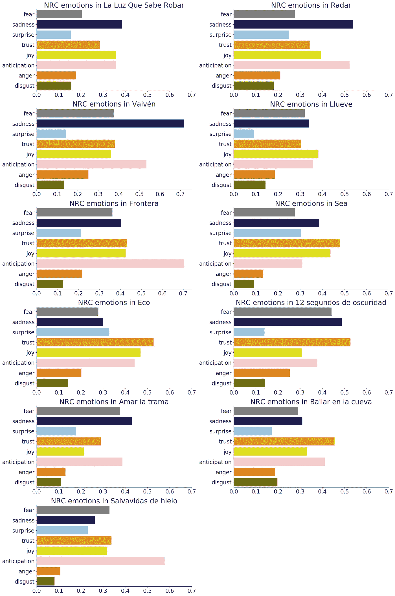

*   他最悲伤的专辑是 1996 年的《Vaivén》。我很确定那是《第 12 集》,事实上……至少那是我悲伤时喜欢听的。德雷克斯勒在西班牙录制了《Vaivén 》,得到了安达卢西亚音乐传奇人物华金·萨宾娜的指导，而他则一跃将自己完全奉献给了音乐，放弃了行医。也许他渴望回家？
*   1997 年的《Frontera》和 2017 年的《T2》中的期待值最高。

让我们用另一张图来看看这些年来是如何演变的。

*   **嗯，可以肯定地说，除了第 12 集*中的颠簸，Jorge 已经不那么悲伤了。那张专辑中的大部分歌曲都是他在 Cabo 波洛尼奥时创作的，那是一片美丽的土地，位于乌拉圭，没有电，夜空繁星点点。12 segundos de oscuridad* (12 秒的黑暗)指的是每 12 秒扫过城镇的灯塔，它周期性地打断黑暗。与前妻分居后，他把自己关在那里作为疗伤的手段。听着像 Soledad(孤独)或 Sanar(治愈)这样的歌曲，你可以感觉到歌手开始意识到他现在是孤独的，时间会治愈他破碎的心。这也许是信任在这里达到顶峰的原因:**尽管他很难过，但他对事情会变好的事实有信心**。**

“It’s done. I’ve already let it tarnish, the illusion that living is painless” Ouch, Jorge! Right in the feels!

*   然而，他的快乐在《Eco》中达到顶峰，并且再也没有从那次挫折中恢复过来。
*   愤怒的高峰出现在 *Vaivén* 和 *12 segundos de oscuridad。*他最悲伤的专辑。
*   负面情绪(愤怒、悲伤、厌恶、恐惧)似乎有某种关联。让我们深入了解一下。

为了检查相关性，我在 Seaborn 中使用了 pairplot 工具，并计算了每一对变量的皮尔逊相关系数，这是两个变量 *X* 和 *Y* 之间线性[相关性的度量。范围在+1 和 1 之间，其中 1 表示完全正线性相关，0 表示没有线性相关，1 表示完全负线性相关。](https://en.wikipedia.org/wiki/Correlation)

ρ = 0.62 and ρ=0.55 are definitely correlation degrees high enough to take into account.

和我第一次怀疑一样，**悲伤和愤怒是高度相关的**。也是愤怒和厌恶。
让我们快速重复上次的情绪曲线图，单独欣赏它们的曲线形状。

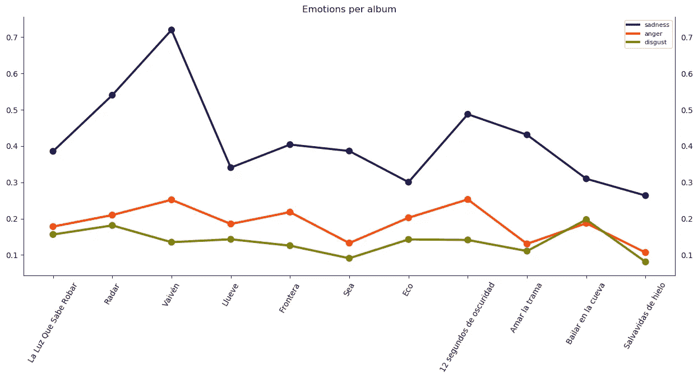

## 事实上，在 Jorge 的歌曲中，可以相当准确地说，悲伤与愤怒和厌恶相伴而生。

现在，让我们直接进入积极情绪和消极情绪。

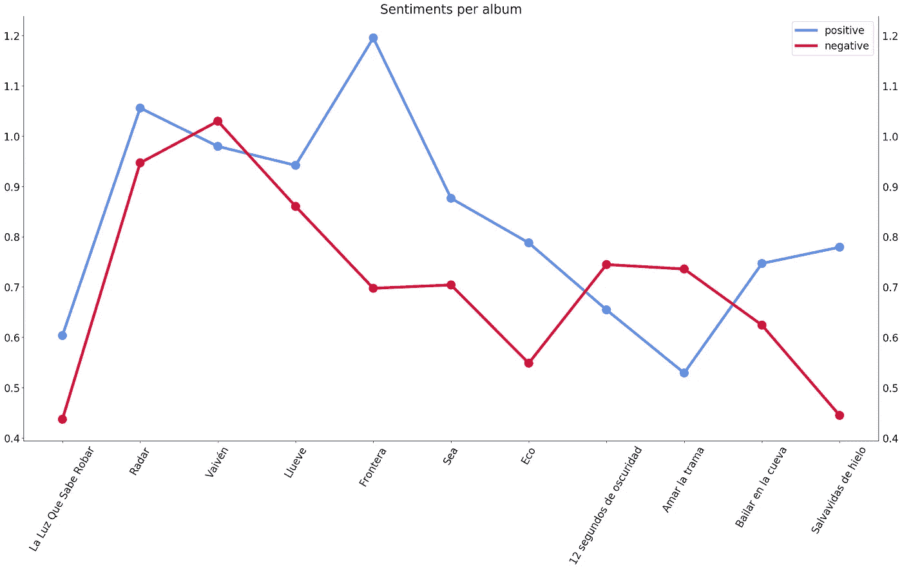

## 我认为这是相当安全的，在这一点上，再次确认，乔治是一个积极的比消极的家伙。

*   他的积极峰值出现在 1999 年的 Frontera，而消极峰值出现在三年前的 vaivén(1996 年)。
*   积极度的历史最低点在 2010 年的 Amar la trama。
*   他消极情绪的最低点发生在职业生涯的开始和结束。*(好吧，不是结尾…让我们希望他继续创作优美的音乐)*
*   **负面多于正面的专辑:*vaivén*(1996)*12 segundos de oscuridad*(2006)*Amar la trama*(2010)。**

# 音乐分析

我能够提取每首歌曲的音乐特征。
要查看每个功能的详细描述，请访问[此](https://developer.spotify.com/documentation/web-api/reference/tracks/get-audio-features/)。
不过，需要声明:所有这些都是使用机器学习或信号处理技术计算出来的。这都是自动化的，所以远不是 100%准确。我通过检查唯一值和异常值进行了预分析，发现了一些小错误，如 *Asilo* 不在 5/4 拍号中，或者 *La plegaria del paparazzo* 被标记为 192 的速度，而实际上它是该值的一半。

豪尔赫使用两种类型的**时间签名**。小节中有三拍的和四拍的。最有可能的是 3/4 和 4/4，但 Spotify API 不提供时间签名的分母；所以没有办法知道哪个音符值相当于一拍(是啊…就是这样:用耳朵一个一个地检查。)

Eco is definitely a trend changer in the distribution of time signatures.

*   你会在他的每张专辑中找到一首三拍歌曲，除了生态专辑。
*   在 Eco 之前，他所有的专辑都包含至少两首 3/4 或其他三拍拍的歌曲。
*   在 Eco 之后，他所有的专辑都只包括其中的一张。

他歌曲的平均速度是 121 bpm。 ***来自*海*的杜兰特*是 Jorge 最快的歌曲，**拥有 178 bpm 的急速节奏。他最慢的是来自 segundos de oscuridad 的赫曼娜·杜达 T38，节奏为 64 bpm。

Slow but sure

让我们来看看他的专辑中节奏是如何分布的。

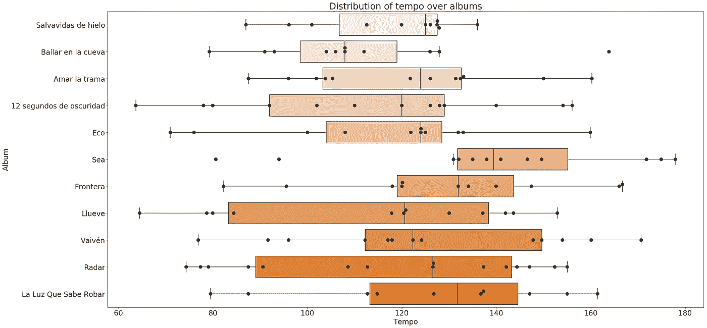

*   **迄今最快专辑:*海*从 2001 年**。这张专辑包含了最乐观的歌曲。
*   其他一切感觉都差不多。所有的歌曲都分布在 120 bpm 左右，一些节奏较慢的民谣散布在他的每张专辑中。

让我们将之前获得的一些见解与我们接下来的分析结合起来。

还记得以下内容吗？抒情密度的趋势随着时间和专辑而上升，他唱得越来越快。字数也是，因为它与抒情密度相关。词汇密度有相反的效果:随着时间的推移，Jorge 写的内容越来越少，歌词越来越容易理解。

现在**曲目长度**，歌曲的时长，随着岁月慢慢减少。

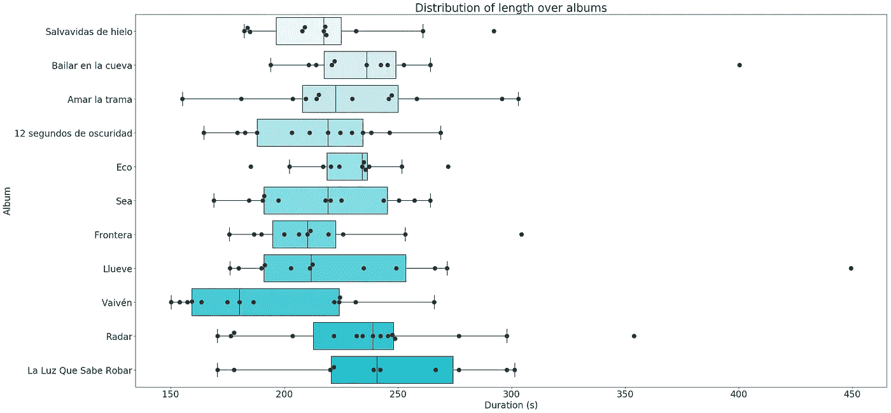

## 随着时间的推移，歌曲越来越短，但歌词却越来越长！

而且，他唱得越快，歌曲越短，越容易理解。

在[乐理](https://en.wikipedia.org/wiki/Music_theory)中，一首乐曲的**键**是一组音高，或音阶，它们构成了古典音乐、西方艺术和西方流行音乐的基础。

该组具有一个*主音音符*及其相应的*和弦*，也称为*主音*或*主音和弦*，它提供了一种主观的到达和休息感，并且还与同一组的其他音高、其相应的和弦以及该组之外的音高和和弦具有独特的关系。

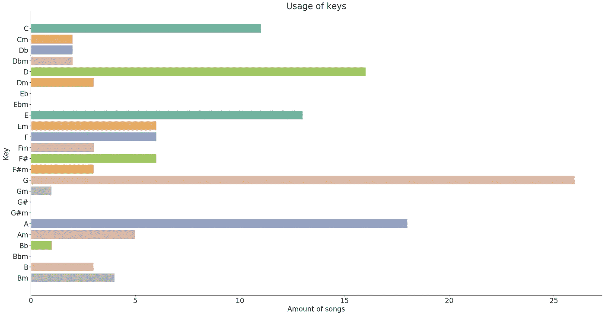

*   有些键在他的专辑里从来没有弹过。Eb 和 Ebm，G#和 G#m，Bbm 都是吉他弹奏中处理起来不是特别舒服的键。
*   另一方面，G 和 A 是最受欢迎的。还有 E、D、c，他们 5 个人和吉他手超级友好。

是的，你猜对了。让我们检查一下专辑中按键的分布。

*   ***Frontera* 是 keywise 最单调的专辑。只有 4 把钥匙。4 首 G 调歌曲，4 首 D 调歌曲，2 首 A 调歌曲和 1 首 f 调歌曲。这无疑是最容易被吉他接受的专辑。**
*   ***Eco* 几乎从不重复调，D** 中的两首除外(*guitar ra y vos*&*Transporte*)。奇怪的是，这些歌都不是乔治最喜欢的调子。
*   其余的专辑都很平衡。

根据我们在 Spotify 的工作人员的说法，**价**是一个从 0.0 到 1.0 的量度，用来描述一首歌曲所传达的音乐积极性。高价曲目听起来更积极(例如，快乐、愉快、欣快)，而低价曲目听起来更消极(例如，悲伤、沮丧、愤怒)。

所以，现在**让我们试着纯粹从音乐方面来分析快乐和悲伤**。

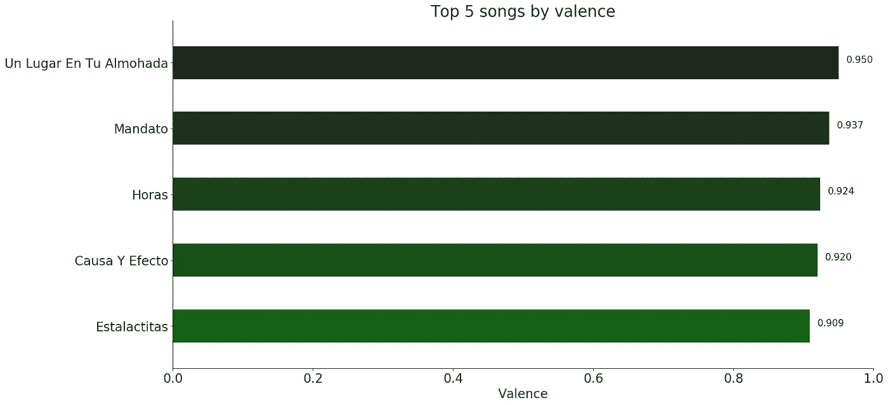

这就是了。这是音乐上最快乐的 5 首歌。

## Un lugar en tu almohada、Mandato 和 Horas 是 ***听起来*** 更快乐的三首歌。

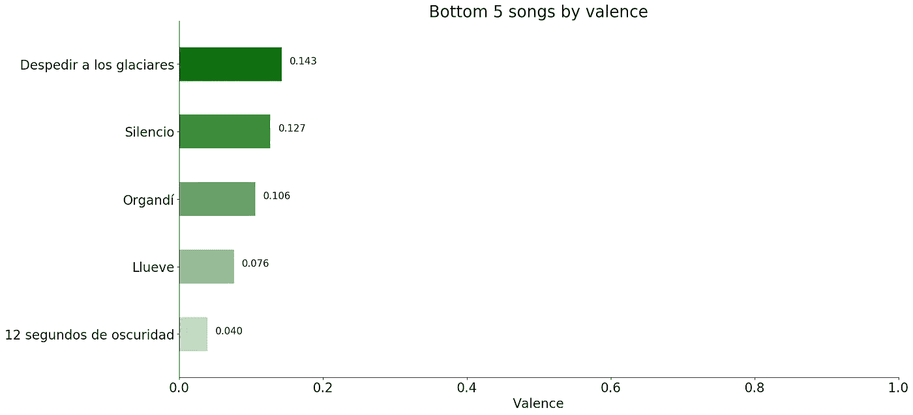

在擂台的另一边，这是音乐上最悲伤的 5 首歌。

## 12 segundos de oscuridad、Llueve 和 Organdí是 3 首听起来更悲伤的歌曲。

Hearts exploding with joy

现在，让我们来点更有趣的。**分析完，我们来让音乐和歌词相遇。**

在这篇令人惊叹的文章中，RCharlie 创建了一个名为**的指标，将它们完美地结合在一起，并找出哪首是电台司令更令人沮丧的歌曲。我鼓励每个人都去看看。**

Valence is Spotify’s valence value, sadness_per is the percentage of sadness in each song (which we can calculate from NRC sadness and Ly_d is lyrical density.

来，让我们为乔治的歌做同样的事！我将重新缩放它，使它从 0 到 100。

## 这就是了。当你把歌词和音乐结合在一起时， *12 segundos de oscuridad* 是 Jorge 最压抑的歌曲。

## ***Un lugar en tu almo hada***， ***Bienvenida*** 和 ***Don de fluir*** 都是 Jorge 最开心的歌！

Gloomy, right?

现在，为了压轴戏，让我们来看看每张专辑的忧郁指数表现如何。

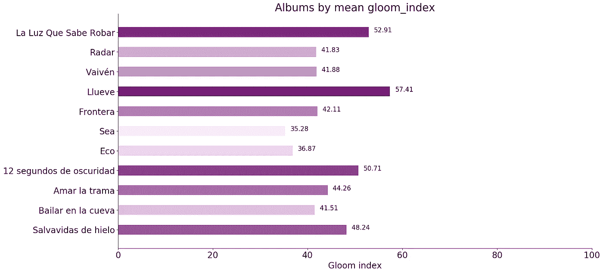

Here you have them, ranked.

## 尽管困难重重，但显然最令人沮丧的专辑是 **Llueve** ！

最快乐的是 *Eco* 和 *Sea* ，所以现在你知道当你想让情绪高涨时该听什么了。

# 结论

乔治已经在《科学之路》中说过:“创作歌曲不是一门精确的科学”。分析它们也不是。虽然这项研究很广泛，但在某些地方缺乏科学的严谨性。让这个不全面的列表作为免责声明/道歉:

*   Spotify 对音乐功能的衡量并不总是准确的。
*   字数统计取决于把它们转录成天才的高尚的人。如果我们想要精确，就需要建立一个标准。我们算合唱的重复吗？如果抄写者很懒，没有抄写最后一段合唱的次数，会怎么样？如果一个词在同一首歌中重复无数次(像*Estalactitas】*中的“tiempo”)是否和它出现在多首歌中一样算？歌曲中唱诗班唱的词或者次要声部唱的词算吗？
*   英文歌曲没有被考虑在内，但翻唱却被考虑在内，尽管这些歌曲不是豪尔赫创作的(比如最初由阿纳尔多·安图内斯创作的*迪士尼乐园*)。
*   情感分析是在一个不是由人类工作，而是由谷歌翻译的基础上进行的。

考虑到所有这些，我确实学到了很多关于数据分析及其所有的优点，如处理从纯代码生成可视化，创建和清理数据库以及项目规划的良好实践。

我也希望这个项目能够帮助乔治的作品获得普遍的关注。不是因为他需要(我觉得他已经挺大了)；而是因为他的音乐一定会给你的生活带来更多的微笑！

我把这个项目献给他，以此表达我对他的感谢。

¡Muchas gracias!

# 参考资料:

使用 Genius API 和乔纳森·埃文斯的 NLTK 对苏菲洋·斯蒂文斯进行量化

[对带有一些 TF-IDF 的熊猫的文本分析(再次)](http://sigdelta.com/blog/text-analysis-in-pandas/)

[各就各位:迈尔斯·哈里逊的《电台司令》歌词的可视化和内容分析](http://www.everydayanalytics.ca/2013/06/radiohead-lyrics-data-visualization-and-content-analysis.html)

Preetish Panda 对泰勒·斯威夫特的歌词进行数据可视化和分析

[钳工快乐](https://www.rcharlie.com/post/fitter-happier/) by [车工](https://www.rcharlie.com/post/fitter-happier/)