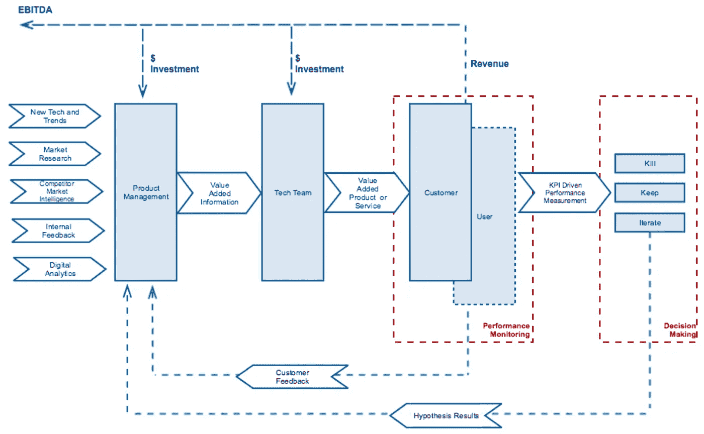
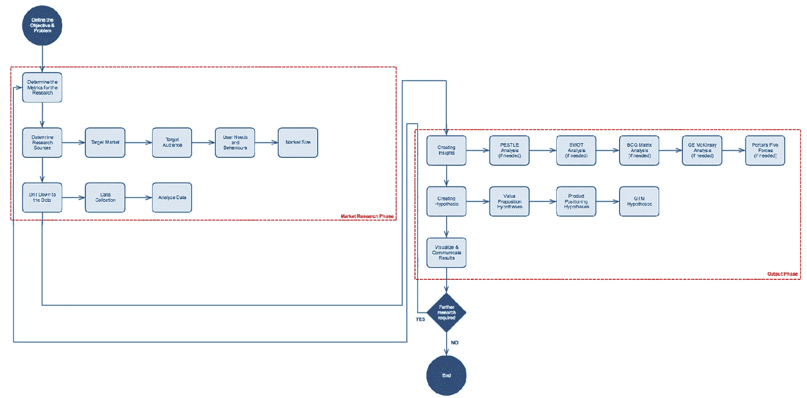
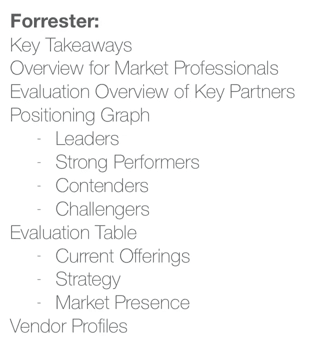
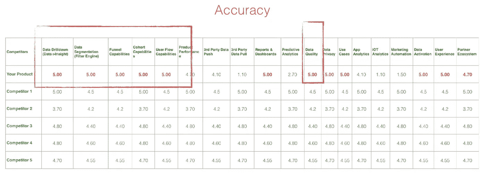
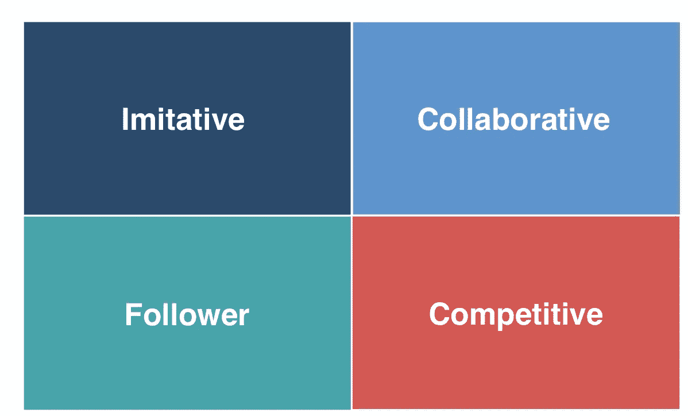
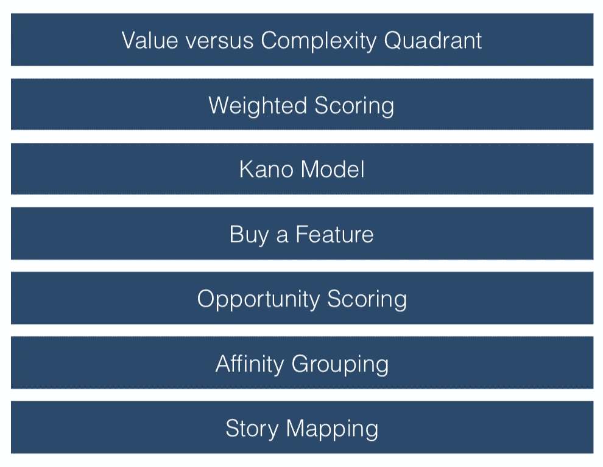
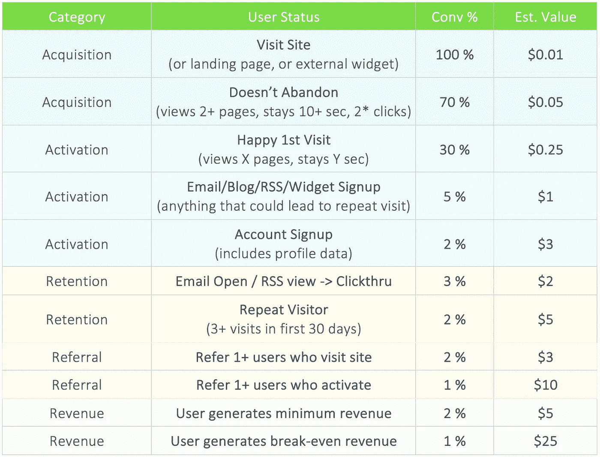

# 数据驱动的产品管理

> 原文：<https://towardsdatascience.com/data-driven-product-management-by-taner-akcok-ffd421cfa8d3?source=collection_archive---------4----------------------->

## 每个产品经理都在谈论数据驱动的产品管理，但真正的解释是什么呢？

Photo by [Mario Gogh](https://unsplash.com/@mariogogh?utm_source=medium&utm_medium=referral) on [Unsplash](https://unsplash.com?utm_source=medium&utm_medium=referral)

产品决策过去是基于产品经理/所有者和 C-Level 高管的愿望和本能。这些本能的主要驱动力是什么；客户反馈、竞争市场情报还是数字分析结果？答案应该是全部。在本文中，我将尝试解释关键的数据源，以及在这些数据源中应该考虑哪些指标来做出正确的产品决策。

成功的产品属于客户而不是产品经理。但这并不意味着产品经理应该只依赖客户的需求。有时甚至顾客也不知道他们想要什么，需要什么。产品经理必须用不同的数据源验证他们的客户反馈。

我强烈建议产品经理和公司高管去看看 [Marvin L. Patterson](https://www.linkedin.com/in/marvpatterson/) 在他的书《[打造一个行业飞车手罗德》中的创新引擎商业模式。](https://www.amazon.com/Build-Industry-Hot-Rod-Competitors/dp/0981728405)

Designed by Marvin L. Patterson and adapted to Product Management by Taner Akcok

如图表所示，产品管理应考虑来自市场研究、CMI(竞争对手市场情报)、内部反馈、数字分析和客户反馈的数据，以做出数据驱动的决策并创建增值信息。听起来很容易，但是评估信息的价值并将它们与产品路线图联系起来需要付出努力。让我们一个一个地深入研究它们，我将尝试解释我是如何在我的产品管理工作中使用这个模型的。

**市场调查**

当我们掷硬币时，正面或反面的概率是多少？50%?可惜没有！如果我们考虑方程中的所有变量如翻转时施加的初始力、重力、空气阻力等。没有硬币的可能性。产品管理和定位也是如此。如果产品经理能够通过适当的市场调查和有用的客户反馈来考虑正确的市场指标和趋势，就没有可能制造出成功的产品。

在本文中，我不会深入探讨产品经理应该做的市场调查，但我想分享一下我在市场调查过程中使用的流程:

Market Research and Product Positioning Process on Product Management

如果你想深入产品营销领域，我强烈建议你对图中列出的项目进行研究；

**确定研究指标**、**确定研究来源**:目标市场、目标受众、客户/用户需求和行为、市场规模、**深入数据:**数据收集、数据分析、**创造洞察:**杵、SWOT、BCG 矩阵分析、GE 麦肯锡分析、波特五力、**创造假设:**价值主张假设、产品定位假设、UX 假设、走向市场假设、**可视化并传达**

我以后会尝试用一篇独立的博文来讨论这个话题。

此外，有许多有用的市场研究公司，产品经理可以用它们来轻松获得快速的市场洞察。但是在本文中我将只解释其中的两个； [**Forrester**](https://go.forrester.com/) 和 [**Gartner**](https://www.gartner.com/technology/home.jsp) 。

[Forrester](https://go.forrester.com/) 提供[报告](https://www.forrester.com/search?N=10001&searchOption=10001)[剧本](https://www.forrester.com/search?N=10101&searchOption=10101)[博客](https://www.forrester.com/search?N=10003&searchOption=10003)[数据](https://www.forrester.com/search?N=10004&searchOption=10004)和[事件](https://www.forrester.com/search?N=10006&searchOption=10006)来传播他们的研究成果。特别是市场特定的 Forrester Wave 报告对市场研究人员非常有用。Forrester Wave 研究在所有标准化研究中提供了相同的大纲。这种标准化允许研究人员轻松地将多项研究结合起来，并获得有用的见解。通常，他们的波浪报告大纲是；

Forrester Wave Report Outlines

然而， [Gartner](https://www.gartner.com/technology/home.jsp) 在其研究中使用了[魔力象限](http://www.gartner.com/technology/research/methodologies/research_mq.jsp)方法来显示厂商的市场定位。他们通过执行能力和愿景的完整性来评估主要供应商。他们把他们分为领导者、挑战者、小众玩家和远见者。通常，他们的报告大纲是；

Gartner Magic Quadrant Reports Outline

这些研究显示了市场中供应商的优势和劣势，并帮助产品经理验证他们的定位。有时候，利基产品和想法很难找到市场，或者他们可能需要根据市场趋势来验证他们的愿景和路线图。市场研究帮助产品经理验证他们的定位和产品愿景，以做出数据驱动的决策。

**竞争对手市场情报**

该术语在企业公司中通常被称为职能。CMI 部门不断检查其他竞争对手，监控他们的内容、年度报告，并要求演示以了解竞争对手的价值主张和差异化。使 CMI 数据可用于产品路线图的最简单方法是比较方法。这种方法的关键点是将你的产品作为一个价值主张进行比较，将你的产品作为一个功能集进行比较。

**价值主张比较**通常来自市场上的供应商选择标准。例如，让我们将“实施”、“及时性”、“定制化”、“准确性”和“用户界面”视为分析市场的主要供应商选择标准，并将这些价值主张的 KPI 定义为能够在 0-8 分之间进行评估。

Sample Vendor Selection Criteria for Analytics Market

关于这种评估和比较，您将有一个五边形图来显示您的公司和您的竞争对手的各个方面，如下图所示。

Sample value proposition distribution for the market

了解价值主张的优势和劣势后，这些五边形可以用作面积图，通过重叠它们来查看对比。

**功能集比较**用于基于产品用例和功能提供。您比较代表我们在上一段中列出的价值主张的子 KPI 的特性或用例。评估和比较功能集或用例的一般方法是给它们打 1-8 分或 0-100 分。

在这一点上，我想注意一下产品定位。 ***一个成功的产品并不意味着在所有价值主张和功能集比较中具有完全优势。*** 你的优势领域必须与你的产品定位相适应。

例如，这里有一个样本表来比较功能集，并验证一个假想的公司在分析市场中的定位，假设我们的产品在准确性方面与其他产品有很大区别。我们可以检查/看到，我们的精度相关功能在市场上是独一无二的:

Sample Feature Set Comparison for Analytics Market

比较价值主张和功能集有助于产品经理改进和优先考虑他们的竞争优势路线图。如果需要对当前产品进行改进，产品经理通常会将这些见解与他们相关的产品概念联系起来。如果它需要一个新的特性，产品经理会围绕它建立一个概念。

通常，这种比较会给你带来 4 个主要子市场定位决策或多样化的价值主张:模仿、合作、跟随、竞争。

例如，你可以说，我将在准确性上具有竞争力，在及时性上是模仿者，在用户界面上是跟随者，在定制化上与其他玩家合作。

How to act into sub-markets or diversified value propositions

**内部反馈**

定义正确的独特卖点(USPs)并围绕这些 USPs 的使用案例积累经验对于成功的产品管理至关重要。收集这些见解的最佳方式是内部反馈，尤其是来自“售前”、“销售”、“咨询”和“IT”部门的反馈。这些部门是产品管理决策的重要利益相关者。

每个产品都有一些“啊哈！”吸引潜在客户的时刻。售前是一个重要的利益相关者，了解哪些用例对客户最重要，以及客户第一次看到产品时对产品的想法。

覆盖重要的用例并不意味着产品足够好来满足那些用例中的客户。“销售”和“咨询”是重要的利益相关者，他们了解在那些用例中，好的产品的特性集如何满足真正的需求和愿望。例如，客户想在产品中从 A 到 B，如果产品在 B 之前将客户带到许多强制目的地，我们不能认为体验完美地覆盖了那个用例，即使产品覆盖了那个用例。“销售”和“咨询”是发现这种瓶颈的关键利益相关者。

易于集成和使用、入职体验和文档是产品经理必须考虑的另一个主题。“咨询”是这种投入的关键利益相关者。最大化咨询的收费时间，产品应该有良好的入职体验和文档。这一部分对于将 COGS(商品销售成本)保持在合理水平非常重要。

“内部反馈”的另一个重要利益相关者是 IT。了解概念背后的挑战、路线图项目的预计劳动力和投资对于在做出产品决策之前计算更准确的业务价值非常重要。此外，与产品负责人和 IT 领导同步可能有助于从不同的角度查看和评估产品团队解决方案。

内部反馈评估有一些常用方法，例如:价值与复杂性象限、加权评分、Kano 模型、购买功能、机会评分、亲和力分组或故事映射。

Common methods for feedback prioritisation

最常用的方法是价值与复杂性象限。该象限通常如下图所示:

Visual source: Hygger.io

这种方法的主要思想是定义速赢和战略机会，并优先考虑你的史诗到正确的方向。

我另一个喜欢的方法是卡诺模型。这个模型的主要思想是，你的产品总是表现在基本特性和刺激特性之间。

我将会写更多关于这些方法以及如何评估内部/外部反馈并在未来优先考虑它们的详细博客文章。

**数字分析**

引用[爱德华·戴明](https://en.wikipedia.org/wiki/W._Edwards_Deming)的话，“我们相信上帝；其他的都带数据。”。关于像素和标签集成，在线解决方案收集了几乎所有的设备、用户和动作数据。正确的事件模式和分析结构是深入研究和获得正确数据的关键，有助于轻松了解客户行为及其痛点。

在本文中，我想提一下关于数字分析的两个重要话题。请从我的“[对分析市场的 7 个预测](https://www.linkedin.com/pulse/7-predictions-analytics-market-taner-akcok/)”文章和我的下一篇文章中找到详细信息。

**第一个话题**是将所有数据整合到一个平台的重要性。产品经理过去常常通过数据仓库、数据管理平台或客户智能解决方案来获取组合数据。如今，企业从各种数据源和内部/外部服务收集大量数据，如 [Magento](https://magento.com/) 、 [MailChimp](https://mailchimp.com/) 、 [Zendesk](https://www.zendesk.com/) 、 [Salesforce](https://www.salesforce.com/eu/) 、 [Olark](https://www.olark.com/) 等。将这些平台的数据整合到一个环境中对于进行跨工具分析非常重要。例如，我们应该结合数字分析和电子邮件服务数据，并将它们与唯一标识符进行匹配，以了解有多少男性消费者打开了我们的“新一季男性吸引力产品”简讯。然后，也许我们可以根据他们的 cookie 数据和标签返回者，通过将我们的广告和 CRM 服务连接到我们的数字分析平台，在我们的数据库中自动将他们定位为“潜在的新一季产品买家”。

**第二个主题**是使用适当的分析和监控所需输出的正确指标，以做出数据驱动的决策。数字分析解决方案提供了一系列分析选项。在我的下一篇博文中，我将深入探讨所有这些分析，但在本文中，我将只提到几个重要的分析和指标。

**漏斗:**漏斗是监控预定义步骤之间转换的最佳方式之一。漏斗最常见的可视化方式是桑基图。产品经理或业务分析师可以创建各种渠道。例如，对于结账流程，我们可以检查一些步骤，如将产品添加到购物篮= >转至结账页面= >选择付款选项= >结账。然后，我们可以创建一些在这个漏斗中弹跳的人群，并设置一个营销触发器，向他们发送一封电子邮件，如“您需要退房帮助吗？”

然而，在现实世界中，有时漏斗可能比这更复杂。例如，顾客可能会在结账前参观其他产品。这可能会影响我们的漏斗，我们可能会认为他们是保镖。对于这种场景，我们可以将一些步骤定义为漏斗中的“可选”步骤。此外，许多分析解决方案允许为用户定义步骤的时间条件，以便在从上一个或第一个目标开始的特定时间范围内完成目标。

**falloutes:**falloutes 分析是页面流量分析和漏斗分析的结合。产品经理和业务分析师可以看到漏斗步骤之间的详细用户行为，以了解人们为什么反弹以及他们要去哪里。这种洞察力可能有助于创建更准确的漏斗或用户流。

**群组:**群组是精心设计的可视化方式，为条件化的目标群体测量期望的度量。在运行群组之前，产品经理应该用“包含性指标”和“返回性指标”来决定群组的“粒度”。包容性指标有助于您定义有条件的目标群体，如所有访客或买家等。返回指标将帮助您选择要从包含组中测量的指标。“访问”可以是返回指标的一个很好的例子。

群组最常见的用途是监控访问者对特定页面或动作的“保留率”。

**流:**流分析让用户可以可视化任何维度或维度项目的序列。此外，流分析也有利于可视化多维序列。例如，“活动”维度的入口流。如果你添加“页面”作为下一个维度，你可以很容易地想象有多少访问者通过活动而来，他们登陆了哪些页面。市场上最常见的流动分析可视化方式是“桑基图”。

产品经理可以在单个或多个维度的视角中可视化“入口维度”、“出口维度”或任何“维度项目”流。

**异常分析:**这些分析最常见的用途是可视化每个数据点的标准偏差水平，并通过使用折线图支持面积图来显示异常(超出或低于标准)。

产品经理可以注意到他们的主指标中的异常，并深入到子指标以了解异常的原因。但是现在，一些企业分析解决方案也提供了这种异常的相关子 KPI。

**分析变量比较:**分析变量比较允许用户同时比较不同时间范围或时间段或两者的指标。

正如我提到的，我将在我的下一篇博客文章中深入分析和公司指标，但我想提一下[戴夫·麦克卢尔](https://www.linkedin.com/in/davemcclure/)的“[海盗创业指标](https://www.slideshare.net/dmc500hats/startup-metrics-for-pirates-long-version)”。它可能会给出产品经理和营销人员应该监控和深入研究的主要指标的基本概述。

[Startup Metrics for Pirates](https://www.slideshare.net/dmc500hats/startup-metrics-for-pirates-long-version) by [Dave McClure](https://www.linkedin.com/in/davemcclure/)

根据上面的 [Dave McClure](https://www.linkedin.com/in/davemcclure/) 的[海盗](https://www.slideshare.net/dmc500hats/startup-metrics-for-pirates-long-version)启动指标图；类别代表客户在客户旅程方面的成熟度。用户状态显示产品经理可以针对该步骤监控的指标。转换代表平均值。漏斗步骤的转换率和估计值并不代表用户的成本；它代表平均值。该步骤中每个用户的值。

产品经理应该使用正确的分析来获得对数据驱动的决策有用的见解。但是，术语“数字分析”不仅仅是可视化数据。我将在以后的文章中深入探讨这个话题。

**客户反馈**

客户反馈对于做出以客户为导向的产品决策具有战略意义和至关重要的作用。但是，收集、组织和评估客户反馈应该以适当的方式进行，以便能够考虑有用的客户反馈，避免无用的反馈。

为了收集和组织反馈，您应该为反馈创建过程建立面向主题的分解，并围绕当前产品功能或未来概念对这些反馈进行分类。

Sample Customer Feedback Clustering Structure

例如，根据上图，我们有三种不同的标签集成场景——容器——容器动作——删除功能。

**场景 1** 表示一个 bug，它应该围绕该特性聚集在一起，并用其他聚集的 bug 来解决。bug 的数量和类型可以给人一种产品特性成熟度的感觉。

**场景 2** 代表一个看起来像 bug 的客户问题。但是在这种情况下，假设被删除的容器在 24 小时内消失。因为一些缓存问题。在这种情况下，产品应该警告客户这种情况。这就是为什么我们可以将此场景视为知识中心增强或 UX 改进。

**场景 3** 代表客户对特定功能的功能要求。这些类型的请求应该被标记为一个特性请求，在这个特性的下一个版本/迭代中考虑。如果业务价值优先考虑标签集成改进，则应该考虑该反馈来决定是否与其他请求一起进行。

如果你对我的博文有任何问题或评论，请不要犹豫[联系我](https://www.linkedin.com/in/tanerakcok/)，并继续关注[我的网站](http://tanerakcok.com/)或[媒体账号](https://medium.com/@tanerakcok)了解我的下一篇博文。

**Taner Akcok**