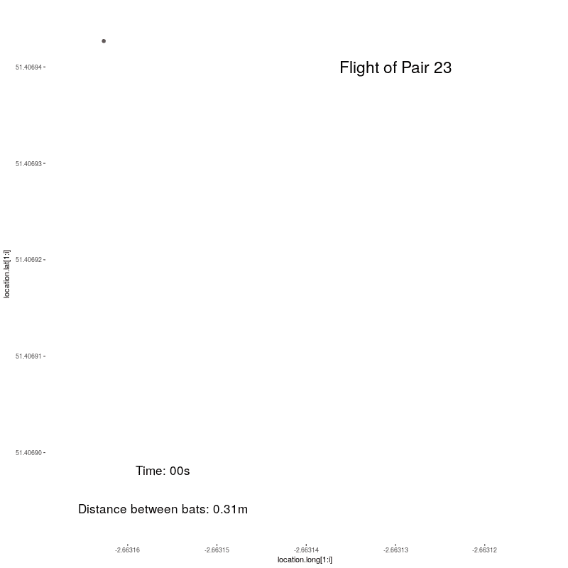
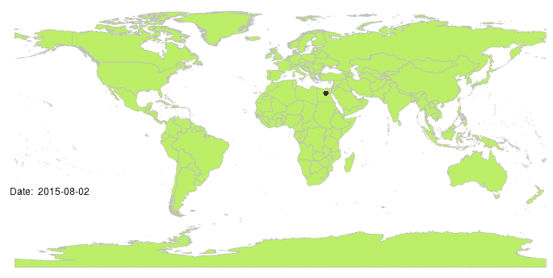
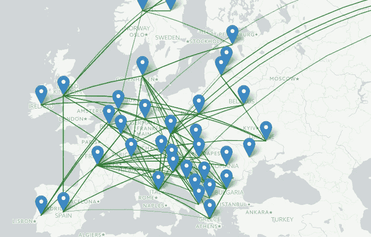

# 兽医数据:动物数据比比皆是！

> 原文：<https://towardsdatascience.com/data-in-veterinary-animal-data-abound-8d8ba92bbdbc?source=collection_archive---------4----------------------->

*“一只黑猫穿过你的道路意味着这只动物要去某个地方”* —格劳乔·马克斯

# 动物相关的开放数据

在最后一篇关于开放数据的出现和好处的博客之后，我决定看看有哪些数据是专门与动物相关的。

我找到的第一个是由马普鸟类研究所主持的 [**Movebank 数据库**](https://www.movebank.org/) 。这是一个专注于动物追踪的开放式数据库。他们的目标是“*…帮助动物追踪研究人员管理、共享、保护、分析和存档他们的数据*”。

在撰写本文时，该网站包含 248 个数据文件，内容涉及从“追踪美洲夜间飞行食虫动物的迁徙”到“南极海燕 3D 飞行”再到“藤壶雁的迁徙时间”。

数据集可以位于地图上，数据可以直接从网站下载。它还为您提供了最后一次数据集更新的日期，以及数据所有者的联系方式。

浏览了一会儿后，我偶然发现了一个有趣的数据集，名为“拖网蝙蝠的[运动协调](http://dx.doi.org/10.5441/001/1.62h1f7k9)”。这是 2015 年进行的一项研究，该研究在短时间内跟踪蝙蝠的位置，旨在推断蝙蝠使用什么规则来协调它们的运动。作者表示“*当观察成对的道本顿蝙蝠在低空觅食搁浅的昆虫时，我们发现它们有有趣的‘交通规则’——它们互相追逐，进行串联转弯，甚至减速以避免碰撞*”。这项研究的[论文](http://journals.plos.org/ploscompbiol/article?id=10.1371/journal.pcbi.1004089)是开放获取的，甚至是一篇[国家地理文章](http://news.nationalgeographic.com/2015/03/150326-bats-animals-science-echolocation-traffic-navigation/)的主题。

我下载了这个数据，玩了一把。我拿了两只蝙蝠(从数据集的参考数据中识别为“成对、协调飞行”)，并用 [R](https://cran.r-project.org/) (一种开源统计编程语言)创建了一个动画。我分别把蝙蝠涂成红色和蓝色，并在它们之间画了一条线，随着它们之间距离的增加，这条线逐渐变淡。

同样，Zoatrack 网站也有动物追踪数据，主要集中在澳大拉西亚地区的研究。它还拥有许多分析和可视化工具，以帮助利用数据。

更专业的是 [**Seaturtle**](http://www.seaturtle.org/tracking/) ，专注于追踪海龟(不足为奇)。对于本网站而言，数据的使用似乎不太“公开”，因为必须首先获得数据所有者的书面同意。

从动物追踪开始， [**EMPRES-i**](http://empres-i.fao.org/eipws3g/) 网站(由联合国粮食及农业组织主办)包含全球动物疾病的公开数据。这个大型数据集提供了诸如猪瘟、口蹄疫和禽流感等疾病的爆发和发生的信息。所有疾病事件都附有位置(经度和纬度)、日期、死亡人数等信息。我下载了全球禽流感爆发的数据，制作了一个快速简单的动画，

不同类型的动物相关数据可在 [**FAOSTAT**](http://www.fao.org/faostat/en/#data) 网站上找到。同样由联合国主办，这个网站聚焦于不同国家、不同行业的贸易和生产。一个数据集显示了所有的活体动物运输，这些数据被“[停止活体运输](https://stoplivetransport.org/)”慈善机构大量使用。我抓取了一些数据(特别是与 2013 年欧洲所有生猪出口相关的数据)，并用它创建了一个交互式地图。

互动版可以在这里[找到。](https://robharrand.shinyapps.io/stoplivetransport_shiny/)

再次不同的是英国政府网站上的动物相关数据。在这里搜索发现了 2015 年所有的[外来动物进口许可证](https://data.gov.uk/dataset/exotic-animal-import-licences-2015/resource/c2117ca8-1dad-4b6f-a14e-b1b8d14f34a3)。如果你想知道最近有多少只巨大的水獭被允许进入英国，这是给你的数据集。

查看[美国政府的开放数据门户](https://www.data.gov/)，在撰写本文时，有 16131 个数据集与“动物”一词相匹配。这些数据包括路易斯维尔的动物咬伤数据、佛蒙特州的动植物物种图谱和西雅图的宠物许可证。专门搜索“狗”会得到奥斯汀宣布的危险狗、巴吞鲁日的控制事件和安克雷奇注册狗名的数据。

# 将数据投入使用

上面提到的数据集仅仅触及了可用数据的表面，每天都有新的数据集被上传到这样的网站。

在一个层面上，这些数据纯粹从“看一看”的角度来看是有用的。如果你找到了与某个主题相关的数据，简单地下载并探索这些数据(通常通过简单的情节)就能揭示出感兴趣的东西。

除此之外，开放数据的真正力量源于能够将数据集合并在一起，或者使用多个开放数据集，或者更好的是，丰富你自己的私有数据。例如，在 Avacta Animal Health，我们有多年的过敏测试数据。我们最近开始结合开放的环境数据集(如英国气象局提供的数据集)来研究这些数据，以获得新的见解。

简而言之，开放数据仓库充斥着动物数据，其中许多部分可能会引起兽医专业人员的兴趣。所以，无论你有什么数据，或者你有什么兴趣，看看那里有什么，甚至可以分享你自己的数据。