# 数据是利益相关者

> 原文：<https://towardsdatascience.com/data-is-a-stakeholder-31bfdb650af0?source=collection_archive---------3----------------------->

## 设计和数据科学

## 设计、人种学和面向未来的数据科学

我从未打算成为一名数据科学家。我大学毕业时获得了文化人类学学位，并天真地认为我想做的研究不需要数学。完全靠运气，我进入了美国为数不多的认真对待数学的人类学研究生项目，这改变了我一点点但不是很多的视角。在我的博士野外工作中，我去了中亚研究宗教、政治和社会活动家的身份叙事，我使用了一些标准的统计工具，如主成分分析和回归模型，以及我的非数学访谈和参与者观察。

我最终获得了博士学位，并在美国陆军部找到了一份战略情报和规划的工作。他们雇用我是因为我是一名人类学家，但我很快就发现从阿富汗传来的大量数据很少有人真正利用。随着时间的推移，我扩展了工具包中的定量部分，以处理越来越大规模的数据。我把自己黑进了数据科学家，因为成为数据科学家是我工作的最佳方式。从那时起，我在公共、私营和非营利部门，以及在安全、旅游、资产管理、教育和营销技术行业建立和管理数据科学能力。

当人们知道我的背景时，他们经常会问“你怀念当人类学家的日子吗？”我对这个问题的回答总是一样的:“我仍然是一个人类学家。”人们几乎从来没有问过我这么说是什么意思，但我越想越相信，我的意思说了一些重要的事情，即面对日益自动化和公众监督，数据科学如何能够保持一个有凝聚力的职业。

## 好的实现需要好的设计

作为一个职业，我认为我们对设计的关注太少了。我看到的关于这个话题的相对较少的讨论给我的印象不是太笼统就是太具体。一方面，我们似乎认为“好的设计”是某种不可定义的东西——只有当我们看到它时才能知道它——而与此同时，我们似乎太快地从好的设计的重要性转移到将设计转化为实现所需的具体方法、度量标准和其他技术工具的列表。

有一次，当我女儿很小的时候，她想要一个玩具厨房。我想从二手商店买旧橱柜和五金器具，给她做一套厨房用具。最后那东西是用木胶和一厢情愿粘在一起的。我女儿喜欢它，但它是一件真正的垃圾。我的实现有两个弱点。

一方面，我只使用我已经拥有的工具，这意味着五个或大或小的螺丝刀，一个机械师在换油后放在我汽车引擎盖下的活结钳，一把我上大学时从我父亲车库里拿的锤子，以及一小袋从宜家家具商店收集的类似工具的物品。简而言之，我的技术工具集很糟糕，我真的不知道如何使用我所拥有的少数工具。

另一方面，我真的没有经验或能力详细地设想我想要建造的东西。我不知道如何将事情作为一个整体来计划，或者考虑意外情况，或者在出错后进行调整，或者预测各个部分可以或应该或将要一起进行的方式。

如果我有世界上最大、最好的硬件，我会早一点完成，最终得到一个稍微好一点的产品。不知道如何实现当然是一个大问题，但是不知道如何设计才是真正阻碍我的。

我认为在这个特殊的时刻，设计技能对于作为一门学科的数据科学来说尤其重要，因为数据科学的技术方面最终有多少将被自动化仍然是一个悬而未决的问题。训练和验证模型是这项工作的一个重要部分。在我的职业生涯中，我训练和验证的许多模型今天都可以通过像 [DataRobot](https://www.datarobot.com/) 这样的服务全部或部分自动化。设计技能，以及我们如何学习这些技能，值得比我们，作为一个职业，迄今为止给予它们更多的关注。

“设计”这个词与“指定”有着相同的词根:单词“signum”，意思是“一个标记”——你书写、放置或剪切的将一件事物与另一件事物区分开来的东西。换句话说，“设计”是采取一个特定的目标，并区分所有与该目标相关的任务、材料和可能性的实践。以这种方式从概念上组织某些问题是具有挑战性的，不管技术实现有多困难。我认为这些问题是数据科学未来的重要组成部分。

## 通过协商讲故事来设计

根据我的经验，设计技能比其他非技术技能更难学习，比如“领域专业知识”或“沟通技能”。我认为这是因为每项技能的学习是如何发生的:

*   当你需要学习一个学科领域时，你让自己与那些已经熟悉这个领域的人接触。每当有人用一个你不知道的单词，或者引用一个不熟悉的例子，或者讲述一个他们的经历来解释一个你不理解的决定时，你就获得了该领域的专业知识。
*   当你需要学习沟通技巧时，你会进行沟通，然后得到反馈，告诉你哪些地方可以做得更好。每次你学习一个新的策略，看着别人展示最佳实践，然后在你下一次交流的尝试中尝试模仿，你就获得了交流技巧。

在这两种情况下，技能本身可能很难学习，但理解如何学习它们并不特别困难。有了设计，就不一样了。学习很难，但学会如何学习也很难。这是因为让一个人在设计技能方面胜任的因素与让一个人在其他非技术技能方面胜任的因素是不同的:

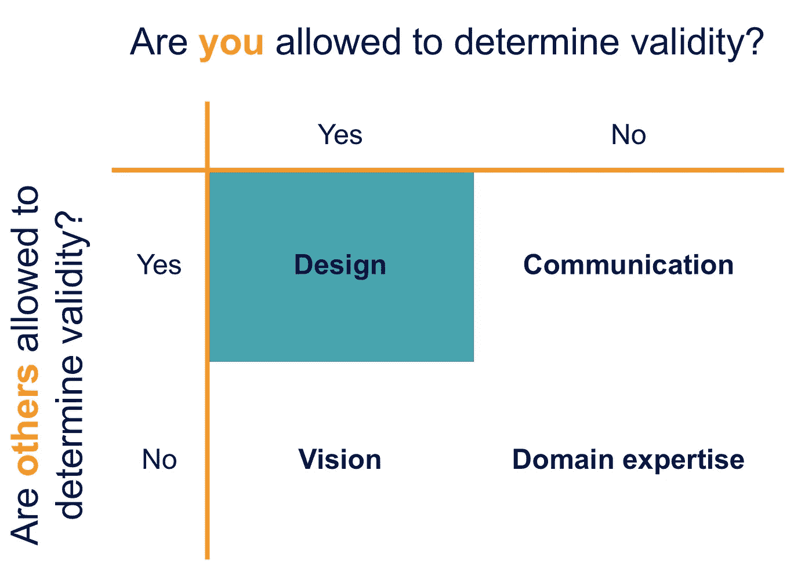

(我不打算说表的“愿景”部分。这是另一篇文章的主题)。

这可以归结为，相对于其他人，你在多大程度上可以决定特定的知识或特定的行为是合理的、可接受的、“正确的”——一句话，它是否有效。对于领域专家来说，没有人有这个权力:如果一件事情发生在一个领域内，那么它就是这个领域的一部分。在交流中，其他人完全有权决定什么是有效的:如果其他人都认为你的演示很糟糕，那么你认为你的演示有多好并不重要。你不能说“我不在乎其他人说什么，我知道我是一个很好的沟通者。”这暴露了对沟通如何进行的根本误解。

在设计中，你和其他人都有权决定有效性。我不是说有效性可以由你或者其他人来决定。我的意思是有效性必须经过协商。

人类学家倾向于使用一种叫做“人种学”的方法来协商设计的有效性。这种方法有许多不同的特点，但我发现把人种学想成要求你进入或多或少陌生的情境，让你自己的直觉和假设沉睡是有用的。你从“当地人”那里获得关于他们如何看待这些情况的信息，然后你唤醒自己的直觉，以便将你所学到的东西转化为对你来说看起来连贯而合理的故事。然后你把这个故事拿回去修改，直到它对他们来说也是一个连贯合理的故事。这是重复的，协商的故事讲述。

作为一名人类学家，当我有一个研究问题时，我会找到愿意和我谈论这个问题的人。我让他们告诉我这个世界是如何按照他们的方式运作的，做笔记，最终我会编一个故事，解释那些假设、背景和环境，让他们的故事对我来说是合理的、符合逻辑的。然后我和他们分享这个故事。然后他们说我满口胡言。

我不认为我第一次尝试复述他们的故事时，有人能认出他们。他们的直觉和我的直觉相差太远了。我得到详细的批评，然后我重写这个故事。如此反复几次，我得到了类似这样的回答:“好吧，这并不完全是我说的那样，但我认为你把所有要点都说对了。”然后我找其他人聊天。这一次，我从讲述我精心构思的故事开始——告诉他们世界就是这样运转的。然后他们告诉我我错了，我请他们纠正我。

随着时间的推移，随着我与更多的人一起工作，并刻意寻找那些有曝光度或观点的人，而这些人是过去的贡献者所没有的，我精心制作了一个大多数贡献者都认为合理的故事。有时这个故事分裂成不止一个故事，因为不同的人群根本不同意。通常情况下，我会以一个讲述大部分情况的主要故事结束，然后是几个讲述重要变化的附属故事。

我不只是收集信息。我填补了个人贡献者故事之间的空白。通常投稿人自己不同意(有时强烈反对)彼此的故事，但同意我的桥。我捍卫我对这个故事的贡献，就像他们捍卫他们的一样。对我来说，仅仅认识到一个视角的存在是不够的，别人告诉我什么有效什么无效也是不够的。我需要协商一个故事，融合我对世界的看法和其他人对世界的看法，结果需要被整体接受，即使它很难被部分接受。

好的设计来自谈判故事。除了沟通技巧之外，还有一些可以学习的技巧可以让一个人成为优秀的设计师。

## 给数据一个声音

现在，设计是各种利益相关者协商的结果的想法当然不是什么新鲜事。事实上，这种优先级的迭代设置是软件设计敏捷方法的核心。然而，我认为数据科学中的设计不同于大多数其他工程环境中的设计，因为数据本身需要有声音。我的意思是，在很大程度上，我的意思是，项目中的每个利益相关者都需要一个声音。在一个健康的设计环境中，利益相关者不只是在设计师规定的时间和方式下给出意见。他们能够反驳。他们能够提出疑问。他们能够加入意想不到的见解。我认为，创建工具来讲述个人的数据故事，即使没有人特别要求这个故事，这也应该是数据科学家工作的核心部分。

这些讲故事的工具需要有响应性，因为设计是协商的，因此是迭代的。当利益相关者提出一系列行动来解决特定的业务问题时，讲故事工具集应该能够对此做出反应:以直观的方式显示，如果执行了这些行动，数据看起来会有所不同，并标记出故事不再有意义的任何情况。它需要尽快做到这一点:如果数据拖累了对话，它将被释放。

提高设计技能是解决数据科学当前最大挑战之一的关键:算法偏差。不难发现存在严重设计缺陷的高效且可扩展的技术解决方案的例子。例如:

*   彭博对亚马逊提供的当天送达服务进行了一项调查，调查显示贫困的、少数民族聚居的邮政编码经常被排除在外。该算法建议在亚马逊已经拥有大量 Prime 订户的地方实现当天送达，这些订户往往在较贫困的地区数量较少。
*   [Wired](https://www.wired.com/story/excerpt-from-automating-inequality/)的一篇报道展示了儿童虐待保护算法如何倾向于针对贫困家庭。该算法试图考虑的虐待儿童的指标(“没有足够的食物，没有足够或不安全的住房，缺乏医疗保健，或在工作时留下一个孩子”)等。)模糊了忽视和贫困之间的界限。
*   [卡耐基梅隆大学的研究人员](https://www.theguardian.com/technology/2015/jul/08/women-less-likely-ads-high-paid-jobs-google-study)创造了一些行为相同的虚假用户，他们的个人资料只是性别不同。谷歌的广告显示系统往往很少向那些个人资料显示为女性的用户显示高薪职位的广告。

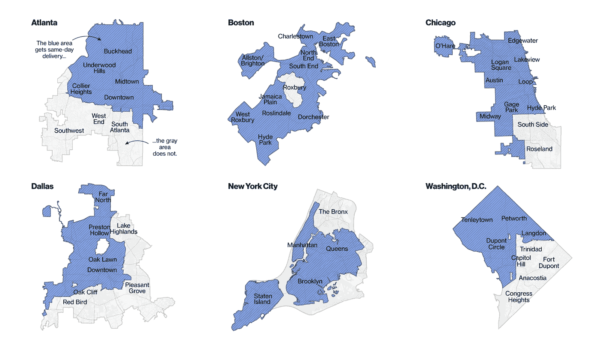

*Image credit:* [*https://www.bloomberg.com/graphics/2016-amazon-same-day/*](https://www.bloomberg.com/graphics/2016-amazon-same-day/)

在上述案例中，没有任何迹象表明种族、财富或性别是明确的目标。这些工具旨在回答一个简单的商业问题:我们如何区分我们感兴趣的人、地点或情况？就我们所知，每种情况下的技术解决方案似乎都是完全合理的:选择一组替代措施，并标记出最常展示这些替代措施的人、地点和情况。然而，在构建这些系统的过程中，似乎没有任何一套工具被构建来回答这样一个问题:被标记的人、地点或情况是否在任何属性上与未被标记的人、地点或情况系统地不同？这不是技术上的失败。这是设计上的失败。

我认为这个设计工具的问题在数据科学中基本上是一个未开发的领域，尽管它在软件开发中开始受到更多关注。无论如何，这是一个比技术技能组合更能抵御自动化威胁的领域，而技术技能组合通常被提升为定义该职业的核心。

## 示例 1:宗地几何重叠解析

[Valassis Digital](https://www.valassisdigital.com/us/) 从移动设备收集位置数据，并使用这些数据帮助公司更精确地向目标受众营销。我对这些数据的大量工作涉及到位置语义的问题:我们发现某些设备倾向于聚集在特定的地理空间，但我们想了解*为什么*它们聚集在那里。尝试理解位置语义的一种方法是通过宗地几何。理解为什么一个设备会出现在一个特定的地方的一个方法是看谁拥有那个特定的地方。这种数据可以通过美国和加拿大的评估办公室获得。我们得到一个定义属性边界的几何定义，通过查看与几何相关联的元数据，我们找到了赋予地理位置数据意义的方法。

宗地几何质量差异很大。我们在使用这些数据时遇到的一个困难是，有时宗地几何会重叠。我们对重叠发生的原因没有很好的理解:在某些情况下，这看起来像是一个简单的草率记录的问题；在其他情况下，财产的两种定义(例如，个人财产与城市通行权)会造成宗地可能合法重叠的情况。对于我们的大多数目的来说，将一块土地与一个且仅一个地块相关联是有帮助的。因此，我必须努力检测这种重叠，这很容易，并自动解决它，这很难。考虑以下情况:

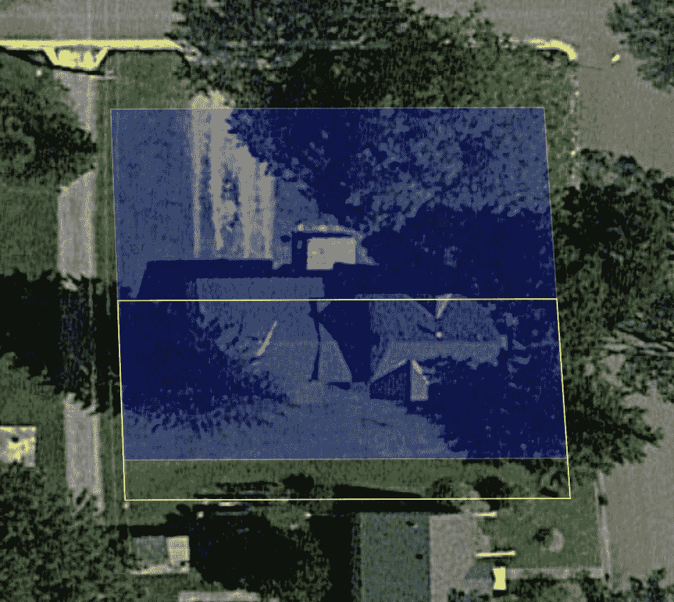

这是我们在宗地数据中遇到的非常典型的重叠。蓝色多边形表示一个宗地，黄色轮廓表示另一个宗地。看到这个例子，几个相对简单的技术解决方案出现了。例如，我们可以将重叠区域分配给两个地块中较大的一个，或者两个地块中较小的一个。我最终得出的解决方案是，将两个地块的重叠区域进行区分，以创建一个模拟，模拟每个地块在失去重叠后的样子。然后，我对照大小和形状阈值检查了每个模拟。如果模拟地块比我们通常在有用的住宅和商业地块(我们最感兴趣的两种土地)中看到的更小或更窄，我只需删除与不成功模拟相关的形状。如果两个形状都没有导致模拟失败，我将重叠区域分配给较大的形状。如果两者都导致模拟失败，我将两个形状合并在一起。

完成上述解决宗地几何重叠的过程后，我对结果进行了一些简单的描述性分析，记录了移除、编辑、合并了多少宗地等。我还浏览了几十张像上面这样的图片，以确认结果看起来合理。换句话说，我做了一些正常的结果检查。然而，我继续用多边形覆盖卫星图像——其中有几千个多边形，并且我制作了一个工具来显示我的算法结果以及原始故障。它是乏味的。但是我们有数以百万计的地块几何，我习惯于看到新的故事出人意料地出现，即使是在长时间一遍又一遍地听到相同的故事之后。结果是:

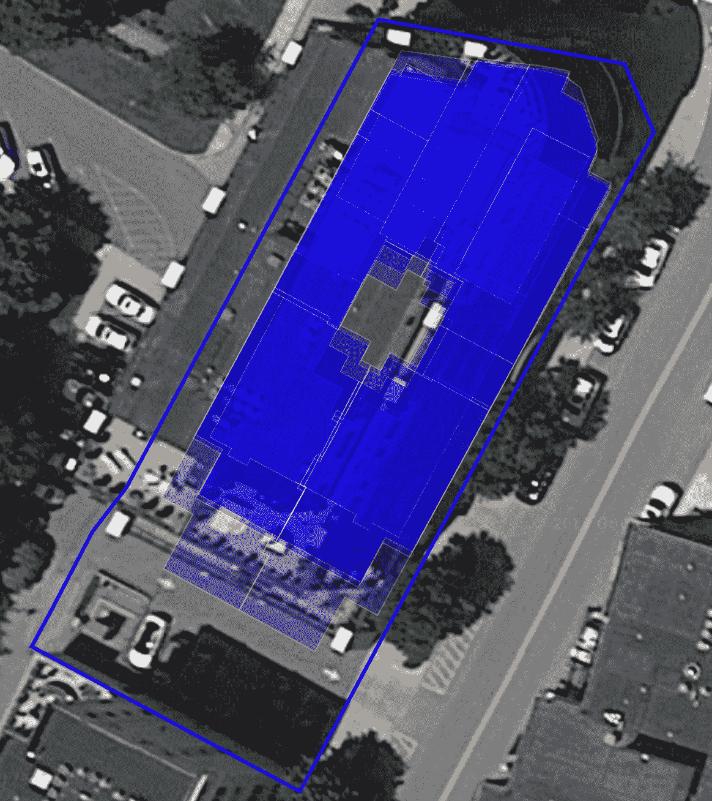

在上图中，一名评估员拍摄了一栋多层建筑，并为每层的每间公寓创建了一个地块几何图形。都叠了。我的简单算法把这种情况搞得一团糟:它实际上最终移除了整个建筑，因为与其他一些地块相比，每个地块最终都变得太窄或太小。这是宗地重叠的特殊情况，必须在运行核心算法之前单独检测和处理。在这种情况下，我寻找堆叠(合计每个地块的面积并除以所有地块覆盖的总面积-任何大于 1.0 的值都表示堆叠)，在我检测到堆叠的情况下，我将所有堆叠的地块合并到一个建筑物中。这应该没问题，对吧？

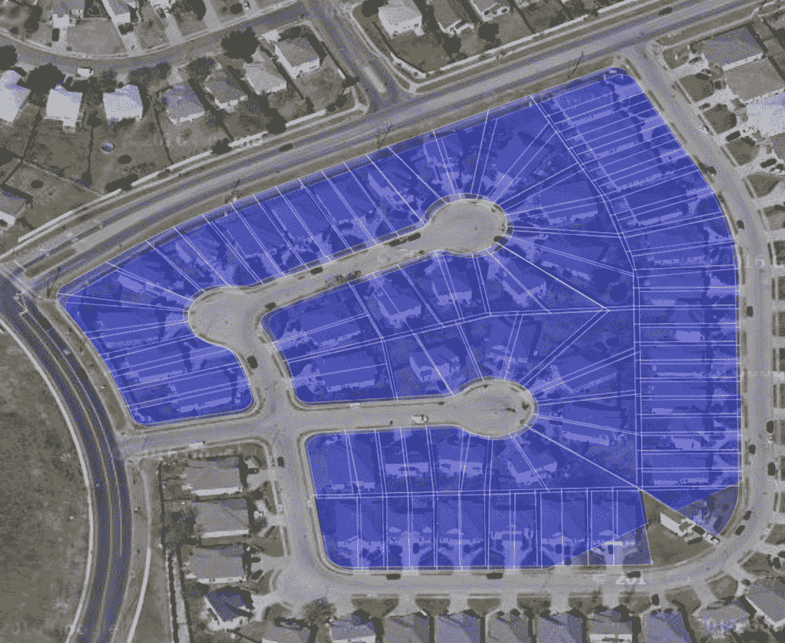

仔细观察上图中的边界线。几乎所有的线路都是双倍的。事实上，这整个区域由两组宗地表示，尽管这两组宗地并不完全相同-一组与另一组略有偏移，但在许多情况下形状也略有不同。我的堆叠检测导致这整个细分合并成一个单一的建筑-不是一个最佳的结果。在这种情况下，我需要像以前一样检查堆叠，然后检查冗余层。我创建了一个网络，其中每个宗地都是一个节点，每个边都是宗地接触的情况，而不是重叠。然后，我从这个网络中取出最大的连接组件集，并将其用作基础层。然后，它会检查每隔一组连接的组件，如果重叠超过某个阈值，则删除新层，如果不重叠，则合并新层。

以上只是一个简单的例子，但它说明了为数据集创建一种对预期算法做出反应的方式的好处，有时也说明了这种必要性。它要求我创建一个新的工具集，突出重叠区域，以便我可以更直观地看到问题区域，它要求我不断“询问”数据集的部分，我的实现是否有意义。我看过的大多数图像都表明我的基本算法没有任何问题。经过几个小时的寻找，我才开始发现差距。

## 示例 2:位置精度校准

我们每天会得到数亿条地理定位记录。然而，并不是所有的数据都可以信以为真。在其他问题中，特定的 ISP、应用程序、设备或特定的设备配置可以以精确坐标的形式报告数据，而实际上坐标并不是精确的。这有很多原因，其中只有一个原因是，来源有时依赖于高水平的记录，这些记录将整个地区编码为一组坐标，就像美国地理中心的一个不幸的家庭十多年来一直感觉的那样。

因此，在开始时，问题似乎相当简单:标记与异常多的独特设备相关联的坐标。例如，如果一个区域中的大多数坐标对看到 1 到 10 个不同的设备，但一个坐标对有 1，527 个不同的设备，则该坐标对可能被用作默认位置。这是一个区域中前 20 个坐标对的放大图，按照独特设备的数量排序，显示了它的样子。

顺便提一下，我省略了所有精度小于三位小数的坐标，并将所有其他坐标四舍五入到六位小数。六个小数位代表一个直径约为 4 英寸的空间，这是 GPS 在没有大量三角测量的情况下所能提供的精度极限。

这里有一个有趣的分析和商业问题。上图中的红线代表了一个例子，说明如何设置一个阈值来过滤掉坐标。您可以清楚地看到设备数量的激增，但您还可以看到至少两个类似规模的增长。什么应该被认为是一个极值而不是一个非常繁忙的点？

这个问题没有好的技术答案。有多种方法可以进行变点检测，但是所有这些方法自然都有需要调整的参数。而且，据我所知，它们都没有告诉你需要注意多少变化点。如果你看到至少三次大的跳跃，就像我们在上面的图表中看到的那样，会怎么样呢？第一个是识别假位置数据的截止点吗？最后一个？即使在只有一个变点的情况下，在变点将最大的数据点与所有其他数据点分开的情况下(有很多变点)，这也只能给我们一个明确的行动路线。这符合我们对默认位置问题的天真想法。但是我发现在一些情况下，变化点将许多，有时是几十个数据点从其余的数据点中分离出来。

这个问题没有明确的技术解决方案，主题领域也没有给我们明确的指导——因为我们不知道产生热点的系统，我们不知道有多少是合理的。这是一个设计挑战。

这就是数据需要发声的地方，有了地理坐标数据，让数据发声并不困难。任何一天在一个地方有一个人都是正常的——这正好符合我们对使用移动设备的人的假设。如果我们看看某一天在纽约市佩恩车站得到的位置数据，这就是我们所期望的:

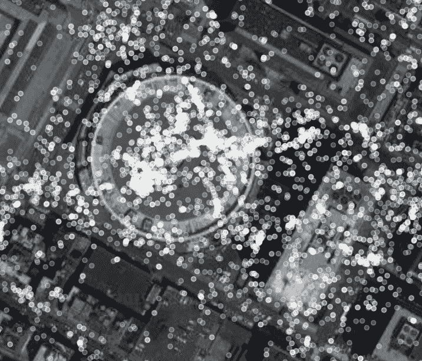

麦迪逊广场花园的中间有一个高密度的坐标，这是我们所期望的，因为宾州车站的主要美国国家铁路客运公司候车区就在地平面下。如果我们只过滤那些一天内很多人在同一地点联系的坐标，我们会得到一个不同的画面:

我们仍然可以在美国国家铁路客运公司等候区看到许多点击，其中许多点击实际上是一个接一个的。我敢打赌，这些地方大多就在时间表的正前方或电源插座的旁边。在麦迪逊广场花园和宾夕法尼亚广场二号(东面的长方形建筑)之间，我们也有几个热门景点，在美国国家铁路客运公司地下一层，是长岛铁路候车区。我们也有一些在另一边的两个佩恩广场，这是一个主要的出租车接送区。换句话说，即使这些坐标附加到的设备比我们通常预期的要多(有些设备多达 50 个)，这种模式也是可信的。

然而，我只能通过碰巧知道一些关于我正在看的区域的事情来认识到这种可能性。这是不可扩展的。因此，我采用了我已经组合在一起的基本地图可视化功能，并将其合并到一个工作流中，该工作流提取美国行政区划(州、县、城市和邮政编码)的 shapefiles，将设备坐标数据集与形状进行匹配，然后使用每坐标对设备的频率来让数据说明特定设备计数的正常程度。

我将唯一设备的数量除以我所查看的行政区划范围内的最大数量。在大多数情况下，绝大多数的点击量不到最大值的 1%,所以我选择了最大值的 50%或更多。然后我开始翻阅覆盖着坐标的卫星图像，寻找故事。许多看起来像我预期的那样——在整个形状中有一两点。然后我降落在沃思堡郊区的一个邮政编码区:

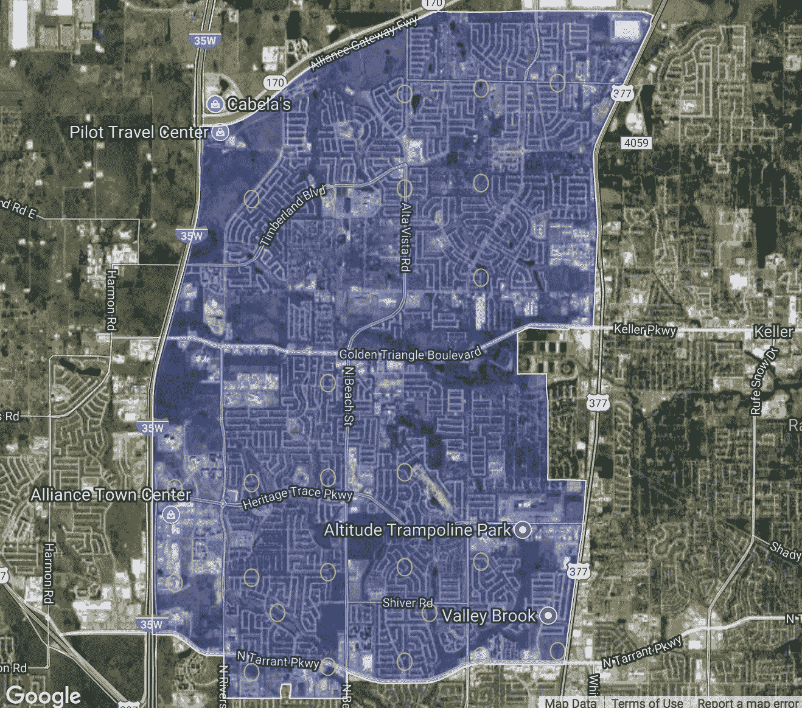

这是一个网格。有几个点不符合网格，自然有部分网格丢失，但那里有模式。翻阅更多的结果，我在博伊西、圣安东尼奥、科罗拉多斯普林斯的邮政编码中发现了同样的情况。这是曼哈顿的一个:

请注意，我在图像上绘制的这些圆圈比实际位置大得多——为了便于查看，我放大了它们。实际上，每个圆圈的直径约为 4 英寸。

这把我带到了一个全新的方向。我设计了一个简单的算法来自动识别网格——我获取了所有连接有许多独特设备的坐标，计算了每个坐标对相对于 x 轴的旋转角度，保留了该过程中的前四个角度，然后过滤掉所有没有连接到另一个坐标的坐标，至少有一个角度。下面地图上的每个圆圈代表我在这个过程中发现的一个网格:

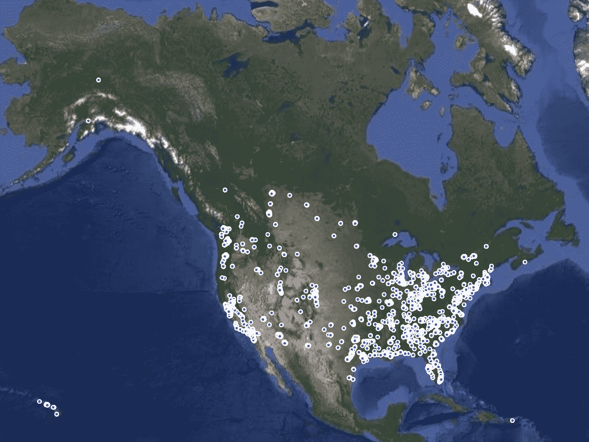

这是一组网格的放大图:

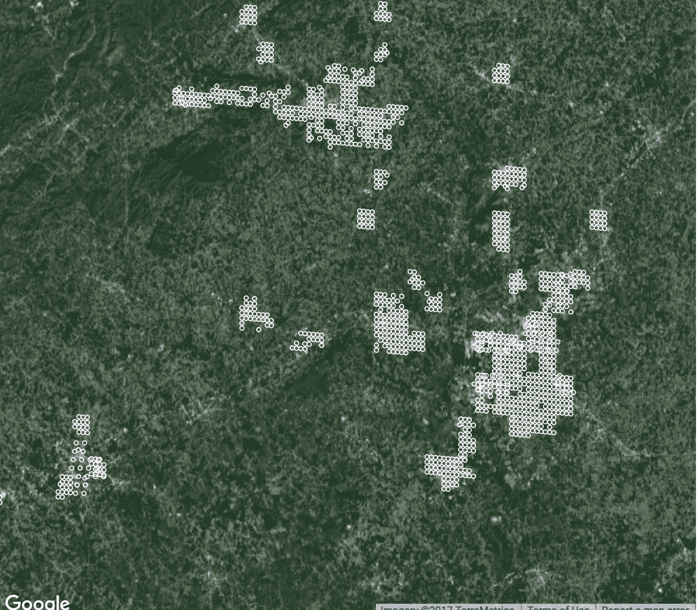

网格中的每个节点都是一个 4 英寸的小块，与其他节点相隔至少 1 公里。不同地方的距离和角度都不一样——这不是一个覆盖整个世界的单一网格。它捕获了大量的坐标，这些坐标具有相对极端的设备数量。如果我没有建立一个工具，让数据根据需求创造关于什么是正常的，什么是不正常的故事，我永远也不会找到它。

这些网格的另一个特点是:几乎所有的网格都包含天气应用。然而，这些应用程序创建的不在网格内的坐标比在网格内的坐标多得多，而且许多涉及坐标的应用程序显然与天气无关。但这给了我一个想法，这可能是一个天气网格，所以我花了一周的大部分时间从美国国家气象局研究和下载天气网格投影。我终于找到了一个与我在数据中看到的粒度大致相同的设备(设备坐标用黄色表示，天气网格用白色表示):

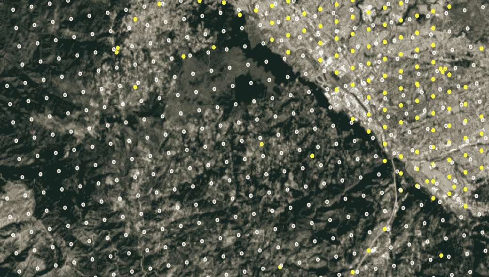

但是网格不匹配。盯着上面这样的图片看了很长时间后，我突然意识到一些显而易见的事情:

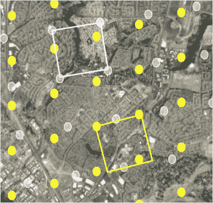

天气网格(白色)是一个合适的网格，节点形成直角。数据网格(黄色)则不是这样。因为国家气象局只使用正确的网格，根据定义，我在数据中看到的模式不可能来自国家气象局。我被难住了，直到像民族志实地调查中经常发生的那样，我在一个看似不相关的话题上进行了一次随机对话，给了我一些突然的洞察力。在这种情况下，对话是在我汽车的前座进行的:

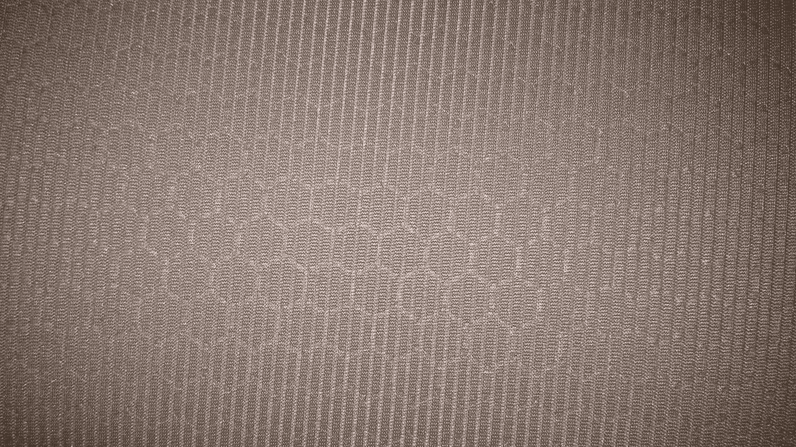

注意布料上的图案。想象这些六边形中间的质心。我没能找到合适的天气网格，因为我一直在搜索“天气网格”。我需要搜索“天气网格”。我一照做了:

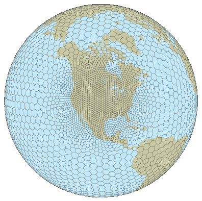

*Image source:* [*https://mpas-dev.github.io/atmosphere/atmosphere.html*](https://mpas-dev.github.io/atmosphere/atmosphere.html)

显然，气象公司(归 IBM 所有，同时也是气象频道和地下气象的所有者)与洛斯阿拉莫斯的气候组织合作开发了一种网格，这种网格可以在世界上的某些地方拉伸到更高的分辨率，而在其他地方收缩到更低的分辨率。他们的网格实现是专有的，并且可能会随着预测需求的变化而发生变化。天气频道拥有一个 API，允许其他人提供天气服务，这解释了为什么如此多的其他应用程序最终也落入六边形质心。然而，天气应用程序在这些质心之外有大量的点击，这表明它们有时只提供质心数据，也许只有在设备上禁用位置服务时。对于气象公司来说，使用某种网格或网格来决定为用户提供什么样的预报非常有意义，对于应用程序来说，在报告用户位置时简单地报告这些六边形的质心也非常有意义——大多数报告系统只需要一个简单的坐标对。在这里，理解数据生成过程的设计可以最准确地使用数据

这一系列发现改变了我解决定位精度校准问题的整个设计:

1.  仅查看特定天气应用程序的坐标
2.  拾取附着了多个设备的坐标。
3.  将数据划分到任意的邻近坐标组中(不再需要管理形状，因为现在我知道我在找什么)。
4.  选择一个组中坐标对之间最常见的前 n 个旋转角度，并选择显示每个旋转角度的坐标对之间最常见的距离。
5.  遍历所有坐标(不仅仅是具有多个设备的坐标)，只保留那些通过所选旋转角度之一连接的坐标，以及那些通过该旋转角度的大致典型距离分隔的坐标。
6.  因为网格节点会随着时间的推移而改变。
7.  使用标准的变点检测方法查找行政区划中的异常值，但只能在移除格网坐标后进行。

通过构建工具来赋予数据声音——以粗略但直观的方式向我展示在多少设备被视为“正常”的不同假设下，坐标看起来是什么样的——问题从参数化变点分析的纯技术挑战转变为如何适应广泛但系统不精确的位置报告系统的设计问题。通过提前删除网格坐标，我的变点检测变得更加简单——它大大增加了州、县、城市和邮政编码，其中只有一组坐标具有极端设备数。此外，它还标记了不可信的坐标(至少在这些坐标给出的精度上)，即使这些坐标上的设备数量并不极端。

## 我们需要一个好的问题生成工具集

数据科学目前非常擅长提出答案。它不太擅长提出问题。我认为这需要数据科学家更加注重培养非技术技能，但我认为这也需要我们开发更多工具来促进这一过程。事实上，构建工具将在很大程度上有助于构建非技术技能。

我在本文中给出的例子是一个相对简单的用例，因为地理空间数据有助于直接、直观的交流。其他类型的数据和其他类型的业务问题将带来更大的挑战。这是一个值得接受的挑战。对设计的关注——不仅仅是意识到这一点，而是积极构建我们的设计直觉、能力和工具集——是数据科学在核心技术功能日益自动化以及公众日益怀疑算法既符合道德又可扩展的观点的严格审查中生存下来的最佳机会。

这篇文章是我个人的，不代表 Valassis Digital 的立场、策略或观点。但我非常感谢我的雇主让我写博客，记录我为他们做的一些工作。(还有 [*我们正在招聘*](https://www.valassisdigital.com/us/careers/tech-careers/) *！)*