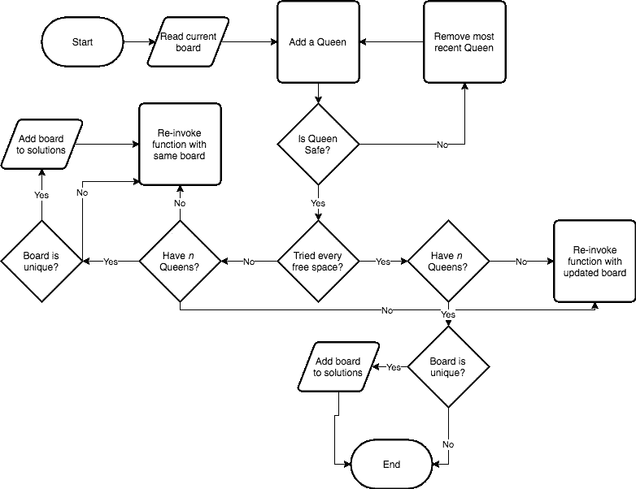
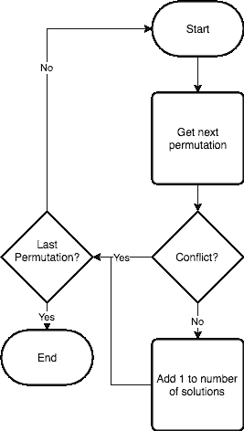

# 用 N 皇后进行数据操作

> 原文：<https://towardsdatascience.com/data-manipulation-with-n-queens-640d37e3c774?source=collection_archive---------0----------------------->

H 我们如何感知，进而如何解决问题，在很大程度上取决于给定数据的格式。事实上，通常可以将给定数据重构为一种形式，这种形式比最初呈现或收集数据的方式更有助于解决问题。在计算和数学中有一个流行的问题，它很好地证明了面向问题的数据重构的概念，它如下:

> 你有多少种方法可以将 n 个*(团队不可知)皇后放在一个维度为 ***nxn*** 的棋盘上，这样就没有皇后可以攻击其他的了？*

*我考虑的第一种方法是将可能的解决方案表示为一个实际的棋盘，在不同的方格中放置一些皇后。一种利用这种数据格式的算法(后来证明与所提出的解决方案非常相似)包括在棋盘上的每个空间放置一个皇后。从这里开始，你可以试着把另一个皇后放在别的地方，确保第一个和第二个皇后不能互相攻击。然后对第三个皇后重复这个过程，然后是第四个，依此类推，直到你在棋盘上有了 ***n*** 个皇后。在这一点上，数数你想出了多少独特的董事会。该过程看起来像这样，为了简单起见，省略了一些内容:*

**

*你可能已经注意到了这个算法的一个或几个问题。首先，如果你严格按照流程图去做，你将会产生大量的非独特的解决方案。必须验证板是否是唯一的将浪费大量时间。第二个(也是更成问题的)问题是，每增加一个皇后，所需步骤的数量将呈指数增长。特别是，当你没有尝试每一个自由空间，并且你还没有足够的皇后，你将不得不对同一个棋盘以及一个有额外皇后的新棋盘再次执行该过程。按照这种逻辑，每次迭代都需要流程图的`n * n — k`个新实例，其中 ***k*** 是棋盘上已有的皇后数。问题在于，整个棋盘包含了大量的信息，我们根本不需要回答这个问题。让我们考虑提出的问题，并尝试将数据归结为一种格式，只表达我们真正需要产生解决方案的内容。*

*T 这里有一些方法可以让我们避免在我们知道行不通的解决方案上浪费太多时间。首先，我们知道女王可以攻击她们行中的任何东西。考虑到这一点，如果一行已经包含一个皇后，我们可以忽略整个行。添加这个简单的功能将极大地减少我们必须验证为解决方案的板的数量，以及我们需要检查唯一性的板的数量。*

*“但是等等！”我听到你说，“女王也可以攻击他们队伍中的任何东西，所以我们也只使用独特的队伍吧！”当我们这样做的时候，我们可能会认为只在空对角线上放置皇后是明智的。我们会到达那里；请容忍我一会儿。在这一点上，我开始怀疑摆弄整个棋盘是否真的是解决问题的最佳方式。如果我们可以轻松地表示每个皇后的行和列，并保证每个皇后的唯一性，而不需要我们管理一大块空白空间，这不是很好吗？的确会，而且碰巧有一种方法不仅能解决笨拙的棋盘问题，同时还能让我内心的组合学博士(我做梦都能拿到博士学位)高兴:输入我喜欢称之为“棋盘地图”的东西*

*让我们跳回到独特的行。如果每行只能容纳一个女王(它们的个人空间非常大)，那么这很适合于每行只记录一个位置:女王所在的列。类似地，既然我们知道每列只能容纳一个皇后，并且我们需要一个完整的 ***n*** 皇后在我们的小战区中，我们可以说每列必须在我们的行集合中的某个地方被表示。实际电路板图的一个示例如下:*

**

***Map: 2–5–7–1–3–0–6–4***

*地图`2-5-7-1-3-0-6-4`与显示的棋盘完全对应，如下所示。映射中的第一个位置(位置 0)表示第一行，其中的值(本例中为 2)声明该行的 queen 存在于该行的第三列中。类似地，第五个位置(位置四)确定在其第四列(或第三列，因为我们从零开始)中存在皇后。把这个逻辑应用到整个地图上，你就会得到上面的板子。使用这种地图结构，很明显问题的任何解决方案都将是一种排列，即地图中数字的重新排序，平凡地图`0-1-2-3-4-5-6-7\.` 的重新排序。然而，我们仍然需要担心对角线。*

*事实证明，我们的新地图结构也恰好给了我们一个非常简单的方法来检查是否存在对角线冲突。在国际象棋棋盘上，如果一个皇后与另一个棋子相隔的行数和列数一样多，就有可能进行对角线攻击。根据这种推理，如果位置的差异与地图中任意两个项目的数量差异相同或相反(例如，3 是 3 的倒数)，我们可以丢弃该地图，因为它不是问题的有效解决方案。考虑到这一点，我们的新算法变成:*

**

*请注意，这个操作没有分支，需要在当前迭代之后进行多个新的迭代。此外，平凡地图的每个排列保证代表一个独特的棋盘，因此我们可以完全消除测试是否已经计算了一个解决方案。我们的地图结构也先发制人地消除了大量有问题的棋盘，因为我们已经保证没有水平或垂直的攻击是可能的。因此，通过放弃原始的数据格式，转而采用针对问题定制的数据格式，我们能够显著降低解决方案的复杂性。*

*到总结，在开发一个问题的解决方案时，考虑数据和数据呈现的格式是非常有益的。操纵传达比回答给定问题所需更多信息的数据是对资源(在计算的情况下是时间和内存)的浪费。在 N 皇后的例子中，我提出的第一个解决方案花了一分多钟来计算从 0 到 8 的值*的答案，而第二个只花了不到 30 毫秒。对于技术上更倾向于，原始解决方案在***【o(nᴺ】***处操作，其中 ***N*** 是板的尺寸(因此 ***n*** )，而第二个更简洁的数据集允许在 ***O(n！*)**。**