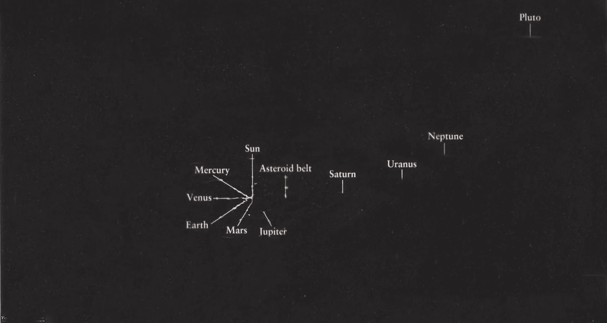

# 数据挖掘——注意差距

> 原文：<https://towardsdatascience.com/data-mining-mind-the-gaps-4086e0e2fe2a?source=collection_archive---------10----------------------->

当评估您希望挖掘用于机器学习或数据分析的大量数据时，您经常会看到大量显式数据点，因此似乎很难看出您需要添加更多数据。但往往最重要的数据不是点而是点与点之间的关系。

如果我们把显式数据看作节点，那么隐式数据就变成了节点之间的连接和关系。一个简单的例子可能是一组坐标，大小，大气组成，以及更多关于我们太阳系中的物体。这组事实可能看起来很重要，也很全面，但是直观地展示它们会暴露出主要的差距。

Solar System as Nodes (Image courtesy of NASA per [https://gpm.nasa.gov/image-use-policy](https://gpm.nasa.gov/image-use-policy))

虽然事实都是真实的，但最重要的事实可能是对象之间的关系。行星围绕太阳旋转，这可能会被你的快照所猜测，但不会被显示出来。冥王星可能是一颗路过的彗星。这些行星可能会撞向中心。我们不知道。

Solar System as Nodes and Connections (Image courtesy of NASA per [https://gpm.nasa.gov/image-use-policy](https://gpm.nasa.gov/image-use-policy))

虽然还有更多的东西可以展示，但这张修改后的太阳系视图增加了天体之间的重要关系，即它们围绕中心太阳的轨道旋转。

在你的数据挖掘中，中心联系和关系可能不像围绕太阳运行的行星那样明显。时间可能已经过去，机构记忆也随之消逝。有些联系并不在数据本身的范围内，但需要扩展您的视野，以了解收集数据的公司(例如，2014 年的一次合并可能从根本上改变了销售的产品组合，因此合并前的数据应与合并后的数据分开处理)。

数据挖掘不仅仅是挖掘。它也是关于理解和欣赏你的数据的背景。两个独立的数据库最好被看作是相关的，而另外两个应该被看作是独立的。这些差距必须得到尊重。

实际上，定义数据的存储桶并询问存储桶之间的关系通常是很好的。谁创建了每个桶中的数据，他们如何与其他桶的创建者交互？

另一个重要的练习是询问在你的数据挖掘中需要回答什么样的问题。试着从实际问题后退一步，进入类型，尽管你可能需要头脑风暴一些具体的问题来帮助人们前进。

然后从问题中退一步，问一下遗漏了什么，假设了什么？列出假设，不管有多基本。然后，问一个机构知识为零的人会不会从数据中知道那些假设。如果没有，你已经找到了你的差距。找出如何填充或完成数据，使假设成为事实，你的数据挖掘将更加有用，不太可能掩盖重要的理解。