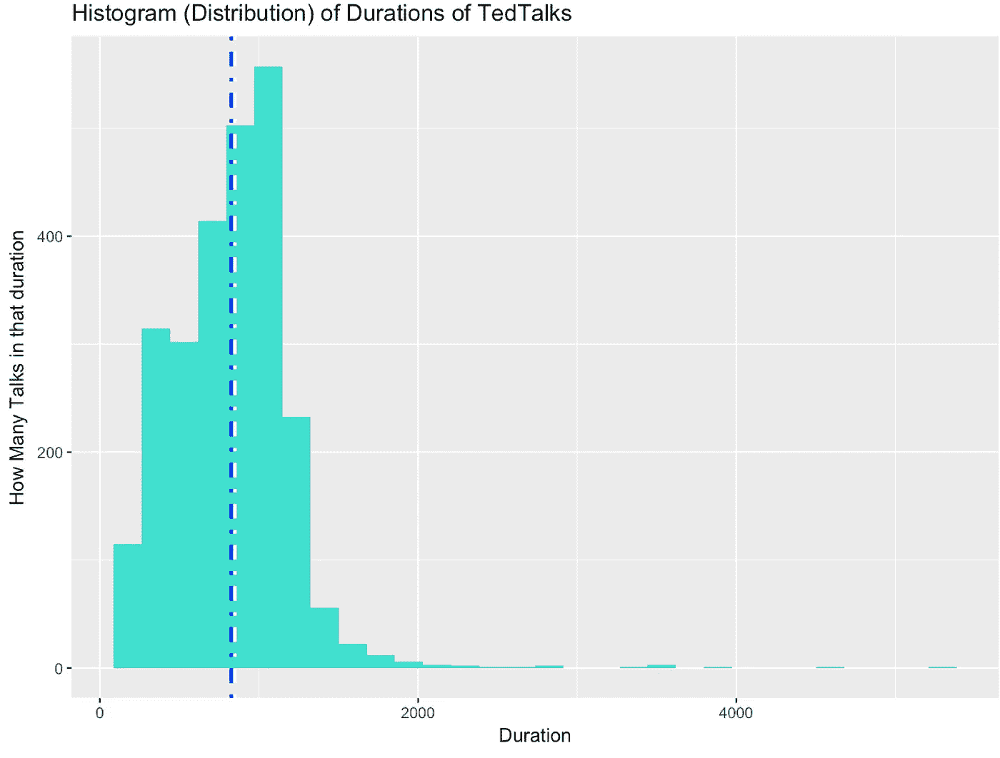
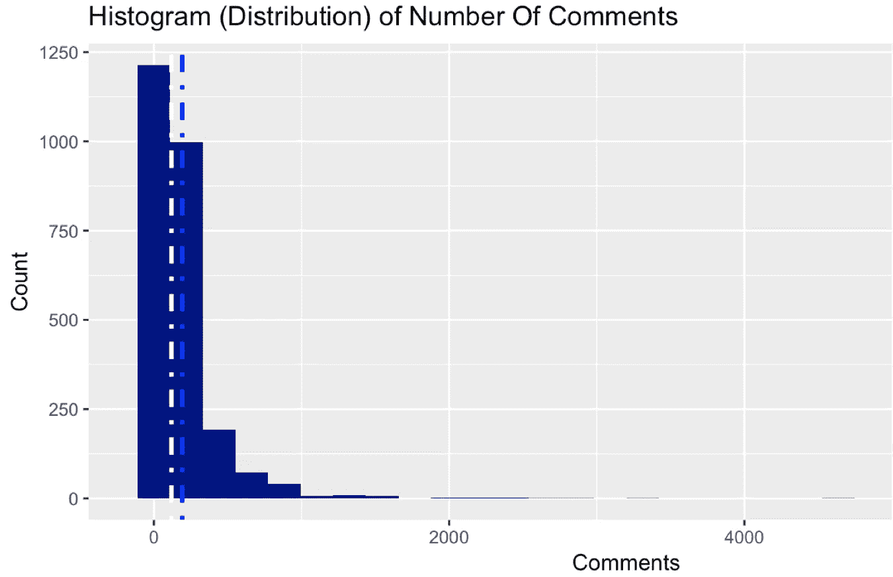
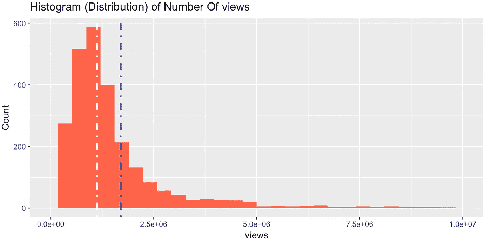
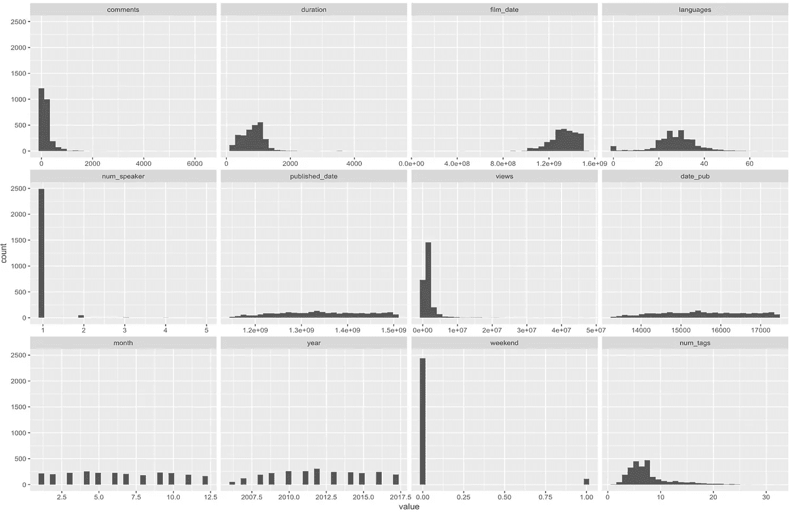
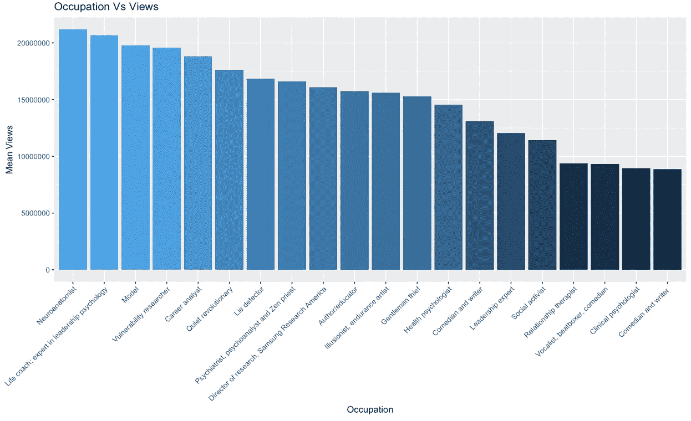
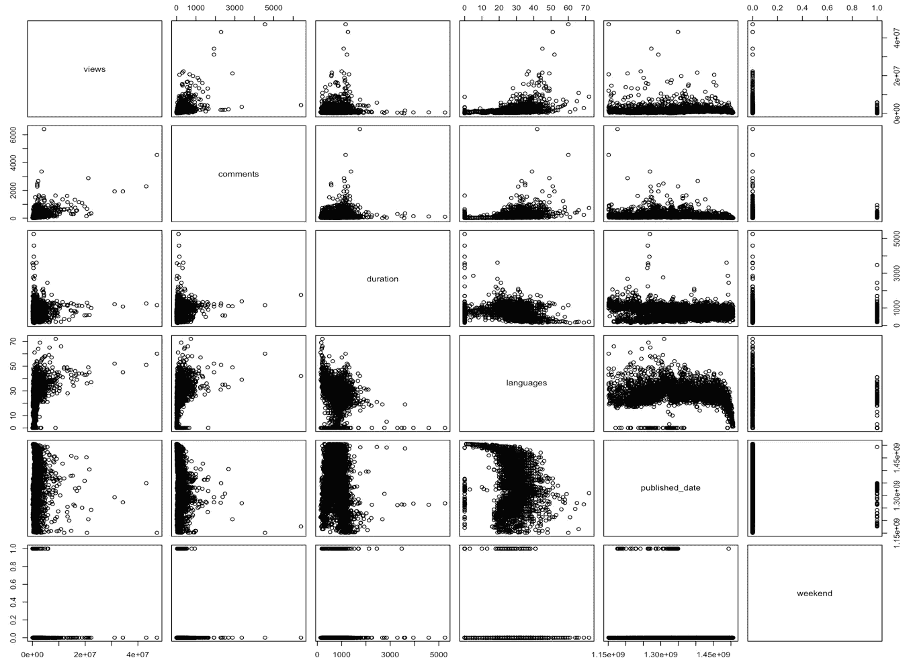
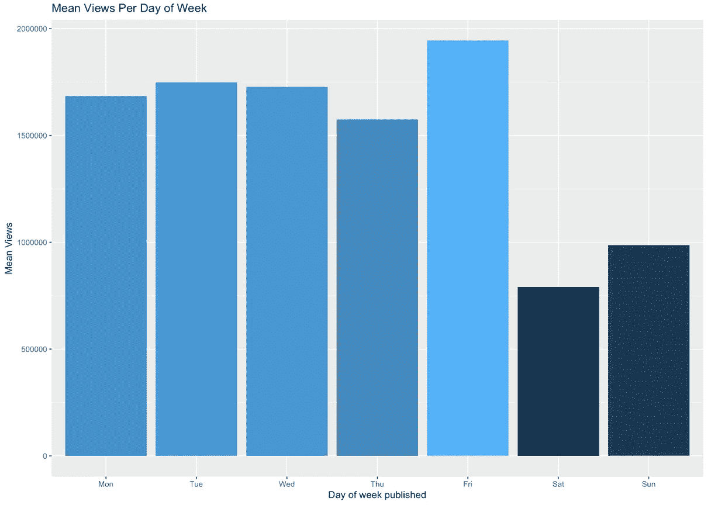
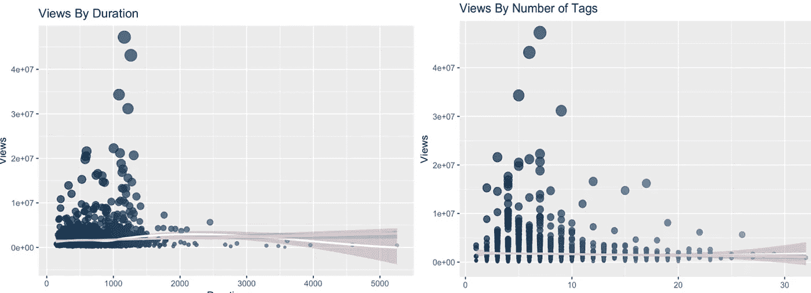
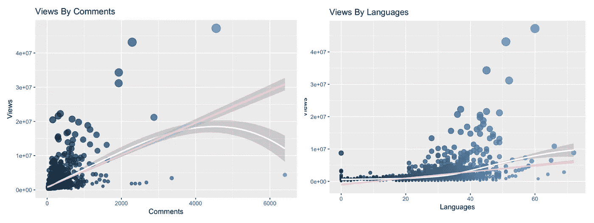

# 数据揭示:是什么让 Ted 演讲受欢迎？

> 原文：<https://towardsdatascience.com/data-reveals-what-makes-a-ted-talk-popular-6bc15540b995?source=collection_archive---------2----------------------->

## 你有没有想过是什么让一些 TED 演讲比其他的更受欢迎？

我分析了 2550 个 ted 演讲的数据集来寻找这个问题的答案。我研究了一个特定演讲的哪些可用变量，如评论数量、翻译语言数量、演讲时长、标签数量或在线发布日期，是其受欢迎程度的强有力预测因素，以浏览量衡量。

## **底线**

在对数据集中其他可用变量的视图进行分析和回归后，揭示了一些有趣的关联。

**一个高点击率的热门话题有什么特点？**

1.  **评论数高(自然)。**
2.  **多语种翻译(自然也是)。**
3.  **许多评论的组合*和*许多翻译语言产生的浏览量远远高于它们单独使用时的预期。**
4.  **它*不应该太短*。持续时间根本没有太大的影响，但如果有的话，它对更长的谈话是积极的。最受欢迎的演讲时间在 8-18 分钟之间。**
5.  **标签数量更多，最好在 3-8 个之间。**
6.  它会在工作日上传，最好是星期五！
7.  你可能会看到一些时髦的职业会因为他们的演讲而获得比平均水平高得多的评价，比如:神经解剖学家、安静的革命者、测谎仪、模特、拳击运动员、弱点研究员或禅宗牧师。这不具有代表性，但他们确实获得了最高的票数(这是一个不公平的游戏，但嘿)。

下面是实际数据分析。你可以在我的 [R-Pubs 页面](http://rpubs.com/tomereldor/ted)上看到完整的 R markdown 笔记本，以及我的 [GitHub](https://github.com/tomereldor/Econometrics/tree/master/TED_Talks_Analysis) 上的所有文件和数据。


Edward Snowden’s Surprise Appearance at TED, Speaking with Chris Anderson and Tim Berners Lee on a telepresence robot, beaming in from a secret location in Russia. Source: [Wikimedia Commons,](https://commons.wikimedia.org/wiki/File:Edward_Snowden%27s_Surprise_Appearance_at_TED.jpg) originally uploaded from [Filckr](http://Uploaded from http://flickr.com/photo/44124348109@N01/13332430295).

# 让我们深入研究数据

首先，你应该意识到:不要把这个(或者从*观察数据中得到的几乎任何其他结论)*作为一个*的因果推断。*这不是一个实验，也不足以证明因果关系。对照组和治疗组或数据的各种亚组之间的观察结果不匹配，即使在回归之后，变量的解释力也不够严格。我手头现有的数字参数不足以得出这样的结论；我无法将真正重要的*内容*与苹果进行比较，即使使用多元回归进行控制，也不是所有的事情都是相同的([其他条件不变](https://en.wikipedia.org/wiki/Ceteris_paribus)假设仍然不成立)。然而，我能够得到一个像样的预测器，并了解哪些变量与较高的视图计数最密切相关。

# 数据是什么样的？

该数据集包括 2550 场演讲的名称、标题、描述和 URL、主要演讲人的姓名和职业、演讲人数、演讲时长、TED 活动和拍摄日期、在线发布日期、评论数量、翻译的语言和浏览量。它还包括一个压缩形式的相关标签、评级和相关谈话的数组，但在数组内部，这些需要转换才能使用。有关完整列表，请参见 Kaggle 上的[数据集页面。](https://www.kaggle.com/rounakbanik/ted-talks)

## 1:直方图

**首先，让我们看看每个变量是如何分布的直方图。**

[***直方图***](https://en.wikipedia.org/wiki/Histogram) *是表示该变量取值分布的一种方式；或者直观地表示:“一分钟有多少次谈话？两分钟？三分钟？等等……”。形式上，直方图是“由矩形组成的图，其面积与变量的频率成比例，宽度等于类间隔”。*

看看下面我们的变量是什么样子的。



会谈持续时间更接近于正态分布，但在较长的持续时间内，一些会谈的右侧尾部较宽，平均值约为 14 分钟，中位数为 12 分钟。几乎所有的演讲都在 1-18 分钟之间(正常 Ted 演讲的最长时间)。



评论数量是泊松分布(视觉上类似于指数分布，但技术上不是，因为评论是以离散数字测量的),对于不受欢迎的视频，强烈偏向于 0 评论的最小值。



视图数量也是一个向左倾斜的泊松分布，视图数量的中位数是 1124524，视图数量的平均数是 1698297

**最后，我们的变量分布的总体情况:**



Histograms of each numerical variable: number of comments, duration, date filmed, number of languages translated, number of speakers presenting (almost always one), published date, view counts, month, year, whether it was published on a weekend, and number of tags.

从这些分布中我们看到:

*   标签数量也是向左倾斜的泊松分布，峰值在 4-7 个标签之间。
*   冷门演讲的翻译语言数量最高为 0，但大部分都在 20-40 种语言之间。
*   虽然 2012 年之前的电影日期很低，但它们都以更加统一的速度出版。

## 最常见的职业有哪些？

显然，作家是 TED 演讲者最常见的职业！其次是其他创造性职业和从事该职业的人数:

1.  作者:45
2.  艺术家:34 岁，设计师:34 岁
3.  记者:33 岁
4.  企业家:31 岁
5.  建筑师:30 岁
6.  发明者:27(显然那是一种职业！)
7.  心理学家:26
8.  摄影师:25
9.  电影制作人:21


## 但是平均来说，导致最受欢迎的谈话的职业是什么？

这些职业差别很大！他们被最受欢迎的 ted 演讲中的离群值扭曲了(例如，# [4]漏洞研究员仅指[布琳·布朗](https://www.ted.com/talks/brene_brown_on_vulnerability))，因此不是代表性样本。总之，这里有一些令人惊讶的发现:

```
 [1] **Neuroanatomist**                                                          
   [2] Life coach; expert in leadership psychology                             
   [3] Model   *# okay, nature of man doesn't change* 
 **[4] Vulnerability researcher** 
   [5] Career analyst                                                          
 **[6] Quiet revolutionary** *# great occupation*
 **[7] Lie detector** 
   [8] Psychiatrist, psychoanalyst and **Zen priest** 
   [9] Director of research, Samsung Research America                          
  [10] Author/educator                                                         
 **[11] Illusionist, endurance artist  #(really?)** 
 **[12] Gentleman thief** 
  [13] Health psychologist                                                     
  [14] Comedian and writer                                                     
  [15] Leadership expert                                                       
  [16] Social activist                                                         
  [17] Relationship therapist                                                  
  [18] Vocalist, **beatboxer**, comedian                                           
  [19] Clinical psychologist                                                   
  [20] Comedian and writer
```



## 2:参数之间的相关性

让我们看看每对数值变量之间的总体相关对散点图矩阵；



pairs scatter-plot matrix

为了补充这一点，可以看到一个相关矩阵，用颜色表示从 0(白色)到深蓝色(+1)或深色条纹红色(强负相关，-1)的相关强度，用星号(***)表示 p 值的显著性。


correlation matrix

大多数参数没有很强的相关性。

*   自然，出版数据和拍摄日期之间有很高的相关性。从数字和逻辑上看，拍摄日期似乎与观看次数没有太大关联——因为观众更受 ted 演讲发布日期的影响，而不是它是一个月前还是一年前录制的。
*   评论数和浏览量之间存在相对较高的正相关性，这是有道理的(更多的受众，更多的评论)
*   翻译语种数与浏览量(0.38)和评论数(0.32)呈正相关
*   时长和语言数量之间存在较小的负相关；讲话越短，翻译的语言就越多，大概是因为更容易翻译吧。

## 3:现在是有趣的部分，这些参数中的每一个与视图的数量有多大关联？

这些变量如何与视图相关联？是线性关系，非线性关系，还是非线性关系？了解这一点很重要，这样才能知道如何将它们插入回归中。

让我们从本周日**开始，这篇讲话发表于。**



因此，一周中的某一天似乎确实与平均观点有一些关联！周末发布的 Ted Talks 浏览量似乎少很多，周六最低，周五是 ted talks 发布日最受欢迎的一天。

下面是散点图，黄土弹性回归用白色表示，线性回归用粉色表示，看看线性形状与弹性移动平均线有什么不同。这向我们表明，通常，除了在这些变量的分布的故事中，只有几个异常值的数据，线性模型在某种程度上描述了这种关系。

**让我们从持续时间和标签数量开始:**



令人惊讶的是，持续时间与视图数量几乎没有一致的相关性；除了最受欢迎的演讲接近 8-18 分钟。标签数量在 3-8 之间似乎是最佳的，这也是更常见的标签数量；有一些特别受欢迎的谈话的异常值。

**那么评论数量和翻译语言呢？**



不出所料，显然，评论数量与浏览量有很好的相关性，语言数量也是如此——它们都来自于拥有大量的观众。因此，基于这些因素来预测观点是不“公平”的，在现实世界中，我们不能使用这些参数来预测，因为它们**不是更多观点的原因**，但是它们也是许多观点的结果，并且是一个加强反馈循环的原因:评论越多，社区就越参与讨论，并且更有可能传播；语种越多，观众能看的越多；而且观众越多，评论翻译的观众就越多。其余的有一个小的线性效应，没有偏离太多，虽然很小。

粉色线是线性回归，而白色线是黄土。与黄土回归相比，线性回归似乎不会丢失太多信息，黄土回归具有任意的灵活性，并且会显示明显的非线性形状。虽然它们中的一些确实具有非线性形状，但从更近的角度来看，它只是在数据稀缺的尾部，并且受到那里的几个数据点 *和一些异常值的影响(如在注释相关性中)。因此，将回归变量作为线性拟合输入可能就足够说明问题了。*

# 模型和结果

我首先对每个感兴趣的变量分别进行了视图数量的回归，这使得我们能够看到哪些变量具有解释力以及解释力有多强。后来，我加入了更好的解释，将它们一个接一个地添加到多元回归中，同时检查它们的添加是否真的提高了我们的性能。结果如下表所示，对于模型(1)到(8)，每一列都是不同的模型。


选择的模型是最后一个模型，因为它在 R 平方、调整后的 R 平方、p 值和 F 统计方面具有最佳的解释能力，尽管它与模型(5)相比只有微小的改进，只有注释和翻译的语言。

出于预测的目的，我会选择包含所有变量的模型 8。出于解释的目的，我选择模型 5 来解释注释和语言是目前为止与视图最相关的，并解释了它的大部分差异。

模型 5 表明，每增加一条评论，就会增加 4，044 次浏览(p 值低于 0.01)，每增加一种语言的翻译，就会增加 60，650 次浏览(p 值低于 0.01)。然而，常数是负的(-733)视图，这没有意义，但这伴随着线性模型的限制。这些共同解释了 0.33 的方差(包括 R 平方和调整的 R 平方)。

***Y(浏览量)=—733+4044 *评论+60650 *语言***

然而，在模型 8 中加入所有其他变量后，R 平方略微提高到 0.336，调整后的 R 平方为 0.334。因此，如果我们追求预测的准确性，我会使用最后一个完整的模型:

***Y(浏览量)=—1455238+3931 *评论+68222 *语言+408 *时长+26625 *数量 _ 标签—41407 *是 _ 周末***

结果，尤其是模型 8，显示了总体意义。大多数变量都显示出显著性，虽然周末没有，但加入它仍然稍微提高了解释力，所以我保留它。f 统计量相对较低，R and R 平方分别为 0.336 和 0.334，但在这组模型中表现最好。常数下降得更多，给变量更多的权力来提高预测的视图计数。评论的系数(效果的估计)从 4044 减少到 3931，并且对于语言的数量重新分配到更高的系数，对于新增加的变量重新分配到新的系数:每增加一秒钟就有 408 个更多的视图，每增加一个标签就有 26625 个更多的视图，并且如果在周末发布，这通过将预测的视图数量减少 41407 来补偿。

最后，我用标签数量和持续时间的多项式进行了最终回归，最高达三次**，添加评论数量和语言数量之间的交互项做出了重大贡献，提高了准确性，R 平方为 0.436，调整后的 R 平方为 0.434。由于系数为正，这表明**与许多评论进行对话*与* d *m* 任何语言的翻译加在一起比只与其中一个人进行对话产生更多的观点。然而，这种模型不太便于得出一般性结论，可能不太通用，容易过度拟合。并不是所有的多项式都有统计学意义，但是当我放弃其中一个时，它们仍然改善了结果。因此，在这里我不会过多地指望它的含义，但是对于类似的数据，它会是一个稍微好一点的预测模型。下面是它的表现(以及如何运行):****

```
Call:
lm(formula = views ~ comments + languages + num_tags + I(num_tags^2) + 
    I(num_tags^3) + weekend + duration + I(duration^2) + I(duration^3) + 
    comments * languages, data = ted)

Residuals:
      Min        1Q    Median        3Q       Max 
-26821919   -682956   -290905    234527  25305423 

Coefficients:
                     Estimate Std. Error t value Pr(>|t|)    
(Intercept)        -4.548e+05  3.394e+05  -1.340  0.18035    
comments           -5.796e+03  4.838e+02 -11.979  < 2e-16 ***
languages           3.522e+04  4.930e+03   7.145 1.17e-12 ***
num_tags           -9.210e+04  7.291e+04  -1.263  0.20668    
I(num_tags^2)       9.235e+03  6.441e+03   1.434  0.15174    
I(num_tags^3)      -2.236e+02  1.666e+02  -1.343  0.17950    
weekend             1.342e+05  1.905e+05   0.704  0.48120    
duration            2.038e+03  4.664e+02   4.369 1.30e-05 ***
I(duration^2)      -9.895e-01  3.355e-01  -2.949  0.00321 ** 
I(duration^3)       1.367e-04  5.555e-05   2.462  0.01389 *  
comments:languages  2.464e+02  1.171e+01  21.052  < 2e-16 ***
---
Signif. codes:  0 ‘***’ 0.001 ‘**’ 0.01 ‘*’ 0.05 ‘.’ 0.1 ‘ ’ 1

Residual standard error: 1879000 on 2539 degrees of freedom
Multiple R-squared:  0.4369,	Adjusted R-squared:  0.4346 
F-statistic:   197 on 10 and 2539 DF,  p-value: < 2.2e-16
```

# 结论

**这个有限模型传达的是相关性，而不是因果关系**。它没有很好地传达因果关系，因为因果推理的基本问题没有用这些变量很好地解决，这些预测因子*不独立于 y 变量，*并且它们高度相关(主要是评论和语言数量，它们自然是最好的预测因子。我不相信通过这些可用的数值预测，我们可以得出一个因果推论。接下来的尝试可能会使用谈话的转录来分析内容，或使用音频来分析鼓掌的程度，或使用谈话中的视觉效果和说话者的服装来更好地预测谈话的内容。

## **含义**

认识到这不是因果关系，这些相关性可以帮助你(1)在给定这些参数的情况下，更好地预测一次谈话的浏览量，以及(2)假设可能的因果方向，并进一步测试它们。

**那么，** **一段通俗的谈话会有什么特点呢？**

1.  **评论数高。**看得越多，你得到的评论就越多，但因果关系也可能是双向的:评论越多→甚至更多的观点。因此，如果你想增加你的浏览量，让你所有的朋友都来评论并开始讨论可能会有所帮助。这可能会刺激你的视频的病毒式传播，增加浏览量，并可能增加 TED 展示它的可能性。实验一下，让我知道！
2.  多种语言的翻译。这也很可能具有双面因果关系；浏览量越多→翻译量越多→能看的人越多，浏览量甚至更多。所以如果你想开始这个循环，让你的朋友或自由职业者翻译并宣传这个演讲，T2 可能会有所帮助。**如果有很多评论和多种翻译语言——这时候你就知道要赌上更多的浏览量了。**
3.  不应该太短。久期非常轻微的正相关；最受欢迎的演讲时长为 8-18 分钟。这可能表明，通常来说，太短的谈话不够深刻，不够鼓舞人心。然而，如果你的演讲天生很短，我不认为延长它并冒着它很无聊的风险是一个好主意。
4.  **标签数量更多，最好在 3-8 个之间**！回归表明，更多的标签有积极的影响，这是有意义的，因为足够广泛，并建议从更多的主题和其他谈话作为来源。最受欢迎的演讲有 3-8 个标签，所以这可能意味着演讲太宽泛或没有重点不是一个好主意。
5.  它会在工作日上传，最好是周五！这有点令人惊讶，但显然，在周末上传有负面影响(除了在最后一个模型中，它可能被如此多的其他形式的其他变量所混淆)；但不可否认的是，一周中的某一天与平均浏览量之间的相关性表明，在工作日上传的谈话，尤其是在周五，明显比周末更受欢迎。当人们在工作的时候，他们对 TED 新发布的内容了解多少？或者更具体地说，当他们在工作中偷懒时，在周五最常做的是什么？

最后，现在你可以和你的朋友继续你的 TED 狂欢派对，进行一些更有根据的猜测了！如果你赢了大奖，你也可以送我一些表示感谢的东西。

你可以在我的 [R-Pubs 页面](http://rpubs.com/tomereldor/ted)上看到完整的 R markdown 笔记本，以及我的 [GitHub](https://github.com/tomereldor/Econometrics/tree/master/TED_Talks_Analysis) 上的所有文件和数据。

*祝你这周过得愉快，一定要看看一个新的 TED 演讲，有 3-8 个标签，8-18 分钟长，有很多评论和语言，是在周五上传的！*