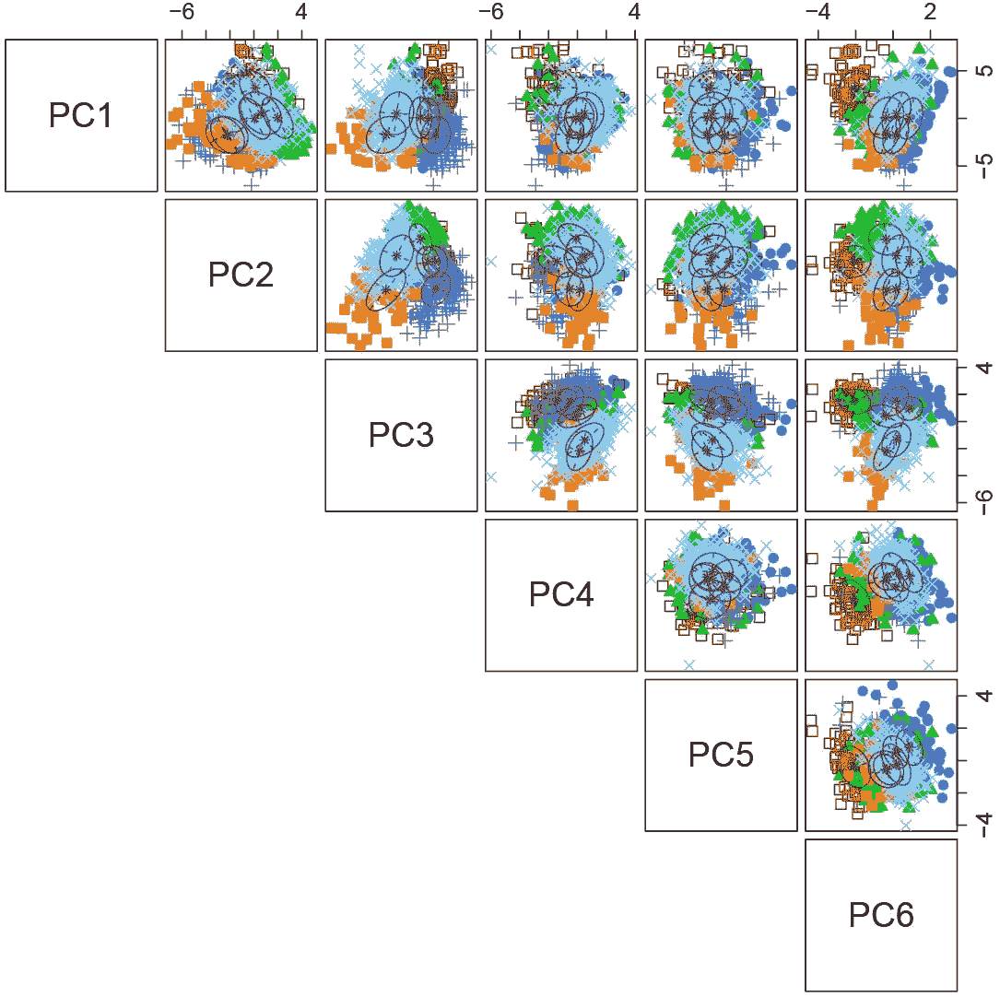
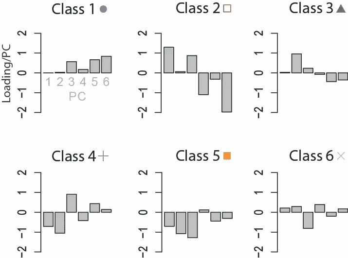
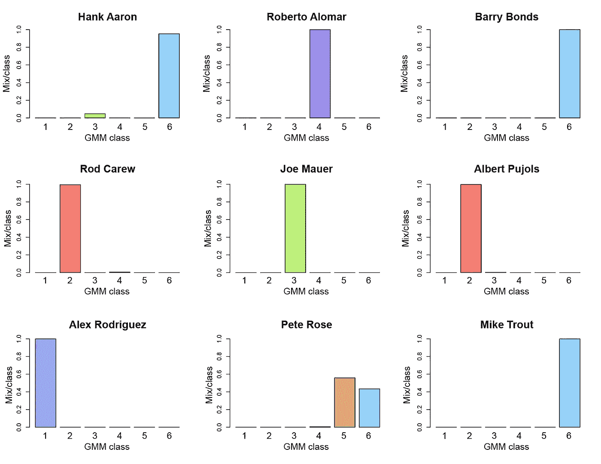
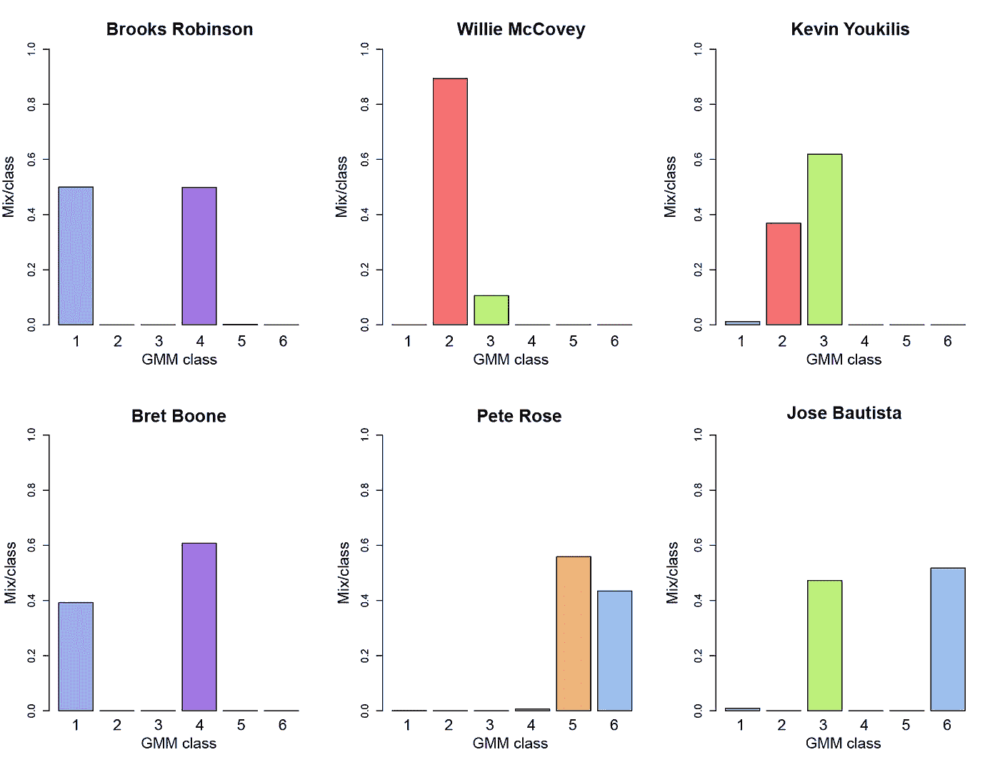

# 棒球数据科学，第 1 部分:击球手

> 原文：<https://towardsdatascience.com/data-science-and-hitters-in-baseball-fc42d20c5fad?source=collection_archive---------16----------------------->

将无监督学习技术应用于棒球的现代击球手

当我在回忆如何应用各种机器学习技术时，我发现自己在想它们可能会从另一组数据中揭示什么。当然，棒球比其他运动有更丰富的数据可以利用，部分原因是这些统计数据被记录了 100 多年。因此，我开始研究一些数据(可以通过 https://github.com/chadwickbureau/baseballdatabank 的[从查德威克棒球局获得)。](https://github.com/chadwickbureau/baseballdatabank)

首先，我从 1969 年至今的赛季(大致相当于黄金时代的结束)中提取了击球数据集的子集，并剔除了总共打了不到 600 场比赛的球员，以确保每个球员都有相当数量的数据可以利用。接下来，我汇总了单个玩家的统计数据，这样每行数据代表一个玩家。因为许多计数统计(HR、SB 等。)是非正态分布和右偏的，我通过跨赛季取每个测量值的中间值(而不是平均值，后者更容易受到离群值的影响)来近似每个球员的“标准”赛季。然后，我对 fielding 数据集进行了相同的聚合，并将其附加到 hitting 数据帧，以形成一个统一的数据集。

最初，我的想法是选取一些最具预测性和正交性的指标(比如，本垒打、上垒率、盗垒率和双杀率)，并将这些指标作为聚类的基础。然而，在经历了几次这一过程后，我意识到有一个更简单(也许在统计学上更合理)的方法来确定最能区分击球手的因素:主成分分析。因此，我首先对数据集运行主成分(PC)分析，然后对前 6 个成分(其特征值> 1)的 PC 负载运行高斯混合模型，以将玩家聚类到不同的类别。高斯混合模型反复比较了多个可能分组的信息内容(我选择了 4 到 7 个类别)，最终在数据集中找到了 6 个类别(玩家的集群):

Scatter plots of each player’s loading on the first 6 principal components (PC), colored by class identity as determined by a gaussian mixture model.

Loadings on each Principal Component for the six classes identified by GMM

尽管每个部分都有很高程度的重叠，但 GMM 似乎找到了与六个不同类别的玩家相对应的相当分离的集群。当然，主成分并不总是容易解释的:再说一遍，PC6 到底是用来衡量什么的？因此，为了调查这六个职业在棒球能力方面可能大致对应的情况，我没有在逐个球员的基础上检查个人电脑，而是回到了最初的统计数据。

首先，我查看了这六个类别中的每一个如何符合高斯混合模型所使用的每一个统计数据的摘要:

Mean values for each batting (AB through SLG) and fielding (PO through DP) statistic for each class (leftmost column).

这六个等级可能代表什么肯定有一些暗示，特别是考虑到在诸如本垒打(HR)、盗垒(SB)、在垒率(OBP)、击球率(SLG)和所有四种防守措施(出局数、助攻数、失误数和双杀数)上的明显差异。如果你把这些职业和球员的位置交叉列表，这些职业之间的差异会更加明显:

Counts of each position (rows) observed within each class (columns).

三垒手几乎完全属于一级，二级全是一垒手，几乎所有的接球手都在三级，四级全是二垒手和游击手，五级和六级主要是外野手。结合在每个类别中观察到的汇总统计数据，该数据有助于将六个类别解释如下(在每个标题下确定了最有可能属于该类别的五名玩家):

# 1 级—电力内场

迪安·帕尔默、迈克·施密特、佩德罗·阿尔瓦雷斯、特洛伊·格莱斯、乔希·唐纳森

路中间。倾向于打出像样的力量，他们相当灵活，但速度不够快，无法三连击或巡视外场的更深范围。

# 第 2 类—第一基本图例

*威利·乌普肖，基思·埃尔南德斯，杰夫·巴格韦尔，乔治·斯科特，乔伊·沃托*

他们不仅在角落里做得很好，而且比其他任何群体走得都多，就好像他们无法抗拒他们位置的吸引力。

# 3 级—缓慢而稳定

*AJ Pierzynski，Carlos Ruiz，Jason Varitek，Matt Wieters，Joe Mauer*

几乎每一个捕手都属于这一类，由于结合了低速度、良好的力量和持续的防守。他们最大的弱点？他们不太可能一路跑到得分最少的垒。

# 第 4 类—内场向导

唐·凯辛格、埃尔维斯·安德鲁斯、蒂托·富恩特斯、奥兹·史密斯、霍勒斯·克拉克

巨大的助攻和转身双杀(在一个几乎完全由 2B 和 SS 组成的团队中是可以预期的)，他们也相当快地上垒，尽管他们的击球还有待改进(最低的 OBP 和 SLG)。

# 第 5 类——速度恶魔

*迪·戈登、乔内·费金斯、胡安·塞缪尔、文斯·科尔曼、胡安·皮埃尔*

投手们讨厌盯着的家伙们，这个最小的小组由一些有史以来最快的球员组成。正如你所料，他们不打太多力量球，但是他们有能力打出一垒安打和三垒安打，击败双杀，这意味着他们能得很多分。

# 6 级——强力外场手

斯塔林·玛特、迈克·特劳特、达里尔·草莓、卡洛斯·戈麦斯、格雷迪·西斯摩尔

打击，速度，力量:这是一个可以做到一切的群体，也是最有可能让你进入名人堂的群体。

最后，我深入到各个数据点，看看无监督类与它们所代表的实际玩家的匹配程度如何。首先，我挑选了九名著名的球员(都是明星和名人堂成员，有点双胞胎荷马的偏见)来看看他们的表现如何:

Class mixtures for nine notable players, colors match class colors in the previous figures.

简而言之，这些玩家中的大多数都非常坚定地属于这个或那个职业，很少怀疑哪个职业最适合他们(至少在算法部分)。这一组中唯一的例外是皮特·罗斯，他主要是 5 班的学生，也有相当多的 6 班学生。为了进一步探究这个问题，我观察了每个班级中不确定性最大的球员，并找出了一些更容易辨认的名字:

Class mixtures for notable players who had a high degree of uncertainty associated with their class assignment.

然后，记住之前指定的每个职业可能代表的内容(**职业 1** :内场能量；**2 级**:一垒传奇；**三级**:稳扎稳打；**第 4 类**:内场奇才；**第五类**:速度恶魔；**6 级**:强力外场手)

布鲁克斯·罗宾逊(**1&4**):三垒手，拥有游击手的射程和速度。有史以来最伟大的防守三垒手之一。

威利·麦科威(**二班&三班**):一垒手，实力不可思议。以令人生畏的强力击球手著称。

凯文·尤基利斯( **Class 2 & 3** ):身材粗壮、擅长上垒的一垒手。

布雷特·布恩(**1 级& 4** ):防守型二垒手，以强力击球闻名。

皮特·罗斯( **Class 5 & 6** ): MLB 在安打和单曲方面的空前领先。在创纪录的五个不同位置(1B，2B，3B，低频，高频)17 次入选全明星。

何塞·包蒂斯塔( **Class 3 & 6** ):外野手，不以速度著称，但擅长保送和 HR。

我不仅同意第一批全明星球员的分类方式(大部分都是一个级别的)，而且我们所知道的更多混合级别的球员有助于解释为什么 GMM 对他们有更多的不确定性。例如，也许皮特·罗斯是如此杰出的球员的原因之一是他融合了强力外野手的一些最佳特质和速度高手难以置信的跑垒。

总而言之，击球手可以根据他们的击球和防守统计数据进行分类并不令人惊讶，尽管看到 GMM 的课程与球员的现实世界位置相符是令人惊喜的。我还认为这六个职业很好地包含了经理在制定阵容时可能会寻找的“原型”人员。它甚至在比较球员数据集时提供了一些见解；例如，迈克·特劳特更像巴里·邦兹和皮特·罗斯，而不是布鲁克斯·罗宾逊或凯文·尤基利斯。这种建模可能会也可能不会打破我们对棒球的理解，但我认为它提供了一些价值，作为对相同的旧数据的新观点。