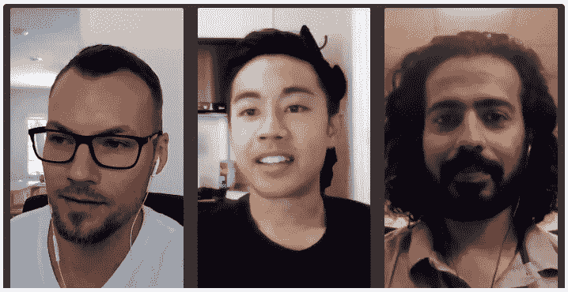

# 成为数据科学家@ LinkedIn

> 原文：<https://towardsdatascience.com/data-science-connect-linkedin-5e6e3f6c5712?source=collection_archive---------16----------------------->

Data Science Connect 是一个关于一切数据的免费网络研讨会。我们的主要目标是帮助尽可能多的有抱负的数据科学家，将他们与聪明的头脑联系起来。有这么多的路线可以选择，听到一个以上的声音总是最好的。

在我们的第一个系列中，我们有幸采访了一位来自 LinkedIn 的数据科学家。你可以在这里观看完整的采访。

[Avinash Ahuja](https://www.linkedin.com/in/ACoAAASj4G0BH-9KxFTeDLSiCaHxt1fHt2byKQ4/) 在 LinkedIn 从事市场动态方面的工作，他的工作已经产生了很大的影响。

> 你可以从任何行业进入数据科学。不是计算机专业出身或者没有编程经验都没关系。你可以随时捡起来。真正重要的是你有解决问题和积极进取的态度。只是想找到解决办法。

土木工程到数据科学 7:10

当你看着我们周围的世界。我们正在努力优化一切。这适用于任何领域。我们正试图找到提高效率的最佳解决方案。无论想最小化什么，我们都可以用 ML。令人惊讶的是所有这些是如何完美地结合在一起的。

他于 2013 年来到美国学习土木工程。他花了整整一年的时间才意识到优化才是他真正感兴趣的。他在研究土木工程中的计算机视觉和最优化问题。"我是班上倒数 25%的学生。"他不是优等生。他使用了大量的线性代数和微积分，特别是对他自己在土木工程领域的研究。

> 我什么都不知道…当事情变得艰难时，你会投入时间和精力。你是什么军衔并不重要。每个人都有糟糕的时候。你要做的就是继续努力，不要停下来。

他花了一年时间参加了 ML 课程，然后在 2014 年秋天，他参加了他的第一个机器学习课程。他花了很长时间才明白 ML 是什么。2014 年春天，他上了社会经济学网络课。现在他对 DS na 感兴趣，知道 ML 的具体细节。他申请了 2015 年的 DS 团契，他在芝加哥完成了他的团契。他于 2016 年毕业于 din，并在 linkedin 开始工作。

# 帮助客户/会员成功:18:00

任何时候你做任何分析，我们关注的是什么会给会员带来价值。什么能帮助我们的成员实现他们的目标。你如何追踪它？你的方法是始终专注于此。总是问自己我们如何为会员价值做出贡献。

让会员站在我们所做一切的最前沿。

其中一个核心问题是，这如何为会员创造价值。其他的都是次要的。我们都有不同的指标，每个指标都被用作我们成员体验的指南。基于这些属性，我们优化了会员的行为和体验

# 从学术界过渡到客户成功指标的挑战(业务)19:30

转变为关注客户成功指标的角色所带来的挑战。在学校里也没怎么涉及到。这很有挑战性，因为这是数据科学行业中人们不会说的话。问题是学校可能只是以一种非常抽象的方式教授这些算法。就像这里，这个 viz 适合这个数据，这个 viz 适合那个数据。使用回归，在这种情况下使用决策树。当你用神经网络处理大量数据时…

真正重要的是学会如何理解你的用户。而这并不是学校真正教的。与用户感同身受。这对用户有什么帮助？我们没有学到的是如何强调用户和产品。这应该是数据科学课程的一部分。

对用户的同情是我遇到的一个问题。从用户的角度来看。每个用户都是不同的，真正了解他们对产品的体验取决于你。这是学校里没有教的东西，需要学习。

其次是讲故事。最初，当我们进行分析时，我们有一个漂亮的图表。有这些图表和模型。但重要的是了解这如何转化为会员体验，以及如何影响业务。始终展示您的分析如何影响业务和用户的价值。您的指标需要转化为对用户和公司的影响。从收入、找到工作的可能性等方面来看。

# 数据科学如何入门 23:00

做数据科学的第一步就是模仿，直到你真正理解并内化了所有的概念。随着你的进步，你开始学习什么问题适合什么技术/分析。一旦你对这些工具和技术的使用有了大致的了解，你就可以开始寻找你自己的数据了。找到一个你想解决的问题，并对它进行分析。他的建议是你最初跟 Kaggle 学。但那不会让你走那么远。你必须超越这些，找到你自己的问题。新事物。有洞察力的东西。不一定是机器学习。它必须是新颖的，新的分析，解决问题的新方法。那就分享一下。这就是你学习和被关注的方式。

# 我学到了什么 27:55

在他的机器学习课程中，他学习了各种算法和技术，如决策树、回归、SVM 和内核。要记住的一件重要的事情是，你不应该只是学习这些算法来应用它并做出预测。真正重要的是理解模型背后的数学原理，并从头开始实现这些模型。不管你使用什么语言，是 python、java、matlab 等等，它实际上是构建整个模型和管道本身。真正了解模型的本质细节、科学和基本原理。这真的很有帮助，因为它给了你理解这些概念的信心，你可以和任何人谈论它们。本质上，你最终会知道如何从根本上优化这些模型。

# 我的学习方法 31:40

我做的第一件事就是暴力。我会参加一个 ML 课程并完成它。一开始你可能会很糟糕，但没关系。随着你的学习，你会开始知道你不知道的事情。这是你需要深入挖掘和学习的概念。你从这些事情中学习，然后重新开始。判断自己知道什么，不知道什么。

1.  采取行动，开始学习
2.  重新评估你的经验，看看你知道什么和不知道什么
3.  学习你不知道的东西，然后再回头看一遍。

> 只要你随着时间的推移不断提高，这就是最重要的。

# 工具

*   Python 和 R: R 的统计量更大。适用于汇总统计。Python 更适合生产。r 和 Python 是微不足道的，它真的取决于你从哪里来。对于大部分地方来说，无所谓。如果你知道 R，你就能处理 Python。有时候我会用 python，R，或者 Scala(取决于项目)。
*   线性代数和统计:统计很重要，因为你需要能够谈论数据。你需要知道什么是置信区间、方差、稀疏性、数据分布、均值/中值/众数和 A/B 检验。统计学是数据科学的基础。
*   其他:如果你想出人头地，你需要知道某些编程范式，了解 GIT、数据结构、OOP、网络算法之类的东西。这些如何在实验中发挥作用，以及它如何优化您的工作流程

# 文件和反馈的重要性 48:35

长话短说:开始记录吧。不要担心初稿的质量。去做吧。有一个完整的想法。考虑和未来的自己对话，告诉自己在做什么。过度记录没关系。如果你不做记录，你就会忘记你为什么做这做那。

1.  记录你的模型、分析、可视化…重要的是把你的想法写出来。提醒你未来的自己为什么没有成功。比如，“嘿，随机森林没用，XGboost 也没用。看起来基于树的模型不起作用。”评论树算法不起作用。让我们尝试另一种算法，尝试回归。记下来，从中学习，然后重复。
2.  你不会尽可能高效地编码。你编码是为了不让事情搞砸。作为一个整体意识形态来保护它。

反馈:这很重要，不要往心里去。试着自己走一遍，和别人谈谈你的模型，你可能会意识到你犯了不同的错误。人们的反馈让你明白人们会犯错误。如果是错误，那就从中吸取教训并改正它。

# LinkedIn 1:00:00 的生活

日子变化很大。有时，根据不同的日子，我会和人们谈论他们的工作以及我所做的工作。但是在任何一天，我的工作要么是和别人分享我的工作，要么是喝咖啡，或者只是从他们正在做的事情中学习。没有议程。我对 LinkedIn 作为一家公司在做什么有一个整体的想法。它太大了。你需要积极主动地了解公司发生了什么，看看你能利用什么来帮忙。与人交谈并传播思想。也许我一周工作的 50%是从 SQL、构建代码审查、Hadoop 中提取数据。另外 50%是交谈，分享想法，和成员交谈。

# `注释结束

凯尔和我很想听到你的反馈，尤其是你从第一集学到了什么。

要报名或获取更多信息，请访问我们位于 www.datasciencedreamjob.com[的网站](http://www.datasciencedreamjob.com/)

👉加入我们在 www.datasciencedreamjob.com/free-tips的邮件列表，获得如何进入这个领域的免费提示

👉如需提前注册我们未来的网络研讨会，请点击此处:[https://lnkd.in/gMT2pJd](https://lnkd.in/gMT2pJd)