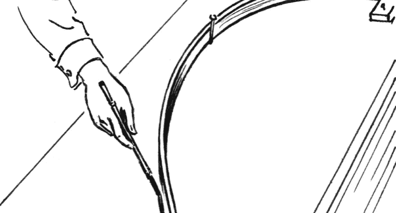
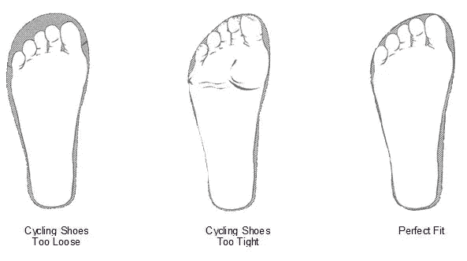
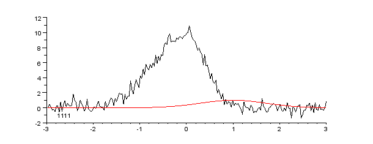
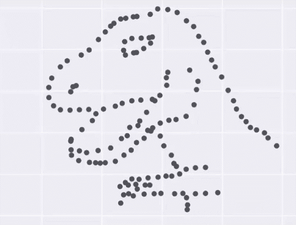

# 数据科学解密:什么是样条？

> 原文：<https://towardsdatascience.com/data-science-deciphered-what-is-a-spline-18632bf96646?source=collection_archive---------3----------------------->

本周在德国实验室的一次会议上，我有了一个认识。我们没有使用正常人的语言。有趣的是，数学术语是如此神秘，而事实上，它们(通常)指的是不那么复杂的东西！

本周，术语是**拟合一条基本样条，**起初让我大吃一惊。让我们仔细分析一下。

***免责声明:在你进一步阅读之前，这篇文章中没有数学。我将尝试研究样条，使它们在更简单的术语中有意义。如果你正在寻找一个已被证实的样条的数学定义，* [*查阅本章*](https://people.cs.clemson.edu/~dhouse/courses/405/notes/splines.pdf) *。* **

# 合适才有意义

“适合”这个词并不可怕。我们一直在用这个词！试衣、在电梯里试衣、穿旧衣服——仅举几例……令人惊讶的是，数学术语“试衣”的意思几乎是一样的。

比方说，你正在购买一些新的自行车鞋。你怎么知道你有一个“完美的契合”？如果鞋子太松，你的脚会扭动。如果鞋子太紧，你会有意外的拇趾囊肿。很难找到完美的契合。你可能不得不以某种方式妥协，在太紧和太松之间找一双鞋。

现在想象一下图表上的一堆数据点。假设你想找到一条符合这些点的线。“拟合曲线”基本上意味着找到一条尽可能接近数据的曲线。这很像找到一双完美的鞋子。你的数据点(你的脚)通常是独一无二的，你穿的线(鞋子)看起来很可能与数据不完全一样。

看看这条符合一组数据的线:

请注意，最终曲线并没有穿过每个数据点。相反，它找到了一个很好的中间地带。这个中间地带是由你选择适合的数学函数/算法决定的。听起来很奇怪，你可以说今天你通过一个可变阻尼因子的高斯-牛顿算法探索了数据拟合曲线。或者你可以说你找到了一双新的自行车鞋。

# 样条是…

这是什么…一束仙人掌刺？

可惜不是。:(

维基百科的定义:“由[多项式](https://en.wikipedia.org/wiki/Polynomial)分段[定义的函数](https://en.wikipedia.org/wiki/Piecewise)”也没有多大帮助。这个定义假设你知道一个*多项式分段*函数意味着什么。这可能是下一篇数据科学解密文章的好主题(是的，我希望做得更多！).

让我们用更简单的术语来说。你用过 PowerPoint 上的线条工具吗？如果不是，这基本上可以概括为:

原来，PowerPoint 知道怎么做样条！样条曲线将曲线加在一起，形成连续的不规则曲线。使用此工具时，每次点击都会为线条创建一个新区域，或一个*线段*。每次点击还会创建一个所谓的*控制点*，或者决定曲线形状的点。

这就是样条的要点。他们用不规则的数据点创建平滑的曲线——很酷，对吧？！

# 好了，基础样条

基本样条只是一种样条形式。根据您使用的类型，样条曲线的外观可能会有所不同。这是有道理的——有许多不同的方法可以通过数据点形成一条线。

以这张图片为例:

[source](http://mathworld.wolfram.com/Spline.html)

每条彩色线都是不同类型的样条线。红线是一种基本样条！

# 为什么要用基样条拟合曲线？

这个问题有点超出了本文的范围。本质上，当您想要将一堆点拟合为平滑曲线，但不确定数据点的基本结构是什么时，这些类型的线非常有用。

数据有时是不可预测的:

基础样条有助于理解它！