# 永远的数据科学！

> 原文：<https://towardsdatascience.com/data-science-for-good-9f18fb70e75?source=collection_archive---------21----------------------->

Dubai Data Science community

这个周末，我很荣幸地在 [In5 Tech](https://infive.ae/in5-tech/) 共同主持了九月份的[迪拜数据科学会议](https://www.meetup.com/Dubai-Data-Science-Meetup/events/251374795/)。meetup 由迪拜的[开放数据科学社区](http://dubaidatascience.ae)组织，汇集了数据科学家、领域专家和行业领袖的最大聚会。作为 9 月 meetup 的支持者，我有机会与来自金融、安全、运营、航空业甚至天体物理学等各种背景的现场专家交流，了解他们的经验以及他们如何使用数据科学解决复杂的工业挑战！

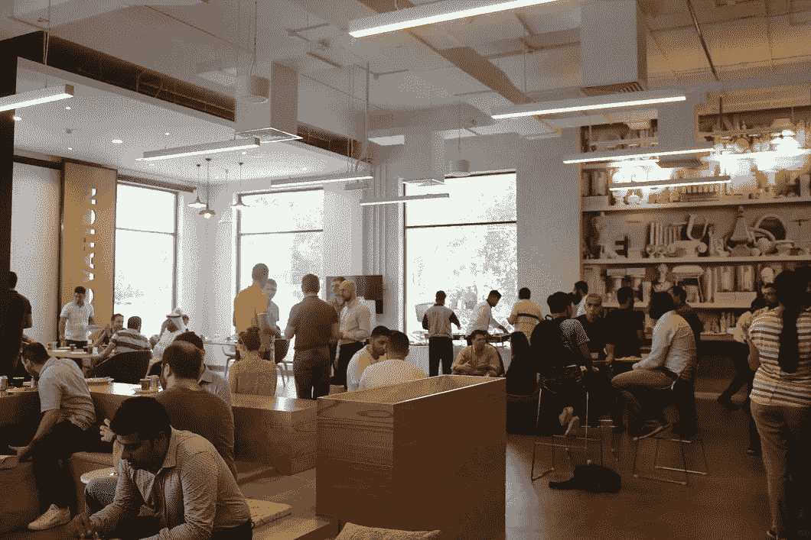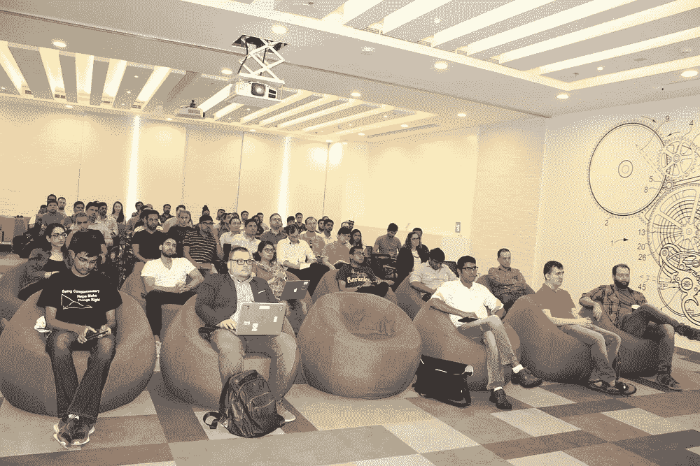

Kicking off the meetup with Developers coming in from all across UAE!

由于 IBM 是 meetup 的赞助商，我有机会邀请来自迪拜数据科学界的开发人员参加[代码征集](https://developer.ibm.com/callforcode/)挑战，这是一项全球性的多年计划，旨在激励开发人员用可持续的软件解决方案解决紧迫的全球问题。2018 年的比赛要求参赛者建立能够显著改善其社区和世界各地备灾现状的解决方案。这一点尤其重要，因为 [2017](https://www.cnbc.com/2017/12/26/2017--a-year-of-disaster.html) 被列为有记录以来灾难性事件[最严重的年份之一](https://www.vox.com/energy-and-environment/2017/12/28/16795490/natural-disasters-2017-hurricanes-wildfires-heat-climate-change-cost-deaths)，包括火灾、洪水、地震和风暴，我们只会看到这种情况在 2018 年继续。

从事机器学习和数据科学工作的开发人员肯定可以通过解决挑战来提供帮助，例如如何[使用机器学习、深度学习和视觉识别来改善关键流程](https://developer.ibm.com/callforcode/resources/visual-recognition/)或者能够[理解、分析和预测健康&营养需求来改善数据科学服务](https://developer.ibm.com/callforcode/resources/healthcare/)。

除了其他好处(高达 20 万美元的现金奖励！)，最具影响力的项目将在 IBM、[Linux 基金会](https://www.linuxfoundation.org/)、[联合国人权委员会](http://www.unchr.org/)和[美国红十字会](https://www.redcross.org/)的帮助下，实施到最需要的社区。

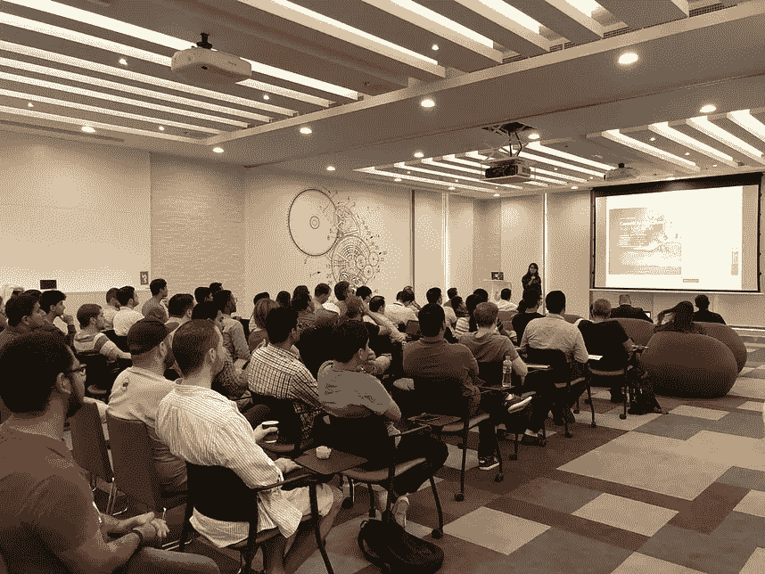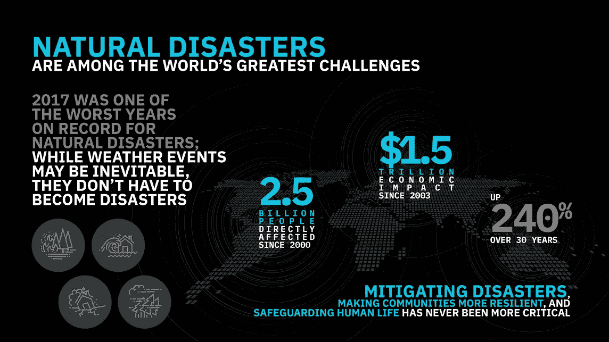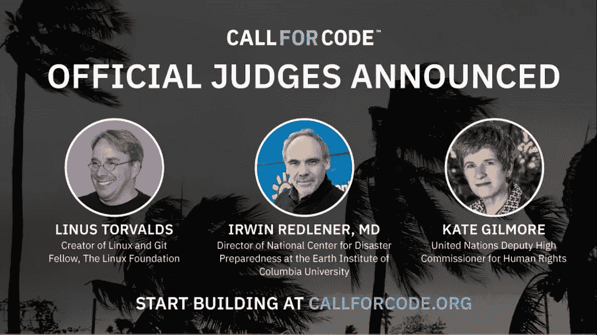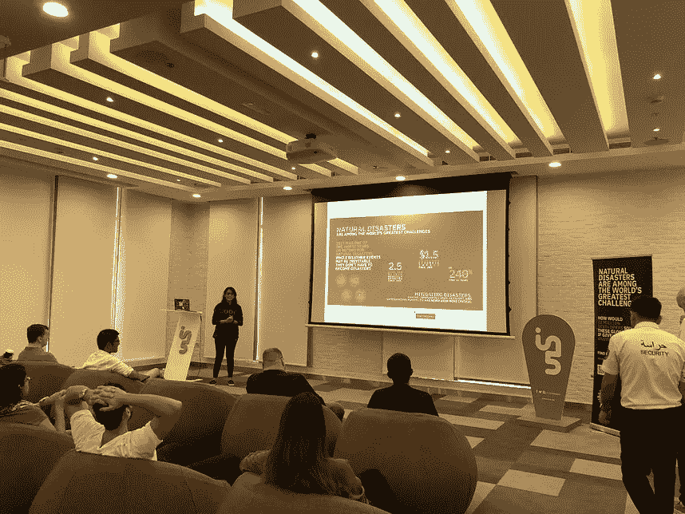

Inviting developers to participate in the Call for Code!

然后，我们以 Sethu Raman 关于数据科学成熟度模型的[演讲开始了第一场会议，在此期间，他谈到了数据科学家如何根据多个重要标准评估他们的模型，而不仅仅是评估其性能。这可以通过针对愿景&一致性、风险(治理、风险&合规性)、责任&技术/平台对其成熟度进行评分来实现。Sethu 浏览了几篇论文和令人难忘的防止](https://www.linkedin.com/in/sethu-raman-b090362)[对抗性](https://developer.ibm.com/code/2018/04/17/adversarial-robustness-toolbox-art-good-versus-evil-ai/) [攻击的例子](https://www.ibm.com/blogs/research/2018/04/ai-adversarial-robustness-toolbox/)，[模型可解释性](https://github.com/lopusz/awesome-interpretable-machine-learning)与[时间](https://github.com/marcotcr/lime)，以及减轻&避免在 ML 系统中传播偏见的最佳实践与 [Kate Crawford 对解决偏见的建议](https://www.youtube.com/watch?v=fMym_BKWQzk):使用公平辩论，创建跨学科系统，以及“更加努力地思考分类的伦理”。他的演讲让房间里的数据科学家大开眼界，并让他们意识到，在发布之前，考虑他们的模型的社会影响并根据这样一个成熟度模型进行评估也同样重要。

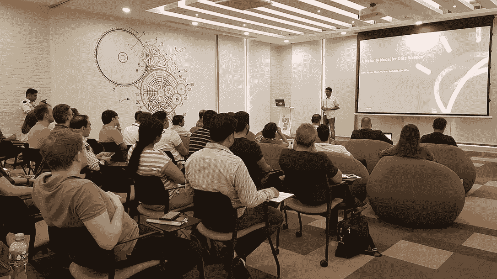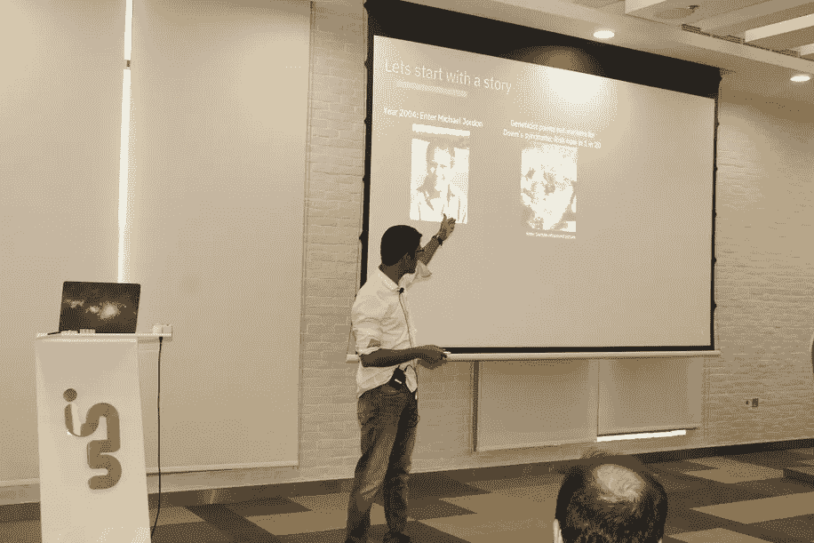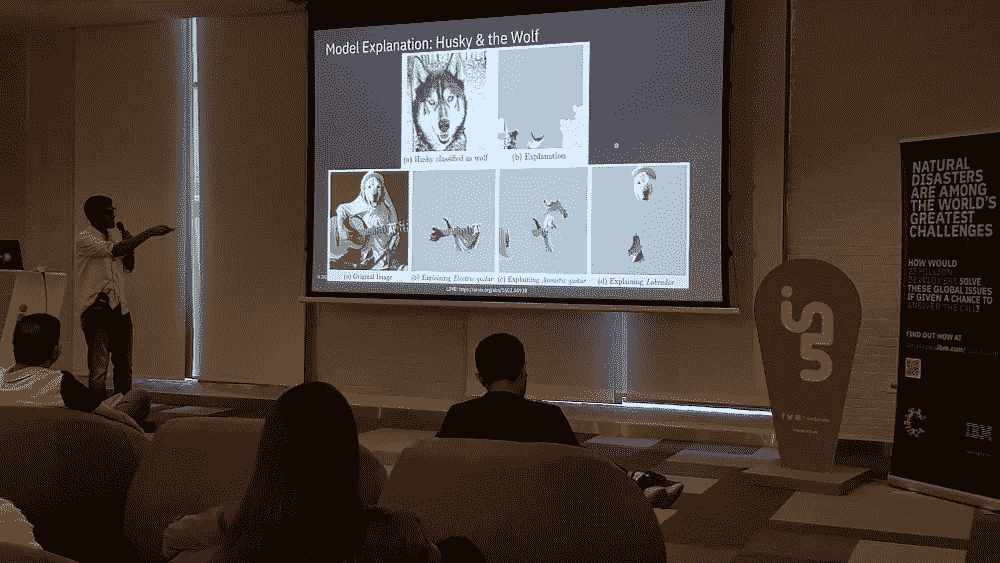

Sethu sharing A Maturity Model for Data Science

接下来是由 [Evgenii Makarov](https://www.linkedin.com/in/evgeniimakarov/) 针对面部标志检测和 MSQRD 如何工作等不同用例的演讲，而其他人如 [Vivek Kalyanarangan](https://www.linkedin.com/in/vivekkalyanarangan/) 演示了像[这样的数据科学家使用 Docker 容器部署机器学习模型的基本技能](https://drive.google.com/open?id=1bTNUhg8xCMrS8luTOUrpeGnwEBQ-wvJB)。

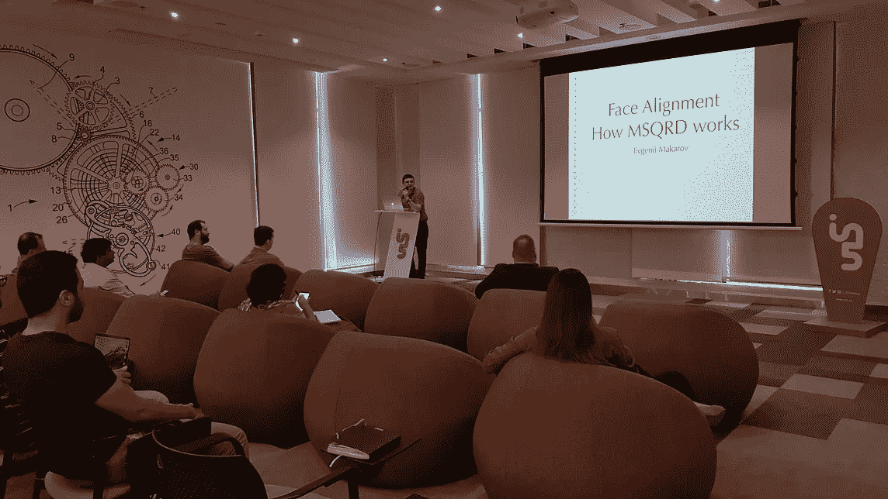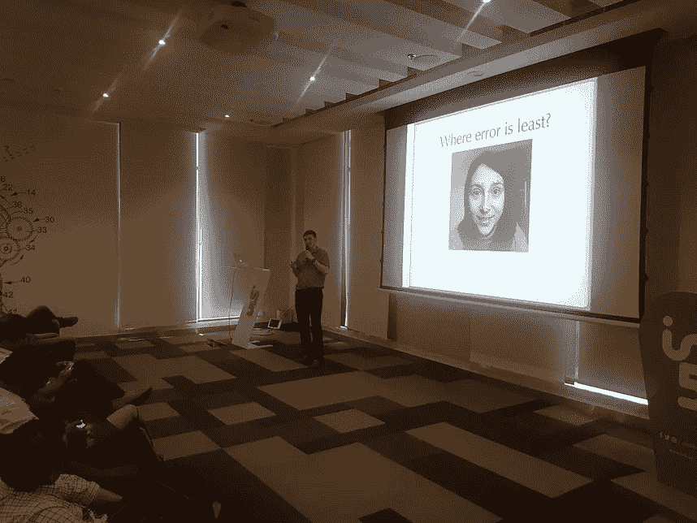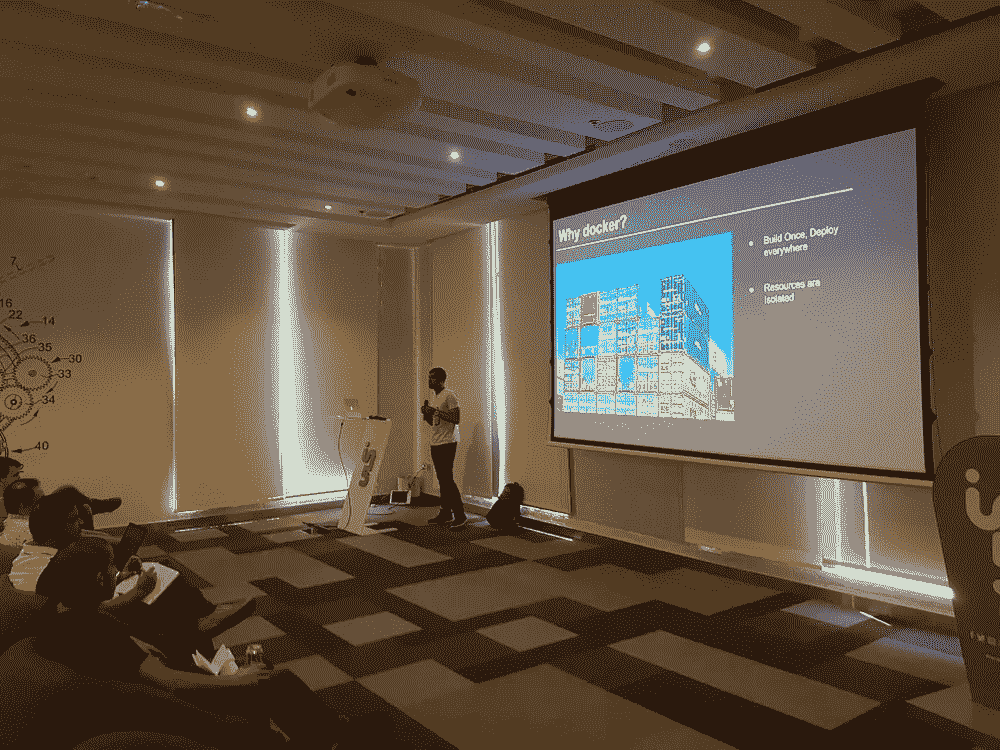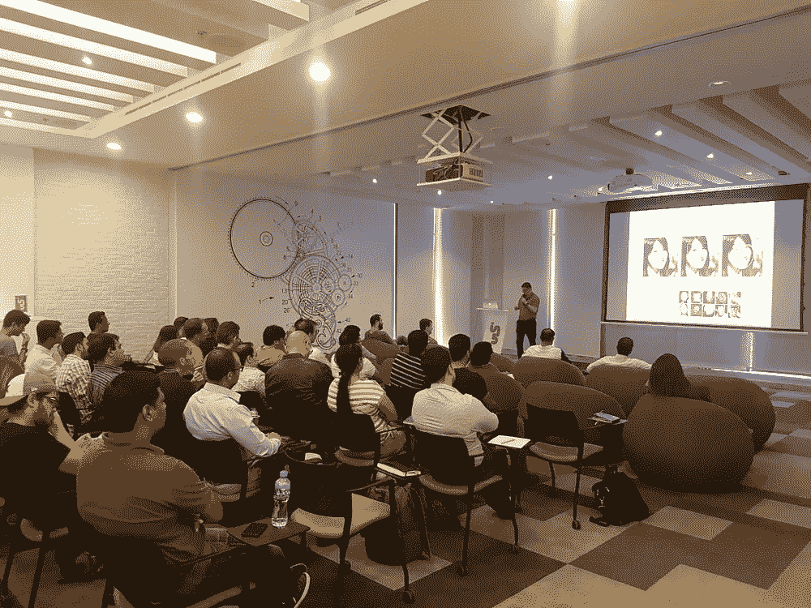

Facial Alignment by Evgenii & Deploying ML Models using Docker by Vivek

下一个有趣的演讲是由 Pavel Golubev 做的，关于[使用马尔可夫决策过程(MDP)来优化航空公司](https://drive.google.com/open?id=1LaAeK1c8vUWS6E0VRxnXDIUBGNU-3sb8)的机上餐食。Pavel 带我们了解了 S7 航空公司项目的商业和技术方面(如果你喜欢乐队 [OK Go](https://www.youtube.com/watch?v=G6u-TomcyD4) ，你可能会认出他们)。了解正在解决的核心业务问题(每月大量未消费的机上餐食)是非常有趣的，它与公司的年度 KPI 以及项目的实际实施相关联——从了解为什么 [MDP](https://leonardoaraujosantos.gitbooks.io/artificial-inteligence/content/markov_decision_process.html) 与线性模型相比是一个很好的 ML 选择，以及通过识别主要代理、状态、行动、成本函数&转移概率来应用 MDP 来构建解决方案的模型。然后，他向我们展示了这是如何与正确的项目团队一起推出的，并通过他们的调度投入生产，使用针对 Python 的 [MDP 工具箱的大规模修改版本来安排&预订系统。这个相当简单的 ML 实现将膳食过剩从 80%减少到只有 12%！](https://github.com/sawcordwell/pymdptoolbox)

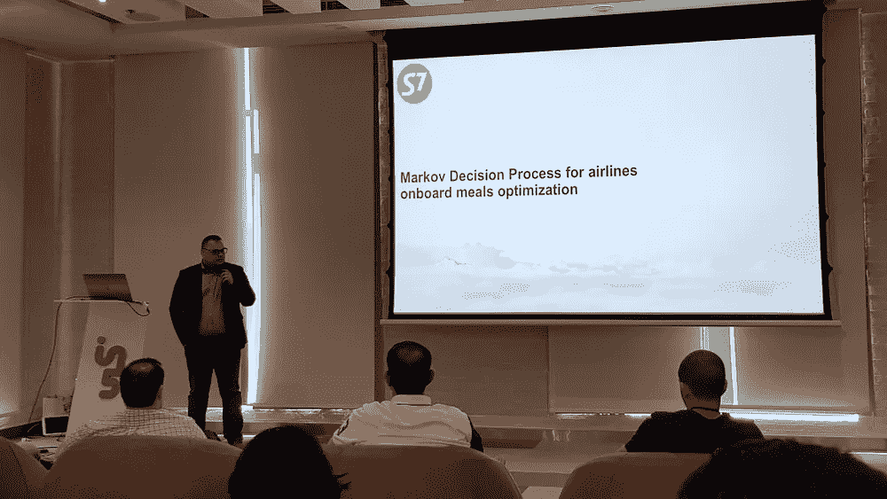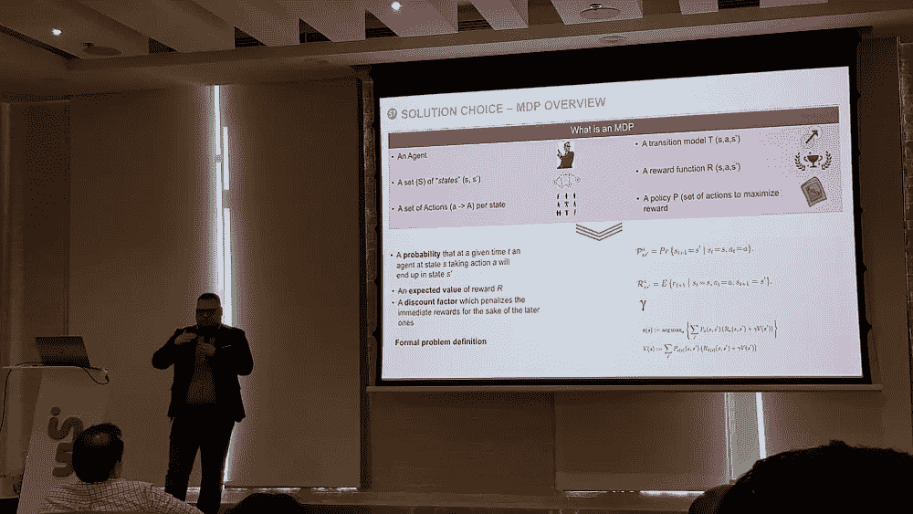

Pavel speaking about optimising S7’s onboard meal ordering system

最后，最后一场会议是关于[帕维尔·内斯特罗夫](https://github.com/mephistopheies/dds/blob/master/cb_rasa_010918/ipy/cb_rasa.ipynb)使用开源 RASA 工具创建聊天机器人的简短讨论，他向我们展示了一个 Jupyter 笔记本，展示了数据科学家如何使用 [RASA 核心](https://github.com/RasaHQ/rasa_core)创建聊天机器人。

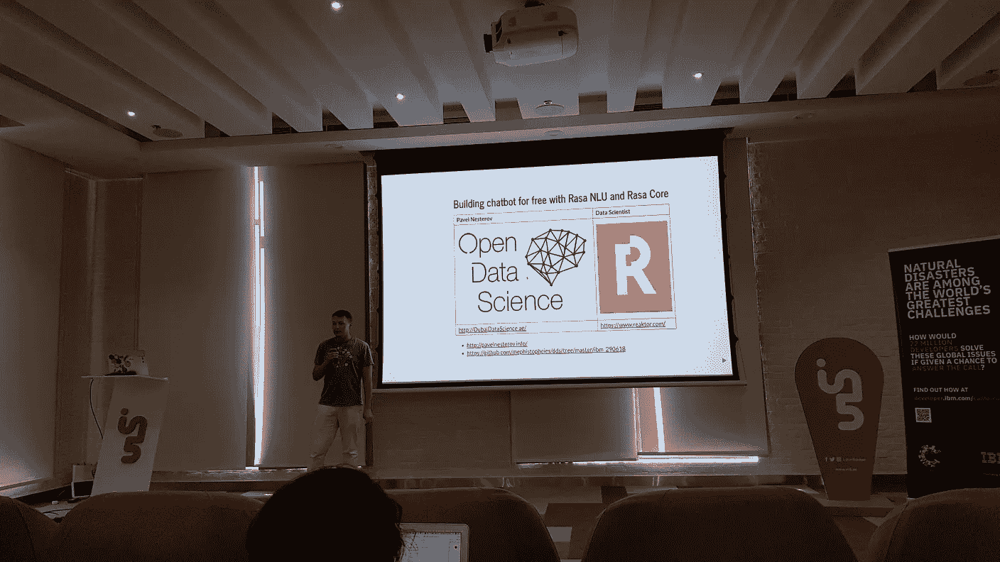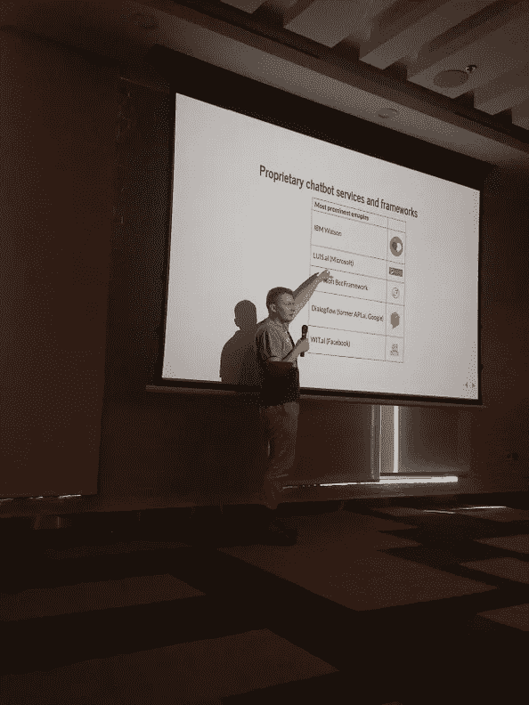

Pavel speaking about open source vs proprietary tools for chatbots

meetup 最精彩的部分是与来自不同行业的开发人员会面，了解他们如何使用多种数据科学工具应用描述性、预测性和规范性分析来解决复杂的业务问题。这真的让你大开眼界，看到了使用数据科学解决挑战性问题的全部能力&我迫不及待地想看到迪拜数据科学界如何通过构建成熟的模型和开发备灾和救灾的可持续解决方案来充分利用这些技能。

想学以致用吗？在[*【http://callforcode.org】*](http://callforcode.org/)*独自或组队参加一场有意义的全球在线比赛。了解开发人员如何通过更好的灾难准备来尽自己的一份力量，让世界变得更美好。当然，现金奖对获奖者的奖励只是奖金！
您也可以参加我们在*[*meetup.com/IBMCloud-Dubai/*](https://www.meetup.com/IBMCloud-Dubai/)举办的下一次开发者聚会