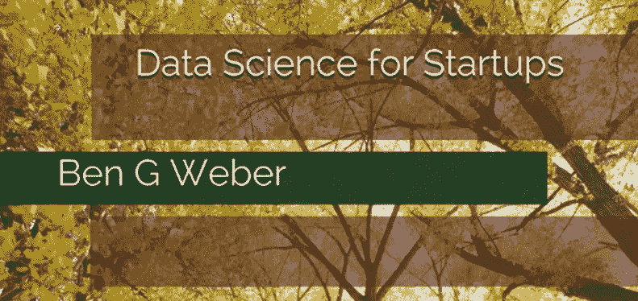

# 创业数据科学:博客->书籍

> 原文：<https://towardsdatascience.com/data-science-for-startups-blog-book-bf53f86ca4d5?source=collection_archive---------9----------------------->

Publishing a blog series as a book.

数据科学家写书有很多令人信服的理由。我想更好地理解新工具，并记录我过去在行业中的一些经验。基里尔·叶列缅科也声称写作让你更快乐、更善解人意、更有效率。

我实现这个目标的最初方法是使用 Medium 发布一系列关于[走向数据科学](https://towardsdatascience.com/)的博客文章。我的[第一篇文章](/data-science-for-startups-introduction-80d022a18aec)反响很好，我分享的后续文章也得到了很好的反馈。一旦我在这个系列上取得了一些好的进展，我就受到启发，使用“基于博客的同行评审”来写一本书。这种方法是由加州大学圣克鲁斯分校的教授诺亚·沃德里普-弗鲁恩在创作他的书《表达处理》时首创的。我没有采用这种正式的方法来进行同行评审，但是在将博客文章转化为书籍章节时，我采纳了反馈意见。

这个过程的结果就是《创业公司的数据科学》这本书。它以多种格式在线免费提供，印刷版也免版税。书中所有例子的代码都可以在 Github 上找到，我也发布了这本书的源代码。以下是一些格式:

*   [网页](https://bgweber.github.io/)
*   [PDF](https://github.com/bgweber/StartupDataScience/raw/master/Weber-DS-V1.pdf)
*   [亚马逊](https://www.amazon.com/dp/1983057975)
*   [Epub](https://github.com/bgweber/StartupDataScience/raw/master/startup-data-science.epub)
*   [本书源代码](https://github.com/bgweber/StartupDataScience/tree/master/book)

在这篇文章中，我将讨论用来创作这本书、构建这本书和自助出版的工具，以及我使用的写作过程。

## 工具作业

对于创作内容，我使用 Medium 来编写作为博客帖子的章节初稿。与其他编辑器相比，我喜欢使用 Medium 进行写作，因为我不必担心格式问题，有一个内置的拼写检查器，并且很容易包含代码片段。在使用该平台一段时间后，我发现它为创作提供了一个很好的流程。在创作一本书时，缺少一些有用的功能，例如能够引用图表、代码块或参考书目条目，但它确实提供了一个很好的起点。

为了构建这本书，我使用了 [bookdown 包](https://bookdown.org/home/)，这是一个 R 库，它将 R markdown 文件转换为 PDF、epub 和 web 格式，以便出版一本书。因为它基于 R markdown，所以您可以使用 R 代码来生成可视化，作为图书编译过程的一部分。将 Medium posts 转换成 R markdown (Rmd)文件需要做一些工作，我将在下一节详细讨论。过去，我用 LaTeX 写论文。对于这本书，我发现 bookdown 更容易使用，不会失去对内容布局的控制。当使用 bookdown 构建 PDF 时，库首先将 R markdown 转换为 TeX 文件，然后使用 Pandoc 生成输出文件。

出版方面，我用的是 Kindle Direct Publishing，现在有了平装本选项。KDP 提供了很好的工具来审查书籍内部的内容，提供了一个有用的封面设计师，并提供了各种各样的书籍尺寸。你的书出现在亚马逊市场上只需要几天时间。我也探索了使用 CreateSpace 和 Lulu，但发现 KDP 有最好的打印质量价格。

## 写作

我很清楚我想在这本书里涵盖什么内容，我在我的[介绍](/data-science-for-startups-introduction-80d022a18aec)帖子里做了概述。然而，我并没有一个完全实现的计划，来计划我将构建什么样的系统，然后在本书中介绍这些系统。理想情况下，我想做一个完整的游戏分析平台，然后在不同的章节中讨论这个系统的不同部分。实际上，我构建了数据平台各部分的 MVP，并使用公开可用的数据集来减少我在撰写章节之前需要做的系统构建工作。在撰写技术书籍时，了解您采用以下哪种方法来创作内容是很有用的:

1.  建立一个系统，然后记录它是如何工作的
2.  编写介绍不同主题的教科书

我从第一种方法开始，然后在写作过程中转向第二种方法。我应该从一开始就决定采取哪种方法，并坚持下去。

因为我已经有了一个很好的大纲，我想涵盖的内容，我把重点放在按顺序写每一章。以下是我使用的过程:

1.  创建章节大纲
2.  为章节中的教程编写代码
3.  创建可视化效果和代码片段
4.  写下这一章的正文部分

我发现第二步通常花费最多的时间，尤其是在探索新工具时，比如使用 Google Datastore。

一旦我在 Medium 上发布了帖子，我就需要将帖子转换成 Rmd 格式。为此，我将文章中的文本复制到一个新文件中，添加了部分和子部分的标题，添加了代码块标识符，用脚注替换了超链接，并使用 knitr 中的 *include_graphics* 函数添加了图像。我还抽查了产生的章节输出，并修改了间距以消除孤儿和其他文本工件。我还修复了媒体上突出显示的或回复中提到的任何错别字。

我的建议是，在写一本技术书籍时，如果可能的话，尽早锁定工具，并留出比你认为写一本书所必需的时间更多的时间，尤其是如果你打算在写作过程中学习一些新东西的话。总的来说，我发现这种体验很有价值，并会推荐更多的数据科学家来尝试一下！