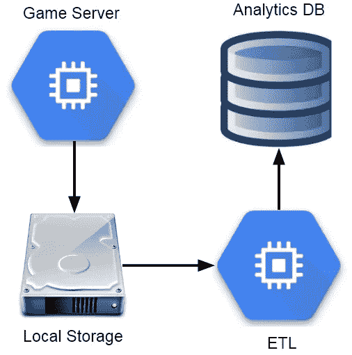
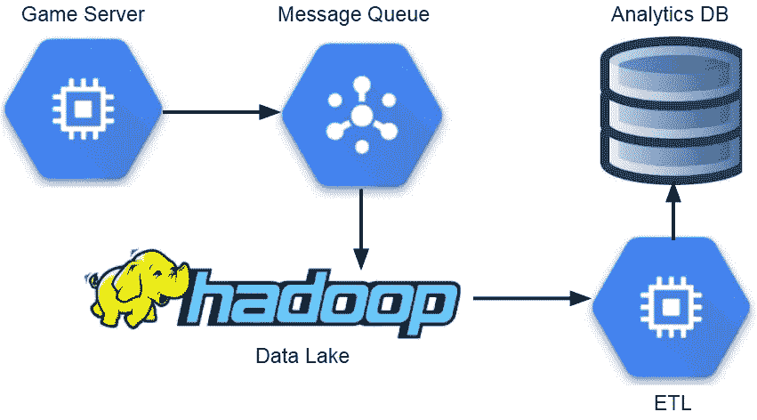
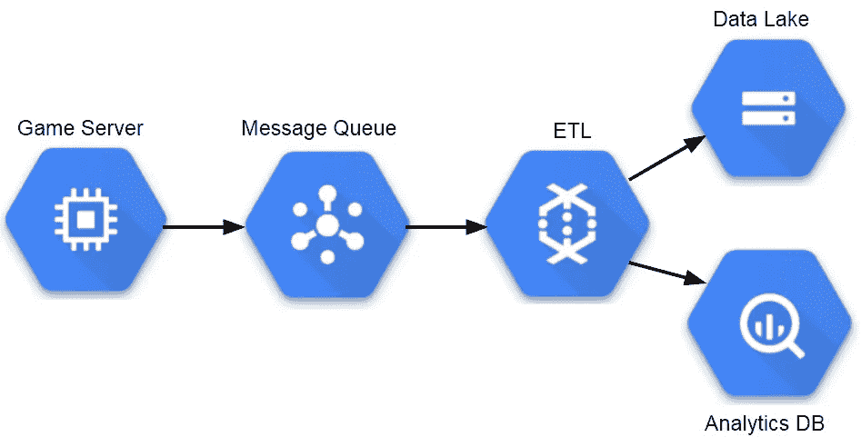
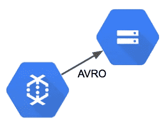
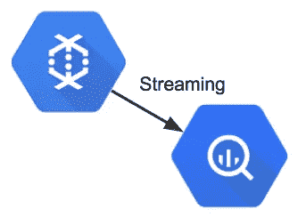
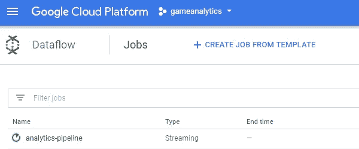
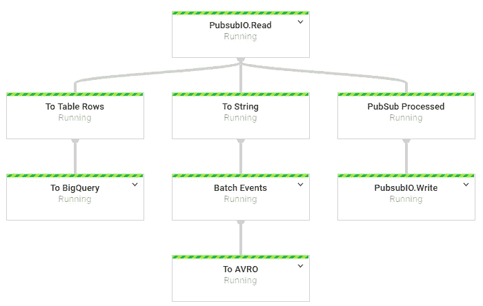

# 创业公司的数据科学:数据管道

> 原文：<https://towardsdatascience.com/data-science-for-startups-data-pipelines-786f6746a59a?source=collection_archive---------0----------------------->


Source: TheDigitalArtist at pixabay.com

我正在进行的关于在初创公司建立数据科学学科的系列文章的第三部分。你可以在 [*简介*](/data-science-for-startups-introduction-80d022a18aec) *中找到所有帖子的链接，还有一本基于这个系列的关于* [*亚马逊*](https://www.amazon.com/dp/1983057975) *的书。*

建立数据管道是初创企业数据科学的核心组成部分。为了构建数据产品，您需要能够从数百万用户那里收集数据点，并近乎实时地处理结果。虽然我的[上一篇博文](/data-science-for-startups-tracking-data-4087b66952a1)讨论了收集什么类型的数据以及如何将数据发送到端点，但这篇博文将讨论如何处理已经收集的数据，使数据科学家能够处理这些数据。即将发布的关于模型生产的博文将讨论如何在这个数据平台上部署模型。

通常，数据管道的目的地是数据湖，如 S3 上的 Hadoop 或 parquet 文件，或者是关系数据库，如 Redshift。理想的数据管道应该具有以下特性:

*   **低事件延迟:**数据科学家应该能够在事件被发送到数据收集端点的几分钟或几秒钟内，在管道中查询最近的事件数据。这对于测试和构建需要近实时更新的数据产品非常有用。
*   **可扩展性:**一个数据管道应该能够扩展到数十亿个数据点，随着产品的扩展，可能会扩展到数万亿。一个高性能的系统不仅应该能够存储这些数据，还应该能够查询完整的数据集。
*   **交互式查询:**一个高功能的数据管道应该支持长时间运行的批处理查询和较小的交互式查询，使数据科学家能够探索表和理解模式，而不必在采样数据时等待几分钟或几小时。
*   **版本控制:**您应该能够对您的数据管道和事件定义进行更改，而不会导致管道中断和数据丢失。本文将讨论在改变事件模式的情况下，如何构建一个支持不同事件定义的管道。
*   **监控:**如果某个事件不再被接收，或者某个特定区域的跟踪数据不再被接收，那么数据管道应该通过 PagerDuty 等工具生成警报。
*   **测试:**您应该能够使用测试事件来测试您的数据管道，这些测试事件不会出现在您的数据湖或数据库中，但是会测试管道中的组件。

数据管道应该具有许多其他有用的属性，但这是一个创业的良好起点。当您开始构建依赖于您的数据管道的附加组件时，您会想要设置用于容错和自动化任务的工具。

本文将展示如何建立一个可伸缩的数据管道，将跟踪数据发送到数据湖、数据库和订阅服务，以便在数据产品中使用。我将讨论管道中不同类型的数据，数据管道的发展，并通过 PubSub、DataFlow 和 BigQuery 在 GCP 上实现一个示例管道。

在部署数据管道之前，您需要回答以下问题，这些问题类似于我们关于跟踪规格的问题:

1.  谁拥有数据管道？
2.  哪些团队将使用数据？
3.  谁将对管道进行质量保证？

在小型组织中，数据科学家可能负责管道，而大型组织通常有一个基础架构团队负责保持管道的运行。了解哪些团队将使用数据也很有用，这样您就可以将数据传输到适当的团队。例如，营销可能需要登录页面访问的实时数据来为营销活动进行归因。最后，应该定期彻底检查传递到管道的事件的数据质量。有时，产品更新会导致跟踪事件丢失相关数据，应该建立一个流程来捕获这些类型的数据变化。

## 数据类型

根据已执行的修改量，管道中的数据通常有不同的名称。数据通常用以下标签分类:

*   **原始数据:**是未经处理的跟踪数据。这是以用于发送跟踪事件的消息编码格式存储的数据，如 JSON。原始数据尚未应用模式。将所有跟踪事件作为原始事件发送是很常见的，因为所有事件都可以发送到单个端点，并且模式可以稍后在管道中应用。
*   **处理过的数据:**处理过的数据是已经被解码成事件特定格式的原始数据，并应用了一个模式。例如，JSON 跟踪事件被转换成具有固定模式的会话启动事件，这些事件被视为已处理数据。已处理的事件通常存储在数据管道中不同的事件表/目的地中。
*   **熟数据:**经过汇总或汇总处理的数据称为熟数据。例如，处理后的数据可以包括会话开始和会话结束事件，并被用作汇总用户日常活动的熟数据的输入，例如会话的数量和网页在网站上的总时间。

数据科学家通常会处理经过处理的数据，并使用工具为其他团队创建成熟的数据。这篇文章将讨论如何构建一个输出处理过的数据的数据管道，而商业智能文章将讨论如何将熟数据添加到您的管道中。

## 数据管道的演变

在过去的二十年里，收集和分析数据的环境发生了巨大的变化。现代系统可以跟踪活动并近乎实时地应用机器学习，而不是通过日志文件在本地存储数据。初创公司可能希望使用早期的方法进行初始测试，但应该真正寻找更新的方法来构建数据管道。根据我的经验，我注意到了四种不同的管道方法:

1.  **平面文件时代:**数据保存在游戏服务器本地
2.  **数据库时代:**数据存放在平面文件中，然后加载到数据库中
3.  **数据湖时代:**数据存储在 Hadoop/S3 中，然后加载到 DB 中
4.  **无服务器时代:**托管服务用于存储和查询

这一演变中的每一步都支持更大数据集的收集，但可能会引入额外的操作复杂性。对于一家初创公司，目标是能够在不扩展运营资源的情况下扩展数据收集，而向托管服务的发展为增长提供了一个很好的解决方案。

我们将在本文的下一节中介绍的数据管道是基于最新的数据管道时代，但介绍不同的方法是有用的，因为不同公司的需求可能更适合不同的架构。

**平面文件时代**


Components in a pre-database Analytics Architecture

2010 年，我在电子艺界开始研究数据科学，那时 EA 还没有围绕数据建立组织。虽然许多游戏公司已经收集了大量关于游戏的数据，但大多数遥测数据都以日志文件或其他平面文件格式的形式存储在游戏服务器上。没有什么是可以直接查询的，计算月活跃用户(MAU)等基本指标需要大量的工作。

在电子艺界，重播功能被内置到 Madden NFL 11 中，这提供了一个意想不到的游戏遥测源。每场比赛后，一份 XML 格式的比赛摘要被发送到一个游戏服务器，其中列出了每场比赛的叫牌、比赛过程中的走法以及比赛结果。这导致了数百万个文件可以被分析，以了解更多关于球员如何在野外与马登足球互动的信息。

在本地存储数据是目前为止收集游戏数据时最简单的方法。例如，上一篇文章中介绍的 PHP 方法对于设置轻量级分析端点非常有用。但是这种方法有明显的缺点。

这种方法很简单，使团队能够以任何需要的格式保存数据，但是没有容错能力，不将数据存储在一个中心位置，在数据可用性方面有很大的延迟，并且具有用于构建分析生态系统的标准工具。如果您只有几台服务器，平面文件可以很好地工作，但它不是真正的分析管道，除非您将文件移动到一个中心位置。您可以编写脚本将数据从日志服务器拉到一个中心位置，但这通常不是一种可伸缩的方法。

**数据库时代**



Components in an ETL-based Analytics Architecture

当我在索尼在线娱乐公司时，我们让游戏服务器每隔几分钟就将事件文件保存到一个中央文件服务器。然后，文件服务器大约每小时运行一次 ETL 过程，将这些事件文件快速加载到我们的分析数据库中，该数据库当时是 Vertica。这个过程有一个合理的延迟，从游戏客户端发送事件到数据在我们的分析数据库中可查询大约一个小时。它还可以扩展到大量数据，但需要使用固定的事件数据模式。

当我还是一个 Twitch 时，我们对我们的一个分析数据库使用了类似的过程。与 SOE 的方法的主要区别是，我们没有将游戏服务器 scp 文件放在一个中心位置，而是使用[亚马逊 Kinesis](https://aws.amazon.com/kinesis/) 将事件从服务器传输到 S3 的集结地。然后，我们使用 ETL 过程将数据快速加载到 Redshift 中进行分析。从那时起，Twitch 转向了数据湖方法，以便扩展到更大的数据量，并为查询数据集提供更多选项。

SOE 和 Twitch 使用的数据库对两家公司都非常有价值，但我们在扩展存储的数据量时确实遇到了挑战。随着我们收集更多关于游戏的详细信息，我们不能再在表格中保存完整的事件历史，需要截断超过几个月的数据。如果您可以设置维护这些事件的最重要细节的汇总表，这很好，但是这不是理想的情况。

这种方法的一个问题是，临时服务器会成为故障的中心点。当一个游戏发送了太多的事件时，也有可能出现瓶颈，导致事件在所有游戏中被丢弃。另一个问题是当处理数据库的分析师数量增加时的查询性能。几个分析师组成的团队处理几个月的游戏数据可能会很好，但在收集了多年的数据并增加了分析师的数量后，查询性能可能会成为一个重大问题，导致一些查询需要几个小时才能完成。

这种方法的主要好处是，所有事件数据都可以在一个位置使用 SQL 查询，并且有很好的工具可以使用，如 Tableau 和 DataGrip，用于处理关系数据库。缺点是将所有数据加载到像 Vertica 或 Redshift 这样的数据库中的成本很高，事件需要有固定的模式，并且可能需要截断表来保持服务器的性能。

使用数据库作为数据的主要接口的另一个问题是，Spark 的 MLlib 等机器学习工具无法有效使用，因为相关数据需要从数据库中卸载才能进行操作。克服这种限制的方法之一是以一种格式和存储层存储游戏数据，这种格式和存储层可以很好地与大数据工具配合使用，例如在 S3 上将事件保存为拼花文件。这种类型的配置在下一个时代变得越来越普遍，它避开了需要截断表的限制，并降低了保存所有数据的成本。

**数据湖时代**



Components in a Data Lake Analytics Architecture

当我在游戏行业担任数据科学家时，最常见的数据存储模式是数据湖。一般模式是将半结构化数据存储在分布式数据库中，并运行 ETL 过程来提取与分析数据库最相关的数据。许多不同的工具可以用于分布式数据库:在电子艺界我们使用 Hadoop，在微软工作室我们使用 Cosmos，在 Twitch 我们使用 S3。

这种方法使团队能够扩展到海量数据，并提供额外的容错能力。它的主要缺点是引入了额外的复杂性，并且由于缺少工具或访问策略，可能导致分析师访问的数据比使用传统数据库方法时少。在这个模型中，大多数分析师会以同样的方式与数据交互，使用从数据湖 ETL 中填充的分析数据库。

这种方法的好处之一是它支持各种不同的事件模式，并且您可以在不影响分析数据库的情况下更改事件的属性。另一个优势是，分析团队可以使用 Spark SQL 等工具直接处理数据湖。然而，我工作过的大多数地方都限制了对数据湖的访问，消除了这种模式的许多好处。

这种方法可以扩展到大量数据，支持灵活的事件模式，并为长时间运行的批处理查询提供了一个很好的解决方案。不利的一面是，它可能涉及大量的操作开销，可能引入大量的事件延迟，并且可能缺乏针对数据湖的最终用户的成熟工具。这种方法的另一个缺点是，通常需要整个团队来保持系统的运行。这对大型组织来说是有意义的，但对较小的公司来说可能有些矫枉过正。利用数据湖而不产生运营开销的方法之一是使用托管服务。

**无服务器时代**



Components in a managed Analytics Architecture (GCP)

在当前时代，分析平台整合了许多托管服务，使团队能够接近实时地处理数据，根据需要扩展系统，并减少维护服务器的开销。我在游戏行业工作时从未经历过这个时代，但看到了这种转变正在发生的迹象。Riot Games 正在使用 [Spark](https://www.slideshare.net/SparkSummit/video-games-at-scale-improving-the-gaming-experience-with-apache-spark) 进行 ETL 过程和机器学习，并需要按需旋转基础设施。一些游戏团队正在为游戏服务使用弹性计算方法，利用这种方法进行分析也是有意义的。

这种方法有许多与使用数据湖相同的好处，可以根据查询和存储需求自动伸缩，并且操作开销最小。主要缺点是托管服务可能很昂贵，采用这种方法可能会导致使用无法移植到其他云提供商的平台特定工具。

在我的职业生涯中，我在使用数据库时代方法方面取得了最大的成功，因为它为分析团队提供了对所有相关数据的访问。然而，这不是一个可以继续扩展的设置，我工作过的大多数团队后来都转移到了数据湖环境。为了让数据湖环境取得成功，分析团队需要访问底层数据，以及成熟的工具来支持他们的流程。对于初创公司来说，无服务器方法通常是开始构建数据管道的最佳方式，因为它可以根据需求进行扩展，并且只需要最少的员工来维护数据管道。下一节将通过托管服务构建一个示例管道。

## **一个可扩展的管道**

我们将构建一个数据管道，使用 Google 的 PuSub 作为端点来接收事件，并将事件保存到数据湖和数据库中。这里介绍的方法将事件保存为原始数据，但是我还将讨论将事件转换为处理过的数据的方法。

执行所有这些功能的数据管道相对简单。管道从 PubSub 读取消息，然后转换事件以实现持久性:管道的 BigQuery 部分将消息转换为 TableRow 对象并直接传输到 BigQuery，而管道的 AVRO 部分将事件批处理到离散的窗口中，然后将事件保存到 Google 存储中。操作图如下图所示。


The streaming pipeline deployed to Google Cloud

**设置环境** 构建数据管道的第一步是设置编译和部署项目所需的依赖关系。我使用了以下 maven 依赖项来为向管道发送事件的跟踪 API 和处理事件的数据管道设置环境。

```
<!-- *Dependencies for the Tracking API* ->
<dependency>
  <groupId>com.google.cloud</groupId>
  <artifactId>google-cloud-pubsub</artifactId>
  <version>0.32.0-beta</version>
  </dependency>
</dependencies><!-- *Dependencies for the data pipeline* ->
<dependency>
  <groupId>com.google.cloud.dataflow</groupId>
  <artifactId>google-cloud-dataflow-java-sdk-all</artifactId>
  <version>2.2.0</version>
</dependency>
```

我使用 Eclipse 来编写和编译本教程的代码，因为它是开源的。然而，其他的 ide 如 [IntelliJ](https://www.jetbrains.com/idea/) 为部署和监控数据流任务提供了额外的特性。在将作业部署到 Google Cloud 之前，您需要为 PubSub 和 DataFlow 设置一个服务帐户。设置这些凭证超出了本文的范围，更多细节可以在 [Google 文档](https://cloud.google.com/bigquery/docs/authentication/service-account-file)中找到。

运行这个数据管道的另一个先决条件是在 GCP 上设置一个 PubSub 主题。我定义了一个 *raw-events* 主题，用于发布和消费数据管道的消息。关于创建 PubSub 主题的更多细节可在[这里](https://cloud.google.com/pubsub/docs/quickstart-console)获得。

要部署这个数据管道，您需要用上面列出的 maven 依赖项设置一个 java 环境，设置一个 Google Cloud 项目并启用计费，在存储和 BigQuery 服务上启用计费，并创建一个用于发送和接收消息的 PubSub 主题。所有这些托管服务都要花钱，但有一个免费层可用于构建数据管道原型。


Sending events from a server to a PubSub topic

**发布事件** 为了构建一个可用的数据管道，构建封装发送事件数据细节的 API 是很有用的。[跟踪 API](https://github.com/bgweber/GameAnalytics/blob/master/events/tracking/TrackingAPI.java) 类提供了这一功能，并可用于将生成的事件数据发送到数据管道。下面的代码显示了发送事件的方法签名，并显示了如何生成示例数据。

```
/** Event Signature for the Tracking API 
public void sendEvent(String eventType, String eventVersion, HashMap<String, String> attributes);
*/// send a batch of events    
for (int i=0; i<10000; i++) {// generate event names      
  String eventType = Math.random() < 0.5 ? 
      "Session" : (Math.random() < 0.5 ? "Login" : "MatchStart");// create attributes to send      
  HashMap<String, String> attributes = new HashMap<String,String>();
  attributes.put("userID", "" + (int)(Math.random()*10000));
  attributes.put("deviceType", Math.random() < 0.5 ? 
      "Android" : (Math.random() < 0.5 ? "iOS" : "Web"));// send the event      
  tracking.sendEvent(eventType, "V1", attributes);      
}
```

跟踪 API 建立一个到 PubSub 主题的连接，以 JSON 格式传递事件，并实现一个回调来通知传递失败。下面提供了用于发送事件的代码，该代码基于 Google 的 PubSub 示例。

```
// Setup a PubSub connection 
TopicName topicName = TopicName.of(projectID, topicID);
Publisher publisher = Publisher.newBuilder(topicName).build();// Specify an event to send
String event = {\"eventType\":\"session\",\"eventVersion\":\"1\"}";// Convert the event to bytes    
ByteString data = ByteString.copyFromUtf8(event.toString());//schedule a message to be published    
PubsubMessage pubsubMessage = 
  PubsubMessage.newBuilder().setData(data).build();// publish the message, and add this class as a callback listener
ApiFuture<String> future = publisher.publish(pubsubMessage);    ApiFutures.addCallback(future, this);
```

上面的代码使应用程序能够将事件发送到 PubSub 主题。下一步是在完全托管的环境中处理这些事件，该环境可以根据需要进行扩展以满足需求。

**存储事件** 数据管道的一个关键功能是让数据科学和分析团队可以使用测量的事件进行分析。用作端点的数据源应该具有低延迟，并且能够扩展到大量事件。本教程中定义的数据管道展示了如何将事件输出到 BigQuery 和数据湖，后者可用于支持大量分析业务用户。


Streaming event data from PubSub to DataFlow

这个数据管道的第一步是从 PubSub 主题中读取事件，并将获取的消息传递给数据流流程。DataFlow 提供了一个 PubSub 连接器，它支持将 PubSub 消息流式传输到其他 DataFlow 组件。下面的代码显示了如何实例化数据管道、指定流模式以及使用来自特定 PubSub 主题的消息。这个过程的输出是一组 PubSub 消息，可以存储起来供以后分析。

```
// set up pipeline options    
Options options = PipelineOptionsFactory.fromArgs(args)
  .withValidation().as(Options.class);    
options.setStreaming(true);    
Pipeline pipeline = Pipeline.create(options);// read game events from PubSub    
PCollection<PubsubMessage> events = pipeline
  .apply(PubsubIO.readMessages().fromTopic(topic));
```

我们希望存储事件的第一种方式是采用列格式，这种格式可用于构建数据湖。虽然这篇文章没有展示如何在下游 ETL 中利用这些文件，但是拥有一个数据湖是在需要修改数据库时维护数据集副本的好方法。数据湖提供了一种在由于模式变化或数据接收问题而需要时重新加载数据的方法。分配给该进程的数据管道部分如下所示。



Batching events to AVRO format and saving to Google Storage

对于 AVRO，我们不能使用直接分流的方法。在保存到平面文件之前，我们需要将事件分组到批处理中。在数据流中实现这一点的方法是应用窗口函数，将事件分组为固定的批次。下面的代码应用转换，将 PubSub 消息转换为 String 对象，以 5 分钟为间隔将消息分组，并将结果批量输出到 Google Storage 上的 AVRO 文件。

```
// AVRO output portion of the pipeline    
events
.apply("To String", ParDo.of(new DoFn<PubsubMessage, String>() {
  @ProcessElement        
  public void processElement(ProcessContext c) throws Exception {
    String message = new String(c.element().getPayload());
    c.output(message);        
  }      
}))// Batch events into 5 minute windows      
.apply("Batch Events", Window.<String>into(    
    FixedWindows.of(Duration.standardMinutes(5)))       
  .triggering(AfterWatermark.pastEndOfWindow())     
  .discardingFiredPanes()              
  .withAllowedLateness(Duration.standardMinutes(5)))// Save the events in ARVO format      
.apply("To AVRO", AvroIO.write(String.class)
  .to("gs://your_gs_bucket/avro/raw-events.avro")
  .withWindowedWrites() 
  .withNumShards(8)
  .withSuffix(".avro"));
```

总而言之，上面的代码将事件分批放入 5 分钟的窗口中，然后将事件导出到 Google Storage 上的 AVRO 文件中。

这部分数据管道的结果是谷歌存储上的 AVRO 文件集合，可以用来建立一个数据湖。每隔 5 分钟就会生成一个新的 AVRO 输出，下游 ETL 可以将原始事件解析为经过处理的特定于事件的表模式。下图显示了 AVRO 文件的输出示例。


AVRO files saved to Google Storage

除了创建数据湖之外，我们还希望在查询环境中可以立即访问事件。DataFlow 提供了一个 BigQuery 连接器来实现这一功能，传输到这个端点的数据在短时间内就可以用于分析。下图显示了数据管道的这一部分。



Streaming events from DataFlow to BigQuery

数据管道将 PubSub 消息转换为 TableRow 对象，这些对象可以直接插入 BigQuery。下面的代码由两个应用方法组成:数据转换和 IO 编写器。转换步骤从 PubSub 读取消息有效负载，将消息解析为 JSON 对象，提取 *eventType* 和 *eventVersion* 属性，并使用这些属性以及时间戳和消息有效负载创建 TableRow 对象。第二个 apply 方法告诉管道将记录写入 BigQuery，并将事件追加到现有的表中。

```
// parse the PubSub events and create rows to insert into BigQuery    events.apply("To Table Rows", new 
  PTransform<PCollection<PubsubMessage>, PCollection<TableRow>>() { 
    public PCollection<TableRow> expand(
        PCollection<PubsubMessage> input) {       

      return input.apply("To Predictions", ParDo.of(new  
          DoFn<PubsubMessage, TableRow>() {    

    @ProcessElement          
    public void processElement(ProcessContext c) throws Exception {
      String message = new String(c.element().getPayload()); 

      // parse the json message for attributes
      JsonObject jsonObject = 
          new JsonParser().parse(message).getAsJsonObject();
      String eventType = jsonObject.get("eventType").getAsString();
      String eventVersion = jsonObject.
              get("eventVersion").getAsString();          
      String serverTime = dateFormat.format(new Date()); 

     // create and output the table row            
     TableRow record = new TableRow();            
     record.set("eventType", eventType);               
     record.set("eventVersion", eventVersion);          
     record.set("serverTime", serverTime);
     record.set("message", message);            
     c.output(record);          
  }}));      
}})

//stream the events to Big Query    
.apply("To BigQuery",BigQueryIO.writeTableRows()   
  .to(table)           
  .withSchema(schema)
  .withCreateDisposition(CreateDisposition.CREATE_IF_NEEDED)
  .withWriteDisposition(WriteDisposition.WRITE_APPEND));
```

总结一下上面的代码，从 PubSub 消费的每条消息都被转换成一个带有时间戳的 TableRow 对象，然后传输到 BigQuery 进行存储。

这部分数据管道的结果是，事件将被传输到 BigQuery，并可用于 DataFlow 任务指定的输出表中的分析。为了有效地将这些事件用于查询，您需要构建额外的 ETL 来创建带有模式化记录的已处理事件表，但是现在您已经有了一个数据收集机制来存储跟踪事件。


Game event records queried from the raw-events table in BigQuery

**部署和自动扩展** 使用数据流，您可以在本地测试数据管道或部署到云。如果运行代码示例时没有指定附加属性，则数据管道将在本地计算机上执行。为了部署到云并利用这个数据管道的自动伸缩功能，您需要指定一个新的 runner 类作为运行时参数的一部分。为了运行数据管道，我使用了以下运行时参数:

```
--runner=org.apache.beam.runners.dataflow.DataflowRunner 
--jobName=game-analytics
--project=your_project_id 
--tempLocation=gs://temp-bucket
```

部署作业后，您应该会看到一条消息，表明作业已经提交。然后你可以点击[数据流控制台](https://console.cloud.google.com/dataflow)来查看任务:



The steaming data pipeline running on Google Cloud

上面指定的运行时配置不会默认为自动缩放配置。为了部署可根据需求扩展的作业，您需要指定其他属性，例如:

```
--autoscalingAlgorithm=THROUGHPUT_BASED
--maxNumWorkers=30
```

关于设置数据流任务以适应繁重工作负载条件的更多详细信息，请参见[这篇谷歌文章](https://cloud.google.com/blog/big-data/2016/03/comparing-cloud-dataflow-autoscaling-to-spark-and-hadoop)和[这篇来自 Spotify 的文章](https://labs.spotify.com/2016/03/10/spotifys-event-delivery-the-road-to-the-cloud-part-iii/)。下图显示了数据流如何根据需要扩展以满足需求。


An example of Dataflow auto scaling. The pipeline will scale up and down as necessary to match demand.

**Raw to Processed Events** 目前呈现的流水线将跟踪事件保存为原始数据。为了将这些事件转换成已处理的数据，我们需要应用特定于事件的模式。对于这条管道，我们可以采取几种不同的方法:

1.  在当前数据流管道中应用模式并保存到 BigQuery
2.  应用当前管道中的架构并发送到新的发布订阅
3.  将附加属性应用于原始事件并发送到新的发布订阅
4.  使用下游 ETL 来应用模式

第一种方法是最简单的，但是如果需要更新事件定义，它没有提供好的解决方案。这种方法可以如下面的代码所示实现，该代码展示了如何过滤和解析 MatchStart 事件，以便输入到 BigQuery 中。

```
events.apply("To MatchStart Events", ParDo.*of*(
    new DoFn<PubsubMessage, TableRow>() {@ProcessElement 
public void processElement(ProcessContext c) throws Exception {
  String message = new String(c.element().getPayload());JsonObject jsonObject = new 
      JsonParser().parse(message).getAsJsonObject();
  String eventType = jsonObject.get("eventType").getAsString();
  String version = jsonObject.get("eventVersion").getAsString();
  String serverTime = dateFormat.format(new Date());

  *// Filter for MatchStart events* if (eventType.equals("MatchStart")) {

    TableRow record = new TableRow();
    record.set("eventType", eventType);
    record.set("eventVersion", version);
    record.set("server_time", serverTime);

    *// event specifc attributes* record.set("userID", jsonObject.get("userID").getAsString());
    record.set("type", jsonObject.get("deviceType").getAsString());
    c.output(record);
  }
}}))
.apply("To BigQuery",BigQueryIO.*writeTableRows*()
```

为了实现这种方法，您需要为每种类型的事件创建一个新的 *DoFn* 实现。第二种方法与第一种类似，但是不是将解析后的事件传递给 BigQuery，而是将它们传递给一个新的 PubSub 主题。可以向单个主题发送多种类型的事件，或者为每个事件创建一个主题。使用前两种方法的缺点是消息解析逻辑是原始事件管道的一部分。这意味着更改事件定义涉及到重新启动管道。



The streaming pipeline with an additional output:

可以使用的第三种方法是将带有附加属性的原始事件发送到另一个 PubSub 主题。然后可以根据需要设置第二个数据流作业来解析事件。下面的代码展示了如何解析原始事件，向 PubSub 消息添加附加属性以进行过滤，以及将事件发布到第二个主题。这种方法允许在不重新启动原始事件管道的情况下更改事件定义。

```
# topic for raw events with additional attributes 
private static String processed = 
  "projects/your_project_id/topics/processed-events";events.apply("PubSub Processed", 
  ParDo.of(new DoFn<PubsubMessage, PubsubMessage>() {               @ProcessElement            
  public void processElement(ProcessContext c) throws Exception { 
    String message = new String(c.element().getPayload());   

    // parse the JSON message for attributes 
    JsonObject jsonObject = new 
        JsonParser().parse(message).getAsJsonObject(); 
    String eventType = jsonObject.get("eventType").getAsString();     // Add additional attributes for filtering 
    HashMap<String, String> atts = new HashMap();               
    atts.put("EventType", eventType);               
    PubsubMessage out = new PubsubMessage(message.getBytes(), atts);
    c.output(out);                                                 
  }  
}))     
.apply(PubsubIO.writeMessages().to(processed));
```

可以使用的第四种方法是让下游 ETLs 流程将模式应用于原始事件，并将原始事件表分解成特定于事件的表。我们将在下一篇文章中讨论这种方法。

## 结论

这篇文章介绍了如何为初创公司构建数据管道。我们讨论了管道中的数据类型、高功能数据管道的理想属性、数据管道的发展以及基于 GCP 构建的示例管道。

现在有各种各样的可用工具，可以轻松地为应用程序建立分析管道。使用托管资源使小型团队能够利用无服务器和自动扩展的基础架构，以最少的基础架构管理扩展到大量事件。您可以记录应用程序的所有相关数据，而不是使用数据供应商现成的数据收集解决方案。虽然这里介绍的方法不能直接移植到其他云，但是用于实现该数据管道核心功能的 Apache Beam 库是可移植的，并且可以利用类似的工具在其他云提供商上构建可伸缩的数据管道。

Github 上提供了该示例管道的完整源代码:

[](https://github.com/bgweber/GameAnalytics) [## BG Weber/游戏分析

### 游戏分析——游戏分析的全面管理管道

github.com](https://github.com/bgweber/GameAnalytics)