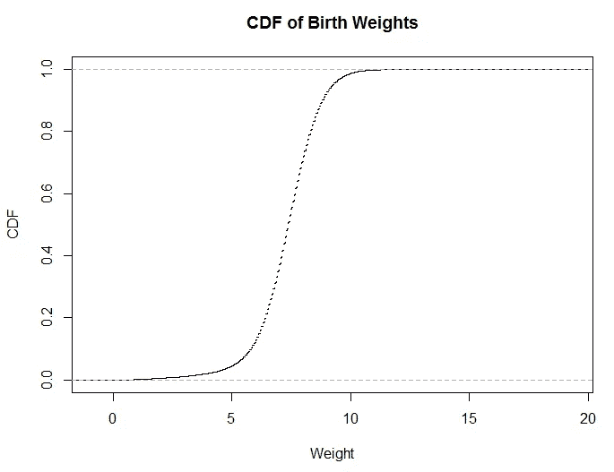
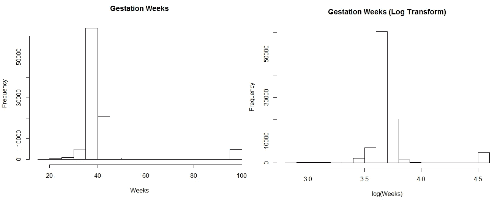
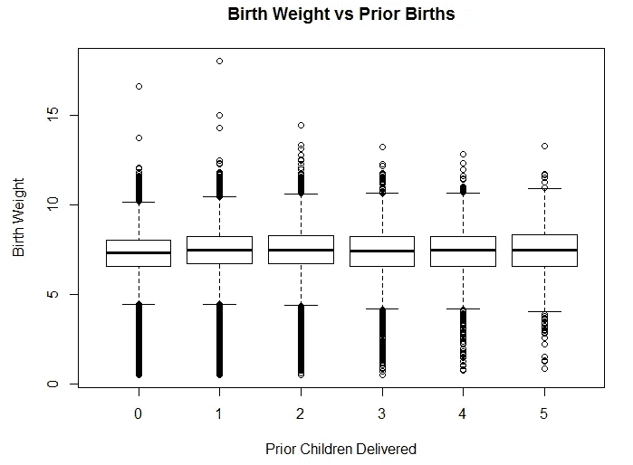
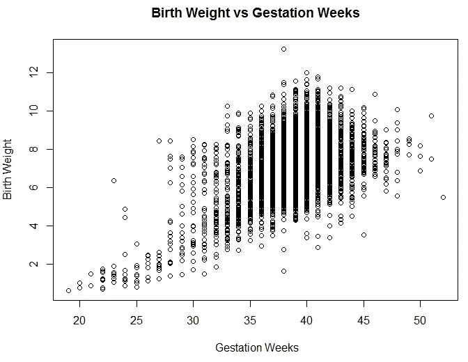
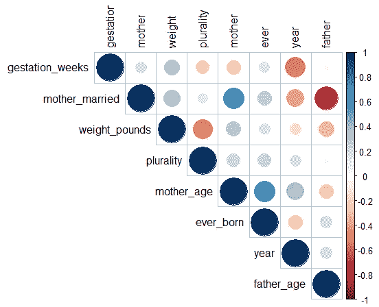
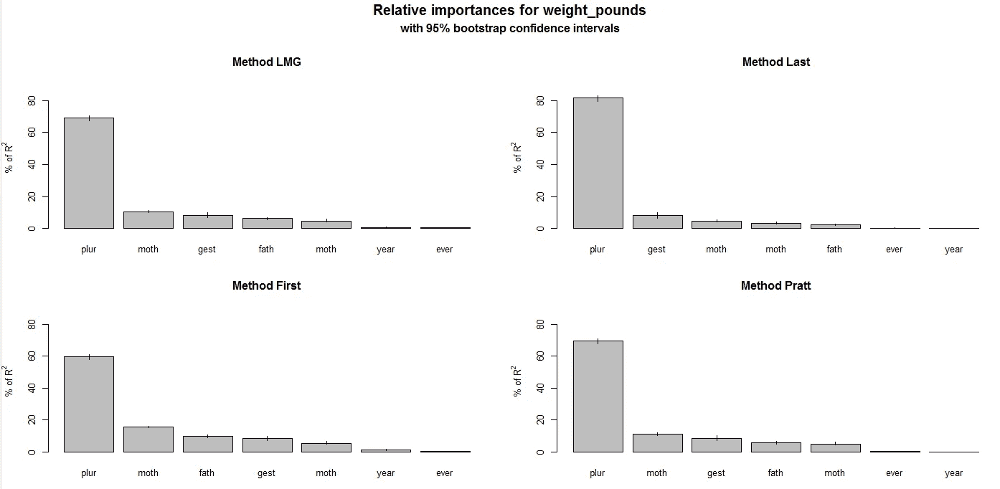

# 创业数据科学:探索性数据分析

> 原文：<https://towardsdatascience.com/data-science-for-startups-exploratory-data-analysis-70ac1815ddec?source=collection_archive---------6----------------------->


Source: wynpnt at pixabay.com

我正在进行的关于在初创公司建立数据科学学科的系列文章的第五部分。你可以在 [*简介*](/data-science-for-startups-introduction-80d022a18aec) *中找到所有帖子的链接，还有一本基于这个系列的关于* [*亚马逊*](https://www.amazon.com/dp/1983057975) *的书。*

一旦你建立了数据管道，收集了用户行为的数据，你就可以开始探索这些数据，以决定如何改进你的产品。探索性数据分析(EDA)是调查数据集以了解数据形状、特征之间的相关性以及数据中可能对构建预测模型有用的信号的过程。

能够用查询语言和脚本语言来执行这项任务是很有用的。r 为快速理解数据集的形状提供了有用的工具，但只能分析能放入内存的数据集。为了处理大规模数据集，SQL 对于计算整个数据集的汇总统计和分布非常有用。

本文介绍了四种探索性分析，包括计算汇总统计数据、绘制要素、相关性分析和简单线性模型的要素重要性加权。执行这类工作的目标是能够更好地理解用户行为，确定如何改进产品，并调查数据是否为构建数据产品提供了有用的信号。

对于 EDA 示例，我们将使用 [Natality BigQuery](https://cloud.google.com/bigquery/sample-tables) 数据集。这个数据集提供了美国过去 50 年的出生信息。该分析的目的是确定哪些因素与出生体重相关，并建立一个线性回归模型来预测结果。

## 汇总统计数据

当探索一个新的数据集时，我们要做的第一件事是计算帮助我们理解数据集的汇总统计数据。这可能包括平均值和中值等统计数据，以及最小值和最大值等极端值。r 提供了一个名为 summary 的函数，用于计算数据框中每一列的统计数据。下面的代码片段显示了使用该函数的示例。

```
library(bigrquery)
project <- "your_project_id"sql <- "
 SELECT year, plurality, mother_age, father_age,    
       gestation_weeks, ever_born, mother_married, weight_pounds
 FROM `bigquery-public-data.samples.natality`
 order by rand() 
 LIMIT 100000"df <- query_exec(sql, project = project, use_legacy_sql = FALSE)
summary(df[, 2:5])
```

该脚本在 BigQuery 中查询出生率数据集，并在本地提取一个样本数据集。接下来，将结果集的第二到第五列传递给 summary 函数。调用该函数的结果如下图所示。对于每一列，该函数计算每个属性的最小值、平均值、最大值以及第 25、50 和 75 个百分点。它还计算缺失(NA)值的实例数。


Summary Stats for the Natality Data Set

*摘要*提供了一种快速理解数据集的方法，但通常需要进一步挖掘才能真正理解数据的形状。下一节将展示如何使用直方图来更全面地理解数据集。数据集中一个有趣的特征是 multiple 列，它描述了怀孕过程中携带的子女数量(产仔数)。中位数略高于 1，因为很少出现双胞胎、三胞胎甚至更多的孩子。由于这种分布的偏态性，汇总的统计数据不能很好地概括人类怀孕中双胞胎或三胞胎的常见程度。

为了弄清楚双胞胎和三胞胎有多常见，我们可以使用 [sqldf](https://cran.r-project.org/web/packages/sqldf/index.html) 库，它允许在 R 数据帧上执行查询。下面的代码显示了如何计算导致多胎分娩的怀孕次数。结果显示，双胞胎出现的频率约为 2.4%，三胞胎出现的频率约为 0.1%，四胞胎出现的频率约为 0.009%。

```
library(sqldf)
df <- df[!is.na(df$plurality), ]
sqldf("select plurality, sum(1) as Babies 
from df group by 1
order by 1")
```

这些结果是基于 1，000，000 例妊娠的样本。理想情况下，我们希望跨计算数据集计算这些统计数据。min、max 和 mean 等聚合值很容易计算，因为 SQL 内置了这些运算的聚合。然而，计算中间值以及第 25 和第 75 个百分位数通常并不简单。如果您试图将 *percentile_cont* 操作应用于 1.38 亿次怀孕的完整数据集，BigQuery 将会抛出一个异常，因为这是一个分析函数，会将所有记录混排到一个节点中。

有几种不同的方法可以解决这个限制。BigQuery 确实提供了一个近似的分位数函数来支持这种大小的数据。您还可以使用随机生成的值(如 rand()*10)对数据集进行分区，并取平均值，以获得近似结果。这些方法适用于第 25、50 和 75 百分位值，但对于极端结果(如第 99.9 百分位)则不太准确。第三种方法是提供一个分区键来分割数据，防止太多的数据被转移到一台机器上。我们可以使用 year 字段，如下面的查询所示。

```
select year, sum(1) births, min(father_age) Min
 ,avg(Q1) Q1, avg(Q2) Median, round(avg(father_age), 1) Mean
  ,avg(Q3) Q3, max(father_age) Max
from (
  select year, father_age
   ,percentile_cont(father_age, 0.25) over (partition by year) as Q1
   ,percentile_cont(father_age, 0.50) over (partition by year) as Q2
   ,percentile_cont(father_age, 0.75) over (partition by year) as Q3
  FROM `bigquery-public-data.samples.natality`
  where mod(year, 5) = 0 and year >= 1980
)
group by 1 order by 1
```

这种方法为*父亲年龄*列计算第 25、50 和 75 个百分点。 *percentile_cont* 函数是一个分析函数，这意味着它为每条记录返回一个结果，并且需要进行聚合以创建汇总统计数据。上面的查询显示了如何使用 BigQuery 计算由 R summary 函数提供的相同统计数据，同时按出生年份对数据进行分区。该查询生成下表，其中显示了关于父亲年龄的统计信息。


Birth Summary Statistics by Year (Father Age)

这些数据中有一些有趣的趋势值得注意。第一个是 99 年的一致值，作为最大父亲年龄。这可能是数据质量问题，当父亲的年龄未知时，99 可能被设置为年龄。另一个趋势是，父亲的平均年龄逐年增加，从 1980 年的 28 岁增加到 2005 年的 32 岁。对于第一个孩子来说，这并不正常，但汇总统计数据确实表明了一种趋势，即家庭开始晚育。

## 测绘

汇总统计数据提供了一种快速获取数据集快照的方法，但通常不能很好地概述数据是如何分布的。为了更完整地理解数据集的形状，用各种方法绘制数据是很有用的，比如使用直方图。

```
hist(df$weight_pounds, main = "Distribution of Birth Weights", 
    xlab = "Weight")
```

上面的 R 代码显示了如何在我们的采样数据集中绘制出生体重的直方图。结果是下面的直方图，它似乎表明值是正态分布的。大多数新生儿的体重在 6 到 9 磅之间。


Distribution of Birth Weights in the Sampled Natality Data Set

直方图对于可视化分布是有用的，但是它们确实有许多问题，例如桶的数量影响分布是单峰还是双峰。直接从直方图中确定百分位数通常也很困难。累积分布函数(CDF)是一种能够更好地传达这类信息的可视化方法。下面的代码展示了如何可视化相同的数据，但是使用了 CDF 而不是直方图。

```
plot(ecdf(df$weight_pounds), main = "CDF of Birth Weights", 
   xlab = "Weight", ylab = "CDF")
```

该代码应用经验累积分布函数，类似于计算运行总和并除以数据集中的实例总数。CDF 图的一个主要好处是，您可以直接从可视化中读取百分位值。这两种类型的可视化都可以使用 SQL 生成，然后在 Excel 等工具中绘制结果，但直方图通常计算成本较低，因为它们不需要分析函数。



The same data, plotted as a Cumulative Distribution Function (CDF)

在研究数据集时，另一个有用的技巧是变换要素，例如应用对数变换。当数据集不是正态分布时，这很有用。例如，会话数据通常是具有长尾的单侧分布，应用对数变换通常可以在绘制时提供更好的数据汇总。

```
hist(df$gestation_weeks, main = "Gestation Weeks", xlab = "Weeks")
hist(log(df$gestation_weeks), 
    main = "Gestation Weeks (Log Transform)", xlab = "log(Weeks)")
```

上面的代码显示了如何使用对数转换来转换妊娠周数特征。这对于具有长尾且只有正值的分布很有用。代码生成了下面两个图，它们显示了相似的结果。对于这个例子来说，转换是没有用的，但是当您需要将数据从偏态分布拟合到更接近正态分布时，这是一个值得探索的技巧。您也可以应用平方根变换来生成有用的图。



Log Transforming Gestation Weeks and Plotting Histograms

直接传达百分位数信息的 CDFs 的替代方法是箱线图。箱形图显示了第 25、50 和 75 个百分位数，以及四分位数范围和异常值。在比较不同数据分区的中值时，这种类型的图通常很有用。

```
sample <- df[df$ever_born <= 6, ]
sample$ever_born <- sample$ever_born - 1 
boxplot(weight_pounds~ever_born,data=sample, main="Birth Weight vs Prior Births", 
        xlab="Prior Children Delivered", ylab="Birth Weight")
```

上面的代码片段显示了一个在 R 中创建盒状图的例子。该代码根据母亲分娩的前几个孩子的数量，创建了一个不同四分位数范围的图。该图没有显示出明显的模式，但看起来第一个分娩的孩子比母亲分娩的其他孩子的体重略轻。



Birth weight based on number of previous children.

另一种有用的可视化是散点图，它比较数据集中两个不同特征的值。散点图可用于显示两个要素是强相关还是弱相关。下面的 R 代码显示了如何绘制妊娠期和出生体重的比较图。我过滤掉了孕育期超过 90 周的值，因为这些是可疑记录。

```
sample <- df[1:10000, ]
sample <- sample[sample$gestation_weeks < 90, ]
plot(sample$gestation_weeks, sample$weight_pounds, main = "Birth Weight vs Gestation Weeks",
      xlab= " Gestation Weeks", ylab = "Birth Weight")
```

结果如下图所示。从图中可以清楚地看出，明显较短的妊娠期会导致较低的出生体重，但对于超过 35 周的妊娠期，这种相关性有多强还不清楚。总体而言，对于样本数据集，这些要素的 R 平方值为 0.25。为了确定哪些特征与出生体重相关，我们需要使用下一节讨论的不同方法。



A comparison of the gestation period and birth weight features.

## 相关分析

了解某些特征是否可以预测数据集中的其他值非常有用。例如，如果我们知道使用某个产品特性的用户比其他用户保留的时间更长，这就为产品开发提供了有用的洞察力。相关性分析有助于了解数据集中哪些要素是相关的。每个要素都与数据集中的所有其他要素进行比较。然而，通常目标只是理解单个特征之间的相关性，而不是完整的比较矩阵。

避免仅基于相关性分析得出强有力的结论也很重要，因为不可能建立因果关系。通常，更专注的用户会探索应用程序提供的更多选项，所以试图驱使用户执行特定的操作并不一定会增加用户的保留率。例如，在应用程序中添加社交关系可以提高用户的留存率，但促使用户在应用程序中添加朋友可能不会带来长期用户留存的预期结果。最好使用受控方法进行实验，我将在以后的帖子中讨论这一点。

r 有一个用于执行相关性分析的内置函数。 *cor* 函数使用指定的方法计算数据帧中所有不同列之间的相关性。pearson 方法在处理连续值时很有用，而 spearman 方法在处理离散值(如调查数据)时很有用。下面的 R 代码片段展示了一个计算相关矩阵的例子。

```
res <- cor(df, method = "pearson", use = "complete.obs")
res <- ifelse(res > 0, res^.5, -abs(res)^.5)
library(corrplot)
corrplot(res, type = "upper", order = "hclust", tl.col = "black")
```

为了可视化结果，我包含了 corrplot 库，它创建了一个矩阵图。我注意到数据集中不同特征之间的相关性很弱，所以我应用了平方根变换使结果更具可读性。结果图如下图所示。如前所述，妊娠期不是决定出生体重的最重要因素。多胎实际上是出生体重最强的预测因素。



Correlation Matrix for the Natality Data Set (R-values have been square-rooted for visibility).

与绘制直方图类似，在计算相关性时尝试不同的要素变换很有用。例如，在预测房价时，房屋平方英尺的对数变换通常比原始平方英尺值更能反映房屋价值。

## 特征重要性

通常，探索数据集的目标是确定哪些特征对预测结果有用。这类似于相关性分析，但不是孤立地评估每个特征的影响，而是在包括所有其他特征时确定单个特征的重要性。相关性分析是理解特征的边际效应的一种方式，而特征重要性是理解特征的独特效应的一种方式。这对于处理高度相关的特性很有用，比如会话数量与总会话长度之比。两者都可能与用户保持度相关，但其中一个特征比另一个特征更能说明问题。[石灰](https://github.com/marcotcr/lime)是这种值得探索的分析类型的概括。

虽然下一篇文章将更详细地介绍预测建模，但我们将在这里使用一个简单的线性模型来展示如何执行特征分析。本例的目标是预测出生体重，这是一个连续的特征。考虑到这个问题规范，回归非常适合预测结果。我们可以建立一个线性回归模型，然后评估模型中不同特征的重要性，以确定哪些因素是结果的强预测因素。下面的代码示例显示了如何在 R 中构建一个线性回归模型，并使用不同的方法来度量功能的重要性。

```
library(relaimpo)
fit <- lm(weight_pounds ~ . , data = df)
boot <- boot.relimp(fit, b = 10, 
    type = c("lmg", "first", "last", "pratt"), 
    rank = TRUE, diff = TRUE, rela = TRUE)booteval.relimp(boot) 
plot(booteval.relimp(boot,sort=TRUE))
```

这个脚本的结果显示在下面的图中。使用不同的方法对特征进行加权，所有这些方法都表明，多元性是决定出生体重的最强特征。该脚本首先通过将 *weight_points* 指定为目标值来拟合线性回归模型，然后使用[相对重要性](https://cran.r-project.org/web/packages/relaimpo/index.html)库来确定哪些特征在决定结果方面是重要的。



Feature Weighting for the Natality data set.

## 结论

探索性数据分析是初创公司数据科学家的关键能力之一。您应该能够挖掘新的数据集，并根据结果确定如何改进您的产品。EDA 是一种理解数据集形状、探索数据中的相关性以及确定是否存在基于不同特征的结果建模信号的方法。

探索性分析通常涉及一些轻量级建模，以确定数据集内不同特征的重要性。在下一篇文章中，我们将深入探讨预测建模，它侧重于基于许多不同的特征来估计结果。