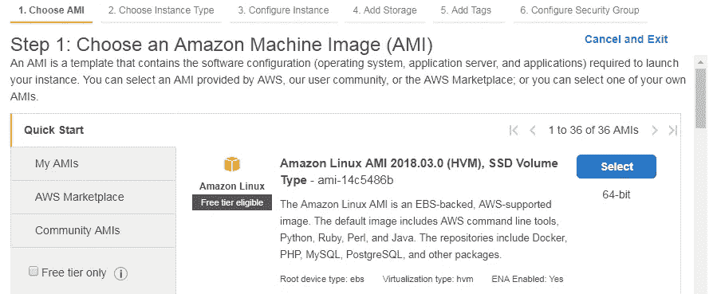
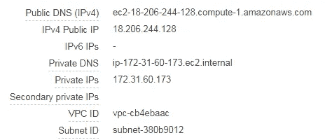

# 创业公司的数据科学:R -> Python

> 原文：<https://towardsdatascience.com/data-science-for-startups-r-python-2ca2cd149c5c?source=collection_archive---------3----------------------->


Source: Yuri_B at pixabay.com

在我的博客系列[初创公司的数据科学](/data-science-for-startups-introduction-80d022a18aec)中，我收到的一条反馈是，对于加入初创公司的数据科学家来说，Python 将是一个更好的选择。如果 Python 已经是执行数据科学任务的首选语言，这就很有意义了。就我而言，我在 R 方面有更多的经验，我想用一种我以前用来解决问题的语言来介绍如何与初创公司合作。

现在我已经完成了这个系列，并把它变成了一本[书](/data-science-for-startups-blog-book-bf53f86ca4d5)，我想开始深入研究 Python 作为数据科学的脚本语言。目前，我仍然更喜欢使用 Java 来生产模型，使用数据流，但是随着我对这种语言越来越熟悉，这种偏好可能会改变。我想把我以前的一些文章从 R 移植到 Python，为更广泛的读者提供一个介绍。以下是我探索 Python 的主要动机:

*   **创业工具:**许多创业公司已经在使用 Python 进行生产，或者他们的部分数据管道。使用 Python 来执行分析任务是有意义的。
*   R 和 Java 不能很好地过渡到交互式创作 Spark 任务。可以用 Java 做 Spark，但是不太适合做探索性的工作，从 Python 过渡到 PySpark 似乎是学习 Spark 最平易近人的方法。
*   **深度学习:**我对深度学习很感兴趣，虽然有 Keras 等库的 R 绑定，但最好还是用这些库的母语编码。我之前用 R 创作过[自定义损失函数](/custom-loss-functions-for-deep-learning-predicting-home-values-with-keras-for-r-532c9e098d1f)，调试错误有问题。
*   **Python 库:**除了为 Python 提供的深度学习库，还有许多其他有用的工具，包括 [Flask](http://flask.pocoo.org/) 和 [Bokeh](http://flask.pocoo.org/) 。有可以扩展的笔记本环境，包括谷歌的[联合实验室](https://colab.research.google.com)和 AWS [SageMaker](https://aws.amazon.com/sagemaker/) 。

我还想介绍两个主题，这是我在最初的系列文章中没有提供的内容:

*   **虚拟化:**一旦您开始运行大型作业，您需要一个更好的环境来进行扩展以处理大型数据集。在最初的系列文章中，我使用了 Google 的数据流，但是我想展示一些工具，这些工具在交互工作时对扩大分析规模很有用。
*   **Spark:** 我想探索更多的 Spark 生态系统，包括像最近宣布的 [MLflow](https://databricks.com/blog/2018/06/05/introducing-mlflow-an-open-source-machine-learning-platform.html) 这样的工具。Spark 为处理大规模数据提供了一个很好的环境，可以更容易地从勘探转移到生产任务。

首先，我计划重温我以前的帖子，这些帖子都是 R heavy，并向 Python 提供这些帖子的一个端口。以下是我的原始系列中需要翻译成 Python 的主题:

*   [**商业智能:**](/data-science-for-startups-business-intelligence-f4a2ba728e75) 用 base R、R markdown、Shiny 进行报告。
*   [**探索性数据分析:**](/data-science-for-startups-exploratory-data-analysis-70ac1815ddec) 汇总统计、可视化、关联分析。
*   [**预测建模:**](/data-science-for-startups-predictive-modeling-ec88ba8350e9) 带正则化的逻辑回归。
*   [**模型制作:**](/data-science-for-startups-model-production-b14a29b2f920) 将线性回归模型导出到 PMML。
*   [**实验:**](https://blog.twitch.tv/a-b-testing-using-googles-staged-rollouts-ea860727f8b2) 执行引导和因果影响分析。
*   [**推荐系统:**](/prototyping-a-recommendation-system-8e4dd4a50675) 原型化一个样本推荐器。
*   [**深度学习:**](/custom-loss-functions-for-deep-learning-predicting-home-values-with-keras-for-r-532c9e098d1f) 编写自定义损失函数。

其中许多部分可以直接翻译，但商业智能等帖子需要使用不同的库，如 Bokeh 而不是 Shiny。我不会更新数据流中的部分，因为它们是用 Java 编写的。然而，使用 Python 编写数据流任务是可能的。我不会将 Java 移植到 Python，而是探索用于产品化工作的新工具，比如 Spark 和 SageMaker。

这篇文章的目标是激励我向 Python 的过渡，并介绍如何使用 Jupyter 笔记本。鉴于我对虚拟化的新关注，我还想展示如何在 AWS 上使用远程机器。本文的剩余部分将讨论如何在 AWS 上启动 EC2 实例，为远程连接设置 Jupyter 笔记本，以及用 Python 从 BigQuery 查询数据。

## 设置 Jupyter

Python 有很多很好的 ide，比如 PyCharm。然而，我将重点关注 Jupyter，因为它是一个笔记本环境，许多用于可扩展数据科学的工具都基于笔记本，如 Spark、Colaboratory 和 SageMaker 的 DataBricks。在学习这门语言的基础知识时，从 IDE 开始可能是有用的，但是熟悉笔记本环境也是有益的，因为这种类型的环境对于大型工具来说非常流行。

开始使用 Python 时讨论的一个常见任务是设置一个虚拟环境，以便使用诸如 [virtualenv](https://virtualenv.pypa.io/en/stable/) 之类的工具安装 Python 和任何必要的库。使用 Python 时设置一个虚拟环境是一个很好的实践，因为库之间可能会有冲突，您可能需要运行多个版本的 Python，或者您可能想要创建一个全新的安装来重新开始。Docker 是另一个选择，但比 virtualenv 更重要。在这篇文章中，我将讨论在 AWS 上启动 EC2 实例来设置 Python 3 环境。这也比使用 virtualenv 要重要得多，但是在处理较大的数据集时，如果有必要，它提供了扩大机器大小的能力。这也是更熟悉 AWS 并开始虚拟化数据科学任务的好机会。

设置笔记本电脑环境时，安全性是另一个重要的考虑因素，因为您不希望您的工作空间对外界开放。在使用 AWS 时，连接到 Jupyter 笔记本最安全的方法是设置一个带端口转发的 SSH 隧道，这可以确保客户端只有在拥有所需的私钥时才能连接到笔记本。另一种选择是将笔记本电脑开放给开放的 web，但是限制哪些机器可以连接到 EC2 实例。我将在本文中介绍后一种方法，因为它需要的步骤更少，但是强烈推荐前一种方法用于任何实际任务。

**启动 EC2 实例** 这篇文章假设你已经创建了一个 AWS 账户。AWS 提供了许多自由层选项，您可以使用它们来熟悉该平台。EC2 是一项服务，可用于启动和连接虚拟机。我们将启动一个 EC2 实例，并使用它来托管 Jupyter 笔记本。关于使用 EC2 的文档可以在[这里](https://docs.aws.amazon.com/AWSEC2/latest/UserGuide/EC2_GetStarted.html)找到。



Launching an EC2 instance on AWS

从 EC2 仪表板执行以下步骤启动机器:

1.点击
的【启动实例】2。选择“亚马逊 Linux AMI 2018 . 03 . 0”
3。选择“t2.micro”，这是符合条件的自由层
4。点击
5【审核并启动】。点击“Launch ”,然后选择通过 SSH 连接的密钥
6。单击“启动实例”，然后单击“查看实例”

我们还需要编辑机器的配置，以便允许端口 8888 上的入站 Jupyter 连接。默认情况下，EC2 实例只允许使用私钥进行身份验证的端口 22 上的入站连接。关于配置安全组的文档可在[这里](https://docs.aws.amazon.com/AWSEC2/latest/UserGuide/using-network-security.html#ec2-classic-security-groups)获得。


Setting up an exception for port 8888 for Jupyter.

我们将只允许主机在端口 8888 上连接到 EC2 实例。从 EC2 仪表板执行以下步骤:

1.选择您的 EC2 实例
2。在“描述”下，选择安全性(如启动向导-1)
3。点击【操作】->-【编辑入站规则】
4。添加新规则:将端口改为 8888，在 source 下选择“我的 IP”
5。点击“保存”

执行完这些步骤后，您现在就有了一个正在运行的 EC2 实例，并有一个开放的端口可用于连接 Jupyter。为了连接到您的实例，您需要一个工具，比如 Putty。此处提供了针对 Windows 用户的说明[。另一个选择是使用 Java 直接连接到您的实例。不过我之前没用过这个，在 Chrome 里已经弃用了。](https://docs.aws.amazon.com/AWSEC2/latest/UserGuide/putty.html)

**安装 Jupyter**
一旦您能够连接到您的实例，您将需要设置 Python 3 和 Jupyter。该实例应该已经安装了 Python 2.7，但是我们希望使用一个更新的版本。运行以下命令安装 Python 3、pip 和 Jupyter:

```
sudo yum install -y python36
python36 --version
curl https://bootstrap.pypa.io/get-pip.py -o get-pip.py
sudo python36 get-pip.py
pip3 --version
pip3 install --user jupyter
```

亚马逊 linux 发行版是基于 RedHat 的，所以 *yum* 是用来安装软件的。Pip 是 Python 的包管理器，我们将在后面的步骤中使用它来安装库。我还包含了检查安装版本的语句。



Private IP and Public IP details for my test instance.

默认情况下，Jupyter 只接受来自本地机器的连接。这可以通过使用`--ip`命令来改变。为了在 EC2 实例上工作，您需要使用机器的私有 IP。这就是上图中的`172.31.60.173`。您可以使用以下命令启用远程连接并启动 Jupyter:

```
jupyter notebook --ip *Your_AWS_Prive_IP*
```

当 Jupyter 启动时，它会提到一个特定的 URL，需要复制到您的浏览器中才能运行笔记本。因为我们将 Jupyter 配置为使用私有 IP，所以这是在启动 Jupyter 时打印出来的内容。要连接到机器，你需要复制链接，还要将 IP 从私有 IP 修改为公有 IP，也就是上图中的`18.206.244.128`。

```
# output from running the command
The Jupyter Notebook is running at:
[http://*Your_AWS_Private_IP*:8888/?token=dd921a6c4ebc3a3bb90fcd8ac44394692a80685705da30e3](http://172.31.60.173:8888/?token=dd921a6c4ebc3a3bb90fcd8ac44394692a80685705da30e3)# switch the internal IP to external to run in a browser
[http://Your_AWS_Public_IP:8888/?token=dd921a6c4ebc3a3bb90fcd8ac44394692a80685705da30e3](http://172.31.60.173:8888/?token=dd921a6c4ebc3a3bb90fcd8ac44394692a80685705da30e3)
```

如果一切顺利，您现在应该会在浏览器中看到 Jupyter。


The Jupyter landing page on my EC2 instance.

现在，您已经有了一个用于创作交互式 python 3 脚本的笔记本！

## 连接到 BigQuery

现在我们已经有了一个 Jupyter 笔记本，在深入研究商业智能和 EDA 之前，我想探索的第一步是弄清楚如何将数据从 BigQuery 提取到 Pandas 数据框架中进行分析。虽然谷歌确实提供了一个在 Python(谷歌云存储)中使用 GCP 的库，但我们不需要在这个特定的用例中使用它。 [pandas-gbq](https://github.com/pydata/pandas-gbq) 库使得在本地提取结果集进行分析的任务变得容易。要设置该库以及用于绘图的 [matplotlib](https://matplotlib.org/) ，在终端中运行以下命令:

```
pip3 install --user pandas-gbq
pip3 install --user matplotlib
```

我们可以切换回 Jupyter 环境，开始使用 BigQuery 公共数据集。下面代码片段中的第一行加载 pandas 库，它是在安装 pandas-gbq 时作为一个依赖项安装的。第二行标识运行查询时使用的产品 id。第三个命令运行一个查询，从出生率数据集中提取一个数据样本，并将结果集分配给 pandas 数据帧。最后一步显示关于 *df* 对象中数据类型的信息。当您第一次运行这个脚本时，笔记本会提示您输入一个密钥，作为向 Google 进行身份验证的一部分。单击提供的链接并复制密钥以继续。

```
import pandas as pdprojectid = "your_project_id"df = pd.read_gbq("""SELECT * 
    FROM `bigquery-public-data.samples.natality` limit 100""",
    projectid, dialect = "standard")df.info()
```

对于 R 用户来说，Python 中的 *info()* 类似于 *str()* ， *describe()* 类似于 *summary()* 。如果您想了解数据集的形状，可以使用 DataFrame 对象的一些内置绘图函数，这些函数使用 matplotlib 生成绘图。下面的代码片段显示了如何从 DataFrame 中选择两列，并为这些属性绘制直方图:

```
df[['weight_pounds', 'mother_age']].hist()
```

这将生成以下 matplotlib 可视化效果:


Histograms of attributes in the Natality data set.

我们现在已经建立了一个环境，可以将 BigQuery 中的数据提取到 pandas 数据帧中进行分析。该工作簿可在 Github [这里](https://github.com/bgweber/StartupDataScience/blob/master/python/BigQueryToPandas.ipynb)获得，渲染版本可在[这里](https://nbviewer.jupyter.org/github/bgweber/StartupDataScience/blob/master/python/BigQueryToPandas.ipynb)获得。我已经用 Jupyter 笔记本进行了一些分析，所以在这个环境中用 BigQuery 建立 Python 连接是将我的 R 分析移植到 Python 的良好开端。下一步是学习如何使用 Python 库执行探索性数据分析、可视化和建模。

## 结论

作为我的创业数据科学系列的下一步，我将探索使用 Python 代替 R 来完成脚本任务。Python 提供了许多激发这个端口的伟大库，包括深度学习、对 Spark 更温和的介绍，以及可扩展的笔记本环境。这篇文章展示了如何设置 EC2 实例并远程使用 Jupyter 笔记本。它还展示了如何从 BigQuery 中提取数据。现在我已经为开始使用 Python 打下了一些基础，我可以开始将我的一些帖子从 r 移植到 Python。