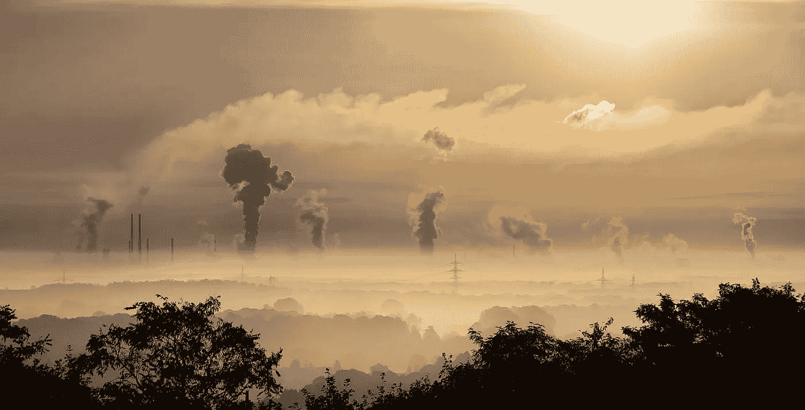
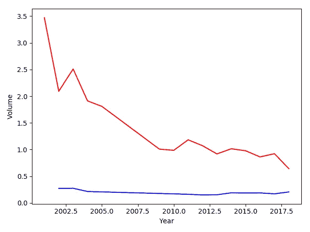
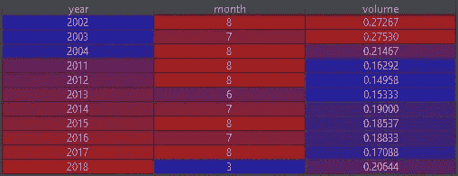
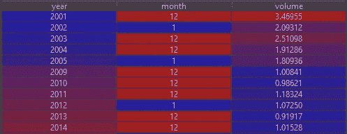

# 数据科学在行动:分析马德里的空气污染

> 原文：<https://towardsdatascience.com/data-science-in-action-analyzing-air-pollution-co-in-madrid-37dc465d78fc?source=collection_archive---------19----------------------->



近年来，马德里某些干旱时期的高污染水平迫使当局采取措施禁止汽车在市中心使用，并被用作提议对该市城市化进行重大改革的理由。感谢[马德里市议会开放数据网站](https://datos.madrid.es/portal/site/egob)，空气质量数据已经上传并公开。有几个数据集，包括从 2001 年到 2018 年登记的污染水平的[每日](https://datos.madrid.es/sites/v/index.jsp?vgnextoid=aecb88a7e2b73410VgnVCM2000000c205a0aRCRD&vgnextchannel=374512b9ace9f310VgnVCM100000171f5a0aRCRD)和[每小时](https://datos.madrid.es/sites/v/index.jsp?vgnextoid=f3c0f7d512273410VgnVCM2000000c205a0aRCRD&vgnextchannel=374512b9ace9f310VgnVCM100000171f5a0aRCRD)的历史数据，以及[用于城市污染和其他颗粒分析的站点列表](https://datos.madrid.es/sites/v/index.jsp?vgnextoid=9e42c176313eb410VgnVCM1000000b205a0aRCRD&vgnextchannel=374512b9ace9f310VgnVCM100000171f5a0aRCRD)。

数据集非常庞大，所以我决定只分析一种污染物——一氧化碳(CO)。从 2001 年到 2018 年，每天 24 个不同站点的数据每小时公布一次，尽管缺少 2002 年、2006 年至 2010 年这种污染物的数据。

为了得到一个大概的情况，我找到了一年中每一天的平均值，基于所有 24 个站点。这个过程在我的笔记本电脑上花了大约一个小时。通过执行这个操作和绘制接收到的数据，我们已经可以得出一些结论。


从上图中我们可以看出，已经采取的措施对城市中的一氧化碳水平产生了积极的影响。这些年来，这种污染物的平均数量急剧下降。

因为我不是一个经常研究空气质量的人，也不理解它的机理，所以我想知道为什么这个图是三角形的。根据图表，我们可以很容易地说，有些月份污染水平较高，有些月份较低。我想知道那些时期。

为了找出这一点，我决定找出每年的最大值和最小值，并将它们放入不同的表中。我也把这些值标在了图上。说真的，没有得到任何有价值的信息，但它有助于解释一个小窍门。所以，当我第一次绘制这些值时，图表看起来是这样的:



你看，因为最大值和最小值之间的巨大差异，我们看不到最小值的趋势——它几乎是一条直线。我们可以通过将“Y”刻度改为对数来改进它。

```
plt.yscale('log')
```


Much better, no?

所以回到我们每年的最小值和最大值。下面你将会看到完整解释一切的表格。(月份是数字，我希望你明白 1 是 1 月，8 是 8 月，不过下一次我将创建一个函数，将这些数字翻译成人类语言:D 语)



Min values



Max values

我真的很惊讶，最大的污染发生在冬季，最小的污染发生在夏季。所以我用我的[解题算法](http://sergilehkyi.com/the-algorithm-to-solve-almost-any-issue-with-your-computer/)来寻找答案。这是我得到的。

*一些污染源，如工业排放，无论什么季节，全年都相当稳定。但是冬天轰鸣的壁炉、柴炉和空转的车辆都会增加颗粒物(构成烟雾的颗粒)和一氧化碳(来自汽车尾气)的含量。*

*除此之外，寒冷的温度和停滞的空气有办法在地面附近创造这些物质的积累，特别是在一种叫做逆温的天气现象期间。在其他季节或天气条件下，暖空气靠近地面，空气很容易上升并带走污染物。在逆温层中，冷空气被一层暖空气限制在地面附近。温暖的空气就像一个盖子，压住这些物质。在逆温期间，烟雾不会上升，一氧化碳会达到不健康的水平。从空气质量的角度来看，风暴是一个受欢迎的天气事件。风、雨和暴风雪有时被称为洗涤器，因为它们有助于清除和分散令人担忧的物质。*

更多详细信息可点击此处— [“为什么冬天空气污染更严重？”](https://airlief.com/air-pollution-during-winter/)这里— [“寒冷天气如何影响空气质量”](http://www.fortair.org/how-cold-weather-affects-air-quality/)

作为一个生活在城市的人，我认为空气污染在夏天更严重，但数据显示完全相反，我无法否认这一点——这就是为什么我热爱数据科学，这就是为什么我热爱我的工作，因为数据从不说谎。是的，作为一个人，你可以在代码中做出不正确的解释或错误，这将扭曲结果，但尽管如此，数据。从来没有。谎言。

希望这篇文章也让一些人大开眼界，如果是的话，请留下评论，你肯定不是一个人🙂

*原载于*[*sergilehkyi.com*](http://sergilehkyi.com/data-science-in-action-analyzing-air-pollution-co-in-madrid)*。*