# 算法交易的数据科学

> 原文：<https://towardsdatascience.com/data-science-in-algorithmic-trading-d21a46d1565d?source=collection_archive---------4----------------------->

在这篇文章中，我计划给你一瞥算法交易的资产模型。这个世界模型应该允许我们根据过去发生的事情来预测将要发生的事情，并通过交易这些信息来赚钱。模型和交易策略只是一个玩具示例，但我提供的是代码中的数据科学部分，这样你就能真正感受到建模工作的真实性。

几个月前我开始为这篇文章写代码，现在我把它和[我们获得了 SEC 的 Investifai](https://adviserinfo.sec.gov/Firm/297838) 许可的消息一起发布！

自从我 2018 年 9 月在 TMLS 的[Investifai.com](http://Investifai.com)演讲以来，我一直在问我们的专有数据是什么，坦率地说，我不是在说话。需要指出的是，仅凭彭博和汤森路透的“标准”市场数据，你就要与整个金融科技世界为敌，后者为访问这些数据付费。因此，新的数据来源让你在做出其他市场参与者可能没有数据的预测时拥有优势。

在这篇文章中，我将向你展示如何识别经济数据，并将其与[可交易](https://www.quora.com/What-is-the-correct-spelling-tradable-or-tradeable)资产匹配。我们将获取数据，清理它，询问它，并在一个简单的模型中设置它。

> “所有的模型都是错误的，但有些是有用的”——乔治·博克斯

我们在这个玩具练习中的资产是**货币对 USD/CAD** 。我们可以从 Open Data Canada [这里](https://open.canada.ca/data/en/dataset/1bc25b1e-0e02-4a5e-afd7-7b96d6728aac)获得该资产从 20 世纪 50 年代开始的每日历史数据。

下面的代码清理这些数据，将其转换成可用的格式。

以下是 fxtop.com 图表中的美元/加元数据:

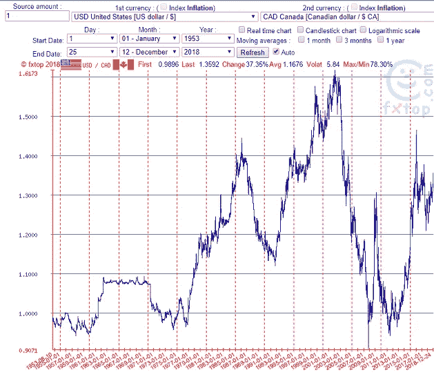

这是我们从加拿大开放数据中心提取的数据:

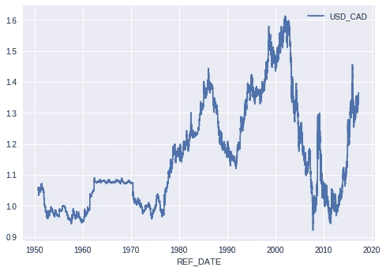

The exchange rate for trading one USD into CAD excluding fees.

两个图表上的数据都在相同的地方下降，再进行一些抽查，我们确信这就是我们所认为的数据。

到目前为止，我们已经看到，为了以一种良好的格式获取数据，需要做一些偷偷摸摸的清理工作。这是数据科学的故事:大部分工作是将数据处理成你观察相关性所需的格式，然后做出预测。

现在，我们继续获取一些数据，我们认为这些数据将有助于我们预测美元/加元资产的走势。该数据也将来自加拿大开放数据公司，以[工业产品价格指数(IPPI)](https://open.canada.ca/data/en/dataset/39a39c7c-24f1-4789-8f20-a04bcbf635b0) 的形式提供，这应该与加拿大货币相对于美国货币的走势有关。如果东西更贵，也许这能告诉我们一些关于经济和货币(相对于美国)的信息。还有很多信息我将跳过[部分，这些数据来自](http://www23.statcan.gc.ca/imdb/p2SV.pl?Function=getSurvey&SDDS=2318)以及如何收集和计算。现在抓紧你的座位。开始了…

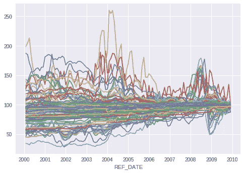

The full dataset (left) looks right. Taking a closer look at one decade (right) also looks reasonable. We see that not all signals start or end at the same points in time.

上面的两个数字是我们对模型的经济数据的初步分析。我们从数据指南中得知，IPPI 指数挂钩“指数，2010=100”，我们可以清楚地看到从 20 世纪 50 年代到 2019 年的长期数据(左)中的挂钩。一切都汇聚在 2010=100，然后从那里向外扩展。

数据中的特定信号也有一些奇怪之处。下图显示了 2008 年至 2016 年名为“纸质办公用品”的 IPPI 因子的归一化图表。大多数信号不存在这个问题，但要记住数据集并不完美，这一点很重要。

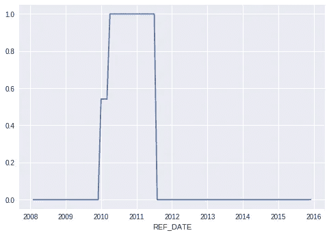

Normalized graph for the IPPI factor called ‘Paper office supplies’ from 2008 to 2016

使用这个数据集有一些严重的限制。首先，它只能按月使用。这对于真正的交易算法来说太慢了。第二，这个指数中的因素都是关于加拿大的，当谈到美元/加元交易时，这是故事的一半或更少。第三，我们没有包括来自新闻或其他数据来源的数据。所有这些都没问题，因为我们只是展示了它在原理上是如何工作的。事实上，有很多方法可以在日常交易中利用月度宏观数据，并将多种类型数据的输入合并到一个模型中。记住这些注意事项，下面是我们如何将 IPPI 数据提取为模型可用的格式:

机器学习模型具有一些输入观察值“x”和一些输出预测值“y ”,其中该模型是建立 y=f(x)关系的函数。模型“f”从观察值映射到预测值。在我们的例子中，“x”是 IPPI 的数据，我们想用它来预测 USD_CAD 的价格变化，这是我们的“y”输出。在我们做出预测之前，我们应该深入研究 IPPI 和美元兑加元之间的相关性，以验证这些东西确实如我们假设的那样相互关联。我们还将看看相关性以外的东西，看看基于 IPPI 数据中的过去值，我们在 USD_CAD 的未来值中看到什么相关性。换句话说，我们将寻找 IPPI 有信号的迹象，我们可以用它来预测 USD_CAD。

让我们首先将经济数据与资产数据结合起来，观察一些很酷的东西。以下所有数据科学的代码都可以在这里找到:

## 从“大画面”看数据:20 世纪 50 年代至今

预处理后，数据集中保留了 931 个因子。让我们先来看看在整个数据期间(20 世纪 50 年代至今)与 USD_CAD 密切相关的因素。

在第一张图表中，我们看到了一系列有趣的相关性。例如，木材和相关的精炼产品如新闻纸、纸浆和纸张与美元的强势相关。有道理。来自加拿大的昂贵纸张导致需求减少，众所周知，加拿大和美国在软木木材定价上有着永无休止的争端。这告诉我们，来自加拿大的廉价木材给 USD_CAD 带来压力。

接下来，让我们看看哪些因素与美元兑加元走软相关。我们可以从下面的图表中看到，石油和天然气行业发挥着重要作用，矿石和采矿行业也是如此。这是有道理的。加拿大生产矿石(如萨德伯里的镍)，也出口石油(如阿尔伯塔省的沥青)，因此有理由认为，它们价格的上涨与加元的下跌相关。

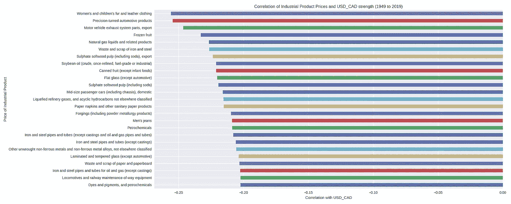

以下是每个 IPPI 系数及其与美元兑加元的相关性的缩小视图:

这些是很好的相关性，但是相关性和交易预测不是一回事。我们需要利用**因果关系**，而不是**相关性**来赚钱。因此，我们需要某种基于[相关性观察](https://www.investopedia.com/ask/answers/030515/how-correlation-used-modern-portfolio-theory.asp)的**预期收益**数据。

下图显示了 IPPI 系数与下个月 USD_CAD 值变化之间的相关性。一个警告是，调查数据可能不可用，甚至一个月后，但让我们假设我们可以获得这种及时的数据访问。

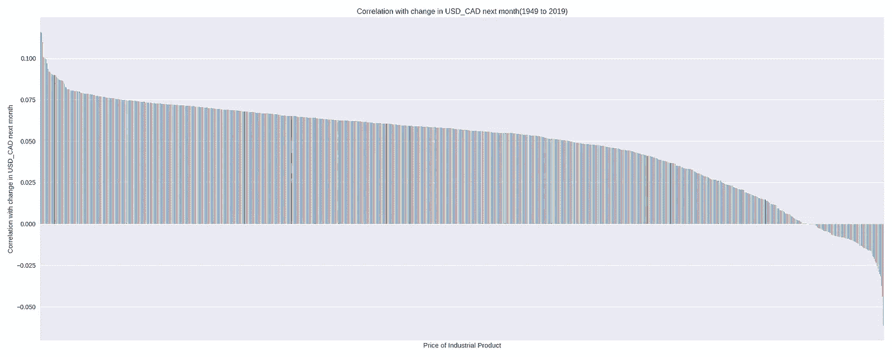

Many factors correlate with future changes in USD_CAD

美元兑加元与工业品价格指数的长期总体关系不同于每十年的关系。这是一个好主意，让我们更深入地研究数据，以帮助我们了解 IPPI 因素和美元 _ 加元走势之间的变化关系。在本文的下一节中，我们将研究 1990 年代、2000 年代和 2010 年代的十年数据。

## 20 世纪 90 年代——美元兑加元的牛市

让我们先来看看 90 年代与美元强势最相关的东西。我们看到一些常见的疑点，如汽车和纸制品(如上所述，价格上涨对 CAD 不利)。有趣的是，IPPI 名列榜首，这表明加拿大工业产品价格普遍较高，意味着美元走强。

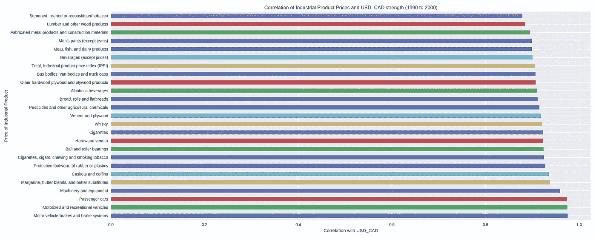

在这段时间里，美元被踢了屁股，所以几乎所有东西的价格上涨都与美国的统治地位相关。这是上世纪 90 年代的价格图表:

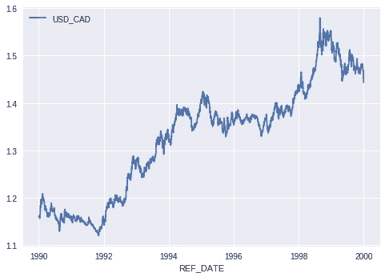

正如我们在下图中看到的，在 20 世纪 90 年代，只有少数 IPPI 因素与 USD_CAD 负相关。木浆是一种奇怪的负相关，因为大多数其他木材相关因素最终都是正相关。

为了保持一致性，我们来看看这个时间段的相关图。

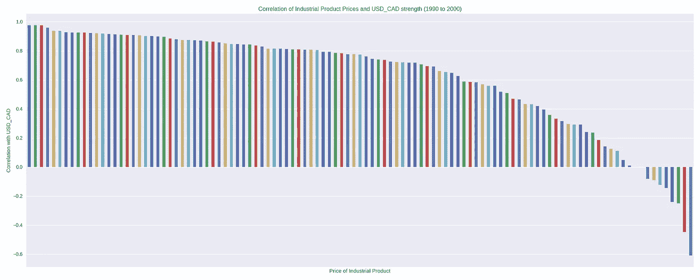

像以前一样，我们更关心交易信号而不是原始相关性，因此下图显示了每个 IPPI 因子如何与从当前月的 USD_CAD 到下个月的 USD_CAD 的变化(汇率的变化)相关联。

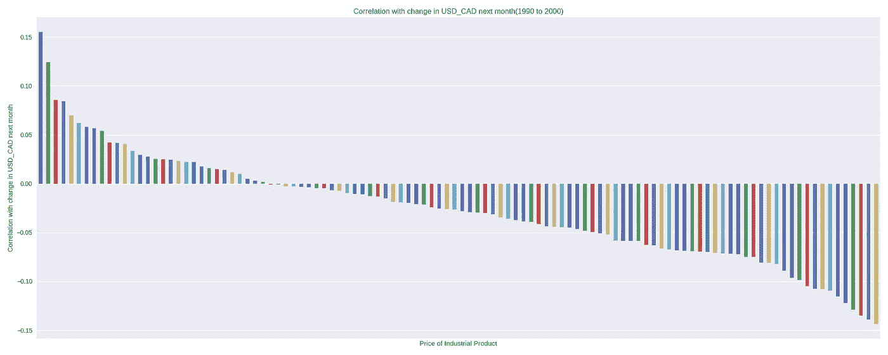

请注意，尽管大多数因素与 USD_CAD 正相关，但与 USD_CAD 变化正相关的因素并不多。此外，请注意，许多在 20 世纪 90 年代没有数据的东西的相关性在结果中被隐藏了。在前面查看所有数据的部分中，任何地方有数据的任何因素都可以关联。既然我们看到的是一个更小的数据子集，我们只能说一些在 20 世纪 90 年代有数据的因素。

下面快速浏览一下数据框的样子，以显示许多因素在数据集中早期是不可用的:

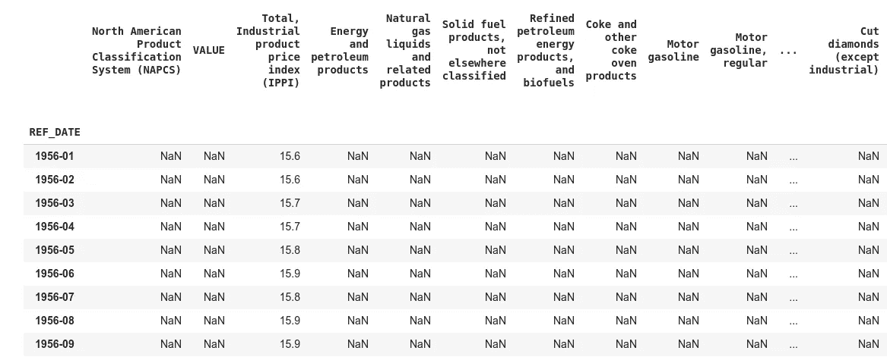

现在让我们继续用 2000 年的镜头来看看支撑我们模型的数据。

## 21 世纪——一个变化的世界

让我们回过头来看看数据中最高的正相关和负相关，就像我们在上世纪 90 年代对整个数据集所做的那样。

在 2000 年，我们继续看到美元兑加元的强势与汽车类股以及木材/纸张类股之间的强相关性。

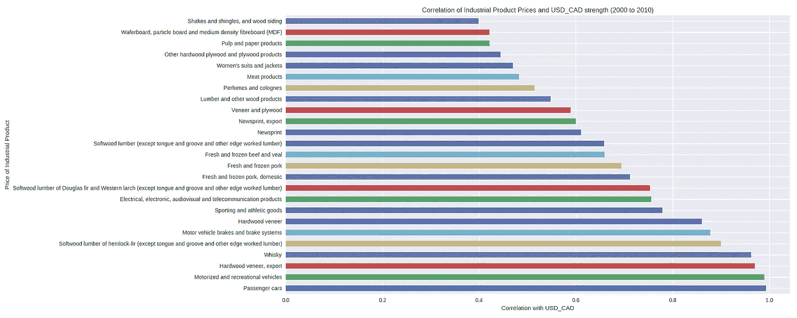

我们从下面的负相关性中看到，金属和石油仍然是美元兑加元疲软的原因之一。

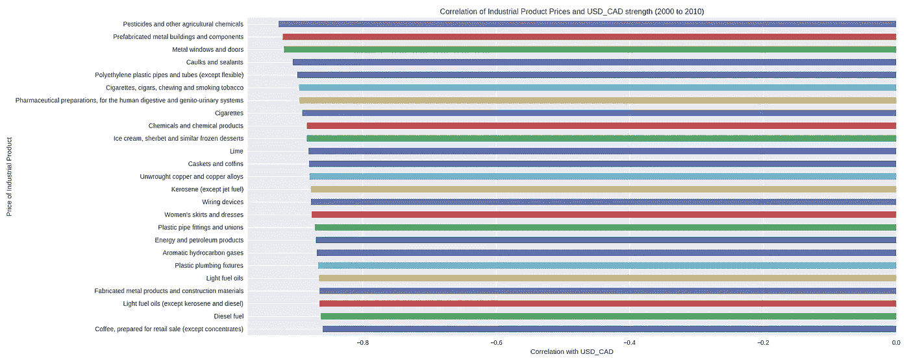

那么是什么改变了呢？从放大的角度来看，这种变化是微妙的，但基本上，20 世纪 90 年代美元兑加元的上涨没有持续。这是 IPPI 因子和美元兑加元之间相关性的放大图，右边是 20 世纪 90 年代，左边是 2000 年代。

我们看到与美元兑加元相关的因素发生了戏剧性的逆转，变成了与美元兑加元负相关的因素。这向我们表明，使用从 20 世纪 50 年代到现在的这些因素作为我们预测模型的训练数据将是一个错误。使用所有的数据会忽略这些因素在现实生活中如何应用的制度变化。然而，我们可以用滑动窗口进行回溯测试，学习新的东西，抛弃旧的东西。这是一种非常常见的测试“远”到过去的策略的策略。

现在，为了保持一致性，让我们看一下显示一个月后各种因素如何与 USD_CAD 变化相关的图表。

这是一个相当平衡的情况，数据中显示了大量的正相关和负相关。对于试图预测这一时期美元兑加元的走势来说，这是一个好迹象。事实上，相关性的方向并不像强度和信号的相互独立性那么重要。最终关键因素是我们赚了多少钱。这里的想法是持有加元和美元，并根据我们的模型预测的时间每月在它们之间切换。

## 2010 年代——有史以来持续时间最长的经济扩张

我很好奇，想看看数据中的高相关性信号是怎么回事。相关性是什么样的？好吧，看看下面图表中的雪地车价格和 USD_CAD。

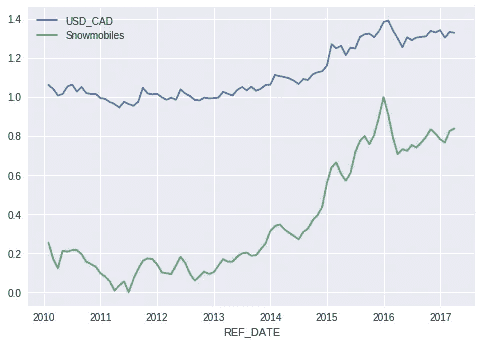

Super high correlation between USD_CAD and snowmobile prices at the factory gate. You can see it just by looking at it.

工厂门口的雪地车价格和美元的强势之间的这种相关性是一个真正的加拿大故事。买雪地车花费越多，加拿大元在美国的能量就越少。有意思。很可能是一些其他潜在的因果因素，如石油和金属价格，创造了这种动态，但看看一些数据来验证它是有意义的仍然是好的。

事实证明，在 2010 年代，一些 IPPI 因素和美元兑加元之间存在非常强的相关性。我们继续看到 SUV 等汽车产品，以及战争产品在美元走强中发挥了重要作用。我认为，2001 年 9 月 11 日的袭击以及由此引发的战争传递了一个潜在的信息，即提升了美元作为避风港和军事强国的地位。我认为这将延续到 2010 年。这些相关性将木材故事挤出了搜索结果的前列。尽管争议仍未解决，但加拿大的许多纸浆和造纸厂在 2010 年代干脆关闭了。

我们在下图中看到，石油和相关产品以及金属继续成为 USD_CAD 负相关的一部分。

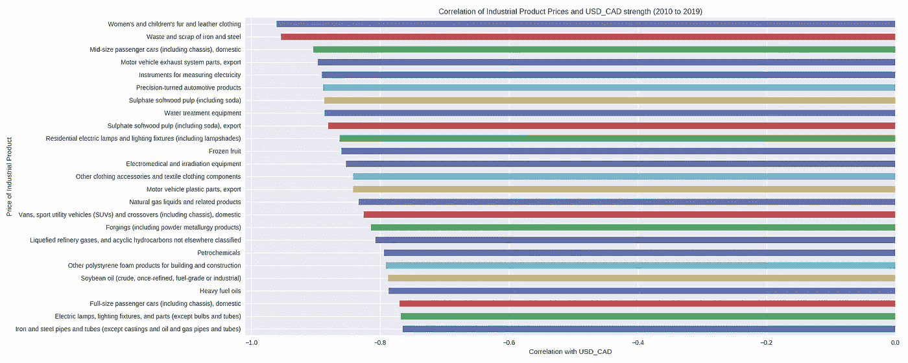

在 2010 年代，数据集中有更多可用的因素。下图显示了 USD_CAD 相关性在这些因素中的分布。

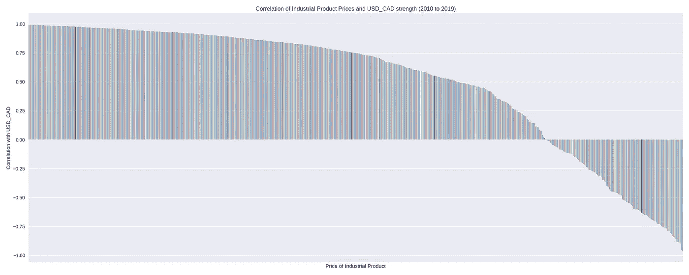

现在让我们来看看如何使用这些因素来进行预测。

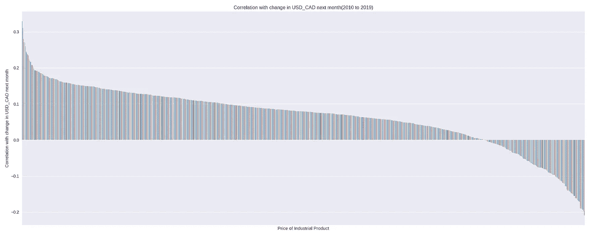

与 20 世纪 90 年代不同，相关性和预测分布之间似乎存在对应关系。请记住，这些图表中的因素顺序并不相同，因此这些数据并不能告诉我们与 USD_CAD 相关的因素是否也预测 USD_CAD 的变化。

## 快速总结，然后开始模型生成

我们看到，总体数据集在这十年中包含的内容比过去几十年多，而几十年前的数据可能与今天的我们无关。在一些关键的时间点上，数据中潜在的故事发生了变化，我们无法使用之前的数据来预测之后的时期。

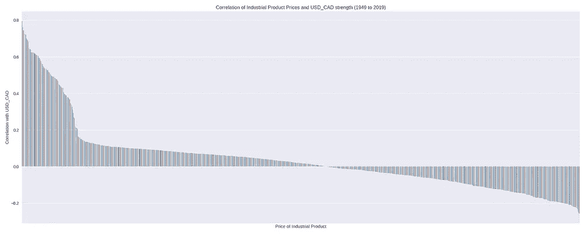

Correlations between the economic data and asset data vary depending on the time period observed and the signals available during the time period in question. The bottom left is for the 1990s. The top left is for the 2010s. The top right is for the 1990s. The bottom right is for the full dataset.

我们还看到，就我们对世界的预期而言，这些数据是合理的。基于这些数据的模型应该是相对可解释的。例如，如果几个因素指向美元兑加元的上涨，我们应该能够看到这些因素是什么，并验证这种多头或空头头寸是有意义的。

在这一点上，我想回到我关于 [**的文章，很多事情你在建立交易策略时不应该做**](/silly-stock-trading-on-onepanel-io-gpus-51cde1772bd1) 。在我们继续构建模型时，请记住这一点。这是一个*玩具示例*，现在你已经有了如何复制这项工作背后的数据科学的代码，包括数据集。我鼓励你尝试一下，看看你能想出什么。

# 预测算法交易模型

为了制作我们的预测模型，我们需要设置我们上面讨论过的[张量](https://www.tensorflow.org/guide/tensors)“x”和“y”。输入“x”将是 IPPI 数据的进一步清理版本，我们的“y”将是两个类别之一:长型和短型。更有趣的事情，比如决定 USD_CAD 中多少预测的变化证明一个行为是合理的阈值，超出了这个玩具示例的范围。我选择了一个形状像自动编码器的前馈深度学习模型(DNN)，在输入端添加了一些噪声，以帮助避免过拟合。

为了做出预测，我们回顾了过去 3 个月的 IPPI 指标。

所以:

为了进行预测，我们仅使用与 USD_CAD 的预期回报至少有 10%相关性的指标。这减少了“x”中的维数。此外，在测试期间，我们使用来自训练运行的经过训练的缩放器，因为我们事先不知道如何缩放还没有发生的东西。让我们将费用设定为每笔交易 0.20 个基点(IB 中列出的[)。每个模型运行都是模型的一个全新的训练和测试实例(从头开始)。](https://www.interactivebrokers.com/en/index.php?f=1590&p=fx)

让我们根据 2000 年到 2012 年初的数据进行训练，然后从 2012 年到 2017 年 Q1 奥运会结束时进行回溯测试。这是 12 年的月度训练数据，即 12*12=144 个训练数据点。事实上，在切掉一个 NaN 后，我们得到 143 个训练样本，每个样本有 39 个数据点。当缺乏数据样本时，我喜欢把它们想象成一组方程组，我们正在寻找一个近似的解决方案。这不会是完美的，但当我们看到这种模式为我们赚钱时，我们就会知道它是否有效。

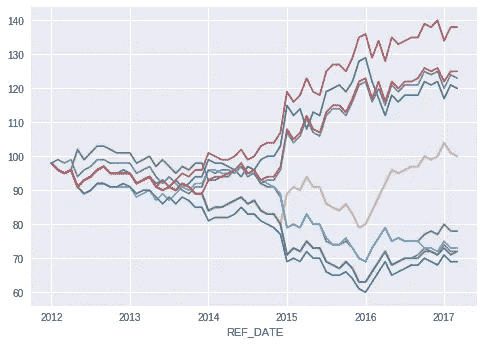

**Before Tuning:** Model performance for 10 simulation runs before tuning the network and massaging the training data. The results are pretty random.

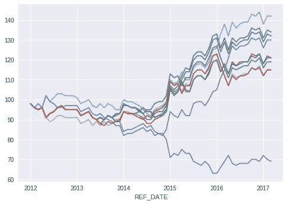

**After some effort, but before fees:** Model performance for 10 simulation runs. These simulations did not include fees. The results look promising.

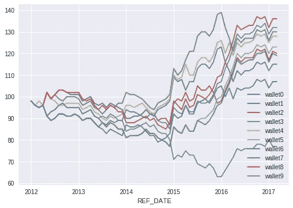

**A trading algorithm is born:** These are the results with fees included. We make a bit less money, but have a bit more consistent performance. Fees are only paid when we buy in or change position. All 9 of 10 simulations eventually ended in profit.

在我停止浪费时间的时候(见上文)，模型已经在运行之间建立了一致性。然而，在模拟的前 3 年，所有的模型都亏损了。这是一个问题，我打算让它保持原样，因为这是一个玩具问题。在 2012 年 1 月 1 日至 2017 年 3 月 1 日期间，模拟的平均最终值为 118.7。这相当于 5.25 年的交易。因此，年化回报率为 3.32%。不是很好，但不是 0 或负的。我不打算讨论我们如何利用杠杆来增加回报，或者对风险调整后的回报进行分析。训练准确率始终在 80%的范围内，而测试准确率大多在 50%以上，如下表所示。

我们可以看到，训练精度并不是上一个模型(#9)不是好模型的好暗示。在这里，最大化利润的最聪明的方法是将模型堆叠在一起，并平均这种类型的误差。想象一下，将 10 美元放到 10 个模型的手中，而不是将 100 美元放到一个模型实例的手中。

整个模拟周期持续时间较长会产生以下结果:

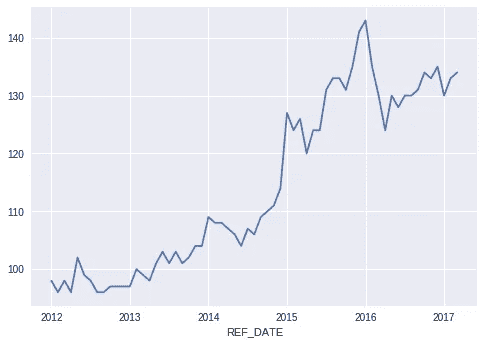

Buy and hold USD_CAD for the duration of the testing period.

叠加这些主动和被动策略，我们得到了下面的图表。

我们看到持有美元兑加元会很好。不幸的是，如果没有某个模型告诉我们该怎么做，我们无法提前知道买入并持有 USD_CAD 是否有利可图。与股票市场不同，真正的长期策略是买入并持有，货币对不遵循这一逻辑。相反，法定货币对随着相关经济体和政府的兴衰而变化。

**什么因素导致了预测？(** [**展示使用精美工具**](/interpretability-of-deep-learning-models-9f52e54d72ab) **)**

我们有一个赚钱的模型，这很酷，但如果能更好地了解它的作用，那就更好了。我用 DeepSHAP 得到了那张照片。首先，我使用来自 x_train 的 75 个样本设置了一个先验(背景)期望。x_train 的其余部分用于获取下一步中使用的 SHAP 值。下图显示了使用上一步中获得的 SHAP 值的 x_test 数据的汇总图。

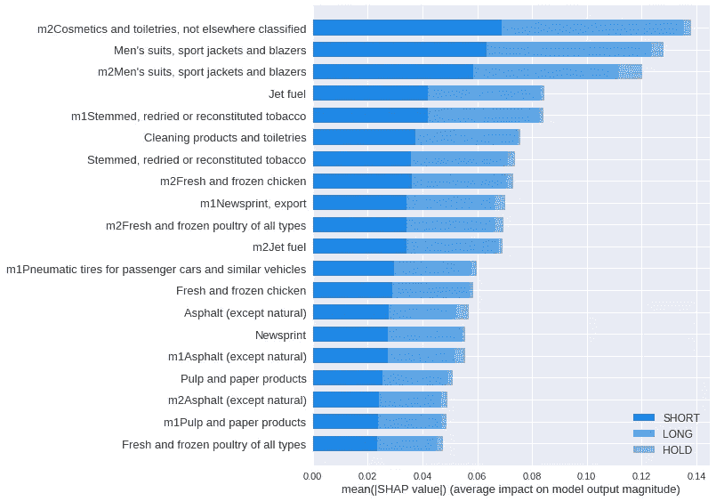

The relative contribution of each of the factors in our little model. Each factor is preceded by an m1 if it is from the month before the prediction, or m2 if it is from 2 months before the prediction.

我们马上就能看到这个模型并没有像我们想象的那样运行。它最关心的是男士西装(纺织品)、家禽、清洁用品、烟草和化妆品。这些都是我们在上述分析中没有考虑太多的因素。还好我们看了。现在，后退一步，我们看到沥青和喷气燃料等油基物质在这里，这是一个好迹象，表明我们并没有完全出局。我们也看到了与纸相关的东西，比如新闻纸，这是一个好迹象，表明我们期望看到的东西还在那里。从这个分析中我们了解到，你认为重要的东西可能最终并不是最重要的因素。在这种情况下，结果是我们考虑的东西在列表中，但对预测的影响小于模型中的其他因素。

最后，本文中介绍的方法还有一些限制值得一提。使用数据仓库比这种手工方法更好，使用回溯测试框架也更好。我尽量让这篇文章保持独立，不引用任何专有代码。

# 从这里去哪里？

[Investifai.com](http://Investifai.com)终于有了 SEC，所以我们现在可以接管资产了！当我们对用户界面和 KYC 流程进行最后的润色时，迪拜的办公室一片繁忙。如果你是一个合格的投资者，并希望投资于初始基金，请联系 hello@investifai.com

**在加拿大，我们的内部审计产品 [AuditMap.ai](http://auditmap.ai) 随着客户的加入而不断成熟。这里有更多关于那东西的信息。**

**如果你喜欢这篇关于算法交易模型开发中的数据科学的文章，那么看看我过去最常阅读的一些文章，比如“[如何为人工智能项目定价](https://medium.com/towards-data-science/how-to-price-an-ai-project-f7270cb630a4)”和“[如何雇用人工智能顾问](https://medium.com/towards-data-science/why-hire-an-ai-consultant-50e155e17b39)”**

**下次见！**

**丹尼尔**