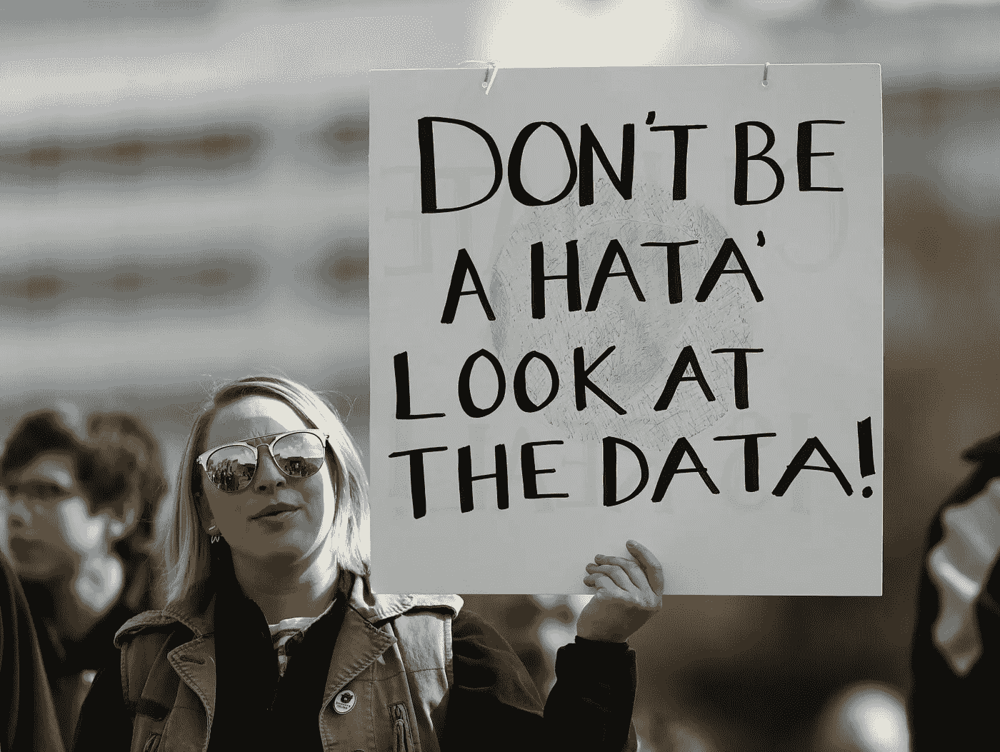

# 特朗普时代的数据科学

> 原文：<https://towardsdatascience.com/data-science-in-the-age-of-trump-a6c91abbf829?source=collection_archive---------6----------------------->

Marching for Science. And Data | AP Photo | April 2017

唐纳德·特朗普(Donald Trump)不是一个技术人员(他不信任个人电脑，也很少使用电子邮件)，但他对数字的热爱是出了名的:评级、推文、人群规模。在过去的一年中，我们多次见证了他如何熟练地寻找统计数据来支持他的政策建议，甚至更擅长于寻找统计数据来钻对手立场的空子。有人知道数据的价值，并且不怕使用它。

当我们的生活充斥着各种类型的数据时，当我们所做的一切——从我们的经济吞吐量到我们看的电影，再到我们约会的人——都被衡量、消化、分析和重新激活，以使我们成为更有效率的社会成员时，我们的总统是最终的现代人。像今天大多数年轻人一样，他不知道计算机如何工作，也不知道一个芯片上能装多少个晶体管，但他不在乎。他的注意力集中在手掌中的设备和电视屏幕上的新闻上。作为我们这个时代的产物，他是一个数据消费者，一个数据生产者——一个数据信徒。

**这对数据科学来说是个好兆头，是吗？**

一方面，特朗普的迅速崛起在很大程度上归功于数据科学。当他的竞选活动开始使用来自剑桥分析公司的数据和算法时，他在总统竞选中获得了提升，这已经得到了很好的记录。在去年年底发表在 Das Magazin 上的一篇文章[(并且](https://www.dasmagazin.ch/2016/12/03/ich-habe-nur-gezeigt-dass-es-die-bombe-gibt/)[在主板](https://motherboard.vice.com/en_us/article/mg9vvn/how-our-likes-helped-trump-win)上以英文再版)中，作者汉尼斯·格拉斯格和米凯尔·克罗格鲁斯对所发生的事情提供了可能是最好的解释。至少，是最多彩的之一。这是一个关于疯狂的学术研究、心理测试和高风险现实生活实验的迷人故事。我们可以从整体上讨论这种提升的规模，但有一点是明确的:在竞选的最后几天，随着佛罗里达州、宾夕法尼亚州或威斯康星州等州出现最后一刻的犹豫不决和极其微弱的竞争，**数据科学是唐纳德·特朗普最好的朋友。**

另一方面，科学研究在白宫 2018 财年的拟议预算中受到了重大打击:国家卫生研究院削减了 22%，能源部削减了 17%，海洋和大气研究办公室削减了 22%，等等。当然，气候研究是政府的目标，但基础能源科学、纳米科学、核物理、生物医学研究、碳排放监测等也是。就连人口普查局也感受到了压力，开始担心自己没有资源来完成 2020 年的人口普查。美国科学促进会(AAAS)估计，根据特朗普的预算，总研究经费将下降 16.8%，这将“摧毁美国的科技企业”。国会山的乐观主义者指望国会从现在到 10 月控制损失，但是毫无疑问，其中一些削减会持续下去。

**那么，当一位总统热爱数据而讨厌科学时，数据科学会发生什么？**

回答这个问题还为时过早，但提出这个问题也不算太早。我们已经有了一些答案，特朗普的竞选活动在去年年底撼动了民调行业。投票既是一门艺术，也是一门科学，尤其是在政治领域。景观不断演变，样本量小，投票率难以预测。世界顶级民调机构已经花了几十年时间研究选民——他们的心理、信念、不安全感，是什么让他们过早地支持某个候选人，在最后一刻改变忠诚，或者决定完全跳过投票站。他们知道如何提问，如何理解没有回应。拥有比历史上任何一次选举都多的数据，以及更复杂的方法来理解这些数据，他们以惊人的方式集体错过了目标。发生了什么事？

美国公众意见研究协会(AAPOR)刚刚发布了一份经过充分研究的事后分析。他们能够证实 2016 年全国民调的表现正如人们可能预期的那样好(克林顿预计将赢得 3%的全国选票，最终以 2.1%的优势获胜)，但另一方面，一些州级民调很难跟上竞选活动最后一刻的变化，在许多情况下遭受了不完整的统计调整(特别是未能纠正受访者中大学毕业生的过度代表性，而这一群体更倾向于投票给克林顿)。该报告还批评了综合预测模型——那些无处不在的“克林顿有 90%的胜算”估计，在最后几天占据了所有的头条——因为它们传达了不必要的确定性，可能会让选民离开。

总而言之，这一分析是对 2016 年该行业缺点的坦率回顾，但它没有带来悲观和厄运，而是为民调的未来奠定了强大的基础。它基于从美国广播公司新闻到密歇根州立大学的 23 家民调机构的数据，以及来自皮尤研究中心、范德比尔特大学、YouGov 和全国其他顶级智库的分析师的交叉询问。在一个拥挤的领域，相互竞争的组织基本上走到一起，找出他们是如何出错的，并确保下次不会出现系统性的问题。这是一个显著的发展。

我没有天真到相信现在每个人都是内特·西尔弗最好的朋友，但民调机构受到了打击，这种打击迫使他们认真检查自己的手艺，因此这个领域越来越强大。提高标准符合每个人的最佳利益。**这意味着收集更好的数据，开发更好的方法。**

当然，投票并不完全是数据科学。连大数据都算不上。但是，在这一职业中发生的事情是整个科学领域正在发生的事情的症状:人们意识到，科学的优势和相关性已经被认为是理所当然的，是时候走上街头，旋转离心机，重写教科书了。

说唐纳德·特朗普正在帮助振兴数据科学领域有点不现实，特别是在像环境保护署(EPA)这样的政府机构正在取消科学顾问的时候，但你知道:在一个崇拜数据但对数据持怀疑态度的社会的压力下，以及一个在对自己不利时迅速怀疑数据的人的压力下，数据科学家必须提高他们的游戏水平。科学没有数据不行，数据没有科学也不行。就这么简单，但也这么复杂。

**川普时代的数据科学将是一场狂野之旅。**

*感谢阅读，它意味着世界！请查看美洲杯上的* [*人与机器*](https://medium.com/towards-data-science/man-vs-machine-at-the-americas-cup-fca9513d5e88) *，了解在完全不同的背景下使用数据科学的观点！*