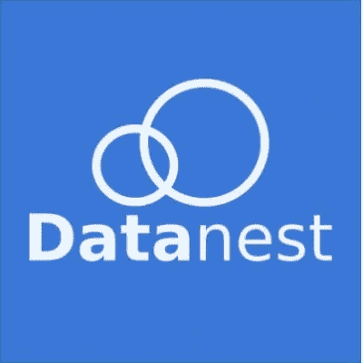
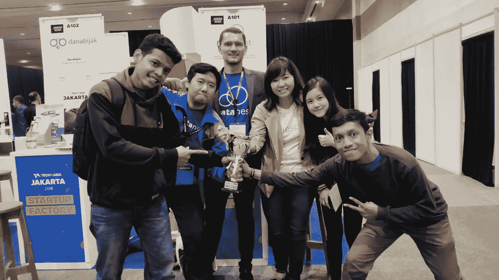
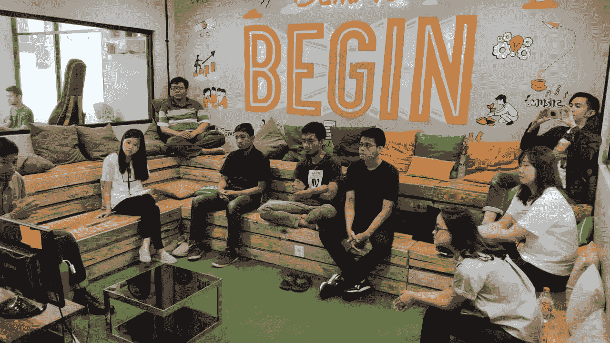
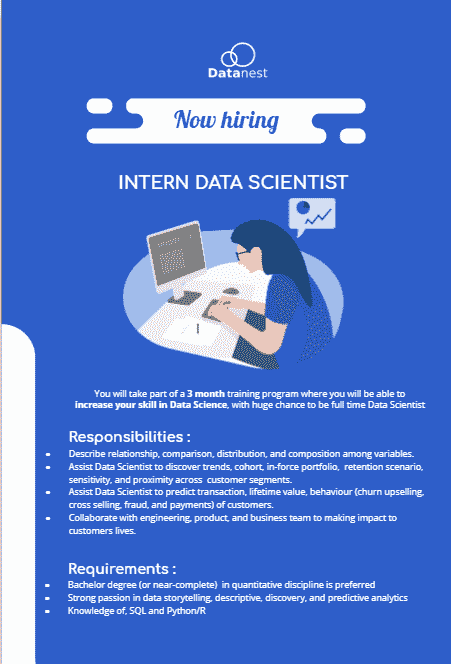

# Datanest 的数据科学实习计划

> 原文：<https://towardsdatascience.com/data-science-internship-program-at-datanest-7826cc6a0ce5?source=collection_archive---------19----------------------->

*Datanest Logo*

在过去的 3 个月里，我一直在印度尼西亚的一家初创公司 [Datanest](http://datanest.io) 做数据科学家实习生。简而言之，Datanest 是一家提供数据科学服务的初创公司。该公司为企业提供完整的端到端解决方案，利用人工智能和机器学习算法来利用他们的数据。由于我知道机器学习和人工智能正在获得他们当之无愧的关注，我希望分享我的实习经历-我觉得这非常有益-希望它可以帮助你们塑造自己作为数据科学家的职业生涯。

我将文章分为三个部分:

1.  选拔过程
2.  实习经历
3.  如何应聘【他们在招人！]

*我已经总结了每一部分中每一点的所有详细解释，所以如果你是那种不喜欢阅读整篇文章的人，只要阅读我放在每一部分标题下面的要点就可以了。*

# *选拔过程*

在选择过程中，你必须做 4 件事:

1.  将你的简历发送到相应的邮箱
2.  在线访谈
3.  判例案件
4.  **案例展示*

下面将提供详细的解释。

# *在线面试*

在我寄出简历的第二天，Datanest 打电话给我，我们安排了一次在线面试。在线采访期间，首席执行官 Pak Manggala 和前数据科学家 Kak Aji 向我提问。面试用英语和印尼语进行(但大部分是英语)。这些问题围绕着我的背景，我为什么想进入数据科学，以及我对数据科学本身的了解。这不是一个紧张的问题，所以不要害怕，但我建议你可以准备一下，特别是如果你不习惯用英语说话(你也必须想给你的雇主留下最好的印象，对吗？) ).

# *测试用例*

就像我听说过的任何数据科学实习项目一样，Datanest 也要求其申请人做一个测试案例。在线面试结束后，我收到了一组数据及其字典——解释了每个变量——并被要求从数据中提出见解(以及图表和故事)，并以 powerpoint 形式提交。我有大约两周的时间来完成测试(因为有 lebaran 假期)。谈到数据集，它大约有 15，000 行，并且没有经过**清理**，所以请注意异常值、重复值、缺失值和没有意义的值。仅供参考，我之前没有任何关于数据挖掘的知识，所以我当时根本不知道如何处理这些数据。我使用了数据透视表(感谢 Awe、Ko Efram 和 Tepen ),还使用 Excel 制作了图表。如果你能使用 Tableau，我会推荐你使用它，因为它提供了更好的可视化，但如果你不能，就考虑使用谷歌电子表格或 Excel 来代替。关于见解，我建议你有不明白的地方可以发邮件问 Datanest。我意识到产生见解可能不是每个人都喜欢的，但不要害怕失败，只要有创造力，尽可能多地探索数据(因为这正是我所做的)。

测试用例截止日期后大约两周，结果出来了。

**在我的选择过程中没有案例演示，但将来可能会添加。*

# *实习经历*

有 5 个要点让我觉得这可能是我参加过的最好的实习项目:

1.  我能够在仅仅 3 个月的时间里学到很多东西；不仅是数据科学，还有商业智能技能。
2.  我也能够向其他部门学习(例如:后端、前端等。).从我的角度来看，对于非计算机专业出身的学生来说，了解这个行业中使用的术语及其工作原理是非常重要的。
3.  我有机会做任务，并由 CBO 直接监督。这是一个难得的机会，我从商业角度学到了很多东西。
4.  每月有两次名为 Datanest Talks 的聚会，其主要目的是交流技能以及发展员工技能。
5.  工作环境很棒。所有的员工都非常能干和随和。你甚至可以向董事会(首席执行官和 CBO)寻求建议，这不仅限于工作方面；例如:我得到了许多关于我主人计划的建议。

***附加信息:我获得了免费参加 2018 年亚洲科技展的机会！我必须告诉你，那感觉很奇妙:)T7*

*First Runner Up of Tech in Asia 2018 ARENA Pitch Battle, congrats!*

事不宜迟，下面我来阐述一下我的经历。

# *数据科学课程*

在第一周，我从 Kak Aji 那里学习了 SQL 和 Excel VBA。那时我基本上没有 SQL 和 VBA 的经验，所以我发现这些对提高我的技能很有帮助。如果你像我一样有数学背景，你会非常熟悉 VBA，因为它和 Matlab 非常相似。接着，我和另一名实习生 Kak Rahmat 也帮助做了一些关于数据探索和见解的 Datanest 项目。我们还学习了购物篮分析(MBA)以及如何使用 Excel VBA 制作简单的购物篮分析。在那之后不久，我们被教授了 Python、机器学习和深度学习概念。在我看来，学习 Python 可能需要相当长的时间，所以我建议你通过在线课程来练习，如 [Udacity](http://udacity.com) 、 [Datacamp](http://datacamp.com) 、e [dX](http://edx.org) 等。对于深度学习部分，我们尝试使用 Keras 制作多层感知器(MLP)和卷积神经网络(CNN)。此外，我和 Kak Rahmat 还有机会通过 [Udacity 免费课程](https://www.udacity.com/course/ab-testing--ud257)学习 A/B 测试的概念。我的一些 Python 代码和 A/B 测试概念的文档可以在这里[找到](http://github.com/monicastephanie97)(请注意，它们都是印度尼西亚语言)。

# *商业智能课程*

关于 BI(商业智能)部分，我们也有机会尝试许多 BI 工具，如 Metabase、Redash、Google Data Studio、Holistics 和 Tableau。CBO thi baud 指导我们创建由数据中的相关信息组成的仪表板。“相关”这个词在这里相当模糊，尤其是如果你缺乏商业经验的话。我个人认为，培养你的商业意识是一个边做边学的过程。学习它的最好方法是直接处理真实数据，幸运的是，我通过这个实习项目得到了这些数据。但是，请记住，您还必须向业务领域的专家请教，以更好地了解客户希望在仪表板中看到什么。

# *数据巢会谈*

Datanest Talks 是一个 30 分钟的演示和问答节目，每月举行两次。作为一名数据科学家实习生，我真的觉得与其他人交流技能很重要。例如，我参加了我们的项目经理 Kak Bagus 的“Scrum 简介”演示，主要讲授如何管理项目，如何管理人员，以及如何进行良好的沟通。我觉得交流技能对每个人来说都是必不可少的，因为不可否认的是，有时技术人员在交流方面有困难，而非技术人员在理解技术部分方面有困难。因此，Datanest 讲座将是向最优秀者学习的绝佳机会！

Datanest Talks

# *工作环境*

我之前提过，这里的工作环境超级棒。令人欣慰的是，Datanest 的所有人都非常善良，愿意教其他人。我确实意识到的一件事是:如果你在一家大公司工作，你不能轻易让不同部门的其他人来教你，更别说 CBO 或首席执行官了。这就是为什么我认为你可以在 Datanest 获得这个机会是一个巨大的优势，因为他们每个人都是专家，很容易交谈。更不用说，当你和董事会说话时，你甚至感觉不到任何障碍。

# *如何申请*

投简历到 jobs@datanest.io，主题“实习数据科学家”。

*如果你没有 SQL 的先验知识，建议你从* [*Udacity 免费课程*](https://www.udacity.com/course/sql-for-data-analysis--ud198) *中学习。*

最后，我非常感谢 Pak Sapto 推荐我加入 Datanest，感谢 Thibaud、Pak Manggala、Ci Vina、Kak Aji、Kak Fajara、Mas Nabih、Kak Rahmat 以及 Datanest 的其他人(抱歉没有一一提及)，感谢你们的好意和在我实习期间愿意教我很多东西。我自豪地说:

> 每天花 3-4 个小时从我家到办公室，反之亦然，绝对值得！:D