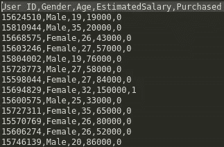
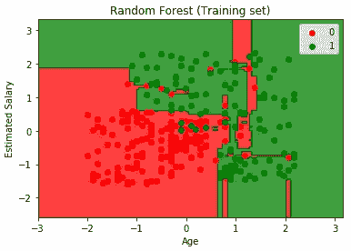
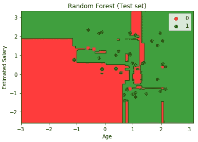

# 数据科学正在颠覆我们看待数据的方式

> 原文：<https://towardsdatascience.com/data-science-is-disrupting-the-way-we-look-at-data-223dd1f0122e?source=collection_archive---------10----------------------->

## 以及如何制作自己的机器学习分类器来分析数据

哪种动物有长长的尾巴、尖尖的耳朵和胡须，是常见的家庭宠物？


Photo by [MIKHAIL VASILYEV](https://unsplash.com/@miklevasilyev?utm_source=medium&utm_medium=referral) on [Unsplash](https://unsplash.com?utm_source=medium&utm_medium=referral)

如果你猜是一只猫，你就猜对了！

现在假设你是一名汽车销售员，销售一辆零售价约为 40，000 美元的货车。一个 22 岁年薪 5 万美元的男人会买你的车吗？

这个场景有太多的变数，让任何人都很难回答！然而，这在数据科学中是可能的。

# 什么是数据科学，它能提供什么帮助？

数据科学是一个新兴领域，数据科学家使用算法从海量数据中提取洞察力。

当我让你辨认猫的时候，应该不会太难，因为你一生中见过很多猫。你可以利用你对猫的特征的先验知识来识别这种动物。类似地，如果你有很多数据(性别、年龄、薪水等等)。)对于已经购买和尚未购买你的汽车的人，你应该能够预测是否有人会购买你的汽车。

这可能仍然是一个很难完成的任务。一个人如何浏览所有这些数据，解读这些数据，并得出结论？这就是机器学习发挥作用的时候了。一个[机器学习分类器](https://en.wikipedia.org/wiki/Statistical_classification)可以通过将他们的信息与成百上千其他可能或可能没有购买汽车的人的信息进行比较，来预测某人是否会购买你的汽车。

现在这听起来可能很复杂，但是如果你想进一步理解它或者你想制作你自己的分类器，我将分解这是如何完成的！

# 如何制作机器学习分类器(Python)

## GitHub 资源库:

[https://github . com/ve dant-Gupta 523/randomforestclassification](https://github.com/Vedant-Gupta523/randomforestclassification)

## 导入库和数据集

为了开始解决这个问题，我们从导入我们从消费者那里收集的信息开始:

```
# Importing the libraries
import numpy as np
import matplotlib.pyplot as plt
import pandas as pd# Importing the dataset
dataset = pd.read_csv('Customer_Information.csv')
X = dataset.iloc[:, [2, 3]].values
y = dataset.iloc[:, 4].values
```



Left: Importing Libraries and Dataset, Right: Customer_Information.csv

我们导入了 3 个库，这将有助于我们的 ML 模型。我们还导入了数据集“Customer_Information.csv”。这个集合包含了 400 个人的信息，他们的性别，年龄，年薪，以及他们是否买了这辆车。

x 和 y 分别代表自变量和因变量。因变量(y)是我们试图弄清楚的，并受自变量(X)的影响。在我们的案例中，因变量是客户是否购买了汽车。自变量是年龄和估计工资。" dataset.iloc[]。values”是从数据集中选择我们想要的行和列。对于因变量，我们选择了第 5 列中的所有内容(ID: 4)。对于自变量，我们从第 3 列和第 4 列(IDs 2 和 3)获取所有数据。

## 将数据集分成训练集和测试集

在学校，老师给我们布置家庭作业，从中我们学习各种概念。过了一段时间，我们会接受一次测试，看看我们是否能运用从作业中学到的知识来解决相似但不同的问题。当我们训练我们的机器学习分类器来确定谁会购买我们的汽车时，我们遵循类似的过程。我们将数据集分成两个不同的集合，一个训练集和一个测试集。该模型使用训练集来查找因变量和自变量之间的相关性。然后，我们给它测试集(没有因变量),它使用它学到的知识对因变量进行预测。之后，我们可以比较结果，看看我们的模型有多精确。

```
# Splitting the dataset into the Training set and Test set
from sklearn.cross_validation import train_test_split
X_train, X_test, y_train, y_test = train_test_split(X, y, test_size = 0.25, random_state = 0)
```

在上面的代码片段中，我们使用 sklearn.cross_validation 库中的 train_test_split 模块来划分数据集。我们的数据集存储在 4 个变量中:X_train(训练自变量)、y_train(训练因变量)、X_test(测试自变量)和 y_test(测试自变量的实际答案)。我们的完整数据集的 25%被放入我们的测试集(test_size = 0.25)。

## 特征缩放

创建机器学习模型时，并不总是需要进行特征缩放，但在这种情况下却是如此。如果我们把我们的数字变量(如年龄，工资等。)在我们的分类器算法中，我们的结果会变得有偏差。尽管年龄和薪水代表了两种完全不同的东西，但该算法显然会将它们视为数字。当它将值 22(年龄)和 50，000(薪水)输入到公式中时，它不会考虑不同的权重。可以把它想象成在不转换单位的情况下比较毫米和千米。

特征缩放的目的是获取每个数值，并将其放在相同的比例上。这样，算法可以公平地使用这些值。

```
# Feature Scaling
from sklearn.preprocessing import StandardScaler
sc = StandardScaler()
X_train = sc.fit_transform(X_train)
X_test = sc.transform(X_test)
```

为了做到这一点，我们使用 sklearn.preprocessing 库中的 StandardScaler 模块来缩放我们所有的独立变量。

## 使分类器适合我们的训练集并进行预测

终于到了开始训练我们的算法和预测我们的训练集结果的时候了！

```
# Fitting Random Forest to the Training set
from sklearn.ensemble import RandomForestClassifier
classifier = RandomForestClassifier(n_estimators = 10, criterion = "entropy", random_state = 0)
classifier.fit(X_train, y_train)# Predicting the Test set results
y_pred = classifier.predict(X_test)
```

虽然有许多不同的分类器可用，但对于这个问题，我选择了[随机森林分类器](https://blog.citizennet.com/blog/2012/11/10/random-forests-ensembles-and-performance-metrics)。我首先从 sklearn 库中导入 RandomForestClassifier 模块。我继续使它适应(训练)我们的训练集。

在代码片段的第二部分，我创建了一个新变量 y_pred。y_pred 是分类器对测试集(X_test)所做的预测。

## 评估我们的结果

要知道没有一个机器学习模型是 100%准确的。如果你的模型显示有完美的准确性，这可能是由于过度拟合。过度拟合意味着您的模型严格遵循它在训练集中找到的精确规则。例如，如果您试图预测一个年薪 35，000 美元的 40 岁男子是否购买了一辆汽车，而分类器没有在这个确切的数据点上进行训练，它可能会默认为他们没有购买，即使这可能不准确。

检查有多少预测是正确/错误的快速方法是使用混淆矩阵:


Confusion Matrix outline

```
# Making the Confusion Matrix
from sklearn.metrics import confusion_matrix
cm = confusion_matrix(y_test, y_pred)
```

迷茫？不要！混淆矩阵的结果分为四个部分，如第一幅图所示。左上角的数字将代表我们预测有人会买车的次数，而他们确实买了。右上角的数字将代表我们预测有人会买车，但没有买车的次数。对于底部的 2 个数字，情况正好相反。需要注意的重要一点是，左上和右下的总和代表我们答对了多少题！

让我们来看看这个问题的可能混淆矩阵:


Confusion Matrix

我们的混淆矩阵告诉我们，100 个测试预测中有 92 个是正确的(63 + 29)。

## 可视化结果

最后一步是在图上可视化我们的分类器的结果！

```
# Visualising the Training set results
from matplotlib.colors import ListedColormap
X_set, y_set = X_train, y_train
X1, X2 = np.meshgrid(np.arange(start = X_set[:, 0].min() - 1, stop = X_set[:, 0].max() + 1, step = 0.01),
                     np.arange(start = X_set[:, 1].min() - 1, stop = X_set[:, 1].max() + 1, step = 0.01))
plt.contourf(X1, X2, classifier.predict(np.array([X1.ravel(), X2.ravel()]).T).reshape(X1.shape),
             alpha = 0.75, cmap = ListedColormap(('red', 'green')))
plt.xlim(X1.min(), X1.max())
plt.ylim(X2.min(), X2.max())
for i, j in enumerate(np.unique(y_set)):
    plt.scatter(X_set[y_set == j, 0], X_set[y_set == j, 1],
                c = ListedColormap(('red', 'green'))(i), label = j)
plt.title('Random Forest (Training set)')
plt.xlabel('Age')
plt.ylabel('Estimated Salary')
plt.legend()
plt.show()# Visualising the Test set results
from matplotlib.colors import ListedColormap
X_set, y_set = X_test, y_test
X1, X2 = np.meshgrid(np.arange(start = X_set[:, 0].min() - 1, stop = X_set[:, 0].max() + 1, step = 0.01),
                     np.arange(start = X_set[:, 1].min() - 1, stop = X_set[:, 1].max() + 1, step = 0.01))
plt.contourf(X1, X2, classifier.predict(np.array([X1.ravel(), X2.ravel()]).T).reshape(X1.shape),
             alpha = 0.75, cmap = ListedColormap(('red', 'green')))
plt.xlim(X1.min(), X1.max())
plt.ylim(X2.min(), X2.max())
for i, j in enumerate(np.unique(y_set)):
    plt.scatter(X_set[y_set == j, 0], X_set[y_set == j, 1],
                c = ListedColormap(('red', 'green'))(i), label = j)
plt.title('Random Forest (Test set)')
plt.xlabel('Age')
plt.ylabel('Estimated Salary')
plt.legend()
plt.show()
```

使用 matplotlib 库，我们可以创建漂亮的图表来可视化模型在训练期间建立的相关性以及预测遵循这些相关性的程度。



Left: The rules the Random Forest Classifier identified with training, Right: Results after applying the rule to the test set

让我们来分解一下我们在上面的图表中看到的内容。每个红点代表没有买车的人，每个绿点代表买车的人。如果一个点落在红色区域内，分类器将认为该人没有购买汽车，反之亦然。

我们注意到的总体趋势是，收入较高的老年人购买这款车的可能性更大。对于那些试图改善销售/营销策略的人来说，这可能是非常有价值的信息！

# 关键要点

数据科学将极大地提高我们决策的效率和准确性，并允许我们进行人类无法单独完成的分析。未来，每当你面临一个与数据相关的难题时，你都可以创建自己方便的机器学习模型，帮助你做出可能的最佳决策；)

> “信息是 21 世纪的石油，分析是内燃机”
> 
> —埃里克·施密特