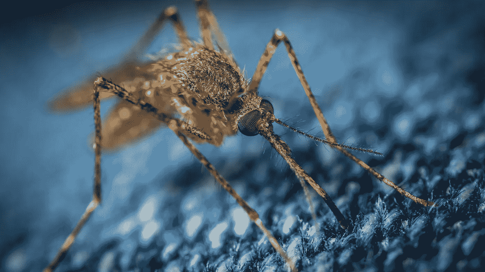

# 数据科学、慈善事业和第三部门——海量的好代码

> 原文：<https://towardsdatascience.com/data-science-philanthropy-and-the-third-sector-magnanimous-coding-for-good-cf2f9caf6fc6?source=collection_archive---------15----------------------->

## 用你的技能改善世界和人们的生活

Photo by [Егор Камелев](https://unsplash.com/photos/sZIjgg4Peu0?utm_source=unsplash&utm_medium=referral&utm_content=creditCopyText) on [Unsplash](https://unsplash.com/search/photos/mosquito?utm_source=unsplash&utm_medium=referral&utm_content=creditCopyText)

不可否认，数据科学是当前的主要趋势之一，从人工智能研究、疾病诊断和自动驾驶汽车，到欺诈检测、数字营销、人力资源管理等等。

读到这里的许多人很可能是数据科学家，你应该已经知道这些了。你们中的一些人可能不知道，但听说过很多，你们中的一些人可能不知道，但对如何在你们的领域应用它有专业兴趣。

许多组织已经接受了数据科学，并可以支持大型团队开展各种工作，从从数据中提取洞察力以做出更好的决策，到大规模开发和实施机器学习模型。许多组织就是没有这样的资源；可能没有规模经济来让第一个数据科学家雇佣工作，或者可能总是有项目必须得到优先考虑。

但是，有一个答案。一个有利于数据科学家和那些正在发展他们的技能和投资组合的人，一个有利于许多这些组织的人。在本帖中，我们将简要介绍我们如何定义数据科学，慈善机构和第三部门组织如何使用数据科学——为非数据科学家服务，以及数据科学本身如何作为资产捐赠，以推动变革和进步。

新技术正导致可用数据的数量和类型呈指数级增长，为通知和改造社会以及保护环境创造了前所未有的可能性。政府、公司、研究人员和公民团体都在积极尝试、创新和适应新的数据世界，在这个世界里，数据比以往任何时候都更大、更快、更详细。这就是数据革命。

有些人已经生活在这个新世界里了。但是，由于缺乏资源、知识、能力或机会，太多的人、组织和政府被排除在外。在获取数据和信息以及使用数据和信息的能力方面，存在着巨大且日益加剧的不平等。

> 为了进一步探索商业与数据科学的结合，[在 Twitter 上关注 Chris](https://twitter.com/chrisBowdata)。

## **什么是数据科学？**

我们的世界正在以惊人的速度产生数据。随着越来越多的设备利用互联网连接来提供更多功能和便利——即“物联网”——我们产生这些数据的速度将会继续提高。除了一些最明显的应用，如在线购物车中改进的产品推荐和一组更相关的“up next”猫视频，数据科学可以带来数据中的知识，只等着被发现。有些知识可能会改变世界，甚至只是解决一个小问题的第一步。

如果你问十个人，关于什么是数据科学，数据科学家做什么，你可能会得到十种不同的定义。从根本上说，数据科学是关于使用统计和计算技术将来自无数来源的数据转化为发现和结论，从而产生洞察力，促进明智的决策，揭示模式和趋势，并允许我们进行预测。

> “新技术正导致可用数据的数量和类型呈指数级增长，为通知和改造社会以及保护环境创造了前所未有的可能性。政府、公司、研究人员和公民团体都在积极尝试、创新和适应新的数据世界，在这个世界里，数据比以往任何时候都更大、更快、更详细。这就是数据革命。
> 
> 有些人已经生活在这个新世界里了。但是，由于缺乏资源、知识、能力或机会，太多的人、组织和政府被排除在外。在获取数据和信息以及使用数据和信息的能力方面，存在着巨大且日益加剧的不平等。"
> 
> *-联合国秘书长数据革命促进可持续发展独立专家咨询小组*

## **数据科学如何惠及慈善和第三部门组织？**

很容易看出数据科学如何在某些领域得到应用。例如，银行可以建立分析管道，在信贷申请中寻找与贷款违约相关的特征；流媒体视频网站可以根据你的观看历史推荐电影，移动电话公司可以建立模型来预测客户是否不会续签合同，并为他们提供适当的优惠。

数据科学如何在专注于慈善和进步活动的组织中得到应用，可能不会立即显而易见，但数据科学在这些领域可以像在蓝筹股业务或科技初创公司中一样有效和有用。

从基本的有效性和效率开始，数据科学可以为组织管理的各个方面提供信息，从员工招聘和保留，到市场营销，再到资产和运营。在最近一个将机器学习应用于设施管理的例子中，谷歌能够使用其算法[将用于冷却其数据中心的能源量减少 40%](https://deepmind.com/blog/deepmind-ai-reduces-google-data-centre-cooling-bill-40/) 。

随着机器学习方法开始在组织的更多活动中应用，通过提高效率实现的潜在节约可能会对成本产生重大影响，降低每笔捐赠中用于组织开销的百分比。

尽管降低运营成本可以最大限度地提高每笔捐款的使用价值，但人们总是希望确保捐款用在能够产生最大影响的地方，并确保捐款的有效性受到监控。

数据科学也可以在这方面发挥作用，基于人工智能的模型可以在预期项目中寻找与强劲表现和成功结果相关的特征，而算法可以实时评估项目的表现，从使用情绪分析跟踪社交媒体意见，使用统计分析寻找特定行业的经济增长提升，或者使用数据科学技术组合和补充来自不同来源的数据以推动医疗保健计划，如在纳米比亚的[疟疾控制](http://www.flowminder.org/case-studies/guiding-malaria-elimination-strategies-in-namibia)。

根据我在多个领域讨论数据科学应用的经验，比如采购和库存管理、可持续时尚和旅游，通常唯一的限制是你的想象力。如果你能让一位数据科学家和一位领域专家在下班后一起喝杯咖啡或啤酒，进行一次随意的交谈，你很可能会惊讶于一个晚上能在一张餐巾纸上写下多少想法。

## **数据科学本身就是慈善事业**

很明显，数据科学不仅可以增强慈善项目的选择和管理，确保捐赠物尽其用，而且数据科学中有越来越多的活动*成为捐赠。*

随着组织不仅对自己的数据基础设施、获取、存储和分析进行大量投资，而且对其数据科学家进行大量投资，公司的数据科学职能是一项宝贵的资产，并且有可能在组织内外提供价值。这一价值使得“慈善数据科学”成为企业拓展和社会责任项目的一个不断增长的领域。

万事达基金会的[包容性增长中心](https://www.mastercardcenter.org/)是全球企业利用其资源和专业知识回馈社会的一个例子。该中心的核心理念是利用“公司的核心资产，通过研究、数据慈善、项目和参与，推动包容性增长的行动。”

不仅仅是跨国公司通过数据科学回馈社会。像 [DataKind](https://www.datakind.org/) 这样的组织给数据科学家一个回馈的机会，将他们自己的时间和专业知识贡献给那些可能已经积累了数据，但没有内部技能来利用这些数据的项目。

另一个组织，[驱动数据](https://www.drivendata.org/)，运行:

> “拯救世界的数据科学竞赛”

竞赛内容涵盖从环境保护到改善公共服务的方方面面。如果你想提高你的数据科学技术，同时知道你编码和构建的东西可能会改变某人的生活，无论你在哪里，都有办法做到这一点。

随着越来越多的组织继续开发新的数据科学工具作为产品，并将数据科学驱动的流程应用于其业务流程的其他方面，数据驱动的方法可能会在所有行业变得越来越普遍。随着这种扩张推动数据科学资源的增加，组织所有领域的个人都找到了利用这些资源的方法，数据科学的应用无疑将在慈善事业、筹款和发展中得到体现。

## 我能做些什么让世界变得更美好？

在我看来，探戈需要两个人。需要有一个数据科学家愿意回馈社会，也需要有一个组织愿意让他们这样做。

对于数据科学家来说——特别是如果你处于职业生涯的早期阶段，希望在更多的项目中获得更多的经验——找到一些慈善组织，他们的事业对你有吸引力，并与他们联系。你可能不想承诺这个世界，但是看看他们是否愿意进行第一次对话；让双方都思考并对合作感到兴奋。

对于组织来说，让他们容易。是的，你可能会对让人们泄露你的数据有所保留，但字段通常可以从数据库或匿名或聚合的个人身份信息中删除。如果你想成为一个数据驱动的组织，或者至少尝试一下，第一步是建立一种文化，允许你考虑成为数据驱动的组织；如果没有人看到其中的潜在价值，那么这位数据科学家的电子邮件就不太可能得到积极的回复。

有很多优秀的数据科学家想要回馈社会，也有很多人在努力让世界变得更美好。让我们看看是否能把更多的人聚集在一起，加速这个过程。