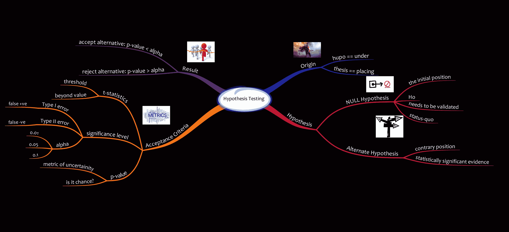

# 数据科学简化版第 3 部分:假设检验

> 原文：<https://towardsdatascience.com/data-science-simplified-hypothesis-testing-56e180ef2f71?source=collection_archive---------1----------------------->

著名的匈牙利裔美国物理学家爱德华·泰勒曾经说过:

> **“事实是每个人都相信的简单陈述。它是无辜的，除非被判有罪。假设是没有人愿意相信的新奇建议。它是有罪的，直到发现有效。”**

假设检验的应用在数据科学中占主导地位。对其进行简化和解构势在必行。就像犯罪小说故事一样，基于数据的假设检验将我们从一个**小说建议**引向一个**有效命题。**

## 概念

假说源于希腊文作品*琥珀*(下)和*论文*(放置)。这意味着一个想法来自有限的证据。这是进一步调查的起点。

这个概念简单而有力。我们每天都直觉地进行假设检验。这是一个 7 步流程:

1.  做出假设。
2.  采取初始位置。
3.  确定备用位置。
4.  设定验收标准
5.  进行基于事实的测试。
6.  评估结果。评估是否支持最初的立场？我们有信心这个结果不是偶然的吗？
7.  得出以下结论之一:拒绝原来的立场，赞成替代立场或不拒绝最初的立场。

## 过程

让我用一个故事来解释假设检验的概念。霍尔马维克是冰岛西部的一个小镇。这个小镇有它的独特之处。它以[巫术博物馆而闻名。](http://www.atlasobscura.com/places/the-museum-of-icelandic-sorcery-witchcraft)

即使是现在，西峡湾还有人自称是巫师。埃西铎和甘道夫就是这样的人。埃西铎和甘道夫自称是巫师。他们自称是千里眼。一位统计学家想要证明或否定这种说法。他们玩 ***千里眼纸牌游戏*** 。

游戏规则如下:

*   埃西铎和甘道夫看到了从一套扑克牌中随机选择的十张牌的反面，并被问及四张中哪一张适合它。
*   他们必须识别卡片所属的花色。
*   对他们中的每一个重复该测试十次。

**还确定对于一个正常人来说，预测正确的平均次数在 6 次左右。**这是我们进行假设检验的基础。我们将从统计学上确定他们是否是巫师。

## 第一步:做出假设

不同种类的假设检验做出不同的假设。假设与数据分布、采样和线性度有关。一些常见的假设是:

*   **分布:**数据遵循特定的分布。理解数据的基本模式。许多自然发生的数据点的分布，如股票市场数据、人的体重和身高、在酒吧喝酒的人的工资等。，可以用**正态分布来近似。**正态分布简单来说就是大量的观测值在中间。少数观察值大于或小于中间值。中间值也被称为**中值**。
*   **抽样:**假设为测试抽样的数据是随机选择的。没有偏见。

对于千里眼纸牌游戏，以下假设是正确的:

*   在千里眼纸牌游戏中，所选纸牌的分布将是正态分布的。这是真的，因为卡是随机选择的。随机选择卡片意味着十张卡片中的每一张都有相等的概率被选中参加测试。
*   有问题的卡片没有偏见。

## 第二步:零假设

零假设是初始位置。这是现状。是被拒绝或者拒绝失败的立场。这是一个需要验证的位置。才是需要考验的岗位。

对于千里眼纸牌游戏，无效假设如下:

*   H0:埃西铎/甘道夫不是先知。

他只是在猜测。他很幸运。

## 第三步:替代假设

替代假设是与零假设相反的立场。如果有统计学上显著的证据表明替代假设是有效的，那么无效假设被拒绝。

对于透视纸牌游戏，另一个假设如下:

*   哈:埃西铎/甘道夫是一个先知。

## 步骤 4:设定验收标准

定义了无效假设和交替假设。现状是无效的假设。现在，需要设定一个阈值。我们知道一个普通人，即不是巫师的人，10 次中有 6 次是正确的。如果埃西铎和甘道夫能够在一次测试中预测出超过六张正确的卡片，那么就有更多的证据表明他们可能确实是巫师。一个称为 **t-statistics** 的指标计算估计值与假设值的差距。高 t 统计量使得替代假设看起来越来越可信。

假设检验结果可能出错。有四种可能的情况:

1.  测试发现埃西铎/甘道夫是一个千里眼。他是一个千里眼。
2.  测试发现埃西铎/甘道夫不是千里眼。他不是千里眼。
3.  测试发现埃西铎/甘道夫是一个千里眼。他不是千里眼。
4.  测试发现埃西铎/甘道夫不是千里眼。他是一个千里眼。

测试击中了靶心，结果 1 和 2 是正确的。结果 3 和 4 的测试失败了。

*   当零假设为真时，结果 3 拒绝零假设。这是一个**误报。**该误差也被称为**I 型误差。**
*   当零假设为假时，结果 3 接受零假设。这是一个**的假阴性。**该误差也称为**第二类误差。**

像所有的统计检验一样，假设检验必须处理不确定性。它必须考虑概率。没有绝对。

需要设定一个概率水平，以便确定 I 类错误发生的可能性。这个水平被称为**显著性水平**。 **alpha (α)** 表示它。较低的α意味着测试非常严格。相对较高的α意味着测试没有那么严格。α的值是根据假设检验的性质设定的。典型值为 0.001、0.05 或 0.1

如果观察到的值仅仅是偶然的呢？如果只是巧合呢？如果他们只是在测试进行的当天运气好呢？这种不确定性需要缓解。假设检验有一个度量标准来处理这种不确定性。 **p 值**是度量。

**p 值**表示为概率。这意味着它的值介于 0 和 1 之间。p 值是在假设零假设为真的情况下偶然观察到的 t 统计的概率。

对于千里眼纸牌游戏来说，如果埃西铎能猜对 8 张以上的牌，那么另一个假设是合理的。他可能确实是一个千里眼。***t 统计量为 8。***

成为透视者不会有生命危险。没有人有危险。显著性水平设定为 0.05。***α为 0.05。***

## 第五步:进行测试

动作发生了。统计学家测试埃西铎和甘道夫的超视力。卡片显示出来了。预言已经做出。注意到了结果。该过程重复十次。统计引擎在收集的数据上运行。结果如下:

埃西铎:

*   t 统计:8
*   p 值:0.1

-甘道夫:

*   t 统计:9
*   p 值:0.01

## 第六步:评估结果

概率(p 值)和显著性水平之间的比较产生以下结果:

## 对于埃西铎:

*   t 统计量是 8。这意味着，平均来说，他已经正确预测了八张牌。这比正常人所能预测的要高。
*   p 值为 0.1。这意味着观察到的 t-统计量是偶然的概率是 10%。p 值很高。
*   设定的显著性水平(α)为 0.05。翻译过来就是 5%。
*   p 值大于设定的显著性水平，即 10% > 5%。

## 对甘道夫来说:

*   t 统计量是 9。这意味着，平均来说，他已经正确预测了九张牌。这比正常人所能预测的要高。
*   p 值为 0.01。这意味着观察到的 t-统计量是偶然的概率只有 1%。
*   设定的显著性水平(α)为 0.05。翻译过来就是 5%。
*   p 值低于设定的显著性水平，即 1% < 5%.

## Step 7: Conclude

The tests have ended. The metrics are known. Who is the real wizard?

**对于埃西铎:**p 值大于设定的显著性水平(10% > 5%)。即使平均来说，他已经正确预测了八张牌；从统计学上看，结论如下:

*   **埃西铎的结论:没有实质证据反对零假设。零假设未能被拒绝。**

**对于甘道夫:**平均来说，他已经正确预测了九张牌。p 值低于设定的显著性水平(1% < 5%)。

*   甘道夫的结论:有充分的证据反对无效假设。无效假设被拒绝。接受替代假设。

埃西铎崩溃了。甘道夫得意洋洋。然而，埃西铎可能会感到安慰，因为没有证明他不是一个千里眼。零假设未能被拒绝。这并不意味着交替假设不成立。这只是意味着没有足够的证据来拒绝零假设。埃西铎普遍维持现状。

## 结论

没有必要进行假设检验来找出埃西铎和甘道夫中谁是巫师。我们都知道甘道夫是巫师。

假设检验是机器学习的基础概念之一。许多评估方法使用假设检验来评估模型的稳健性。在本系列中，我们将**进一步深入**它的构造。