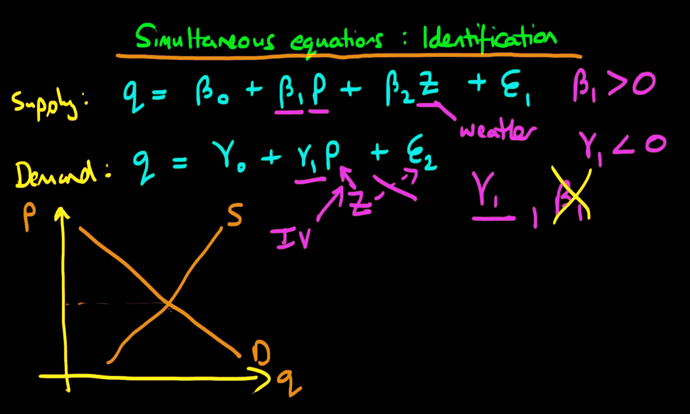
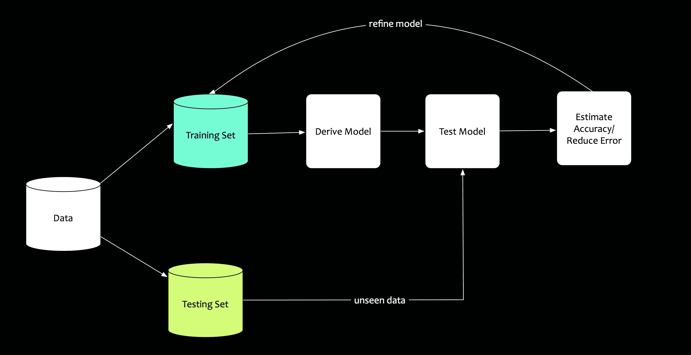
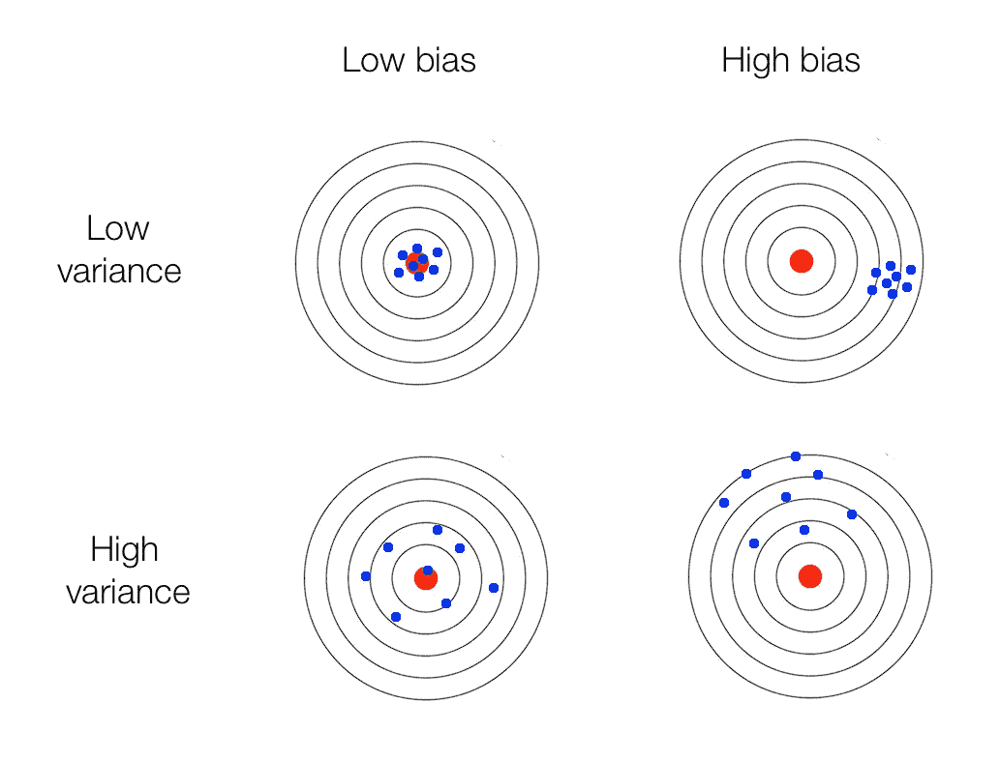
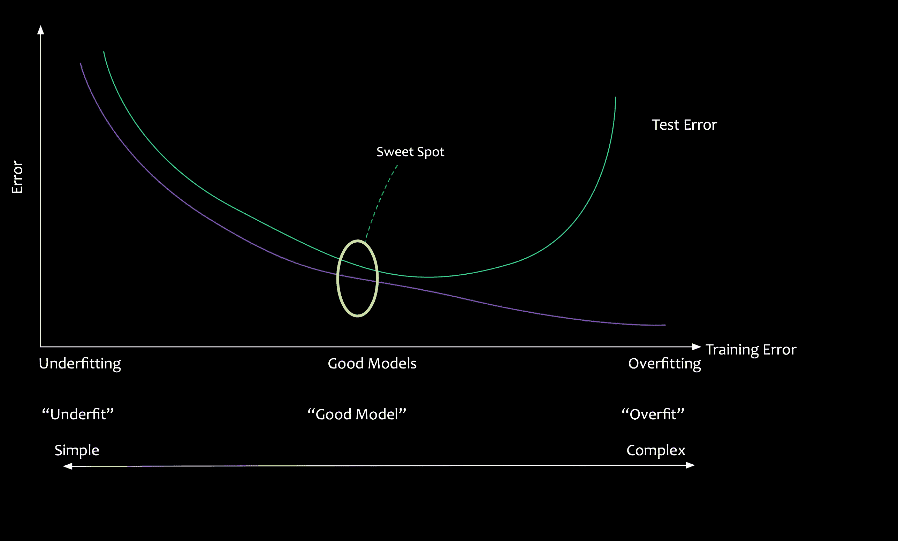

# 数据科学简化第 2 部分:统计学习的关键概念

> 原文：<https://towardsdatascience.com/data-science-simplified-key-concepts-of-statistical-learning-45648049709e?source=collection_archive---------2----------------------->

在本系列的第一篇文章中，我已经谈到了数据科学的关键概念和过程。在这篇文章中，我将深入探讨一下。首先，我将定义什么是统计学习。然后，我们将深入研究统计学习中的关键概念。相信我；很简单。

## 什么是统计学习？

根据[维基百科](https://en.wikipedia.org/wiki/Statistical_learning_theory)，统计学习理论是从统计学和功能分析领域汲取的机器学习框架。

机器学习是通过软件应用实现的统计学习技术的一种表现形式。

这在实践中意味着什么？统计学习指的是使我们能够**更好地理解数据的工具和技术。**让我们回到这里。我们理解数据是什么意思？

在统计学习的背景下，有两种类型的数据:

1.  可以直接控制的数据，又称独立变量。
2.  不能直接控制的数据，也称为因变量。

无法控制的数据，即需要预测或估计的因变量。

*更好地理解数据*是从自变量的角度更好地了解因变量。让我用一个例子来说明:

假设我想根据分配给电视、广播和印刷品的广告预算来衡量销售额。我可以控制预算，我可以分配给电视，广播和印刷。我不能控制的是它们将如何影响销售。我想把我不能控制的数据(销售额)表达成我能控制的数据(广告预算)的函数。我想揭开这种隐藏的关系。

**统计学习揭示隐藏的数据关系。非独立数据和独立数据之间的关系。**

## 参数和模型

运营管理中一个著名的商业模式是 ITO 模式。代表**输入-转换-输出**模型。很简单。有输入。这些输入经历一些转换。产生一个输出。

统计学习也应用类似的概念。有输入数据。输入数据被转换。需要预测或估计的输出就产生了。

转换引擎被称为**模型。**这些是估计输出的函数。

这种转换是数学上的。数学成分被添加到输入数据中以估计输出。这些成分被称为**参数。**

让我们看一个例子:

是什么决定了一个人的收入？说收入是由一个人一年的教育和多年的经验决定的。估计收入的模型可以是这样的:

收入= c + β0 x 学历+ β1 x 经验

**β0 和β1** 是将收入表示为教育和经验的函数的参数。

学历和经历是可控变量。这些可控变量有不同的同义词。它们被称为独立变量。它们也被称为**特征**。

收入是不可控的变量。他们被称为**目标**。

## 培训和测试

当我们必须准备考试的时候，我们做什么？学习。学习。喝点酒。记笔记。练习模拟试卷。这些是学习的工具，也是为未知的考验做准备的工具。

机器学习也使用类似的概念进行学习。数据是有限的。现有数据需要谨慎使用。建立的模型需要验证。验证它的方法如下:

*   将数据分成两部分。
*   用一部分进行训练。让模型从中学习。让模型看到数据。这个数据集被称为**训练数据。**
*   使用另一部分测试模型。用看不见的数据对模型进行“测试”。这个数据集被称为**测试数据。**

在竞争性考试中，如果准备充分，如果学习扎实，那么在考试中的表现也会令人满意。同样，在机器学习中，如果模型从训练数据中学习得很好，它将在测试数据中表现良好。

类似地，在机器学习中，一旦在测试数据集上测试了模型，就评估了模型的性能。根据估计的输出与实际值的接近程度进行评估。

## 方差和偏差

英国著名统计学家乔治·博克斯曾经引用过:

> **“所有型号都是错的；有些是有用的。”**

没有模型是 100%准确的。所有模型都有误差。这些误差有两个来源:

*   偏见
*   差异

让我尝试用一个类比来解释这一点。

Raj，一个七岁的孩子，刚刚开始学习乘法的概念。他已经掌握了表 1 和表 2。他的下一个挑战是学习三表。他非常兴奋，开始练习 3 的乘法表。他的桌子是这样的:

*   3 x 1 = 4
*   3 x 2 = 7
*   3 x 3 = 10
*   3 x 4 = 13
*   3 x 5 = 16

拉吉的同学鲍勃也在同一条船上。他的桌子看起来像这样:

*   3 x 1 = 5
*   3 x 2 = 9
*   3 x 3 = 18
*   3 x 4 = 24
*   3 x 5 = 30

让我们从机器学习的角度来研究 Bob 和 Raj 创建的乘法模型。

*   拉吉的模型有一个无效的假设。它假设乘法运算意味着在结果后加一。这个假设引入了**偏差**误差。假设是一致的，即输出加 1。这意味着拉吉的模型有一个**低偏差。**
*   Raj 的模型得出的结果总是与实际相差 1 个数字。这意味着他的模型有一个**低方差。**
*   鲍勃的模型的输出到处都是。他的模型输出与实际值相差很大。偏离没有一致的模式。Bob 的模型有**高偏差**和**高变化。**

上面的例子是对方差和偏差这一重要概念的粗略解释。

*   **偏差**是模型由于没有考虑数据中的所有信息而不断学习错误的东西的倾向。
*   **方差**是模型获取随机事物的趋势，与真实信号无关。

## 偏差-方差权衡

我有一个学校的朋友，他是一个很棒的学生。他的数学相对较差。他过去学习数学的方法是死记硬背。他学会并记住了数学问题。他能很好地“背诵”它们。

挑战如下:考试问题与他记忆的问题不同。这些问题是数学概念的一般应用。显然，他很难通过考试。

机器学习问题遵循同样的模式。如果模型学习了太多关于特定数据集的知识，并试图将相同的模型应用于看不见的数据，它将具有很高的误差。从给定的数据集中学习太多被称为**过拟合**。它还没有**推广**对看不见的数据有效应用的学习。另一方面，学习太少会导致不适应。模型太差了，甚至无法从给定的数据中学习。

阿尔伯特·爱因斯坦简洁地总结了这个概念。他说:

> “一切都应该尽可能简单，但不能再简单了。”

机器学习问题中的一个持续努力是取得正确的平衡。创建一个不太复杂也不太简单的模型。创建一个通用模型。创建一个相对不准确但有用的模型。

*   **过度拟合**的模型是复杂的。它在训练数据上表现非常好。它在测试数据上表现不佳。
*   一个**低于**的模型太简单了。它不会对训练和测试数据都执行 will。
*   一个好的模型能平衡欠拟合和过拟合。它概括得很好。这是尽可能简单，但不简单。

这种平衡行为被称为**偏差-方差权衡。**

## 结论

统计学习是复杂机器学习应用的构建模块。这篇文章介绍了统计学习的一些基本概念。这篇文章的 5 大要点是:

1.  **统计学习揭示隐藏的数据关系。非独立数据和独立数据之间的关系。**
2.  **模式是变革的引擎。参数是实现转换的要素。**
3.  **模型使用训练数据进行学习。模型使用测试数据进行评估。**
4.  **所有型号都是错的；有些是有用的。**
5.  **偏差-方差权衡是一种平衡行为。平衡以找到最佳模式。找到最佳平衡点。**

我们将在本系列的后续文章中更深入地研究机器学习模型的细节。