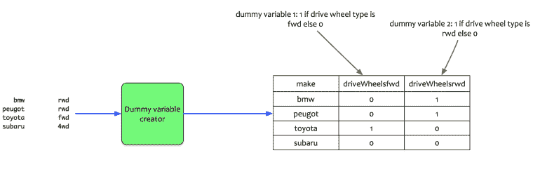

# 数据科学简化版第 8 部分:回归模型中的定性变量

> 原文：<https://towardsdatascience.com/data-science-simplified-part-8-qualitative-variables-in-regression-models-d1817d56245c?source=collection_archive---------4----------------------->

本系列的最后几篇博文讨论了回归模型。费尔南多选择了[最佳车型。他建立了一个多元回归模型。该模型采用以下形状:](https://datascientia.blog/2017/08/09/dss-model-selection-methods/)

> *价格= -55089.98 + 87.34* 发动机尺寸+ 60.93 *马力+ 770.42* 宽度

该模型预测或估计价格(目标)，作为发动机尺寸、马力和宽度(预测值)的函数。该模型将所有预测值作为数值。

如果有定性变量呢？如何使用定性变量来增强模型？定性变量是如何解释的？

这是这篇博文将要回答的几个问题。

费尔南多得到两个这样的定性变量:

*   燃料类型:使用的燃料类型。该值可以是天然气或柴油。
*   驱动轮:驱动轮的类型。它有三个值 4 轮(四轮驱动)，后轮(RWD)和前轮(前轮)。

数据集是这样的。

费尔南多想找出这些定性变量对汽车价格的影响。

# 概念

定性变量是非数值变量。它将数据分类。它们也被称为**分类变量**或**因子。**

因素有层次。水平只不过是特定定性变量的唯一值。

*   燃料类型有两个唯一的值。汽油还是柴油。这意味着燃料类型有两个因素。
*   驱动轮有三个独特的价值。四轮驱动，后轮驱动和前轮驱动。这意味着驱动轮有三个因素。

当回归模型使用定性变量时，统计引擎会创建虚拟变量。虚拟变量的概念很简单。它只需要两个值 0 或 1。

让我们看一个例子。样本数据有 5 辆汽车，每辆汽车都有柴油或气体燃料类型。

燃料类型是一个定性变量。它有两个级别(柴油或天然气)。统计软件包创建一个虚拟变量。它创建了一个名为 fuelTypegas 的伪变量。此变量采用 0 或 1 值。如果燃料类型是气体，则虚拟变量为 1，否则为 0。

数学上，它可以写成:

*   如果燃料类型是气体，xi = 1
*   xi = 0 表示燃料类型为柴油

> *回归模型创建的虚拟变量的数量比定性变量中的数字因子值少一个。*

让我们来看看它是如何在回归模型中表现出来的。仅将价格和燃料类型作为输入的简单回归模型提供了以下系数:

只有一个系数和一个截距。回归模型为定性变量(本例中为气体)的因子值创建一个虚拟变量。

上面写着:

*   如果虚拟变量为 0，即汽车的燃料类型为柴油，则价格= 18348 + 0 x (-6925) = $18348
*   如果虚拟变量为 1，即汽车的燃料类型为天然气，则价格= 18348 + 1 x (-6925) = $11423

具有两个因素水平的定性变量的处理方式是清楚的。两级以上的变量呢？让我们检查另一个例子来理解它。

驱动轮是一个有三个因素的定性变量。在这种情况下，回归模型创建了两个虚拟变量。让我们看一个例子。样本数据有 4 辆汽车。

创建了两个虚拟变量:

*   驱动轮前进:如果驱动轮类型是前进，则为 1，否则为 0
*   如果驱动轮类型是 rwd，则为 1，否则为 0

数学上，它可以写成:

*   如果驱动轮向前，xi1 = 1；如果驱动轮不向前，则为 0。
*   如果驱动轮是后轮，xi2 = 1；如果驱动轮不是后轮，则为 0。

请注意，4WD 没有虚拟变量。

它们在回归模型中是如何体现的？回归模型处理它们的方式如下:

*   首先，它为价格估算创建了一个 ***基线*** 。基线是没有创建虚拟变量的定性变量的平均价格。这是截距值。基线方程适用于 4WD。这是一辆四轮驱动汽车的平均价格。
*   对于前轮驱动:前轮驱动的平均价格估计为**基线+1×前轮驱动系数。**即价格= 7603+1×1405+0×10704 = 9008 美元。这意味着平均来说，一辆四轮驱动汽车比一辆四轮驱动汽车贵 1405 美元。
*   对于 RWD:后轮驱动(红色)的价格估计为**基线+1 x RWD 系数。**即价格= 7603+0×1405+1×10704 = 18307 美元。这意味着平均而言，一辆后轮驱动汽车比一辆四轮驱动汽车贵 10704 美元。

所有具有两个以上因子值的定性变量都以类似方式处理。

# 模型结构

既然定性变量的处理机制。让我们看看费尔南多是如何将其应用到他的模型中的。他最初的模型如下:

> *价格= -55089.98 + 87.34* 发动机尺寸+ 60.93 *马力+ 770.42* 宽度

他增加了两个定性变量。燃料类型和车轮驱动。该模型的一般形式写为:

> *价格= β0 + β1 .发动机尺寸+ β2 .马力+ β3 .宽度+ β4 .燃油类型+β5 .驱动轮 fwd + β6 .驱动轮 rwd*

Fernando 在其统计包中训练该模型，并获得以下系数。

该模型的方程式为:

> *价格= -76404.83 + 57.20 *发动机尺寸+ 23.72 *马力+ 1214.42 *宽度— 1381.47 *燃油类型气-344.62 *驱动轮 fwd + 2189.16 *驱动轮 rwd*

这里混合了定量和定性变量。变量是相互独立的。现在让我们来解释这些系数:

*   β0:注意，没有为柴油汽车和 4WD 汽车创建虚拟变量。 *β0 代表柴油和 4WD 汽车的平均价格。*是负值。这意味着，如果有柴油四轮驱动，平均价格将是负值。这是不可能的。该模型可能违反了线性回归假设。
*   β1:这种解释与多元回归的解释相同。 ***发动机尺寸增加 1 个单位，解释为汽车价格平均增加。*** 发动机尺寸每增加 1 个单位，汽车价格平均增加 57 美元。
*   β2:这种解释与多元回归的解释相同。 ***马力增加 1 个单位，解释为车价平均增加。*** 马力增加 1 个单位，汽车价格平均增加 23.72 美元。
*   β3:这种解释与多元回归的解释相同。 ***宽度增加 1 个单位，解释为车价平均增加。*** 宽度增加 1 个单位，汽车价格平均增加 1214.42 美元。
*   β4:该系数是虚拟变量(燃料型气体)的结果。 ***它解释为柴油汽车和燃气汽车的平均价格差。*** ***这意味着，平均而言，一辆燃油型汽车比一辆柴油车便宜 1381.47 美元。***
*   β5:该系数是虚拟变量(驱动轮向前)的结果。 ***它解释为四轮驱动和四轮驱动汽车之间的平均价格差。这意味着平均来说，一辆四轮驱动汽车要比一辆四轮驱动汽车便宜 344.62 美元。***
*   β6:该系数是虚拟变量(驱动轮 rwd)的结果。 ***它被解释为一辆四轮驱动汽车和一辆 RWD 汽车之间的平均价格差。这意味着平均来说，一辆 RWD 轿车要比一辆四轮驱动轿车贵 2189.16 美元。***
*   调整后的 r 平方为 0.8183。这意味着该模型解释了训练数据中 81.83%的变异。
*   请注意，并非所有系数都很重要。 ***事实上，在这种情况下，定性变量对模型表现没有意义。***

# 结论

这个模型并不比最初创建的模型更好。然而，它已经完成了它的工作。 ***我们了解回归模型中定性变量的解释方式。*** 很明显，原来的型号配 ***马力，引擎尺寸和宽度比*** 要好。然而，他想知道:马力、发动机尺寸和宽度是分开处理的。

> ***马力、发动机尺寸、宽度有关系怎么办？这些关系可以建模吗？***

本系列的下一篇博文将回答这些问题。它将解释互动的概念。

*原载于 2017 年 8 月 19 日*[*datascientia . blog*](https://datascientia.blog/2017/08/19/dss8-qual-var/)*。*