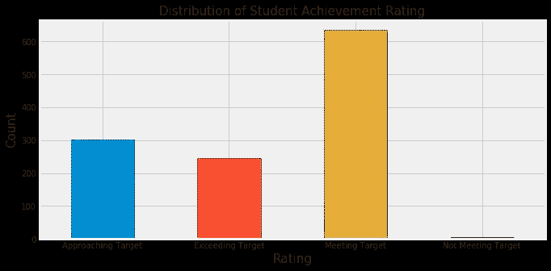
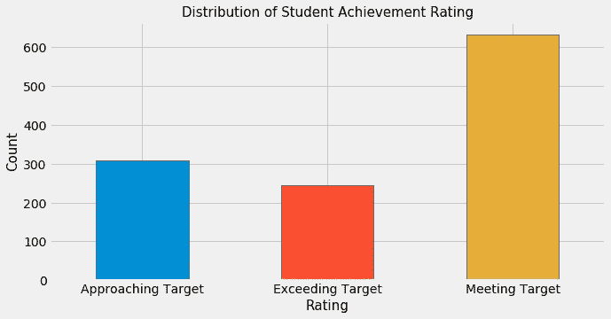
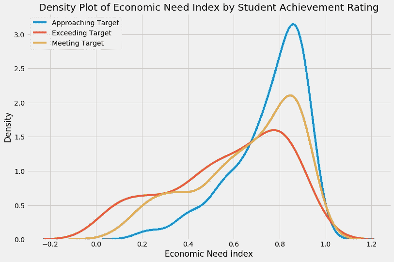
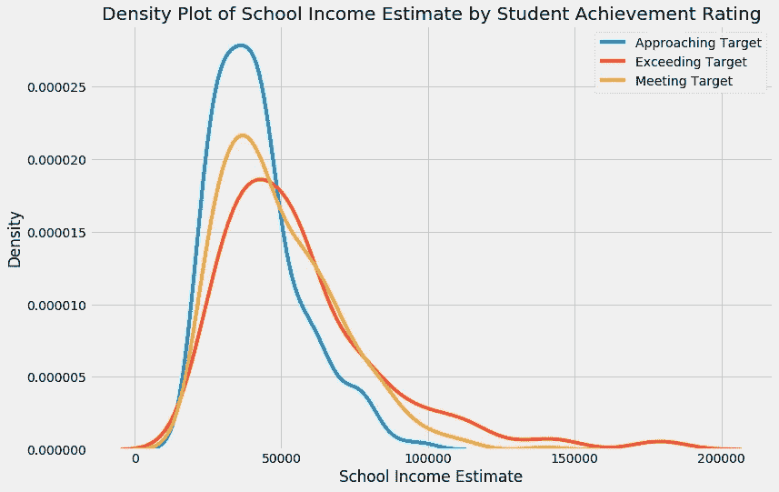
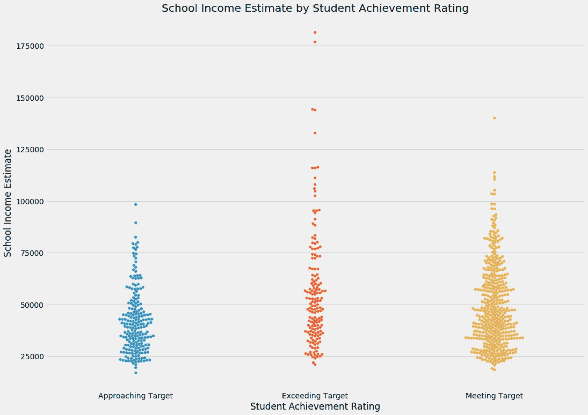
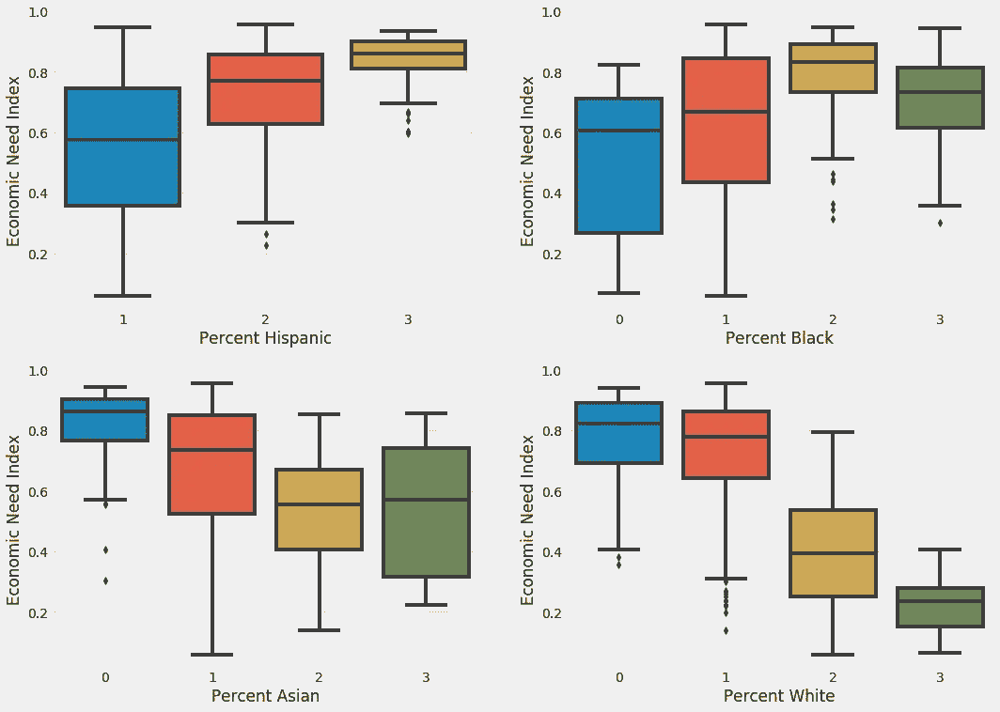
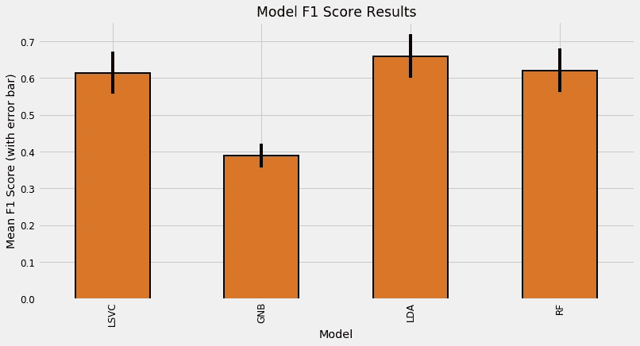
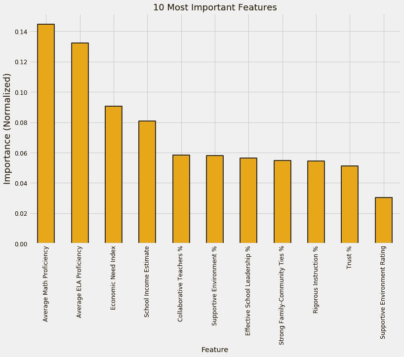

# 数据科学承担公共教育

> 原文：<https://towardsdatascience.com/data-science-takes-on-public-education-f432910ea9f0?source=collection_archive---------15----------------------->

## 使用机器学习帮助分析教育问题

“high-angle photography of group of people sitting at chairs” by [Mikael Kristenson](https://unsplash.com/@mikael_k?utm_source=medium&utm_medium=referral) on [Unsplash](https://unsplash.com?utm_source=medium&utm_medium=referral)

> “教育是你可以用来改变世界的最强大的武器”——纳尔逊·曼德拉

## 介绍

纳尔逊·曼德拉是对的。教育是强大的武器，也是人生最大的礼物之一。在美国，有各种各样的儿童教育项目可供选择，如公立学校、特许学校和私立学校。虽然有几种教育途径可供选择，但它们都是为了实现学生成功的相同目标吗？

## 问题

我在 Kaggle 上遇到了一个挑战，叫做 [PASSNYC:为了好的数据科学](https://www.kaggle.com/passnyc/data-science-for-good/home)。这项挑战是由 PASSNYC 创建的，这是一个非营利组织，旨在帮助纽约市的公立学校学生，通过使用公开可用的数据来量化他们在学校面临的挑战，以及如何鼓励学生参加**专门高中入学考试(SHSAT)** 来评估学生的需求。PASSNYC 想找到哪些学校需要帮助来增加参加考试的学生人数。虽然这个挑战本身很有趣，但我想用机器学习的方法来解决一个不同的问题:我们如何帮助公立学校提高学生的成功率？

**目的:我们能预测公立学校的学生成绩等级吗？**

在数据中，有一个字段对每所学校的学生成绩进行评级，我用它来确定学校是否达到了学生成功的目标。学生成绩评定有 4 个不同的等级:*未达到目标、接近目标、达到目标、*和*超过目标*。这将使我们的分析成为**监督的多分类**机器学习任务:

**监督**:我们得到了训练数据的目标数据

**多类分类**:目标数据有 4 个不同的分类值(我后来把它们变成了 3 个，以提高模型的性能)

## 探索性数据分析

与任何数据科学项目一样，第一种方法是理解数据。数据集中有 160 个特征/列，包括数值和分类值。基于这些特征，我能够发现 4 种不同类型的组:经济组、种族组、教育评级组和测试组。例如，属于经济组的特征包括学校收入估计(数值)和经济需求指数(数值)，它们用于识别公立学校的经济状态。

在最终的模型中，我删除了最多的特性是测试。这些特征包括参加**专门高中入学考试(SHSAT)的学生总数。**在第一次分析中，我包括了所有这些功能，但后来发现它们并不能帮助我们解决问题，也不能提高模型的性能。我将只包括测试的平均分数(ELA 和数学测试)，但不包括参加测试的学生人数。

*   **学生成绩等级的分布最初是什么样子的？**

通过查看学生成绩等级的分布，我意识到需要做一些清理工作。数据中只有 6 所学校*没有达到学生成绩的目标*，相比之下，超过 600 所学校*达到了目标*。由于只有少数学校没有达到目标*，模型很难做出预测。因此，我决定将*未达到目标*的值改为*接近目标*，因为在现实中，它们都是:A)未达到学生成绩的目标，B)努力达到目标(嗯，至少我希望是这样)。其他特性也有 4 个评级等级(*未达到目标、接近目标、达到目标、*和*超过目标)、*，因此也对这些值进行了更改。做出这些改变后，学生成绩的分布如下所示:*

**

***目标和特征之间的关系***

*分析的下一步是寻找目标和特征之间的关系。为此，我绘制了一些密度图。通过按目标(学生成绩等级)给密度曲线着色，这显示了分布如何基于等级而变化。*

**

*在我看来，经济需求指数和学生成绩之间的关系是意料之中的。经济需求指数的值介于 0 和 1 之间，值越接近 1，意味着学校的经济需求越大。在这里，与其他评级相比，有更多经济需求指数值高的公立学校被评为*接近目标*。在这里，许多具有高经济价值指数(超过 0.8)的公立学校的学生成绩评级接近目标*。换句话说，需要经济支持的学校没有良好的学生成绩。**

**

*学校收入估计与学生成绩的关系与经济需求指数相同。许多估计收入较低(低于 5 万美元)的公立学校的学生成绩评级接近目标。*

**

*在进一步调查后，我发现学校预计收入超过 10 万美元的公立学校要么达到目标，要么超过目标。基于这些观察，我推测学校的收入/经济状况将在分析中发挥重要作用。*

## *特征工程/选择*

*流程的下一步是对功能进行更改，以优化模型的性能。使用 [one hot encoding](https://hackernoon.com/what-is-one-hot-encoding-why-and-when-do-you-have-to-use-it-e3c6186d008f) ，具有百分比值的列从数值变为序数值，从 0 变为 3。例如，特征*百分比西班牙裔*的值为 23% (0.23)的观察值被更新为序数值 1，而相同特征的值为 88% (0.88)的观察值被更新为值 3。对所有具有百分比(数值)值的要素执行此操作可提高模型的准确性！*

*对于评分值为*、*的特性，我还使用了一个热编码:*接近目标:1，达到目标:2，*和*超过目标:3。*该程序还包括目标，即学生成绩评定。*

*分析的另一部分是查看特征之间的关系。经济需要指数和种族之间的关系显示出一种显著的模式:*

**

*在这里，我注意到经济需求指数因特定种族的学校而异。例如，西班牙裔人口较多的公立学校(3 分)被认为更需要财政援助。另一方面，白人比例较高(3 分)的公立学校似乎不太需要财政援助。*

## *模型选择和测试*

*由于这是一个受监督的多分类机器学习分析，我创建了四个分类模型:*

*   *随机森林分类器*
*   *线性支持向量分类(LSVC)*
*   *高斯朴素贝叶斯(GNB)*
*   *线性判别分析(LDA)*

***公制***

*为了评估模型的预测，我使用了**微 F1 分数**。由于这是一个多类问题，我必须平均每个类的 F1 分数。同时也考虑到标签的不平衡。*微*平均计算所有类别的假阳性、假阴性和真阳性的总数，然后使用这些计数计算精度、召回和 f 值
。*

*对数据进行 10 重交叉验证，对模型进行 10 次训练和测试，结果如下:*

**

*使用 10 重交叉验证，**线性判别分析(LDA)** 模型具有最高的微观 F1 分数，为 0.66(越高越好)。随机森林(RF)模型排名第二，得分为 0.62。(令人惊讶的)表现不佳的模型是高斯朴素贝叶斯(GNB)，其得分大大低于其他模型。*

*使用随机森林模型，我对功能的重要性进行了排序，以查看顶级功能在分析中的帮助程度:*

**

*ELA 和数学考试的平均分数是最重要的特征。这是有道理的，因为学校的平均考试成绩越高，学校的学生成绩等级就越高。特征重要性的一个方面是两个基于经济的特征的高排名:经济需求指数和学校收入估计。种族特征在分析中很重要，但没有我想象的那么重要。*

## *结论*

*以下是我从分析中学到的一些东西:*

*   *收入水平较低的学校似乎需要改进。如果 PASSNYC 想要为学校提供资金/援助，他们应该关注经济困难的学校和少数族裔(黑人/西班牙裔)比例较高的学校*
*   *学校的经济地位对学生的成就起着重要的作用:学校越需要经济，学校的成就越低*
*   *学校的经济地位因学校的主要种族而异:学校的少数民族(黑人/西班牙裔)学生越多，其经济需求就越大*
*   *与其他模型相比，线性判别分析(LDA)在这种多类机器学习分析中得分较高。*

*尽管最佳模型在预测纽约公立学校的学生成绩评级方面做得很好，但我在这个过程中了解到的一些问题可能会在未来的项目中帮助我:*

*   *去更新型号选择/工程总是很棒的！尽管这个建议在几乎所有数据科学相关的资料中都有推荐，但我完全理解它的价值。Kaggle 提供的数据有 100 多个特征，我在最初的几个模型中使用过，但在回到选择/工程流程后，我删除了其中的大部分。这些功能可用并不意味着它们会有用。*
*   *更多(非冗余)功能。提供的数据本可以有更有用的特征，如学校规模或师生比。这种类型的数据可能会提高我们模型的准确性。*

> **请随时给予反馈或建设性的批评！:)还有，跟我上* [*推特*](https://twitter.com/dataosanch) *和* [*中*](https://towardsdatascience.com/@osanchez2323) *！**

*这篇文章使用的所有代码都可以在 GitHub 上找到，组织在这个[笔记本](https://github.com/osanchez2323/Portfolio/blob/master/Data%20Science%20Takes%20on%20Education/Data%20Science%20Takes%20on%20Education.ipynb)上。*