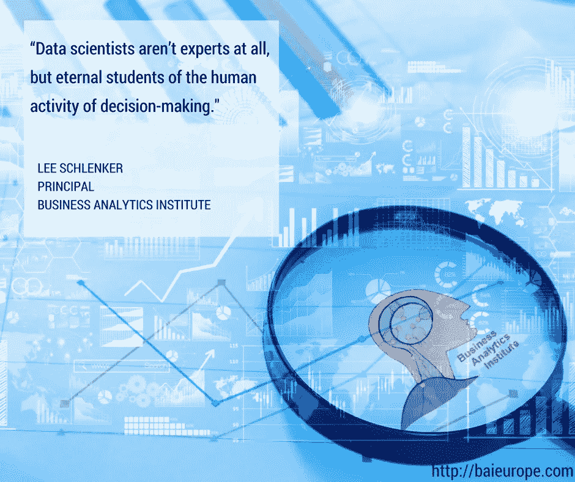

# 数据科学的肮脏小秘密

> 原文：<https://towardsdatascience.com/data-sciences-dirty-little-secrets-15184d814486?source=collection_archive---------2----------------------->

尽管在这个主题上有相当多的贡献，但是定义今天的数据科学家的知识和技能集被证明是一个相当大的问题。这一挑战并没有阻止贸易专家预测世界范围内对这类“专家”的供需缺口[【第二】【第三】；而 LinkedIn 的 2017 年十大最具市场价值技能调查则突出了统计分析、数据建模和数据呈现](#_edn2)[【iii】](#_edn3)。自从威廉·克利夫兰(William Cleveland)在 2001 年提出“数据科学”这一术语作为计算机科学和统计学领域之间的结合点以来——“超级明星”、“忍者摇滚明星”和“性感独角兽”等最高级词汇对商业和高等教育理解这一行业的具体情况几乎没有帮助。*究竟是什么让数据科学家与该领域的其他人区分开来？*

有几个原因可以解释为什么这个行业在定义角色上有这么多困难。大多数组织倾向于使用这个术语作为一个包罗万象的短语，似乎包括统计学家、业务分析师和数据工程师。多年来统计工具和方法的快速发展并没有让这项任务变得更容易:专业知识的标准变得越来越雄心勃勃。数据科学家的营销与其他技术相关行业没有太大不同:IT 行业在不断重塑传统职位头衔的过程中，历史上一直表现出一种“本月流行”的心态。在回顾了当前职位空缺对数据科学家的要求后，人们应该想知道是否有数据科学家不能做的事情。

鉴于这份技能和能力的清单，也许更有前途的方法是列出数据科学家不是什么。Chuck Russel 的贡献提出了一些有效的观点。他表示，这个头衔并不附带数学、计量经济学或决策科学的高级学位。根据候选人对供应商统计平台培训视频的使用情况来判断他们是否是数据科学家就更加困难了。参加新兵训练营或专业在线课程的证书并不能区分专业人员。*数据科学家不像专业人士那样擅长处理数据，而是练习解决组织问题。*

如果数据、平台和编程方面的专业知识还不够，那么数据科学家的特质是什么？在我们看来，这一切都始于候选人对特定市场和行业逻辑的理解。数据科学也是一种思维框架，数据科学家不断扫描他们的物理和数字环境，寻找需要解决的问题。他们的日常工作包括探索要解决的问题的本质，鉴定手头的数据，确定哪些方法可以在给定的环境下产生更好的选择，以及将数据转化为有洞察力的行动。他们不会把自己孤立在电脑前，但正如李·贝克所说，他们充当公司和客户现实的侦探，以及组织内部技术和运营服务之间的中介。总之，数据科学家根本不是专家，而是人类决策活动的永恒学生。

这种对决策而非数据的关注，让我们对一名优秀的数据科学家与众不同的地方有了一些了解。贸易知识是不可替代的——理解市场如何运作是数据科学的基础。理解人们如何“看待”数据，以及决策中隐含的启发和认知偏差与数据本身一样重要。寻找要解决的问题是找到解决方案的前提。专注于通过数字讲述故事是促进有效决策的关键。数据科学不是一个职业头衔，而是一个组织每天带到工作中的思维方式。

改善管理决策是[商业分析研究所](http://baieurope.com)的核心和灵魂。在我们位于巴约纳的[暑期学校](http://baisummer.com)，以及我们在欧洲的[大师班](http://baimaster.com)，我们让数据科学为您和您的组织服务。该研究所专注于管理者数据科学的五个应用:在数字时代工作、数据驱动的决策、机器学习、社区管理和可视通信。数据驱动的决策会对你未来的工作和职业生涯产生影响。

Lee Schlenker 是 Pau 商学院的教授，也是 http://baieurope.com 商业分析学院 [*的负责人。【www.linkedin.com/in/leeschlenker.】*](http://baieurope.com./)*你可以在推特上关注我们*[*https://twitter.com/DSign4Analytics*](https://twitter.com/DSign4Analytics)

___________

[【I】](#_ednref1)参见例如 Smith，A. (2016)，[如何成为数据科学家](https://www.experfy.com/blog/how-to-become-a-data-scientist-part-1-3)，Experfy

[【ii】](#_ednref2)Cap Gemini(2017)[介意数据科学技能差距](http://capgemini.ft.com/closer-look/mind-the-data-science-skills-gap_a-48-2500.html)

[【iii】](#_ednref3)Ficher，C. (2016)，[能让你在 2017 年被录用的顶级技能](https://blog.linkedin.com/2016/10/20/top-skills-2016-week-of-learning-linkedin)，LinkedIn

[【iv】](#_ednref4)罗素，C. (2015)，[你不是数据科学家](https://medium.com/@chuckrussell/you-re-not-a-data-scientist-f2a75e5abd55)，中等

[【v】](#_ednref5)贝克 L. (2016)。《50 种灰色阴影——数据科学家的心理学》