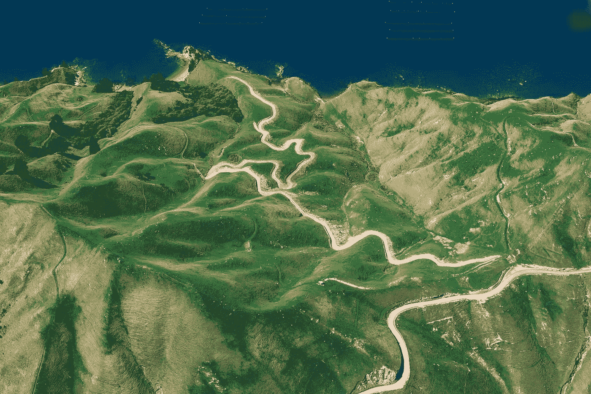
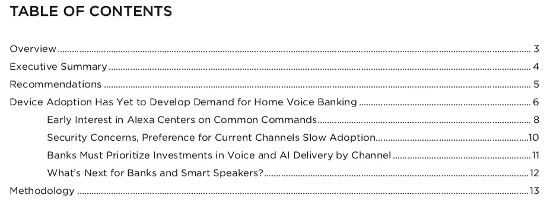
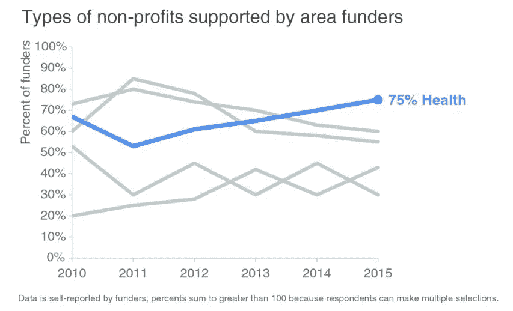

# 数据叙事:提高洞察力到行动的转换，以产生更大的现实世界影响

> 原文：<https://towardsdatascience.com/data-storytelling-improve-insight-to-action-conversion-for-a-greater-real-world-impact-b94e1827fa01?source=collection_archive---------6----------------------->

Photo by [Alex Siale](https://unsplash.com/photos/qH36EgNjPJY?utm_source=unsplash&utm_medium=referral&utm_content=creditCopyText) on [Unsplash](https://unsplash.com/search/photos/map?utm_source=unsplash&utm_medium=referral&utm_content=creditCopyText)

# 数据科学结果和现实世界影响之间的差距

数据科学家有两种类型:B 型和 A 型。[B 型用于构建，A 型用于分析](https://www.quora.com/What-is-data-science/answer/Michael-Hochster)。对应这两种类型，在数据科学项目中，我最担心两种潜在的结果。第一，模型不能进入生产系统。第二，洞察力不会导致行动。这两个令人沮丧的结果发生在从数据科学到其他领域的过渡中:一个是从数据科学到软件工程，另一个是从数据科学到业务执行。这两个转变是创造现实世界影响的关键途径，因此在这些转变中取得成功的风险很高。在移交过程中，软件工程师可能会说模型不符合他们的工程标准，业务合作伙伴可能会声称洞察很有趣，但没有采取任何行动。这些“因果关系”阻止了数据科学的成果重见天日，并且发生在数据科学家的身上([链接](http://There are two types of data scientists: type A and type B. Type A is for analysis and type B is for building. A Quora answer from Michael Hochster illustrates these two types in details. Whether you are a type A who supports decision makers with data analysis or type B who builds models to make products smarter, you have an inspiration  to not only create data science solutions but also to drive results in practice. A result could be a business decision or a code commit into production. The last step in data science project life cycle is ,  I worry about other challenges less. With the right setup, it is more or less straightforward to acquire data, clean data, explore data, learn from data, engineer features, create visualizations, build models and conclude results. These items are well covered by learning materials and are the familiar challenges to data scientists.))。

这两个结果比其他典型的数据科学挑战更令人担忧，因为我们无法控制移交后数据科学结果的命运。尽管我们的控制非常有限，但我们应该采取行动来影响这两种结果。模型部署在不同的组织中有不同的含义，但是人们一致认为编写生产级代码有助于数据科学家进行部署。Trey Causey 在他的博客[这里](http://treycausey.com/software_dev_skills.html)中列出了数据科学家在编写生产级代码时的一些首要任务。简而言之，使你的代码模块化，创建文档，使用版本控制，包括日志记录和设置测试。许多数据科学家采用自顶向下的命令式风格编码；这种风格给与软件工程师合作制造了障碍。为了使部署工作顺利进行，请编写生产级代码。

将洞察转化为行动，就像将“心智代码”部署到“社交机器”中。如果数据科学家可以通过编写生产级代码来改进模型部署，那么数据科学家可以做些什么来改进 insight 的部署呢？强大的数据叙事是一个关键的解决方案。来自数据的引人注目的故事可以给观众留下持久的印象并激励行动。

数据讲故事听起来很棒，但却是一个模糊的概念。为了真正深入了解数据讲故事，最近我回顾了科尔·克纳弗里克的《用数据讲故事的 T2》和内森·尤的《有意义的可视化 T4》。这两本书让我对数据讲故事有了新的认识。基于这两本书和我的经验，我想向你展示优化洞察力到行动转换的策略。

**概述:**

1.  **将洞察力放在展示层级的顶部**
2.  **在视觉层次结构的顶端做出大胆的声明**
3.  **争取合理的见解-行动转化率**

# 1.**将洞察力放在展示层级的顶部**

几个月前，我知道了一种展示数据科学成果的方法。我认为这是最好的方法，因为无数的科学论文选择了这种方法。为了以这种方式展示我的数据科学成果，我会从背景开始，谈论数据源，使用图形和表格来突出数据属性，谈论模型构建，讨论建模结果，最后总结洞察力(在适当的时候呼吁采取行动)。在这个流程中，洞察力排在最后，因为对数据和模型的基本解释为观众对洞察力的真正理解做好了准备。这个流程对我来说很好，直到我开始向业务合作伙伴呈现数据结果，这些业务合作伙伴是业务执行方面的老手，但却是数据科学的局外人(不幸的是，今天的大多数决策者都有这种情况)。

我的商业伙伴对我的数据探索不太感兴趣，也对建模细节不感兴趣。他们对这些见解感兴趣，并建议我将数据细节移到附录中。起初，我对他们对科学推理过程的轻微关注感到惊讶，在我采纳了他们的建议后，我发现我的数据故事更快地引起了他们的共鸣。隐藏定量推理过程受到欢迎。更进一步，我开始回溯任何与我的见解间接相关的东西。现在我讲故事更多的是围绕结论，而不是围绕数据建模过程。Josh Bernoff 在他的书*中的一段话很好地总结了这一观察:*

> 你必须颠倒你在学校里所学的推理和写作。你学会了从热身开始，然后进行推理，从基本原则出发，得出结论。商业读者没有时间热身，也缺乏耐心进行深入的推理，除非他们事先知道回报。所以从大胆的陈述和结论开始。然后继续你的推理。这样，那些没有阅读整个文档的读者仍然会从阅读你的结论中受益。

我仍然会和我的技术同事说行话，但是，决策层级越高，我就越需要像 Josh 建议的那样颠倒我的故事流程。另一个职业，顾问，有着支持企业高管决策的悠久历史。看起来顾问们很久以前就已经知道了前置洞察的必要性。我看到一篇由家庭语音银行顾问撰写的研究论文。这篇论文的流程是久经考验的讲故事的方式。

Table of contents in a research paper from an advisory firm

正如您在上面的目录中看到的，顾问将建议放在执行摘要之后，将方法放在最后一节。介于两者之间的所有东西都是带有行动含义的大胆声明。在本文中，智能音箱银行的需求较低，因此顾问建议银行谨慎从事。这种方法在咨询师中很常见。

无论是以写作的形式还是以演讲的形式，紧接在开头之后的位置是表达层次的顶端。为了有助于洞察到行动的对话，洞察应该放在首位，而不是其他。

# 2.**在视觉层级的顶端做出大胆的声明**

数据可视化是数据故事的决定性时刻。它们是表格和图表，由视觉提示、坐标系统、比例尺、周围文字等组成。数据可视化既是一种交流信息的伟大方式，“一张图片胜过千言万语”，也是一种伟大的分析方式，“一张图片的最大价值在于它迫使我们注意到我们从未期望看到的东西”，John Tukey 在*探索性数据分析*中说道。考虑到数据可视化的有用性，我们可以通过更好地使用数据可视化来显著改进数据讲述。

在过去，对我来说，数据可视化优化就是让图形更有表现力。我会浏览我起草的表格和图表，找出有趣的，添加缺失的标题、图例和颜色，最后把它们放到我的演示文稿中。这种方法一直工作得很好，直到最近我的合作者在信息就在他们面前的时候询问信息。我现在意识到，我的图表显示了信息，但没有指示应该看哪里。

在*用数据讲故事*和*有意义的可视化*中，利用预先注意属性创建视觉层次的概念帮助我看到了数据可视化真正令人信服的力量。数据可视化不仅仅是使用正确的格式显示数据，还包括使用隐含的视觉指令来指导受众如何轻松处理给定的信息，并在视觉层次结构的顶部提供洞察力。我将用两个案例来说明。

这是科尔·克纳弗里克的一个案例研究。下面的第一张图是一个典型的意大利面条图。意大利面图在时间序列研究、重复测量研究等等中被大量使用。下图有正确的标题、轴和图例。从技术标准来看，这是一幅好图。然而，读者很难知道它试图说什么。

这个改进的版本使用了预先注意属性。下图用粗体蓝色突出显示了最大的增长趋势。所有其他趋势都用灰色作为背景。读者现在更容易理解这种可视化，因为读者通过更好地定义的视觉层次结构得到指导。

在我采用这种做法后，当我使用预先注意属性来突出我想说的话时，我立即看到了来自我的观众的更快、更强和更积极的反应。视觉层次真的很管用。

在另一个案例研究中，Cole Knaflic 展示了头衔的强大用途。在下图中，标题不是典型的“一段时间内的票据量”，它是描述性的，而是被动的。标题是“请批准雇用 2 名全职员工”，呼吁采取行动。这一行动号召有助于观众从趋势线中发现缺少 2 名员工会导致绩效差距。

我总是以一种描述性的方式使用标题:“X 和 Y 的趋势”，“A 和 B 的分布”等等。现在，我的标题要么是行动呼吁，要么是问题，要么是见解。标题是数据可视化中最重要的不动产，富有表现力的标题确实有助于提升我们的洞察力。

由于科尔和 T2 内森的功劳，我真诚地推荐他们的书，他们有许多其他可能对你有用的技巧。

# 3.**争取合理的见解-行动转化率**

数据故事不是一次性表演。你会被要求一遍又一遍地向不同的利益相关者讲述同一个故事，尤其是当你的洞察力成功地引起你最初的听众的共鸣时。这个过程就像一场路演，你推销你的数据故事，以获得尽可能多的认同。有了足够的认同，人们就会采取行动:以不同的方式瞄准销售潜力，调整做法以提高运营效率，关闭不必要的产品功能，推出新流程以防范风险，等等。正如一句中国谚语所说，“牵一发而动全身”，将一个见解转化为一个行动会对本组织的许多部门产生连锁反应，这自然会引起来自许多方面的审视。这些审查压力测试你的故事。

带着适度的怀疑，人们可以质疑你的数据质量、假设和建模方法。如果人们看到基础数据中的错误，就会削弱你的故事。从不同的角度来看，人们可能会问你范围之外的问题，这会导致额外的分析迭代。即使你的数据故事被完全接受，人们可能会要求你的数据，图表和模型进行带回家的分析；人们可能会在其他会议上要你的图表。这些需求驱使你把你的故事记录下来，便于阅读，模块化和互动。如果你通过这些压力测试不断改进你的故事，你的故事会变得更加完美，更接近一个行动。

路演可能会成功，也可能会失败，或者介于两者之间。A 型数据科学家需要对从洞察到行动的对话有一个合理的预期。如今，每个企业领导者都高度评价数据驱动的决策，让数据解决方案成为商业世界中的英雄极光，但这一趋势并不意味着决策将只由数据驱动。决策仍然是科学和艺术的复杂混合体，是数据逻辑和商业逻辑的混合体。在现实世界中，高管们利用多种来源的定性和定量情报来做出决策。一项数据科学分析直接决定一项主要业务活动的想法并没有错，但却有误导性。过去，在这种想法的驱使下，如果分析最终导致了行动，我会认为它是成功的。我看到了这样的成功，但是我看到了更多的案例，在这些案例中，洞察力被接受了，但是没有被转化。随着对复杂商业世界的进一步观察，我现在得出结论，将洞察力转化为行动部分取决于洞察力有多强，A 型数据科学家的成功不应该由他们的分析所促成的商业行动(和商业结果)来判断。放下数据英雄的幻想，承认洞察力的实际局限性，有助于我更好地专注于自己的工作，而不是被超出我控制范围的事情分散注意力。

# 最后的想法

洞察力是数据科学工作的一个重要成果。我们在数据中寻找洞察力，因为我们希望洞察力能帮助我们让这个世界变得更美好。将洞察力转化为行动是实现有价值的洞察力的方法。因为数据科学家通常会将洞察力交给其他专业人员来采取行动，所以数据科学家应该优化他们的数据叙事，以保持洞察力到行动的成功转换。以合理的洞察力到行动的转化率为目标，数据科学家可以通过将洞察力放在呈现层次的顶部并在视觉层次的顶部做出大胆的陈述来讲述更强有力的数据故事。

一如既往，我欢迎反馈，并且可以联系到我 [@yuzhouyz](https://twitter.com/yuzhouyz)