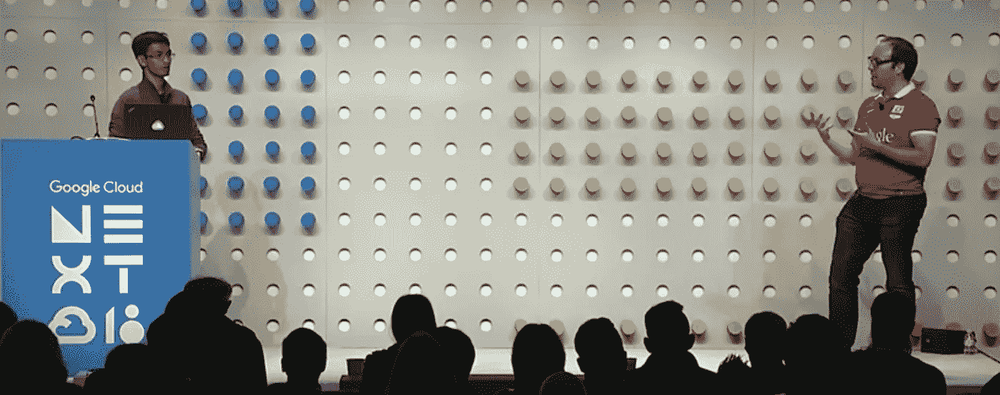

# 使用 BigQuery 的数据工作室:2018 年最佳实践

> 原文：<https://towardsdatascience.com/data-studio-with-bigquery-2018s-best-practices-d2824620cb35?source=collection_archive---------12----------------------->

## 多年来，我一直使用 BigQuery 和公共数据集[来发布有趣的文章](https://medium.com/@hoffa)——现在有了 Data Studio，我可以让它们在媒体上互动。在这里找到我们迄今为止开发的使 BigQuery 和 Data Studio 协同工作的最佳实践。

【2019 重要更新:BigQuery 和 Data Studio 之间要使用 [**BI 引擎**](https://cloud.google.com/bi-engine/docs/overview)

 **[## BigQuery BI 引擎介绍| BI 引擎|谷歌云

### 测试版该产品或功能处于预发布状态，可能会有变化或支持有限。有关更多信息…

cloud.google.com](https://cloud.google.com/bi-engine/docs/overview)** 

**谷歌数据工作室完全免费，你也可以使用它。将它与许多不同的来源联系起来真的很容易，包括 BigQuery。这就是我现在所做的:我用 BigQuery 分析数据，我把结果连接到 Data Studio，我让我的仪表板交互，我[在媒体上发布它们](/when-will-stack-overflow-reply-how-to-predict-with-bigquery-553c24b546a3)。**

**Interactive dashboard — click to play with it: [World Cup goals](https://medium.freecodecamp.org/world-cup-all-the-goals-in-2018-b52e5ef53e0a)**

**但是也有一些挑战。如您所知，BigQuery 允许您在几秒钟内分析大量数据——并且它只对您运行的每个查询收费。我们甚至有一个[免费的月层](https://cloud.google.com/free/)用于查询，所以你可能最终什么也不用付。但是如果您将 BigQuery 连接到一个流行的仪表板，那么您的用户最终可能会代表您生成大量的查询——这意味着您最终会有一个巨大的 BigQuery 账单。我们不想那样。**

**在 Google Next 18 上，Data Studio 的开发者代言人— [Minhaz Kazi](https://medium.com/u/be4fab220f85?source=post_page-----d2824620cb35--------------------------------) —和我做了一个关于[最佳实践的演讲，我们已经开发了这些最佳实践来让我们最喜欢的产品协同工作。](https://www.youtube.com/watch?v=KG8CpA3m1q4)**

**例如，避免将新查询从 Data Studio 推入 BigQuery 的最简单方法是将查询结果具体化到 Data Studio 中。没错，一旦有了想要可视化的 BigQuery 结果或表，就可以使用 extract 按钮来实现，Data Studio 将为您提供一种简单的方法来保存和刷新这些数据的副本。**

**但目前该功能仍在开发中，它将受到某些限制——所以我们还分享了一些其他选项，以在 Data Studio 和 BigQuery 之间创建一个廉价的层。**

**例如，你可以使用 Google Apps 脚本[安排查询](https://developers.google.com/apps-script/guides/triggers/#available_types_of_triggers)，并将结果推送到 Google 云存储中。`csv`文件。然后，您可以将 Data Studio 连接到该文件，该文件将根据您的计划进行刷新，您的用户将能够快速浏览结果。**

**Predicting [when will Stack Overflow reply](/when-will-stack-overflow-reply-how-to-predict-with-bigquery-553c24b546a3)**

**但这仅在结果达到一定规模时有效。在其他情况下，使用支持按键查找的数据库可能更有意义。一旦您知道您的可视化只需要键查找来检索数据，而不是在 BigQuery 中扫描一个表，您就可以将 Data Studio 连接到一个传统的数据库，只从其中获取单个行。在这种情况下，您可以将 BigQuery 结果导出到托管在[云 SQL](https://cloud.google.com/sql/docs/) 上的 MySQL 数据库，添加所需的索引，并快速获得便宜的结果。**

**Reddit kept getting slower throughout 2018\. Source: [Crux](https://github.com/rviscomi/crux-cookbook).**

**但是有时您可能有更复杂的需求——例如，当您想让一个数据源对许多用户可用，并让他们构建自己的自定义可视化时。在这种情况下，您可以使用 Apps 脚本创建一个 Data Studio [社区连接器](https://developers.google.com/datastudio/connector/)，并在其中设计您自己的缓存逻辑。**

**在完整的演讲中，您可以从 Minhaz 的例子中看到这一点——他[创建了一个任何人只需点击几次](https://developers.google.com/web/updates/2018/08/chrome-ux-report-dashboard)就可以使用的连接器，他们获得了一个自定义和可定制的可视化——在 BigQuery 中托管了新数据——无需任何编码——SQL 或其他。**

**总的来说，如果您想连接 BigQuery 和 Data Studio 来创建一个交互式仪表板，并且您想让每个人都可以使用这个仪表板，请记住考虑您想在 BigQuery 和 Data Studio 之间有一个什么样的层。请继续关注，因为在谷歌，我们总是在思考如何让这种联系更加强大和令人敬畏。**

****重要 2019 更新:BigQuery 和 Data Studio** 之间要使用 [**BI 引擎**](https://cloud.google.com/bi-engine/docs/overview)**