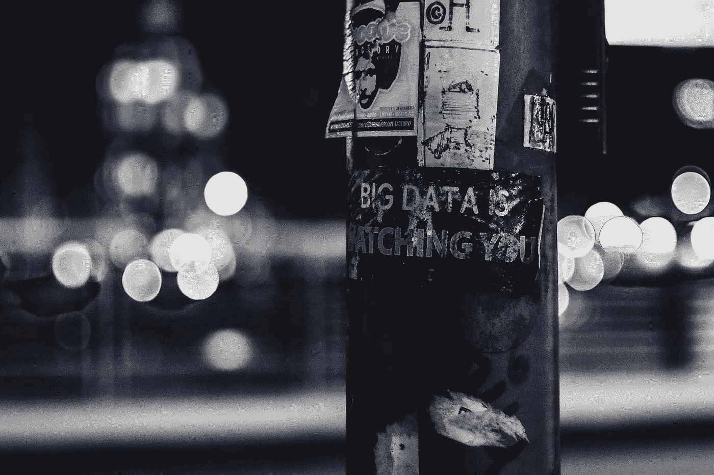

# 非私有互联网中的数据透明

> 原文：<https://towardsdatascience.com/data-transparency-in-an-un-private-internet-8179805f70e7?source=collection_archive---------6----------------------->

信息时代彻底改变了我们互动、交流和被感知的方式。在美国，大约 90%的人口都在互联网上，使用脸书和谷歌来与高中朋友联系并回答他们的问题。谷歌等公司不断收集用户搜索习惯和喜好的数据，以便提供更个性化的结果，并改善他们的公司。

数据收集和出售这些个人数据最近一直是一个有争议的话题，主要是由于脸书和剑桥分析公司的丑闻。在 2017 年的热门科幻电影《圆圈》中，主角梅在一家与谷歌极其相似的公司找到了一份工作，名为“圆圈”。该公司创建了一个类似于脸书的名为“真实的你”的社交网络，并不断创造围绕收集大量数据的新软件和产品，因为“知道是好的；知无不言，言无不尽。”随着电影接近尾声，圈子知道任何人的一切，可以在 20 分钟内追踪到一个人。虽然被大大夸大了，但这显示了不当使用数据可能导致的潜在后果，并引发了一个问题:我们是否应该允许访问人们的私人数据，以改善我们使用的服务的个性化，甚至允许访问政府，以增加国家安全？正确使用数据可以极大地改善产品并使我们的生活更加轻松，但是，作为消费者，我们有权知道我们的信息是如何被收集和使用的。

每次我们注册一个新的网络服务，我们必须接受一个条款和条件合同。这份协议充满了法律术语，对普通消费者来说非常难懂，需要修改以便更容易阅读和理解。在一项由乔纳森·奥巴进行、NPR 报道的研究中，研究人员创建了一个虚拟的社交网站，并为其编写了条款和条件。所有的信息都会被传递给国家安全局，你必须把你的第一个孩子交给公司。500 名参与者中只有 1 人表达了对 NSA 的担忧，近 98%的参与者表示他们甚至没有注意到第一胎条款。实际上，没有人阅读条款和条件(本研究中有 26%的人浏览了文档，其余的人根本没有阅读)，这部分是由于它们的长度，根据 Obar 的说法，“普通用户每天需要花费 40 分钟来阅读所有的隐私和服务条款”，但在很大程度上也是由于文本的可读性。事实上， [2014 年的一项调查发现，](http://www.pewresearch.org/fact-tank/2014/12/04/half-of-americans-dont-know-what-a-privacy-policy-is/) 52%的互联网用户错误地认为“当公司发布隐私政策时，它确保了公司对其收集的所有用户信息保密”。起初，这是令人惊讶的，但仔细想想，许多条款和条件合同可读性差，导致对公司可以用你的信息做什么的严重误解。为了衡量条款和条件协议有多严格，我计算了苹果合同的 SMOG(一个常用的公式，用来计算理解文本需要什么样的教育水平)分数，该合同的分数为 14 年教育。这意味着你至少需要在大学二年级才能完全理解当你注册苹果产品时你所同意的。孩子们获得第一个移动设备的平均年龄是 12.1 岁，他们不可能接受足够的教育来正确理解他们经常盲目同意的东西。

加拿大等国家和欧盟最近通过了通用数据保护条例(GDPR)立法，正在采取措施改善条款和条件以及数据透明度。加拿大有[个人信息保护和电子文档法案](https://www.priv.gc.ca/en/privacy-topics/privacy-laws-in-canada/the-personal-information-protection-and-electronic-documents-act-pipeda/p_principle/) (PIPEDA)，该法案侧重于让公司对个人数据使用管理负责，限制收集和使用、准确性以及少数人对个人数据的访问。GDPR 于 2018 年 4 月中旬刚刚颁布成为法律，并将于 2018 年 5 月 25 日适用。这项法律旨在通过要求具体的数据同意和仔细规范公司商品化和出售个人数据，将数据还给消费者。根据《T2 哈佛商业评论》的一篇文章，25%的人不知道公司可以收集他们的位置数据。然而，通过颁布 PIPEDA 和 GDPR 等法律，政府在数据透明度方面迈出了一大步，更加公开他们收集的数据以及他们如何使用这些数据，并允许消费者查看他们收集的数据。最终，诸如此类的法律将允许消费者更加了解他们个人数据的范围。

根据 T4 外交关系委员会的文章，美国大约有 286，942，362 名网民

> “美国缺乏单一、全面的联邦法律来规范个人信息的收集和使用。相反，政府通过只监管某些部门来处理隐私和安全问题，这[反过来造成]重叠和矛盾的保护"。

最近的 GDPR 法律是美国迄今为止最全面的数据保护，而且是一部欧洲法律！GDPR 正在改变许多美国公司处理客户数据的方式，因为 Snapchat、脸书和谷歌等公司也在欧洲开展业务。这促使许多公司根据新法律修改条款和条件。事实上，在过去的一周里，我每天至少会收到一封电子邮件，通知我某家公司根据 GDPR 规则在数据透明度和使用方面所做的改变。欧洲法律对美国公司数据标准拥有更多控制权的事实是荒谬的，应该(但很可能不会)促使国会通过一项法律。在一项潜在的法案通过之前，它必须通过公共议程引起注意，在数据透明度问题上，这似乎很难做到。2015 年，几乎[的美国人不愿意与企业分享他们的数据，因为他们想维护自己的隐私](http://www.pewinternet.org/2015/05/20/americans-views-about-data-collection-and-security/)，并且“93%的成年人表示，控制谁可以获得他们的信息很重要”。然而，人们对消费者数据的收集和使用方式存在严重误解。虽然大多数人认为公司正在收集你的数据，[不超过 25%的人知道](https://hbr.org/2015/05/customer-data-designing-for-transparency-and-trust)搜索历史、通信历史和 IP 地址是专门收集的。这是一个挑战，大多数消费者并不知道他们收集的数据实际上有多隐私。例如，在 2015 年年中，85%的美国人表示他们信任信用卡公司的个人数据，然而根据 ID Theft Center 2015 年的报告，2015 年在银行、信贷和金融领域发生了 71 起数据泄露事件。普通美国消费者不知道他们自己的数据有多大，也不知道这些数据是如何被使用的，更不用说这些数据被滥用了。这是一个问题，因为为了恰当地规范大公司对高度敏感的个人数据的使用，数据透明是必要的，然而许多美国人并不认为这是一个问题。例如，在 FCC(监管互联网)的网站上，你可以查看消费者提交的所有投诉，数据隐私甚至没有排在前 5 位，它排在不受欢迎的电话和电话营销之后。显然，这在美国不是一个大问题，这主要是因为消费者不知道该行业的不良做法。

美国数据隐私的现状是极度封闭的，并且将会持续下去，直到大多数消费者对此有所表示。条款和条件协议变得越来越难以理解，尽管它们已经更新以符合新的数据监管法律。总体而言，消费者对他们的数据是如何被收集和使用的一无所知，甚至不知道所收集的关于他们的基本信息类型。随着公司及其软件变得更加侵入性(特别是随着人工智能和机器学习的进步)，个人数据隐私将成为一个主要问题。然而，如果没有全国性的行动号召，什么也做不了，这些大公司拥有巨大的游说力量，如果没有明显的反弹，他们将继续不当使用个人数据。