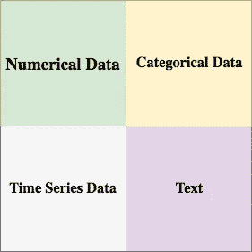
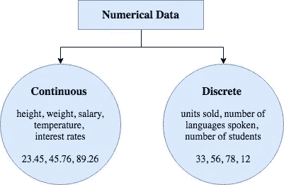

# 从机器学习的角度看数据类型，并附有示例

> 原文：<https://towardsdatascience.com/data-types-from-a-machine-learning-perspective-with-examples-111ac679e8bc?source=collection_archive---------2----------------------->

几乎任何东西都可以变成数据。建立对不同数据类型的深刻理解是对机器学习模型进行探索性数据分析(EDA)和特征工程的重要前提。您还需要转换一些变量的数据类型，以便在数据可视化和讲故事中为可视编码做出适当的选择。

从机器学习的角度来看，大多数数据可以分为 4 种基本类型:数值数据、分类数据、时间序列数据和文本。

Data Types From A Machine Learning Perspective

# 数据

数字数据是数据点是精确数字的任何数据。统计学家也可以称数字数据为定量数据。这些数据既可以作为房价等衡量指标，也可以作为统计数据，比如洛杉矶的住宅数量或去年售出的房屋数量。

数字数据可以用连续或离散数据来表征。连续数据可以采用某个范围内的任何值，而离散数据具有不同的值。

Numerical Data

例如，学习 Python 课程的学生人数将是一个离散的数据集。只能有离散的整数值，如 10、25 或 33。一个班级不能有 12.75 名注册学生。一个学生要么去上课，要么不去。另一方面，连续数据是可以落在一个范围内任何地方的数字。比如一个学生的平均分是 88.25，介于 0 到 100 之间。

这里的要点是数字数据没有及时排序。它们只是我们收集的数字。

# 分类数据

分类数据表示特征，例如曲棍球运动员的位置、球队、家乡。分类数据可以采用数值。例如，也许我们会用 1 代表红色，用 2 代表蓝色。但是这些数字没有数学意义。也就是不能相加，也不能取平均值。

在超级分类的上下文中，分类数据将是类标签。这也类似于一个人是男是女，或者财产是住宅还是商业。

还有一种叫做顺序数据的东西，从某种意义上说，它是数字数据和分类数据的混合。在顺序数据中，数据仍然属于不同的类别，但是这些类别是以某种特定的方式排序的。一个例子是等级难度，比如初级、中级和高级。这三种类型的职业是我们给职业贴标签的一种方式，它们在难度增加时有一个自然的顺序。

另一个例子是，我们只是获取定量数据，并将其分组，因此我们有其他类型数据的箱或类别。

Ordinal Data

出于绘图目的，序数数据的处理方式与分类数据非常相似。但是组通常是从最低到最高排序的，这样我们可以保持这种排序。

# 时序数据

时间序列数据是在一段时间内定期收集的一系列数字。这非常重要，尤其是在金融这样的特殊领域。时间序列数据附有一个时间值，所以这可能是一个类似日期或时间戳的东西，您可以从中寻找时间趋势。

例如，我们可以测量多年来房屋销售的平均数。时间序列数据和数值数据的区别在于，时间序列数据并不是有一堆没有任何时间顺序的数值，而是有一些隐含的顺序。收集了第一个数据点和最后一个数据点。

CREA

# 文本

文本数据基本上只是文字。很多时候，你对文本做的第一件事就是用一些有趣的函数把它变成数字，比如单词袋公式。

从机器学习的角度来看，这是四种类型的数据。根据具体的数据类型，这可能会对可用于特征工程和建模的算法类型或可向其提出的问题类型产生一些影响。

如果你有任何问题或意见，请告诉我。以后想写一篇关于基于不同数据类型的特征工程的文章。感谢您的阅读。

# 报名参加🦞:的 Udemy 课程

## [具有机器学习和统计的推荐系统](https://www.udemy.com/course/recommender-system-with-machine-learning-and-statistics/?referralCode=178D030EF728F966D62D)

[https://www.udemy.com/course/recommender-system-with-machine-learning-and-statistics/?referralCode=178D030EF728F966D62D](https://www.udemy.com/course/recommender-system-with-machine-learning-and-statistics/?referralCode=178D030EF728F966D62D)