# 让您的数据自己说话！少即是多(而且人们不读书)

> 原文：<https://towardsdatascience.com/data-visualization-best-practices-less-is-more-and-people-dont-read-ba41b8f29e7b?source=collection_archive---------0----------------------->

我最近从一家分析公司得到了一些非常可怕的数据可视化的例子，这里就不说了。所以，我开始教育我的员工，好的数据可视化是什么样子，大小、微妙的颜色和位置是传达信息的最佳方式，而不是对他们大喊大叫。如果你仍然在你的图表上使用明亮的背景——看看你，孩子。您需要高数据-油墨比率。这意味着更多的墨水(在大多数情况下，数字墨水)被用来传递数据，而不是任何其他元素。

如果你已经错过了信息过载的时代，只要知道人们不会通读文本——(读者，你还在吗？；你的图表必须坚如磐石。他们必须独立——他们不能接受任何解释。他们不能要求人们阅读附带的文本来理解。它们不应该用大量的亮色和粗体来分散信息——尽量少用这些元素！你不能把认知负担放在用户身上——如果你让理解你的研究变得太难，这肯定不会让他们愿意投资你的公司。你如何向人们传达信息至少和研究本身一样重要！，我内心的科技作家和外在的 UX 自我尖叫道(声明:我是一名科技作家多年:-D)。毕竟，你是想用你的数据赢得人们，而不是迷惑他们！

以下是我将在本文中讨论的一些亮点:

*   只有在添加信息时才明智地使用不同的颜色
*   不添加 chartjunk
*   具有高的数据-墨水比率。彩色背景有损于所传达的信息
*   使用正确类型的图表来传达信息
*   理解特定颜色的含义，如红色和绿色，并有节制地使用它们来分别表示问题和成功。
*   将图表值放在尽可能靠近其详细描述的图形部分。尽可能避免传奇。
*   使用元素大小、颜色饱和度和位置来传达信息
*   少即是多！

# **这里有一些坏数据的例子，更好的是，如何修复它们:**

**过度使用颜色有损实际数据**

颜色应该被明智地使用，只有当使用颜色传达更多的信息。

这张图表有很多问题:

*   颜色的随意使用和一些类别使用相同的颜色会让人觉得这些类别之间有某种联系。当用户努力寻找例如产品/服务交付速度和移动策略集成之间的联系时，这引入了认知负担。我们想知道，为什么新的商业模式本身是蓝色的？
*   在图表中，红色通常用于显示错误，橙色用于警告。但在这里，用著名的马克·吐温(我承认我崇拜他)的话来说，最好的做法是，“这条规则被抛下，在上面跳舞”。产品交付的速度用红色表示，但它代表了图表中的最大收益。
*   明亮的蓝色背景会使用户更加困惑。使用明亮、饱和、引人注目的颜色(尤其是红色、橙色和黄色)会导致眼睛不知道先关注什么。用户最终会跳来跳去，而不是真正接受你想要他们接受的信息。
*   好像所有的红色还不够，增加了一个红框，进一步分散了用户的注意力，甚至没有任何东西显示为什么红框会在那里。

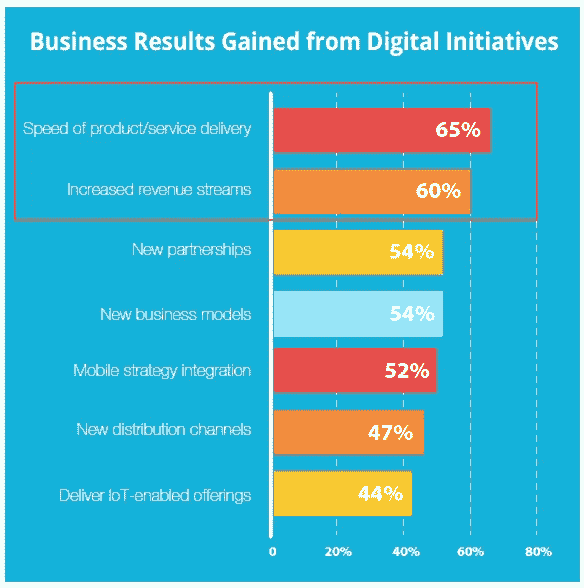

***改版:***

在这里，我已经减少到只有蓝色，减少了图形线条的重量，删除了背景(白色背景对大多数用户来说是最可读的)，并添加了一个小括号指示器来代替红色框，并配有文本。没有什么留给读者去理解。请记住，读者不会花时间阅读附带的文字，只会快速浏览一下你的图表，看看是否值得进一步研究。你不会再有第一印象的机会了！

**重治疗处处招关注——什么重要？！**

这是另一个罪魁祸首，整个图表都让你眼前一亮。但是你想传达的关键信息是什么呢？让你困惑的是:

*   一切都是粗体的——线条、圆圈和数值
*   图例上的文本看起来很重要，但却被包裹在 4 行中，妨碍了可扫描性
*   明亮的蓝色背景使整个东西颤动起来
*   网格线与背景和数据的对比度太高。他们应该被制服，微妙地传递信息，但不是尖叫。

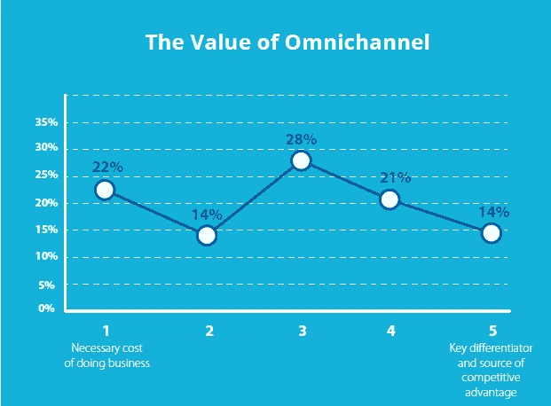

***改版:***

在这里，一个更饱和的大胆的处理和文字被用来传达重要的部分，和大小被用来立即传达价值的差异。文本被缩短，文本列的长度被加宽，以便更快地扫描。

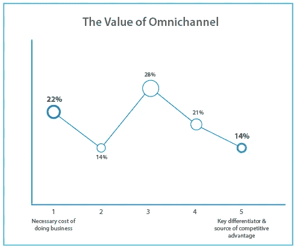

**颜色、文本、箭头——哦，天哪！**

有许多事情使下面的图表难以理解。

*   弹出的是箭头。它们到底是什么意思？我找不到知道的人！49%的内部部门系统流向 36%的客户供应链？什么？
*   为什么是红色和橙色？！这些本身就引人注目，但在蓝色背景的映衬下，它们似乎在颤动。不是你想要的，除非它是一张迷幻的黑光灯海报，就像我们在大学时代回到斯潘塞(在美国)一样；-D！
*   不必要的长标签会导致缺乏即时理解。
*   疯狂长标题！像狄更斯时代一样，这个机构是按角色收费的吗？；-D

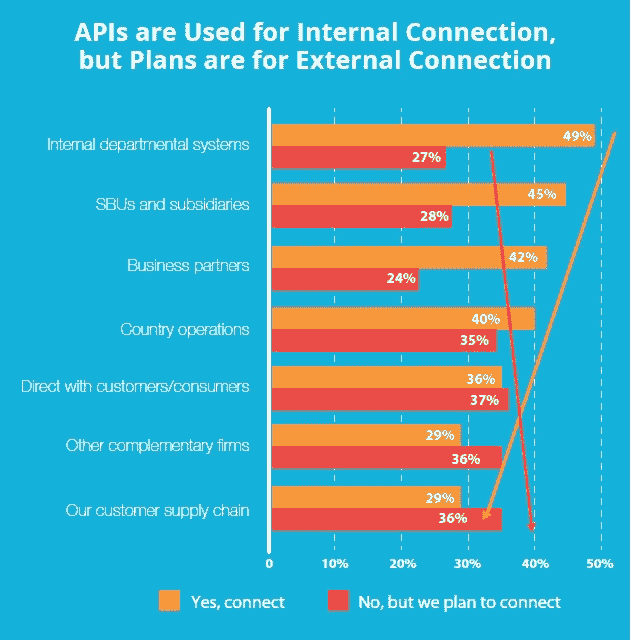

一百万年后，你可能也猜不到这些箭头是什么意思——我甚至犹豫是否要告诉你。显然，它们应该是趋势线。嗯……嗯，对我没有，对我问过的其他人也没有。

在这里，在与主要利益相关者交谈后，我简化了——当我们真正想要的是显示外部 API 使用的增加趋势时，显示内部 API 使用的减少趋势有那么重要吗？为了传达这两种价值，把图表弄乱值得吗？在这种情况下，我们决定它不是。

***改版:***

在这里，将颜色减少到只有两种，都是蓝色的阴影，在这里，外部扩张被显示为更重要，用更饱和的蓝色来吸引注意力。一个简单的花括号指示器被用来代替原始图表上那些神秘的箭头。标题和图例文本被缩短，以便于理解和浏览。

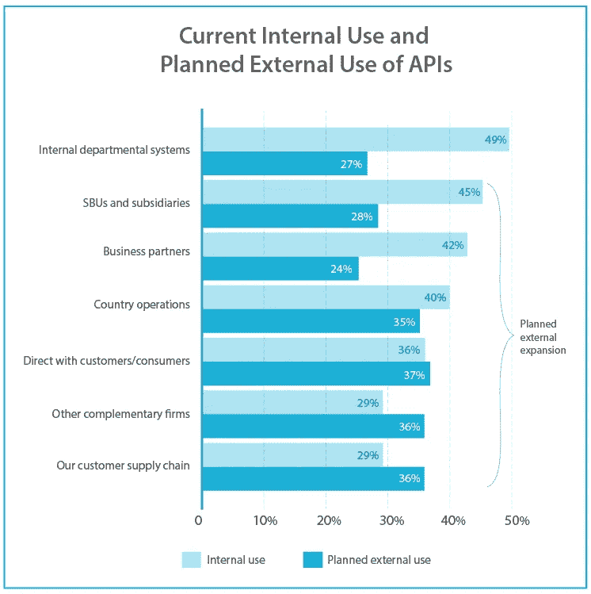

**从头开始！**

在某个不知名的地方随机出现的图表应该能够解释它们自己，以及它们为什么会出现在那里(是的，马克·吐温的读者，你可能知道我最喜欢的作者的一种说话方式。我是一个博学的人，这意味着我从许多知识流派中汲取知识——我喜欢吐温——如果有一天我发明了时光机，或者你发明了时光机，塞缪尔·克莱门斯是我最想见到的作家！:-D)。

除了我们已经详细讨论过的背景和过度饱和、引人注目的颜色之外，这里还有另一个数据 viz 规则——为了有效地传达信息，图表应该从 0 开始。任何其他事情，你试图扭曲数据，以显示其他东西！诚实对待你的数据！

在这里，蛋糕层毫无意义。为什么他们从中间开始？很难比较。相同颜色的条传达了一种不存在的关系。而且横条看起来也不成比例。

***改版:***

这个超级简单。就像所有优秀的故事讲述者一样，从头开始！我也简化为蓝色主题。正如你将在后面的一些图表中看到的，我也开始使用饱和度来传达意思，但在这里，它们只是不同的蓝色色调:)。

**一致地传达信息**

如果第一次你使用一种方法来表达一种尺度，不要为了增加更多的颜色而在下一次使用不同的方法！您可能会在前面的示例中认出这个用在折线图上的从低到高的比例，但它变得更加复杂了！

在这里，除了背景和颜色，我已经唠叨够了；-D，红色边框、图例和颜色合并到 x 轴中。网格标记实际上甚至没有必要，因为百分比就在横条上。

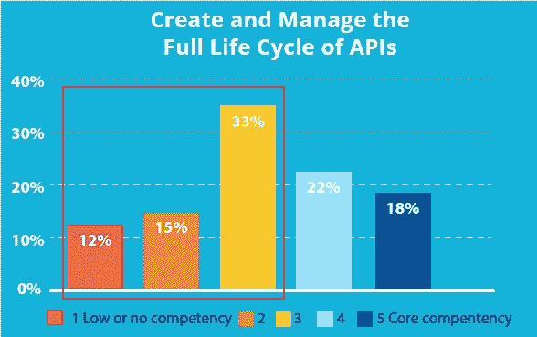

***改版:***

我告诉过你我要开始用饱和度来传达意思，就是这样！耶！通过使用越来越饱和的蓝色，我们传达了意义——低能力到核心能力。投入的时间、精力和金钱由较高的饱和度表示。哦，对了，还有那个花括号来代替上面那个神秘的没有标签的红盒子。图例被简化为仅包含重要信息。

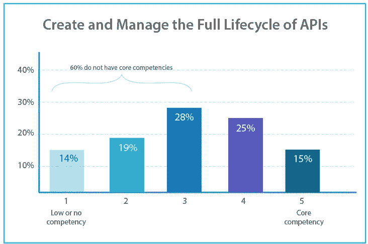

颜色有意义——用它来传达信息！

这里，重要的信息不是“没有计划”部分，而是“是”部分和“没有，但有计划”部分。没有计划是特别不重要的。这表明他们已经想到了这一点，并放弃了这个想法。这里没什么潜力。那么为什么是红色和橙色呢？为什么要用橙色来引起对最不重要部分的注意？

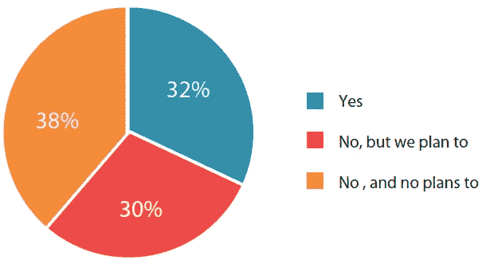

***改版:***

在这里，我看了颜色的含义——橙色表示没有任何意义的计划，红色表示有任何意义的计划——红色和橙色分别用于错误和警告状态，记得吗？没有计划意味着灯灭了，它是灰色的。我还将标签整合到了细分市场中——我的观众没有眼跳——他们不必在图表和图例之间跳来跳去，这进一步妨碍了理解和浏览。

然后，让我们看看饼状图中的现代性。油炸圈饼的使用范围更广。分隔区段的空间使得比较更加困难。我喜欢甜甜圈的另一点(不，不是吃——我很奇怪，我知道)是潜在的核心圈子。我在这里没有使用任何东西，但是你可以展示一些重要的东西，比如被调查的客户数量，或者甚至一张简单的图片来传达更多的信息。哦，可能性！是的，我爱死 UX 了——这表现出来了吗？；-D

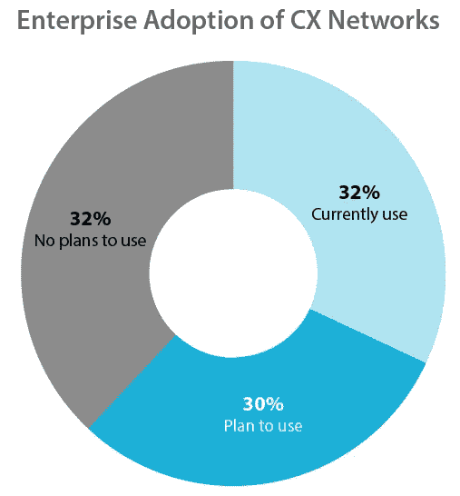

不要让你的读者认为！

哦，这些颜色！它们是什么意思？它们都很亮，但传达不出任何意义！干掉他们，数据可视化蚱蜢！:-D

***改版:***

我不得不在这里做了一点延伸，将不重要的标签移动到段中，但是我觉得这比将标签放在外面的巨大段更好。记住，如果你不能把标签放在片段中，紧挨着它们是下一个最好的选择。例如，如果您必须处理要翻译的设计，这很好。我说的紧挨着，是指毗邻，而不是在传说中。这是我写的另一篇文章，其中我详细讨论了饼图设计和颜色使用，供色盲用户使用，如果你想了解更多信息:[https://medium . com/@ Courtney Jordan/design-for-all-users-why-you-should-care-color-blindness-beabd 61943 EB](https://medium.com/@courtneyjordan/designing-for-all-users-why-you-should-care-about-color-blindness-beabd61943eb)

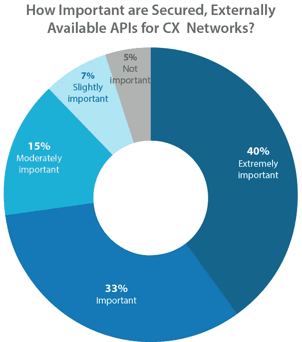

**颜色饱和度和尺寸**

哦天哪！我们还能比这更无聊吗？什么重要？一切都是大胆的，意味着什么都不会被关注。什么都不突出，因为什么都突出！

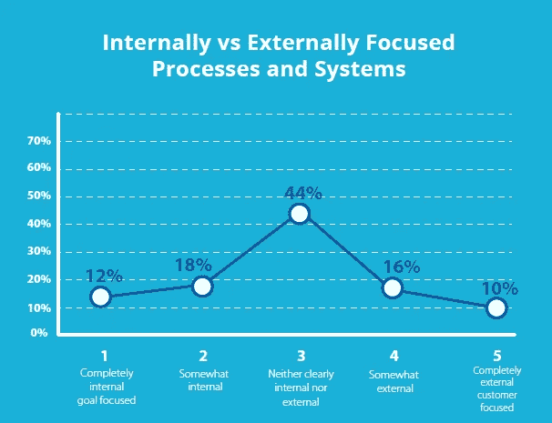

***改版:***

这可能是我最喜欢的重新设计之一:)。在这里，我用了一种不太饱和的蓝色来显示内部焦点逐渐增加到一种更饱和的蓝色，以部分或完全关注外部客户。我还用大小来传达大多数公司的位置。通过将内部和外部的传说分成两种不同的蓝调，并合计每种的百分比，它减少了蓝调可能造成的认知负担。相信我，我试过了:)。

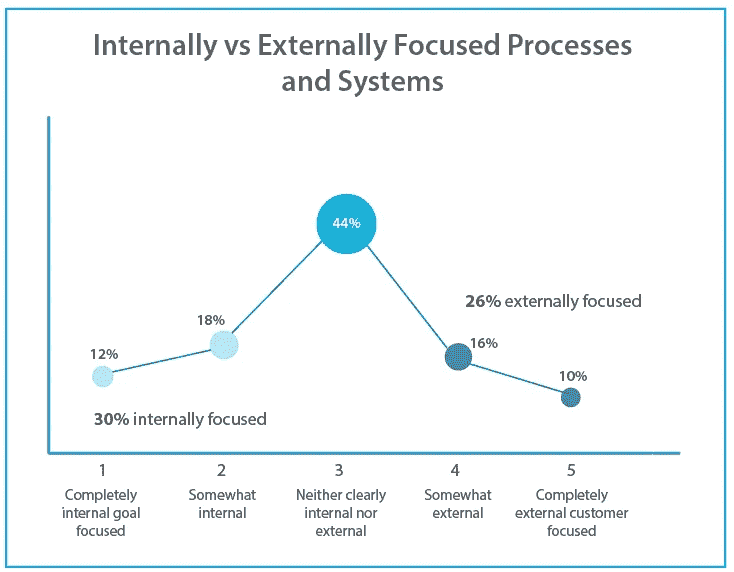

希望您喜欢学习数据可视化及其在传递信息方面的重要性，尤其是让他们阅读，更重要的是理解它。这不禁让更多人议论起来！好的数据可视化让你的公司好看！什么样的潜在客户会去看一家向他们展示令人困惑的图表的公司？你希望那家公司能够帮助你吗？如果你的答案是肯定的，“我在亚利桑那州有一些海滨房产…”:-D

快乐的数据分析和可视化！