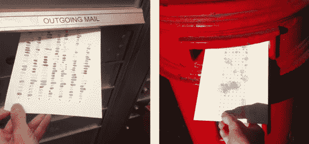

# 数据可视化设计和赏心悦目的命令

> 原文：<https://towardsdatascience.com/data-visualization-design-and-the-eye-candy-imperative-b58afb43f728?source=collection_archive---------4----------------------->

你还记得人们哀叹被称为“信息娱乐”的可怕的新祸害吗？这个词最早出现在 20 世纪 60 年代，但随着 80 年代 MTV 的推出，这个词变得无处不在。如果 MTV 新闻是“信息娱乐”的中心，那么主播库尔特·洛德就是它的代言人。我是看着洛德长大的，我认为他体现了新闻业美好未来的先兆，因为他和 MTV 承认他们的观众对媒体有不同的期望。

事实是，我们需要娱乐(每天都是如此)。但是比这更简单。我们喜欢漂亮的东西。我们喜欢漂亮的人、漂亮的东西和漂亮的想法。如今，即使丑陋也能被遗忘。无论你做什么，不要让我厌烦！

我认为有一种强烈的“赏心悦目的需求”制造美丽的东西不再是一种奢侈。这是强制性的。换句话说，审美很重要。

2016 年我最喜欢的一个项目(现在是一本书)是[亲爱的数据](http://www.dear-data.com/)。这是两位信息设计师乔治·卢皮和斯蒂芬妮·波萨维克的合作，他们在整整一年的时间里，每周都互相发送个人数据的明信片草图。这个项目在很多层面上都是有趣和鼓舞人心的，尤其是在赏心悦目的背景下。为什么？因为 104 张明信片中没有一张是标准的“图表”

每一个都是某个数据集的独特定制视图。每一个都是赏心悦目的，因为它是数据的美丽而有趣的表达。每个都是“信息娱乐”，因为它是信息(数据)和娱乐(艺术表现)。正如我所说的，它们很好地证实了视觉糖果打动观众的力量。这个项目已经席卷了信息设计界，甚至泄露到了更一般的媒体渠道，比如 Slate 和 Quartz。

**视觉糖果在设计中有三个主要的关键目的:**

1.  它让事物在视觉上保持新鲜和有趣
2.  它能把注意力吸引到重要的东西上
3.  它可以提醒观众注意功能

反对视觉糖果的一个论点是，“严肃”的人会质疑视觉糖果是否会降低主题的重要性，或者更糟的是，可能会使设计变得不那么有用或不准确。研究证明这不是真的。[萨斯喀彻温大学](http://hci.usask.ca/uploads/173-pap0297-bateman.pdf)的一项研究调查了“图表垃圾”的概念，这是理解图表信息不必要的修饰，由爱德华·塔夫特创造，至少可以说，他不是一个视觉糖果的粉丝。正如 Tufte 所说，这项研究的目的是确定图表垃圾是否是一个坏主意。

该研究发现，图表垃圾没有任何有害影响——理解的准确性不会因装饰而降低，事实上，与没有添加闪光的图表相比，使用“图表垃圾”视觉效果回忆信息的能力要好得多。

[另一项研究](http://infoscape.org/publications/iv07b.pdf)研究美学对数据可视化可用性的影响，发现用户更喜欢“漂亮”的图表——最好的例子是旭日图——即使他们通常并不真正理解它们是如何工作的。这项研究还发现，人们会花更多的时间在他们喜欢的图表上，学习它们是如何工作的，他们理解的准确性最终不会受到影响。因此，即使更简单的“更有效的”图表可能适用于您的数据，也有理由使用美观的可视化效果。

换句话说，你应该争取形式和功能最纯粹、最充分的体现。做出好看的，有趣的，动画的，创新的新鲜东西。挑战极限，吸引观众眼球，迫使他们离开舒适区一点。记住要小心——在设计视觉效果时，要非常仔细地考虑可用性和你的最终沟通目标。

要了解更多关于数据故事和信息设计的知识，请加入我的[成长社区](https://www.facebook.com/groups/rockthevizcomm/)，在那里我一直在收集关于这个主题的精彩内容。

这篇文章最初发表在[信息博客](https://medium.com/@Infogram/data-visualization-design-and-the-eye-candy-imperative-f75c6d1803b6#.s2lo7xz4i)上。