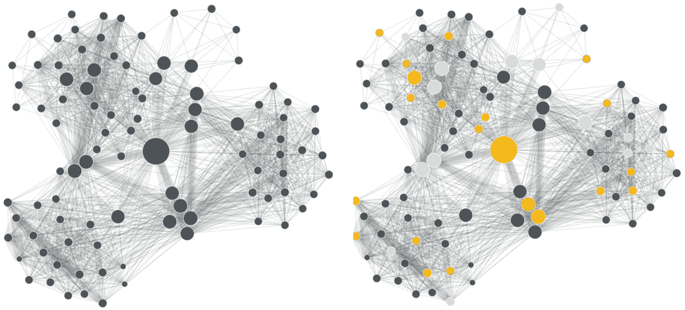
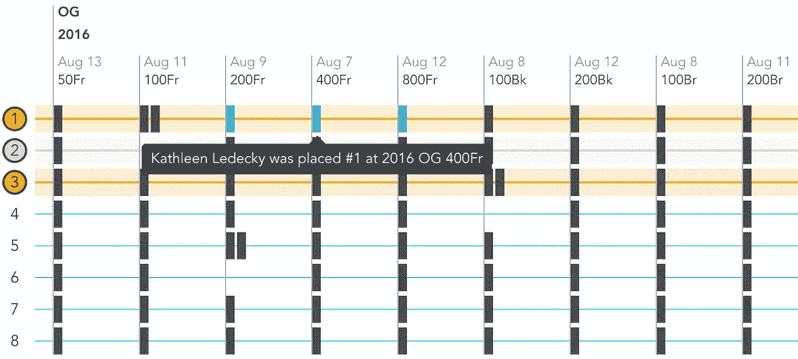
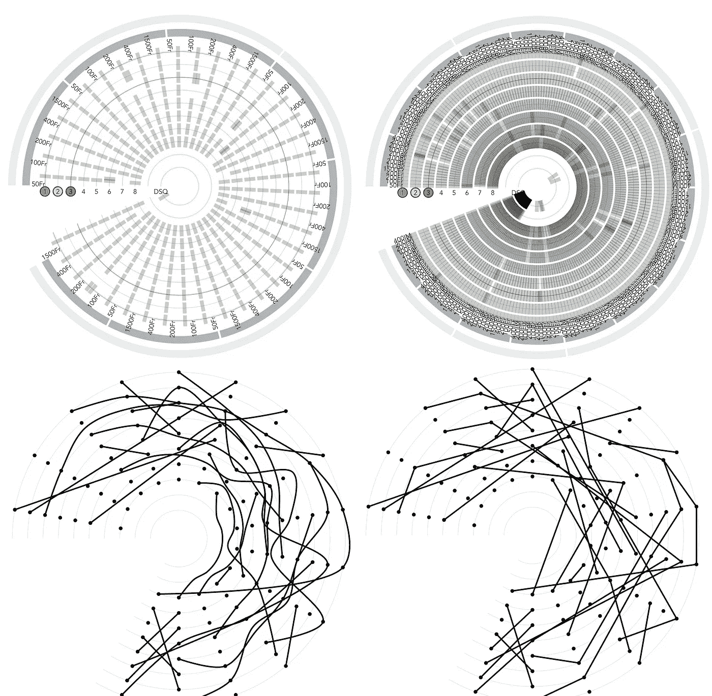
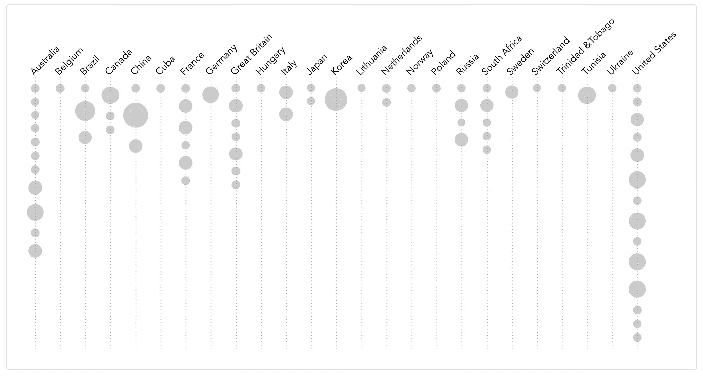
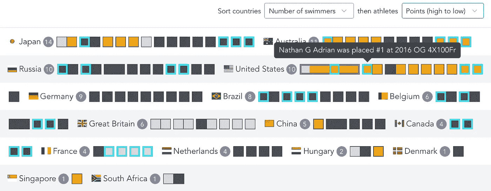
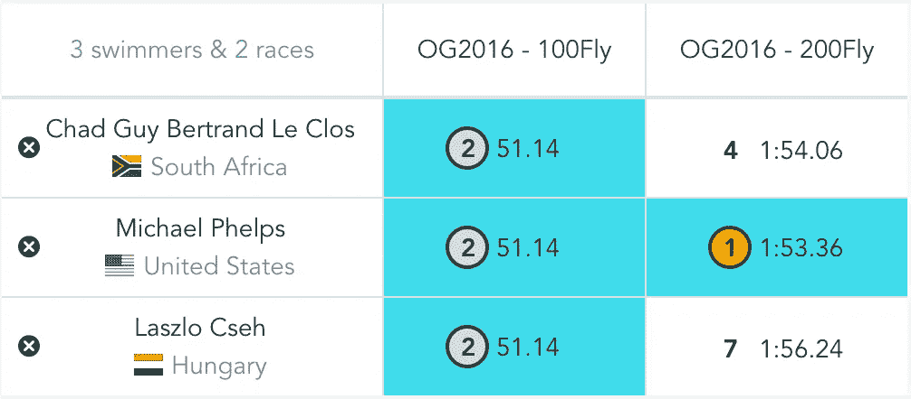

# 优秀游泳运动员比赛成绩的数据可视化(第二部分——设计)

> 原文：<https://towardsdatascience.com/data-visualization-of-elite-swimmers-competition-results-part-2-design-dc86d77946b8?source=collection_archive---------5----------------------->

这个帖子是关于一个数据可视化项目游泳运动员的历史。请查看[上一篇关于数据集生成的文章](https://medium.com/@tanykim/data-visualization-of-elite-swimmers-competition-results-part-1-datasets-bd09b68154c2)。

 [## 游泳运动员的历史

### 大型游泳比赛中优秀游泳运动员比赛成绩的数据可视化。探索+1500 游泳者的历史…

tany.kim](http://tany.kim/swimmers-history) 

通过利用 SwimRankins.net的数据采集工作，我从 2006 年到 2007 年的 544 场重大赛事中创建了 1648 名游泳运动员的历史数据集。那么如何处理这个数据集呢？在这篇文章中，我描述了**三种可视化的构思过程**，以及探索数据集的用户交互设计。这篇文章包括了很多在最终决定之前的可视化设计的图片，我希望用它们来帮助其他**设计师发展他们自己的想法，避免常见的错误**。通过展示同一数据集的各种可视化类型，我还想解释数据集的哪些**方面可以根据可视化设计**来关注或必须忽略。请注意，下面的可视化示例是用整个数据集的子集制作的；用户可以使用选项面板设置自己的子集。

# 游泳主题的颜色

首先，让我谈谈你将在可视化中看到的颜色。对于这个游泳主题的项目，我希望主色接近蓝色，强调色比蓝色稍暖一些。我用这三个作为网站设计的**通用调色板**。由于可视化不是静态图像，我使用这些颜色来突出显示用户交互触发的视觉元素。

在设计可视化效果时，颜色经常被误用，如下所示。

*   编码不适当的数据维度:**在对定量数据进行编码时，颜色不应是首选**
*   冗余:仅出于装饰目的使用颜色会导致**数据维度的冗余编码**(例如，将颜色渐变应用于条形图，以匹配已经通过条形长度呈现的值)。

因为我已经使用了三种主要颜色来通过鼠标悬停或单击来突出显示视觉元素，所以我尽量减少了其他颜色的使用。然而，通过反复的设计，我加入了三种奖牌颜色，事实证明它们对洞察力的发现非常有效。这是**为分类数据**(金、银和铜)应用颜色的一个很好的例子。

Examples of using two main, accent colors (top) and medal colors (bottom) in CSS

# 通过普通比赛的游泳者网络

通常游泳成绩是按比赛和比赛列出的(这正是源网站的组织方式)，但我认为可视化可以做得很好的一件事是呈现游泳者之间的关系。为了突出数据的方面，我使用了 D3 中的[力定向图形库。](https://bl.ocks.org/mbostock/4062045)

Color-coding medalists also helps users to figure out where to start.

我遵循了网络图的一般设计原则。**每个游泳者代表一个圆圈(节点)。**当一名游泳运动员参加一场比赛时，他/她可以获得 700+分，位置更高的游泳运动员可以获得更多分。累积的点与节点的大小(面积，而不是直径)成比例。奖牌获得者用每种匹配的奖牌颜色进行颜色编码。我首先没有想到对奖牌颜色进行编码，但事实证明，除了圆圈的大小之外，添加这些颜色有助于区分成绩更好的游泳运动员。

如果游泳运动员在一场或多场比赛中相互竞争，他们就被联系在一起。**两个游泳者的连线(边缘)呈现半透明的直线。**代表同一个国家在同一个团体项目中一起游泳不被考虑为链接。他们共享的种族越多，线就变得越粗。

下面的四张图片展示了不同的互动状态。

1.  在正常状态下，我会突出显示金牌、银牌和铜牌获得者。
2.  选定(单击)的节点用强调色填充。
3.  对于鼠标悬停效果，使用两种主要颜色来突出显示连接的节点(浅蓝色)和线条(蓝色)。如果链接了以前选择的游泳者，则强调色会被浅蓝色覆盖。
4.  当选择多个节点时，用户可以突出显示所有连接的圆(用白色)和边(用强调色)。此视图是 2 的替代视图。

Network graph has various states depending on mouse interactions and highlighting options

# 以种族为中心的可视化

When a rectangle (as an instance of Ledecky’s single result) is selected, other Ledecky’s rectangles are also highlighted in blue.

在实现了上面的网络图之后，我认为如果有另一种方法来表示游泳运动员参加的每一场比赛，那将会很棒，因为比赛信息没有包含在节点-边图中。基本想法是**显示比赛中的游泳运动员(如果一个游泳运动员参加了多场比赛，他/她有多个实例)**，每个游泳运动员在比赛中被显示为一个细矩形。当一个游泳者被悬停或点击时，所选游泳者的所有实例被突出显示。

Iterations of the radial view show its limitation in scaleability (top) and in showing connected swimmers (dots).

直到上面的最终设计，我经历了许多次迭代。首先，我认为在径向视图中显示比赛有点独特，这也将保持网络视图的方形布局。人们在设计可视化时犯的一个常见错误是**他们忽略了数据集在缩放时的不同形状。**当我想呈现尽可能多的比赛时，我发现在固定大小的画布上很难区分比赛或游泳者。这是我不得不放弃放射状外观的一个原因。

以种族为中心的观点的一个早期想法是通过线条明确地连接同一个游泳者的实例。但是用实际数据实现这个想法并不是很好；游泳运动员并没有参加所有经过筛选的比赛，因此用直线或曲线将它们连接起来会使可视化看起来更加复杂。遗憾的是，我也不得不放弃这个想法，转而接受只用颜色突出显示的想法。

# 按国家可视化游泳运动员

游泳运动员最重要的比赛是奥运会，我们认为这是国家之间的竞争。人们对了解强大的国家感兴趣，所以我设计了一个视图，通过他们代表的国家来探索游泳运动员。

Early work for the country-based view of swimmers

可视化的第一个想法是在 x 轴上排列国家，并将游泳者列为圆圈，编码他们的总点数(与节点-边图相同)。同样，类似于我上面讨论的径向视图，它的可伸缩性不是很好。我可以垂直列出这些国家，然后如果一个国家有太多的游泳者，它就不适合给定的宽度。为了解决这个问题，我可以把游泳者分成多排，这实际上是个好主意。

但是我想在可视化中显示一个游泳运动员的所有比赛，而不是像网络视图那样；为此，我想了一个方法来呈现**游泳运动员在**参加的一组比赛。因此，一场比赛是一个正方形，如果一名运动员在多场比赛中游泳，这些正方形被连接起来形成一个宽矩形。矩形可以很宽，因此由这些游泳者组成的国家也会占据很大的空间。

最后，我决定把所有的比赛、游泳者和国家都列在一个方向上，就像我们写文字一样。如果一个游泳者太长而不能适应一条线，它会打断下一条线。这种划分方式可能会令人困惑，因为大多数游泳运动员都在一个完整的矩形中，但我折衷了这一部分，以涵盖一些极端情况(例如，如果您选择男子所有比赛和项目，一些主要的游泳运动员无法在一条线上。)第一名(金牌)、第二名(银牌)和第三名(铜牌)用相应的奖牌颜色填充。我还用这个漂亮的库添加了每个国家的国旗。与其他视图中选择每个游泳者不同，在国家视图中，每个比赛都可以用鼠标悬停，以浅蓝色轮廓突出显示。

The number in the grey circle next to each country name means the number of swimmers.

# 对游泳运动员比赛成绩的盘问

Swimmers who had the best results a race is highlighted

当用户选择一名游泳者时(通过点击可视化中匹配的可视元素或右边的下拉菜单)，该游泳者的比赛结果出现在可视化下方。当选择多个游泳者时，仅显示他们都参加过的比赛(即，比赛的交叉点)。**这个额外的表格补充了没有显示详细比赛结果的可视化效果**。

# 带有元数据的登录页面

如前所述，用户可以选择将哪些游泳比赛/事件和游泳者包括在可视化中。为了让用户清楚地熟悉这个特性以及数据集的健壮性，我设计了一个入口点来生成相对更有趣的子数据集。

该数据集包括 10 年间的 17 场游泳比赛。我将会议的**“元数据”可视化为类似时间轴的视图。我**把一条传统的直线时间线修改成了波浪。这样时间线可以区分奇数年和偶数年；大型游泳比赛每隔 2 或 4 年举行一次。此外，我认为海浪符合游泳的主题。对于一个介绍性的可视化，我不想让它太复杂。没有用户交互，但这是一个动画。每年的竞赛名称会随着移动的圆圈到达该年而弹出。我可以添加每次会面的日期，但是过多的文本会使视觉效果更加混乱，所以我省略了它们。****

A subtle variation: the Olympic years are on a higher wave than the non-olympic 4-th years.

感谢阅读！如果你想知道你能从这些可视化图像中学到什么，请看下一篇[文章](https://medium.com/@tanykim/data-visualization-of-elite-swimmers-competition-results-part-3-insights-7ec5862f48a7)。