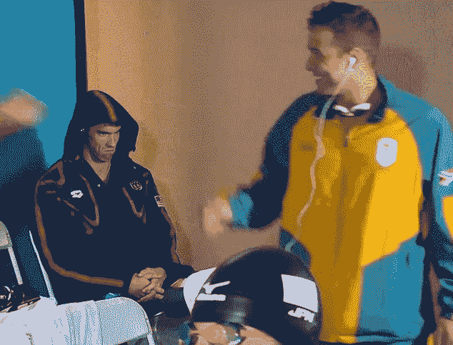
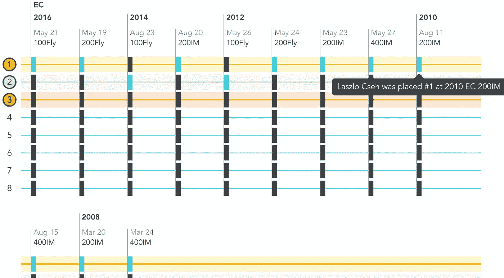
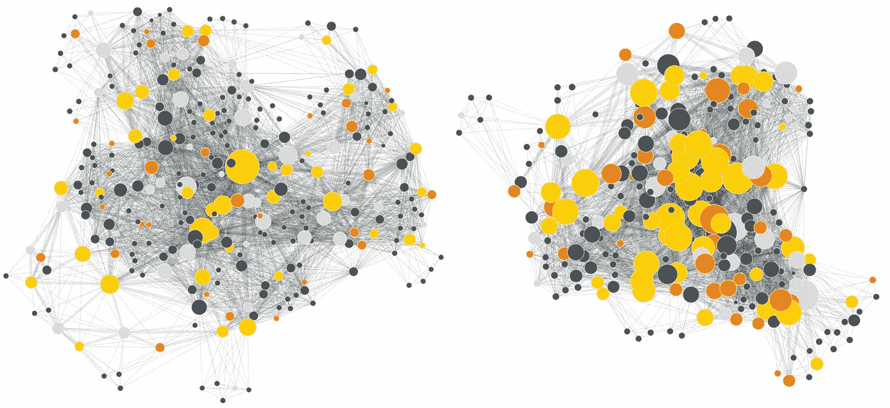
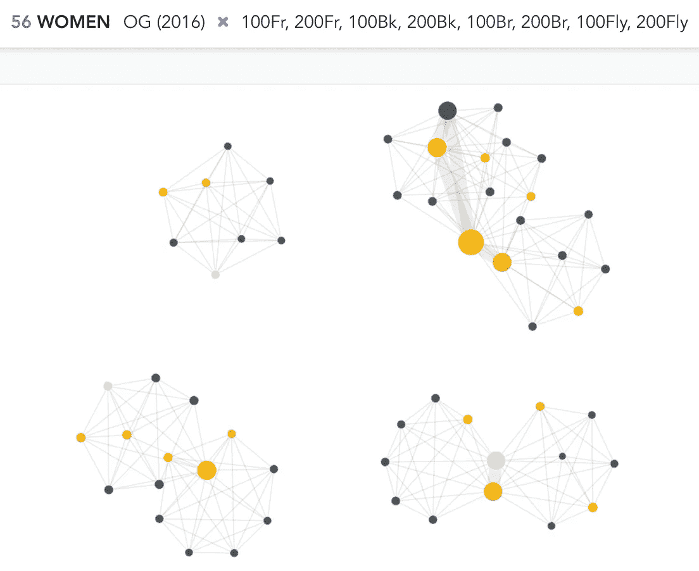
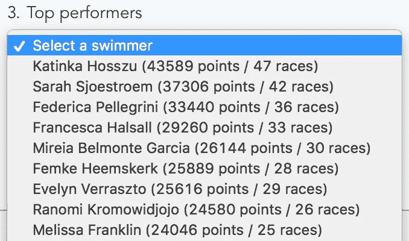

# 优秀游泳运动员比赛成绩的数据可视化(第三部分——洞察)

> 原文：<https://towardsdatascience.com/data-visualization-of-elite-swimmers-competition-results-part-3-insights-7ec5862f48a7?source=collection_archive---------7----------------------->

这个帖子是关于游泳运动员的历史。如果你想了解[数据处理](https://medium.com/@tanykim/data-visualization-of-elite-swimmers-competition-results-part-1-datasets-bd09b68154c2)和[可视化设计](https://medium.com/@tanykim/data-visualization-of-elite-swimmers-competition-results-part-2-design-dc86d77946b8)的技术方面，请阅读其他帖子。

 [## 游泳运动员的历史

### 大型游泳比赛中优秀游泳运动员比赛成绩的数据可视化。探索+1500 游泳者的历史…

tany.kim](http://tany.kim/swimmers-history) 

即使你对游泳不感兴趣，你也一定听说过一些世界级的游泳运动员，如迈克尔·菲尔普斯或声名狼藉的瑞安·罗切特。如果你是一个游泳爱好者，你可能会对这两位游泳运动员的竞争历史感到好奇。这是一个你可以用游泳运动员的历史来回答的问题。

The Phelps Face

“菲尔普斯脸”是 2016 年里约奥运会期间的一个迷因。人们可能想知道为什么南非游泳运动员惹恼了历史上获得奖牌最多的游泳运动员。嗯，有一个历史，你可以很容易地看到它与游泳运动员的历史！这里我描述几个洞察的例子。

# 对手的历史

在选项面板中，我选择了所有奥运会和所有个人项目。然后我选择了菲尔普斯和勒克洛斯来比较他们的结果。是的，勒克洛斯在 2012 年以 0.05 秒的优势击败过菲尔普斯一次。

Le Close beat Phelps once in 2012 at 200M butterfly.

It’s something considering there are only 4 Olympic events that Phelps didn’t win.

当我在观看里约奥运会游泳比赛时，可能是 100 米蝶泳或 200 米蝶泳，我听到解说员说匈牙利的拉斯洛·切赫赢得了四枚奥运奖牌，但没有一枚是金牌，每一枚金牌都被菲尔普斯获得。我觉得这太不可思议了，想看看这是不是真的。在过去的 10 年里，两人都参加了蝶泳和个人混合泳比赛。包括另外两次世界锦标赛，Cseh 从未击败过菲尔普斯。他唯一没有输的一次是在他们的最后一场比赛中——他们在里约的 100 米蝶泳比赛中并列获得银牌。我无法想象在自己的大陆上你是最棒的，但不是全世界最棒的。

History of Phelps VS Cseh

At the European Championships, Laszlo Cseh is absolutely dominating in Butterly and Individual Medley.

# 占优势的游泳运动员

在网络视图中，由于圆圈(节点)的大小代表游泳运动员获得的分数，您可以轻松识别表现更好的游泳运动员。创建一个与迈克尔·菲尔普斯竞争的游泳运动员网络；总共检索到 369 名游泳运动员，你会发现菲尔普斯的圈子明显更大。第二大国家是瑞安·罗切特。

当你选择所有参加过过去三届奥运会的游泳运动员时，你会看到 213 名男子，253 名女子。按性别比较这两个网络，你会发现一个相当大的差异。在男子网中，菲尔普斯是最大的圆心。相比之下，你会看到许多金牌得主的圆圈大小变化不大。

Men (left) and Women (right) Olympian swimmers

# 游泳运动员的风格分布

Four styles are completed separated in Women’s 2016 Olympics.

游泳运动员参加多种风格的比赛吗？让我们找出答案。转到女子，选择 2016 年里约奥运会，然后是四种泳姿的 100 米和 200 米项目——自由泳、仰泳、蛙泳、蝶泳。有趣的是，你会发现没有一个游泳运动员参加过一种以上的比赛。同样的项目，但对于男子，你会看到勒克洛斯是唯一一个参加多种类型比赛的游泳运动员——他参加了自由泳和蝶泳比赛。

# 个人游泳运动员

Highlighted swimmer is Paul Bierdermann of Germany.

你也可以调查一个特定的游泳运动员。例如，我想知道德国的保罗·比德尔曼在 2009 年成为世界冠军后的表现。如果你是一个游泳爱好者，你会记得他的记录太好了，因为冠军赛后被禁的高科技泳衣。也许并不奇怪，他的记录被丢弃了；2009 年后，他从未赢得过奥运会或世界冠军，但仍参加了许多决赛。说到德国，我发现了一件令人惊讶的事情——德国男子游泳运动员在过去的三届奥运会上都没有获得任何奖牌。我记得 1988 年奥运会上东德游泳运动员还是个孩子，这很令人惊讶。

Olympic swimmers at final races — no medalists from Germany….

我还看到荷兰也没有任何奖牌获得者(皮尔特·范·登·霍根班德是我最喜欢的游泳运动员之一！)

Swimmers of high points can be selected from the dropdown menu.

在帖子的前面，我讨论过奥运会上没有明显表现突出的女游泳运动员。但是我们仍然可以看到“勤奋”的游泳运动员——《纽约时报》的这篇文章告诉我们来自匈牙利的 Katinka Hosszu 有些“独特”的训练风格。这是我们可以从游泳运动员的历史中发现的。在奥运会、世界锦标赛和欧洲锦标赛上，Hosszu 总共参加了 47 场比赛，这只是最后一场比赛。

我阐明了你可以从主要游泳比赛数据的可视化中发现什么。我在这里写的只是几个见解的例子。**如果你发现了什么有趣的东西，请留下你的评论！**