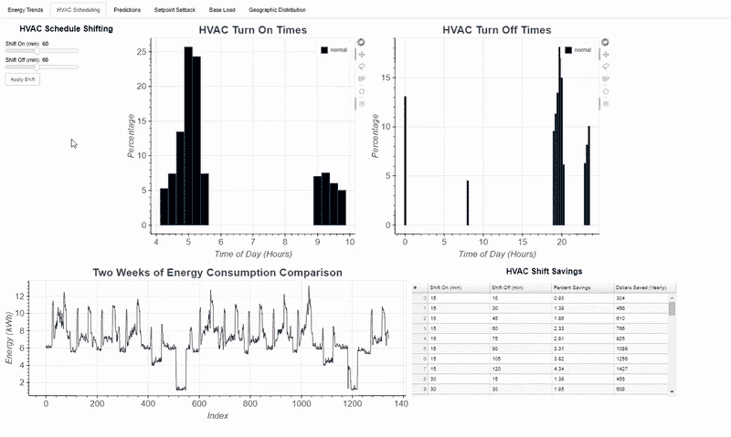
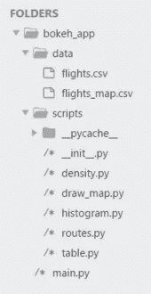
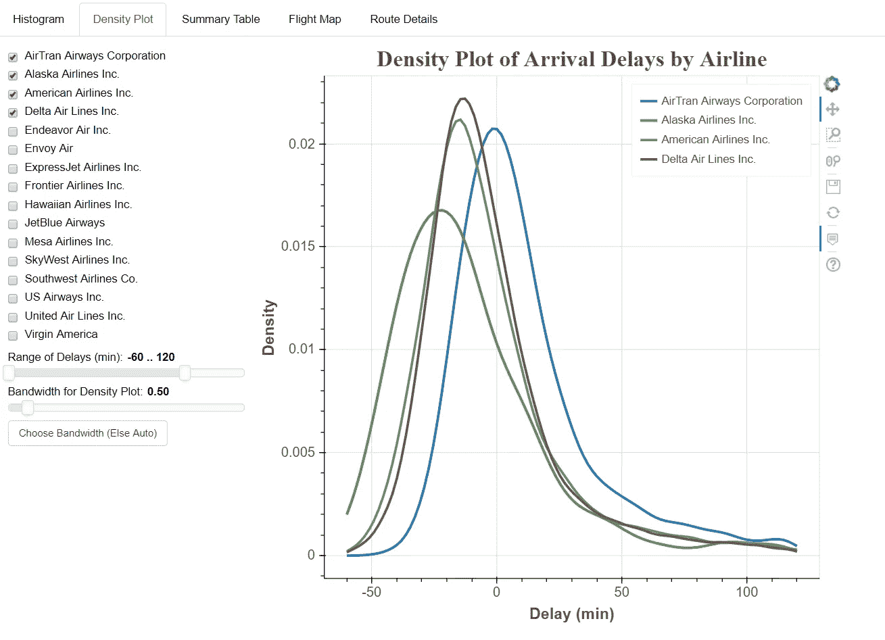
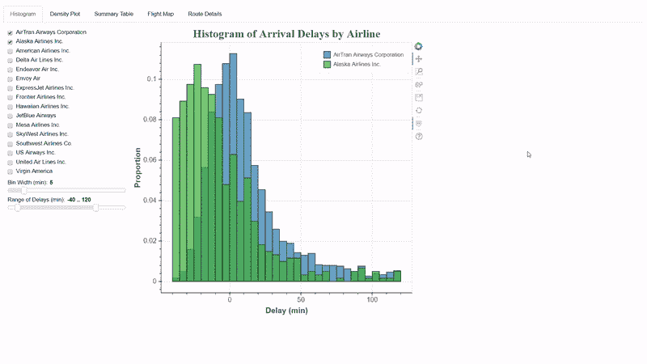

# 使用 Python 中的散景进行数据可视化，第三部分:制作完整的仪表板

> 原文：<https://towardsdatascience.com/data-visualization-with-bokeh-in-python-part-iii-a-complete-dashboard-dc6a86aa6e23?source=collection_archive---------0----------------------->


**在散景中创建交互式可视化应用**

有时我会学习一种数据科学技术来解决一个特定的问题。其他时候，就像使用散景一样，我尝试一种新工具，因为我在 Twitter 上看到一些很酷的项目，然后想:“看起来很棒。我不确定什么时候会用到它，但它可能会派上用场。”几乎每次我这么说的时候，我最终都会找到这个工具的用途。数据科学需要许多不同技能的知识，您永远不知道您将使用的下一个想法来自哪里！

以散景为例，在试用了几周后，我作为一名数据科学研究人员在工作中发现了一个完美的用例。我的[研究项目](https://arpa-e.energy.gov/?q=slick-sheet-project/virtual-building-energy-audits)涉及使用数据科学提高商业建筑的能源效率，并且，对于最近在[召开的会议](http://www.arpae-summit.com/about/about-the-summit)，我们需要一种方式来展示我们应用的许多技术的成果。通常的 powerpoint 建议可以完成工作，但并不突出。当大多数与会者看到他们的第三张幻灯片时，他们已经不再注意了。尽管我还不太了解 Bokeh，但我自愿尝试制作一个与该库交互的应用程序，认为这将允许我扩展我的技能，并创建一种引人入胜的方式来展示我们的项目。我们的团队持怀疑态度，准备了一个备份演示，但在我向他们展示了一些原型后，他们给予了全力支持。最终的交互式仪表盘在会议上非常引人注目，将被我们的团队采用以供将来使用:



Example of Bokeh Dashboard built [for my research](https://arpa-e.energy.gov/?q=slick-sheet-project/virtual-building-energy-audits)

虽然不是你在 Twitter 上看到的每个想法都可能对你的职业生涯有所帮助，但我认为可以肯定地说，了解更多的数据科学技术不会有什么坏处。沿着这些思路，我开始了这个系列来分享 [Bokeh](https://bokeh.pydata.org/en/latest/) 的功能，这是 Python 中一个强大的绘图库，允许您制作交互式绘图和仪表板。虽然我不能为我的研究分享仪表板，但我可以使用公开可用的数据集展示在散景中构建可视化的基础。这第三个帖子是我的散景系列的延续，[第一部分专注于构建一个简单的图形，](/data-visualization-with-bokeh-in-python-part-one-getting-started-a11655a467d4)和[第二部分展示了如何向散景图添加交互](/data-visualization-with-bokeh-in-python-part-ii-interactions-a4cf994e2512)。在这篇文章中，我们将看到如何建立一个完整的散景应用程序，并运行一个可以在浏览器中访问的本地散景服务器！

本文将关注散景应用程序的结构，而不是情节细节，但所有内容的完整代码都可以在 [GitHub 上找到。](https://github.com/WillKoehrsen/Bokeh-Python-Visualization)我们将继续使用 [NYCFlights13 数据集](https://cran.r-project.org/web/packages/nycflights13/nycflights13.pdf)，这是 2013 年从纽约 3 个机场起飞的航班的真实信息集合。数据集中有超过 300，000 个航班，对于我们的仪表板，我们将主要关注于探索到达延迟信息。

要自己运行完整的应用程序，确保你已经安装了散景(使用`pip install bokeh`)，[从 GitHub 下载](https://github.com/WillKoehrsen/Bokeh-Python-Visualization/blob/master/bokeh_app.zip) `[bokeh_app.zip](https://github.com/WillKoehrsen/Bokeh-Python-Visualization/blob/master/bokeh_app.zip)` [文件夹](https://github.com/WillKoehrsen/Bokeh-Python-Visualization/blob/master/bokeh_app.zip)，解压，在目录中打开一个命令窗口，键入`bokeh serve --show bokeh_app`。这将建立一个[本地散景服务器](https://bokeh.pydata.org/en/latest/docs/user_guide/server.html)并在你的浏览器中打开应用程序(你也可以在线公开散景图，但现在我们将坚持本地托管)。

# 最终产品

在我们进入细节之前，让我们看一下我们的目标产品，这样我们就可以看到各个部分是如何组合在一起的。下面是一个短片，展示了我们如何与完整的控制面板进行交互:

Final Bokeh Flights Application

这里我在一个运行在本地服务器上的浏览器(Chrome 的全屏模式)中使用了散景应用程序。在顶部，我们看到许多选项卡，每个选项卡包含应用程序的不同部分。仪表板的想法是，虽然每个选项卡可以独立存在，但我们可以将许多选项卡连接在一起，以实现对数据的完整探索。视频展示了我们可以用散景制作的一系列图表，从直方图和密度图，到可以按列排序的数据表，再到完全交互式的地图。除了我们可以在散景中创建的图形范围之外，使用这个库的另一个好处是交互。每个标签都有一个互动元素，让用户参与数据并做出自己的发现。根据经验，当探索数据集时，人们喜欢自己获得洞察力，我们可以通过让他们通过各种控件选择和过滤数据来实现这一点。

现在我们有了一个仪表板的概念，让我们看看如何创建一个散景应用程序。我强烈推荐[下载代码](https://github.com/WillKoehrsen/Bokeh-Python-Visualization/tree/master/bokeh_app)让自己跟着做！

# 散景应用程序的结构

在编写任何代码之前，为我们的应用程序建立一个框架是很重要的。在任何项目中，很容易迷失在编码中，很快就会迷失在一堆半成品脚本和不合适的数据文件中，因此我们希望预先创建一个结构，以便将所有代码和数据放入其中。这种组织将帮助我们跟踪应用程序中的所有元素，并在不可避免地出错时协助调试。此外，我们可以在未来的项目中重复使用这个框架，这样我们在规划阶段的初始投资将会得到回报。

为了建立一个散景应用程序，我创建了一个父目录来保存所有名为`bokeh_app`的东西。在这个目录中，我们将有一个数据子目录(称为`data`)，一个脚本子目录(`scripts`)，以及一个`main.py`脚本来整合所有内容。通常，为了管理所有代码，我发现最好将每个选项卡的代码保存在单独的 Python 脚本中，并从单个主脚本中调用它们。以下是我在散景应用中使用的文件结构，改编自[官方文档](https://bokeh.pydata.org/en/latest/docs/user_guide/server.html)。

```
bokeh_app
|
+--- data
|   +--- info.csv
|   +--- info2.csv
|
+--- scripts
|   +--- plot.py
|   +--- plot2.py
|
+--- main.py
```

对于 flights 应用程序，其结构遵循以下一般框架:



Folder structure of flights dashboard

在一个父`bokeh_app`目录下有三个主要部分:`data`、`scripts`和`main.py,`。当运行服务器时，我们告诉 Bokeh 服务于`bokeh_app`目录，它将自动搜索并运行`main.py` 脚本。有了大致的结构，让我们来看看`main.py` ，我喜欢称之为散景应用程序的执行者(不是一个技术术语)！

# `main.py`

`main.py`脚本就像一个散景应用程序的执行者。它加载数据，将数据传递给其他脚本，获取结果图，并将它们组织到一个单独的显示中。这将是我完整展示的唯一一个脚本，因为它对应用程序至关重要:

我们从必要的导入开始，包括创建选项卡的函数，每个选项卡都存储在`scripts`目录中的一个单独的脚本中。如果您查看文件结构，请注意在`scripts`目录中有一个`__init__.py`文件。这是一个完全空白的文件，需要放在目录中，以便我们使用相关语句(如`from scripts.histogram import histogram_tab`)导入适当的函数。我不太确定为什么需要这样做，但它确实有效(下面是我用来解决这个问题的[堆栈溢出答案](https://stackoverflow.com/a/48468292/5755357))。

在库和脚本导入之后，我们在 [Python](https://stackoverflow.com/questions/9271464/what-does-the-file-variable-mean-do/9271617) `[__file__](https://stackoverflow.com/questions/9271464/what-does-the-file-variable-mean-do/9271617)` [属性](https://stackoverflow.com/questions/9271464/what-does-the-file-variable-mean-do/9271617)的帮助下读入必要的数据。在这种情况下，我们使用两个熊猫数据帧(`flights`和`map_data`)以及包含在散景中的美国各州数据。一旦数据被读入，脚本就开始委托:它将适当的数据传递给每个函数，每个函数绘制并返回一个选项卡，主脚本将所有这些选项卡组织在一个名为`tabs`的布局中。作为每个独立选项卡功能的示例，让我们看看绘制`map_tab`的功能。

该功能接收`map_data` (航班数据的格式化版本)和美国各州数据，并为选定的航空公司生成飞行路线地图:


Map Tab

我们在本系列的第二部分讨论了交互式的情节，这个情节只是那个想法的一个实现。该功能的总体结构是:

```
def map_tab(map_data, states):
    ...

    def make_dataset(airline_list):
    ...
       return new_src def make_plot(src):
    ...
       return p def update(attr, old, new):
   ... new_src = make_dataset(airline_list)
      src.data.update(new_src.data) controls = ... tab = Panel(child = layout, title = 'Flight Map')

   return tab
```

我们看到熟悉的`make_dataset`、`make_plot`和`update`函数用于[绘制带有交互控件](/data-visualization-with-bokeh-in-python-part-ii-interactions-a4cf994e2512)的图形。一旦我们建立了情节，最后一行将整个情节返回给主脚本。每个单独的脚本(5 个选项卡有 5 个)遵循相同的模式。

回到主脚本，最后一步是收集选项卡并将它们添加到单个文档中。

```
# Put all the tabs into one application
tabs = Tabs(tabs = [tab1, tab2, tab3, tab4, tab5])# Put the tabs in the current document for display
curdoc().add_root(tabs)
```

选项卡出现在应用程序的顶部，就像任何浏览器中的选项卡一样，我们可以轻松地在它们之间切换以浏览数据。



# 运行散景服务器

在完成了绘制图形所需的所有设置和编码之后，在本地运行散景服务器就非常简单了。我们打开一个命令行界面(我更喜欢 Git Bash，但是任何一个都可以)，切换到包含`bokeh_app`的目录并运行`bokeh serve --show bokeh_app`。假设一切都编码正确，应用程序将自动在我们的浏览器中打开地址`http://localhost:5006/bokeh_app`。然后，我们可以访问该应用程序并浏览我们的仪表板！



Final Bokeh Flights Application

## 在 Jupyter 笔记本中调试

如果出现问题(在我们编写仪表板的最初几次中，毫无疑问会出现这种情况),必须停止服务器，对文件进行更改，然后重启服务器以查看我们的更改是否达到了预期的效果，这可能会令人沮丧。为了快速迭代和解决问题，我通常会在 Jupyter 笔记本上绘制图表。Jupyter 笔记本是一个很好的散景开发环境，因为您可以在笔记本中创建和测试完全交互式的绘图。语法略有不同，但是一旦你有了一个完整的情节，代码只需要稍微修改一下，然后就可以复制并粘贴到一个独立的`.py`脚本中。要了解这一点，请看一看我用来开发应用程序的 [Jupyter 笔记本](https://github.com/WillKoehrsen/Bokeh-Python-Visualization/blob/master/application/app_development.ipynb)。

# 结论

完全交互式的散景仪表板使任何数据科学项目脱颖而出。我经常看到我的同事做了大量出色的统计工作，但却没有清晰地传达结果，这意味着所有的工作都没有得到应有的认可。从个人经验来看，我也看到了散景应用在交流结果方面的有效性。虽然制作一个完整的仪表板工作量很大(这个有 600 多行代码！)结果是值得的。此外，一旦我们有了一个应用程序，我们可以使用 GitHub 快速共享它，如果我们聪明地使用我们的结构，我们可以在其他项目中重用这个框架。

从本项目中获得的要点通常适用于许多数据科学项目:

1.  在开始数据科学任务(散景或任何其他任务)之前，拥有适当的框架/结构至关重要。这样，您就不会发现自己迷失在试图寻找错误的代码森林中。此外，一旦我们开发了一个有效的框架，它就可以用最少的努力被重用，从而带来长期的收益。
2.  找到一个允许你快速迭代想法的调试周期是至关重要的。Jupyter Notebook 允许的编写代码—查看结果—修复错误循环有助于提高开发周期的效率(至少对于小规模的项目是如此)。
3.  散景中的交互式应用将提升你的项目并鼓励用户参与。仪表板可以是一个独立的探索性项目，也可以突出显示您已经完成的所有棘手的分析工作！
4.  你永远不知道你会在哪里找到下一个你将在工作中使用的工具。睁大你的眼睛，不要害怕尝试新的软件和技术！

这就是这篇文章和这个系列的全部内容，尽管我计划在未来发布更多关于散景的独立教程。有了 Bokeh 和 plot.ly 这样的库，制作交互式图形变得越来越容易，拥有一种以令人信服的方式展示数据科学成果的方法至关重要。检查这个 [Bokeh GitHub repo](https://github.com/WillKoehrsen/Bokeh-Python-Visualization) 为我所有的工作，并随时分叉，并开始与您自己的项目。现在，我渴望看到其他人能创造什么！

一如既往，我欢迎反馈和建设性的批评。可以通过推特 [@koehrsen_will](https://twitter.com/koehrsen_will) 联系到我。