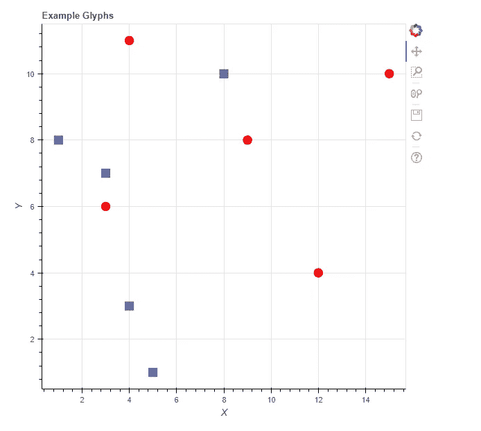
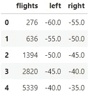
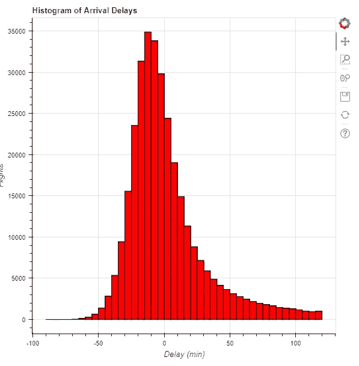
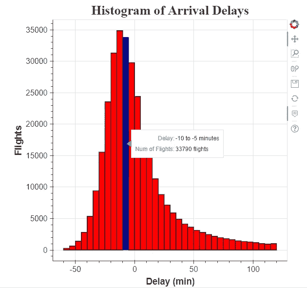
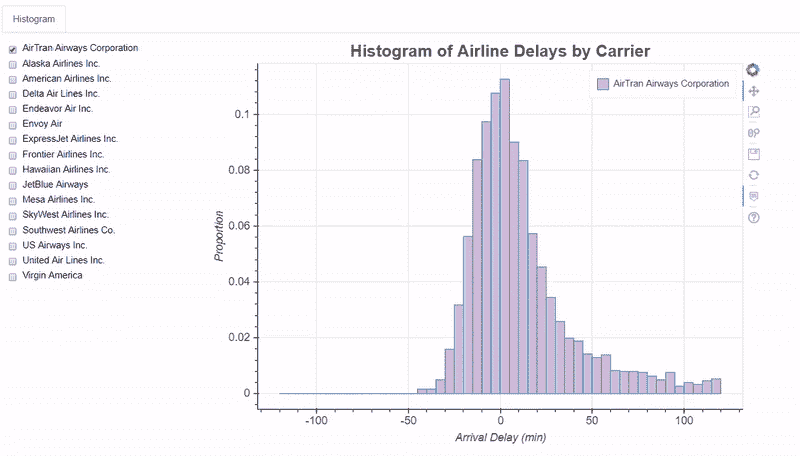

# 使用 Python 中的散景进行数据可视化，第一部分:入门

> 原文：<https://towardsdatascience.com/data-visualization-with-bokeh-in-python-part-one-getting-started-a11655a467d4?source=collection_archive---------1----------------------->


**提升你的视觉游戏**

如果没有交流结果的有效手段，最复杂的统计分析可能是没有意义的。我最近在我的研究项目中的一次经历让我明白了这一点，在这个项目中，我们使用[数据科学来提高建筑能效](https://arpa-e.energy.gov/?q=slick-sheet-project/virtual-building-energy-audits)。在过去的几个月里，我的一个团队成员一直在研究一种叫做[小波变换](http://disp.ee.ntu.edu.tw/tutorial/WaveletTutorial.pdf)的技术，这种技术用于分析时间序列的频率成分。这种方法取得了积极的效果，但她很难在不迷失于技术细节的情况下解释它。

她有些恼怒，问我是否可以制作一个展示这种转变的图像。在几分钟内，我用一个名为`gganimate`的 R 包制作了一个简单的动画，展示了该方法如何转换一个时间序列。现在，我的团队成员不用费力解释小波，而是可以展示这个剪辑来直观地展示这项技术是如何工作的。我的结论是，我们可以做最严格的分析，但最终，所有人想看到的是一个 gif！虽然这种说法是幽默的，但它也有一定的道理:如果不能清楚地交流，结果将没有什么影响，而且通常呈现分析结果的最佳方式是可视化。

可用于数据科学的资源正在快速发展，这在可视化领域[尤为明显](https://codeburst.io/overview-of-python-data-visualization-tools-e32e1f716d10)，似乎每周都有另一种选择可以尝试。所有这些进步都有一个共同的趋势:互动性增强。人们喜欢在静态图中看到数据，但他们更喜欢摆弄数据，看看变化的参数如何影响结果。就我的研究而言，一份告诉业主通过改变空调时间表可以节省多少电的报告是不错的，但更有效的是给他们一个交互式图表，让他们可以选择不同的时间表，并查看他们的选择如何影响电力消耗。最近，受交互式情节趋势和不断学习新工具的愿望的启发，我一直在与 Python 库 [Bokeh](https://bokeh.pydata.org/en/latest/) 合作。我为自己的研究项目制作的这个仪表板展示了散景互动功能的一个例子:


虽然我不能分享这个项目背后的代码，但我可以通过一个例子来使用公开可用的数据构建一个完全交互式的散景应用程序。这一系列文章将涵盖使用散景创建应用程序的整个过程。在第一篇文章中，我们将介绍散景的基本要素，我们将在后续文章中对此进行阐述。在整个系列中，我们将使用[nyflights 13 数据集](https://cran.r-project.org/web/packages/nycflights13/nycflights13.pdf)，它记录了 2013 年以来超过 30 万次航班。我们将首先专注于可视化单个变量，在这种情况下，以分钟为单位的航班到达延迟，我们将从构建基本直方图开始，这是显示一个连续变量的分布和位置的经典方法。《T4》的完整代码可以在 GitHub 上找到，第一个 Jupyter 笔记本可以在这里[找到](https://github.com/WillKoehrsen/Bokeh-Python-Visualization/blob/master/intro/exploration/first_histogram.ipynb)。这篇文章关注的是视觉效果，所以我鼓励任何人查看代码，如果他们想看数据清理和格式化的乏味但必要的步骤！

# 散景基础

散景的主要概念是一次一层地构建图形。我们首先创建一个图形，然后向图形添加元素，称为[字形](https://bokeh.pydata.org/en/latest/docs/user_guide/plotting.html)。(对于那些使用过 ggplot 的人来说，字形的概念本质上与 geomss 的概念是一样的，geom 一次添加一个“层”。)字形可以呈现许多形状，这取决于所需的用途:圆形、线条、补丁、条形、弧形等等。让我们用正方形和圆形制作一个基本图表来说明字形的概念。首先，我们使用`figure`方法绘制一个图，然后通过调用适当的方法并传入数据，将我们的字形附加到图中。最后，我们展示我们的图表(我正在使用 Jupyter 笔记本，如果您使用`output_notebook`调用，它可以让您看到代码正下方的图表)。

这就产生了下面这个略显乏味的情节:



虽然我们可以在任何绘图库中轻松地制作这个图表，但我们可以免费获得一些工具，用于右侧的任何散景绘图，包括平移，缩放，选择和绘图保存功能。这些工具是可配置的，当我们想要调查我们的数据时会派上用场。

现在让我们开始显示航班延误数据。在我们直接进入图表之前，我们应该加载数据并对其进行简要检查( **bold** 是代码输出):

```
# Read the data from a csv into a dataframe
flights = pd.read_csv('../data/flights.csv', index_col=0)# Summary stats for the column of interest
flights['arr_delay'].describe()**count    327346.000000
mean          6.895377
std          44.633292
min         -86.000000
25%         -17.000000
50%          -5.000000
75%          14.000000
max        1272.000000**
```

汇总统计数据为我们的绘图决策提供了信息:我们有 327，346 次航班，最小延迟为-86 分钟(意味着航班提前了 86 分钟)，最大延迟为 1272 分钟，令人震惊的 21 小时！75%的分位数仅在 14 分钟，因此我们可以假设超过 1000 分钟的数字可能是异常值(这并不意味着它们是不合理的，只是极端)。在柱状图中，我将重点关注-60 分钟到+120 分钟之间的延迟。

直方图[是单个变量初始可视化的常见选择，因为它显示了数据的分布。x 位置是分组到称为条柱的间隔中的变量的值，每个条的高度表示每个间隔中数据点的计数(数量)。在我们的例子中，x 位置将代表以分钟为单位的到达延迟，而高度是相应仓中的航班数。散景没有内置的直方图标志符号，但是我们可以使用`quad`标志符号来创建自己的直方图标志符号，它允许我们指定每个条形的底部、顶部、左侧和右侧边缘。](https://www.moresteam.com/toolbox/histogram.cfm)

为了创建条形的数据，我们将使用 [numpy](https://docs.scipy.org/doc/numpy-1.14.0/reference/generated/numpy.histogram.html) `[histogram](https://docs.scipy.org/doc/numpy-1.14.0/reference/generated/numpy.histogram.html)` [函数](https://docs.scipy.org/doc/numpy-1.14.0/reference/generated/numpy.histogram.html)来计算每个指定条块中的数据点数。我们将使用 5 分钟长度的箱，这意味着该功能将计算每个 5 分钟延迟间隔内的航班数量。生成数据后，我们将它放在一个 [pandas 数据帧中，以便将所有数据保存在一个对象中。](https://pandas.pydata.org/pandas-docs/stable/dsintro.html)这里的代码对于理解散景并不重要，但它仍然很有用，因为 numpy 和 pandas 在数据科学中很流行！

```
"""Bins will be five minutes in width, so the number of bins 
is (length of interval / 5). Limit delays to [-60, +120] minutes using the range."""arr_hist, edges = np.histogram(flights['arr_delay'], 
                               bins = int(180/5), 
                               range = [-60, 120])# Put the information in a dataframe
delays = pd.DataFrame({'arr_delay': arr_hist, 
                       'left': edges[:-1], 
                       'right': edges[1:]})
```

我们的数据看起来像这样:



`flights`栏是从`left`到`right`的每个延误间隔内的航班数。从这里，我们可以制作一个新的散景图形，并添加一个指定适当参数的四边形 glpyh:



制作这个图表的大部分工作来自数据格式化，这在数据科学中并不罕见！从我们的图中，我们看到到达延迟几乎是正态分布，在右侧有一个[轻微的正偏斜或严重的尾部。](http://www.statisticshowto.com/probability-and-statistics/skewed-distribution/)

在 Python 中有更简单的方法来创建基本的直方图，使用几行`[matplotlib](https://en.wikipedia.org/wiki/Matplotlib)`就可以得到相同的结果。然而，开发散景图所需的回报来自于工具和与数据交互的方式，我们现在可以轻松地将这些数据添加到图表中。

# 添加交互性

我们将在本系列中讨论的第一种交互类型是被动交互。查看器可以采取这些操作，但不会改变显示的数据。这些被称为[检查员](https://bokeh.pydata.org/en/latest/docs/reference/models/tools.html)，因为他们允许观众更详细地“调查”数据。一个有用的检查器是当用户将鼠标放在数据点上时出现的工具提示，它在散景中被称为[悬停工具。](https://bokeh.pydata.org/en/latest/docs/user_guide/tools.html)


A basic Hover tooltip

为了添加工具提示，我们需要将数据源从 dataframe 改为 [ColumnDataSource，这是散景中的一个关键概念。](https://bokeh.pydata.org/en/latest/docs/reference/models/sources.html)这是一个专门用于绘图的对象，包括数据以及一些方法和属性。ColumnDataSource 允许我们向图形添加注释和交互性，并且可以从 pandas 数据帧中构造。实际数据本身保存在一个字典中，可通过 ColumnDataSource 的 data 属性进行访问。这里，我们从我们的数据帧创建源，并查看对应于我们的数据帧的列的数据字典的键。

```
# Import the ColumnDataSource class
from bokeh.models import ColumnDataSource# Convert dataframe to column data source
src = ColumnDataSource(delays)
src.data.keys()**dict_keys(['flights', 'left', 'right', 'index'])**
```

当我们使用 ColumnDataSource 添加字形时，我们将 ColumnDataSource 作为`source`参数传入，并使用字符串引用列名:

```
# Add a quad glyph with source this time
p.quad(source = src, bottom=0, top='flights', 
       left='left', right='right', 
       fill_color='red', line_color='black')
```

请注意代码是如何引用特定的数据列的，比如“flights”、“left”和“right ”,使用的是单个字符串，而不是以前的`df['column']`格式。

## 散景中的悬停工具

一开始，HoverTool 的语法看起来有点复杂，但是通过练习，它们很容易创建。我们向我们的`HoverTool`实例传递一个`tooltips`列表作为 [Python 元组](https://www.tutorialspoint.com/python/python_tuples.htm)，其中第一个元素是数据的标签，第二个元素引用我们想要突出显示的特定数据。我们可以引用图形的属性，比如使用' $ '引用 x 或 y 位置，或者使用' @ '引用源中的特定字段。这听起来可能有点令人困惑，所以这里有一个我们两者都做的悬停工具的例子:

```
# Hover tool referring to our own data field using @ and
# a position on the graph using $
h = HoverTool(tooltips = [('Delay Interval Left ', '[@](http://twitter.com/f_interval)left'),
                          ('(x,y)', '($x, $y)')])
```

这里，我们使用“@”引用 ColumnDataSource(对应于原始数据帧的“左”列)中的`left` 数据字段，并使用“$”引用光标的(x，y)位置。结果如下:


Hover tooltip showing different data references

(x，y)位置是鼠标在图上的位置，对我们的直方图没有太大的帮助，因为我们需要找到给定条形中对应于条形顶部的航班数量。为了解决这个问题，我们将修改工具提示实例来引用正确的列。格式化工具提示中显示的数据可能会令人沮丧，所以我通常在 dataframe 中用正确的格式创建另一列。例如，如果我希望工具提示显示给定条形的整个间隔，我会在 dataframe 中创建一个格式化列:

```
# Add a column showing the extent of each interval
delays['f_interval'] = ['%d to %d minutes' % (left, right) for left, right in zip(delays['left'], delays['right'])]
```

然后，我将这个数据帧转换成 ColumnDataSource，并在 HoverTool 调用中访问这个列。以下代码使用引用两个格式化列的悬停工具创建绘图，并将该工具添加到绘图中:

在散景风格中，我们通过将元素添加到原始图形中来将它们包含在图表中。注意在`p.quad`字形调用中，有几个额外的参数，`hover_fill_alpha`和`hover_fill_color`，当我们将鼠标放在工具条上时，它们会改变字形的外观。我还使用一个`style` 函数添加了样式(代码见笔记本)。美学打字很繁琐，所以我一般会写一个可以适用于任何剧情的函数。当我使用样式时，我保持事情简单，并关注标签的可读性。图表的主要目的是显示数据，只添加不必要的元素会降低图表的有用性！最终的情节如下:



当我们将鼠标悬停在不同的条柱上时，我们会获得该条柱的精确统计数据，显示时间间隔以及该时间间隔内的航班数量。如果我们对我们的绘图感到自豪，我们可以将它保存到 html 文件中进行共享:

```
# Import savings function
from bokeh.io import output_file# Specify the output file and save
output_file('hist.html')
show(p)
```

# 进一步的步骤和结论

我花了不止一个情节来获得散景的基本工作流程，所以如果看起来有很多东西要学，也不用担心。在这个系列的课程中，我们将得到更多的练习！虽然散景看起来工作量很大，但当我们想将视觉效果扩展到简单的静态数字之外时，好处就来了。一旦我们有了一个基本的图表，我们可以通过添加更多的元素来增加视觉效果。例如，如果我们想按航空公司查看到达延迟，我们可以制作一个交互式图表，允许用户选择和比较航空公司。我们将把改变显示数据的主动交互留到下一篇文章中，但我们可以做些什么:



主动交互需要更多的脚本，但是这给了我们一个在 Python 上工作的机会！(如果有人想在下一篇文章之前看看这个情节的代码，[这里是](https://github.com/WillKoehrsen/Bokeh-Python-Visualization/blob/master/interactive/histogram.py)。)

在整个系列中，我想强调的是，散景或任何一个库工具都不会是满足你所有绘图需求的一站式工具。散景在允许用户探索图形方面很棒，但对于其他用途，如简单的[探索性数据分析，](https://en.wikipedia.org/wiki/Exploratory_data_analysis)像`matplotlib`这样的轻量级库可能会更有效。本系列旨在展示散景的功能，为您提供另一个必要的绘图工具。您了解的库越多，您就越有能力使用正确的可视化工具来完成任务。

一如既往，我欢迎建设性的批评和反馈。可以在推特上找到我 [@koehrsen_will](http://twitter.com/@koehrsen_will) 。