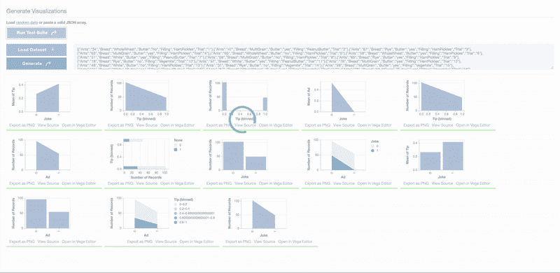
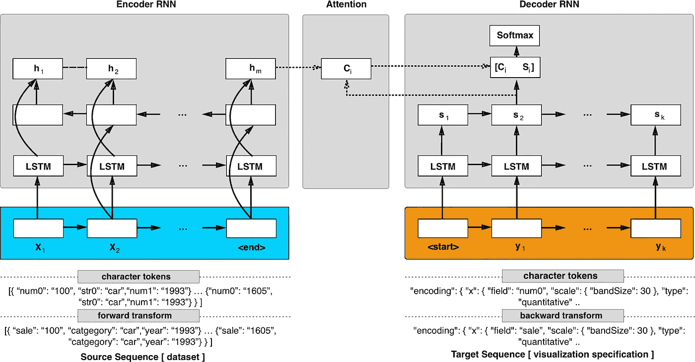

# Data2Vis:使用序列间递归神经网络自动生成数据可视化

> 原文：<https://towardsdatascience.com/data2vis-automatic-generation-of-data-visualizations-using-sequence-to-sequence-recurrent-neural-5da8e9d3e43e?source=collection_archive---------2----------------------->

A collection of random examples generated by the model given datasets from the [RDataset](https://github.com/vincentarelbundock/Rdatasets) collection..

我们将数据可视化公式化为一个序列到序列的翻译问题。

**TLDR；我们训练一个模型，该模型可以接受数据集作为输入，并生成一组可信的可视化作为输出。**

> 我们有一份早期的论文草稿，描述了关于 [arxiv](https://arxiv.org/abs/1804.03126) 、[短视频](https://vimeo.com/264192643)、[源代码](https://github.com/victordibia/data2vis)和[演示](http://hci.stanford.edu/~cagatay/data2vis/)的工作。欢迎反馈、讨论( [@vykthur](https://twitter.com/vykthur) 、 [@serravis](https://twitter.com/serravis) )和评论！

[Demo web app](http://hci.stanford.edu/~cagatay/data2vis/). We provide a web interface where a user can paste data (or load a random dataset) and get set of generated visualizations (using beam search).

想尝试训练一个类似的模型吗？我们已经公布了实验中使用的源代码。

 [## 维克托迪亚/数据 2 维斯

### Data2Vis:使用序列对序列递归神经网络自动生成数据可视化…

github.com](https://github.com/victordibia/data2vis) 

这项工作是与一位[同事(Cagatay Demiralp)](https://hci.stanford.edu/~cagatay/) 共同完成的，从我们在一次论文讨论会后的一次谈话开始。我们读过一些论文，其中使用了各种形式的生成和序列模型来创建各种各样的东西——从生成图像(gan)、音乐、源代码、图像标题到生成关于图像的问题和答案(VQA)等。尽管这些模型有时会有一些怪癖(独眼猫、最终缺乏自然感觉的音乐等)，但当它们被大规模训练和部署时，它们都展示了价值的承诺。

因此，我们很好奇将这些深度学习模型中展示的进步应用于创建可视化任务的可能性。这是有价值的，因为可视化创作可能是一个耗时的过程(选择使用什么工具、可视化哪些字段、应用哪些转换以及支持哪些交互)。如果我们能找到一个模型来做这些事情，我们觉得可以改进可视化创作过程。第一个挑战与寻找制定问题的方法有关，这样它就可以*服从*深度学习*。我们如何教会模型理解，然后*生成*可视化？我们如何管理我们的训练数据集？我们是否收集了可视化+数据对的好图像，并在这些图像上进行训练？*

*幸运的是，研究人员过去已经考虑过与改进可视化创作相关的类似问题。一项有趣的工作是围绕着创建声明性语言的努力，这些语言简洁地描述了可视化，并在创作可视化时提供了表达性和速度之间的"*右*"权衡。有了这些语言或语法，你可以编写一些简洁的**文本规范**，一些引擎会努力将文本转化为实际的可视化。这种声明性语言的一个很好的例子是由华盛顿大学交互数据实验室的令人敬畏的研究人员创造的 [Vega-Lite](https://idl.cs.washington.edu/papers/vega-lite/) 。对于我们的实验，我们使用 Vega-Lite 语法规范(JSON)来表示可视化。*

**

*A [Vega-Lite](https://vega.github.io/vega-lite/) visualization (left), specified using the Vega-Lite grammar (right).*

# *我们做了什么*

*如果我们把可视化想象成文本规范，问题就简化成生成一堆这些规范，*给*一些输入数据。因此，我们的下一个任务是探索学习可视化规范格式的空间的模型，也许可以“幻觉”一些新的可视化？我们根据[卡帕西的博客](http://karpathy.github.io/2015/05/21/rnn-effectiveness/)中的笔记开始了最初的实验——我们生成了可视化规范(数据+规范)，将它们连接起来，并试图训练一个 RNN 来生成看似合理的东西。*

*从第一次实验中，我们了解了字符 rnn(lstm)在学习嵌套结构(如 Vega-Lite 规范)中包含的数据结构方面的表现。我们发现，虽然基于字符的 rnn 对于该问题工作得很好(与基于单词的 rnn 相比)，但是它们在模拟长序列方面的局限性和对长序列的存储要求使得它们难以训练(在几个字符之后的难以理解的记号，即使在数千个步骤之后也有限的学习进度，未经预处理的数百万个参数)。此外，字符 RNNs 没有为训练提供输入和输出对之间的具体映射。这些挑战促使我们思考其他方式来表述问题——学习我们输出空间的结构，并在给定一些输入的情况下生成新数据的方法。本质上是从源数据规范到目标可视化规范的转换。*

## *序列到序列模型*

*序列对序列模型[1，2，3]能够做到这一点—它们接受一些输入(例如一种语言的文本)并生成一个输出(例如不同语言的相同文本)。它们已经被广泛成功地应用于诸如语言翻译、文本摘要、图像字幕等问题。利用编码器解码器架构的序列到序列模型的变体也已经被探索用于正式[编程语言](https://arxiv.org/abs/1802.03691)、[学习领域特定程序](https://www.microsoft.com/en-us/research/blog/deep-learning-program-synthesis/)和通用[程序合成](https://sunblaze-ucb.github.io/program-synthesis/index.html)之间的翻译。*

**

*We train a sequence to sequence model based on the work of [Britz et al 2017](https://arxiv.org/abs/1703.03906). Training data consists of a source token (a single row from a data set) and a target token (a valid Vegalite visualization specification) pair.*

## *数据和培训*

*首先，我们基于有效的 Vega-Lite 可视化示例组装了一个训练数据集(源和目标对)。基于 11 个不同的数据集和 4300 个 Vega-Lite 示例，总共使用了 215k 对样本。请参见[论文](https://arxiv.org/abs/1804.03126)了解更多关于数据采样和预处理的详细信息。*

*我们使用[架构](https://arxiv.org/abs/1703.03906)和 [Britz 等人 2017](https://arxiv.org/abs/1703.03906) 提供的样本[代码](https://github.com/google/seq2seq)训练一个序列到序列模型。该模型是一个具有注意机制的编码器-解码器架构(请参见 [Britz 论文](https://arxiv.org/abs/1703.03906)了解关于该架构的更多细节)。我们还在数据集上执行一些简单的标准化来简化训练。我们在源序列(数据集)中使用一个短符号“str”和“num”来替换字符串和数字字段名。接下来，在目标序列中复制类似的反向转换(后处理),以保持字段名的一致性。这些转换有助于通过减少词汇量来构建学习过程，并防止 LSTM 学习字段名(在训练集中学习字段名对我们的生成问题没有用)。反过来，我们能够减少总的源和目标序列长度，减少训练时间，并减少模型需要收敛的隐藏层的数量。*

## *波束搜索解码*

*为了探索各种生成的可视化，我们使用波束搜索解码算法。与输出输入序列的最有可能(最高概率)的翻译相反，波束搜索在生成期间扩展所有可能的后续步骤，并保持最有可能的 ***k*** ，其中 k 是用户指定的参数，称为 ***波束宽度*** 。与传统的语言翻译系统不同，在传统的语言翻译系统中，波束搜索主要用于通过最大化生成序列的条件概率来提高翻译质量，我们还探索波束搜索作为一种通过输出所有并行波束结果来生成一组*多样的*候选可视化的方式。通过波束搜索，我们观察到模型生成了不同的图，探索了图表类型的组合和多个变量的使用。*

## *早期结果*

**

*Examples where the model has learned to generate univariate plots that summarize fields selected from the dataset.*

****

*Examples of generated visualizations where the model has learned common selection patterns and leverages concepts such as responses (yes, no) and sex (male, female)*

*为了评估这个模型，我们使用了 [Rdataset 存储库](https://github.com/vincentarelbundock/Rdatasets)(被清理并转换成有效的 JSON 格式)，它不包括在我们的培训中。生成的有效单变量和多变量可视化的范围表明该模型捕获了可视化生成过程的各个方面。随着训练的进行，模型逐渐学习有效 Vega-Lite 规范的词汇和语法，学习使用引号、括号、符号和关键字。该模型似乎还学会了在 Vega-Lite 语法中使用正确类型的变量规范(例如，它正确地为文本字段分配了字符串类型，为数值字段分配了数量类型)。*

*定性结果还建议在适当的字段上使用适当的转换(箱、集合)(例如，在数值字段上执行均值)。该模型还了解可视化中出现的常见数据选择模式，以及它们与其他变量的组合，以创建二元图。例如，当专家创建可视化时，通常按地理(国家、州、性别)、个人特征(公民身份、婚姻状况、性别)等对数据进行分组。早期的结果表明，我们的模型开始学习这些模式，并将其应用于可视化的生成。例如，它学习使用常见的顺序字段(如回答(是/否)、性别(男性/女性)等)对数据进行子集划分，并根据其他字段绘制这些值。最后，在所有情况下，模型都会生成一个 ***完全有效的*** JSON 文件和有效的 Vega-Lite 规范，其中包含一些小的失败案例。*

**

*A collection of random examples generated (beam width k = 15) by the model given some test dataset. These examples demonstrate initial results on the model’s capabilities in generating plausible visualizations and its current limitations (cases where the model generates non-existent fields or uses transforms that result in invalid charts).*

*正如许多深度学习模型所观察到的，有有希望的结果，也有怪癖或失败的案例(例如，5 条腿的狗，3 只眼的猫等)。在我们的例子中，模型有时使用不存在的(幻象变量)生成规范，或者应用在运行时无效的转换，导致空图。见上图(用橙色标记的图)。我们的直觉是，这些挑战可以通过扩大我们相对较小的数据集来解决。*

# *为什么要用深度学习实现可视化自动化？*

*我们认为可视化的自动生成有趣的原因有几个:*

## *使可视化创作更加容易。*

*为很少或没有编程经验的用户提供快速创建表达性数据可视化的能力，增强了他们的能力，并将数据可视化带入他们的个人工作流。对于专家来说，像 Data2Vis 这样的模型也有可能“播种”数据可视化过程，减少指定可视化语言语法和支持可视化可能性迭代所花费的时间。这种动机与探索源代码生成和翻译的深度学习方法的其他研究工作产生了共鸣( [UCBerkeley](https://sunblaze-ucb.github.io/program-synthesis/index.html) ，[微软研究院](https://www.microsoft.com/en-us/research/blog/deep-learning-program-synthesis/)等)。*

## *规模的承诺*

*从理论上讲，随着我们收集更多多样和复杂的训练例子(也许还有更好的架构)，DataVis *应该*学习更复杂的可视化策略，增加它的效用。这有望创造一个模型，有朝一日*可能*在数据可视化方面达到人类水平(或超人水平),就像我们在图像识别、游戏、医学成像等其他领域观察到的那样。*

## *超越“启发式”*

*现有的可视化生成方法倾向于基于规则和试探法，这些规则和试探法生成单变量汇总图或基于规则组合的图。在这种情况下， [Jeff Dean](http://learningsys.org/nips17/assets/slides/dean-nips17.pdf) 发现了使用机器学习(ML)改进这种系统的机会，并鼓励“*学习*”和“*元学习*”一切方法。他还强调了[启发式](http://learningsys.org/nips17/assets/slides/dean-nips17.pdf)的挑战——它们不适应使用模式，并且可能无法考虑有价值的上下文。我们也同意，ML 和 AI 方法通过从现有的训练例子中学习，提供了超越基于规则的方法的机会。*

# *下一步是什么*

*这个项目仍然是非常进展中的工作-有限制和未来的工作，我们希望解决。除了收集更多的数据和运行实验来改进 Data2Vis，一些未来的工作包括:*

## *扩展 Data2Vis 以生成多种可信的可视化效果*

*Data2Vis 目前被实现为序列到序列的转换模型，并为给定的数据集输出单个可视化规范。现在，训练一个模型来为给定的数据集生成多个有效的可视化效果不是很棒吗？我们认为会的。*

## *瞄准附加语法*

*也许训练模型可以将输入数据映射到多种不同的可视化规范语言(例如 Vega-Lite、ggplot2、D3 等。).或者将可视化从一种语言翻译成另一种语言。通过跨语言、平台和系统重用可视化规范，这将有助于使可视化更易访问。*

## *自然语言和可视化规范*

*Text2Vis 怎么样？-除输入数据外，还使用自然语言文本生成可视化效果的模型。想象一个人在大屏幕前探索数据，并要求基于特定的*字段*、*转换*或*交互*的可视化？*

# *结论*

*本文讨论了使用序列对序列模型自动生成可视化的一些想法和早期结果。希望这项工作可以作为未来使用深度学习方法自动生成可视化的基线。请随意阅读[论文](https://arxiv.org/abs/1804.03126)了解更多详情，也分享你的想法( [@vykthur](https://twitter.com/vykthur) ， [@serravis](https://twitter.com/serravis) )！我们希望很快能分享代码和训练好的模型。*

# *确认*

*这项工作是由许多个人的贡献促成的。感谢 [Vega-Lite](https://idl.cs.washington.edu/papers/vega-lite/) 、 [Voyager](https://idl.cs.washington.edu/papers/voyager/) 库的作者，感谢他们分享了我们实验中使用的示例数据。非常感谢[tensor flow](https://medium.com/u/b1d410cb9700?source=post_page-----5da8e9d3e43e--------------------------------)[seq 2 seq](https://github.com/google/seq2seq)模型实现和 [TensorFlow](https://medium.com/u/b1d410cb9700?source=post_page-----5da8e9d3e43e--------------------------------) 库团队的作者——他们的工作使我们能够快速了解序列模型和*原型，我们的实验将很少以前的经验。**

# **参考**

**[1] Dzmitry Bahdanau、Kyunghyun Cho 和 Yoshua Bengio。2014.通过联合学习对齐和翻译的神经机器翻译。(2014 年 9 月)。**

**[2] Ilya Sutskever、Oriol Vinyals 和 Quoc V. Le。2014.用神经网络进行序列对序列学习**

**[3] Denny Britz、Anna Goldie、Thang Luong 和 Quoc Le。2017.神经机器翻译架构的大规模探索**

**[4]豪尔赫·波科和杰弗里·赫尔。2017.可视化逆向工程:从图表图像中恢复可视编码。计算机图形学论坛。EuroVis) (2017)。**