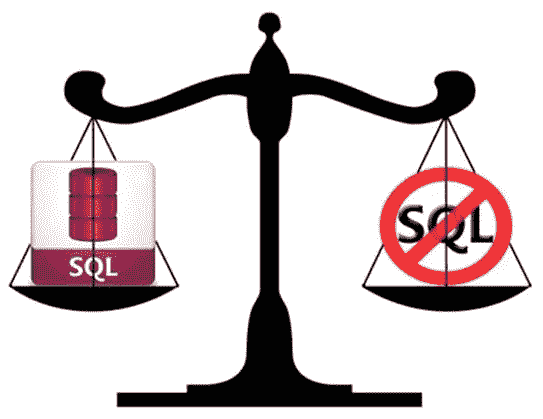

# 数据库— SQL 和 NoSQL

> 原文：<https://towardsdatascience.com/databases-sql-and-nosql-7bdbab25b6ef?source=collection_archive---------2----------------------->

## 对 NoSQL 数据库的介绍和对 MongoDB 的一瞥

SQL 在 1970 年与 E. F. Codd 博士的研究论文“大型共享数据库的关系数据模型”一起使用。是啊！！这是 Boyce-Codd 规范化中的 Codd。



SQL/NoSQL: [url](https://www.google.com/url?sa=i&rct=j&q=&esrc=s&source=images&cd=&cad=rja&uact=8&ved=0ahUKEwjL0rjSn6fWAhUFNI8KHcmBBCkQjRwIBw&url=https%3A%2F%2Fwww.monitis.com%2Fblog%2Fnosql-vs-sql-what-you-need-to-know%2F&psig=AFQjCNE9uaQ_fkFAHccCe5xkwj0UV-mmMw&ust=1505566827614230)

NoSQL 在 20 世纪 90 年代后期开始出现。然而，在此之前就已经有这样的数据库了。NoSQL 是带着打破传统*事务型数据库瓶颈的动机引入的。一个常见的误解是 NoSQL 数据库不是关系型的，这是不太正确的。关系确实存在于数据中，否则这些数据将毫无用处。让我们看看发生了什么变化以及如何变化。*

# *布鲁尔帽定理和酸性*

## *CAP 定理—与 NoSQL 有关*

*CAP 定理试图证明 NoSQL 数据库所期望的性质。大多数数据库被设计成以另一个属性为代价来实现这些属性中的两个。*

****C —一致性***
这证明了一旦更新被更新者确认，更新的执行和可用性的保证。简而言之，如果数据库是一致的，更新一旦完成就可用，这在分布式环境中是无法保证的。*

****A —可用性*** 这展示了一个数据库的属性，它能够服务于一个请求。如果加载/执行时间较长，大多数 SQL 数据库都会删除查询。通过消除 SQL 数据库中存在的事务属性，NoSQL 数据库的可用性预计会非常高，响应时间预计会非常短。*

****P —分区容差***
数据库能够在节点间因网络问题出现故障时正常运行的属性。例如，一个数据库可能包含几个协同工作的节点(MongoDB 节点)(通过 Mapreduce 之类的机制)。如果在分布式环境中，即使一个或多个节点不可访问，数据库作为一个整体也可以运行，则保留该属性。*

## *ACID — SQL 数据库*

*ACID 属性是传统关系数据库(如 MySQL、MS SQL 或 Oracle 数据库)中的预期属性。*

****A —原子性***
保证原子操作的性质，要么一组查询可以作为一个整体完成，要么一个都不能。这是交易的关键特征。*

****C —一致性***
数据一旦完全插入或更新，即可使用。*

****I —隔离***
暗示，事务是独立的。因此，数据不会受到发生在同一组数据上的两个事务的负面影响。*

****D —耐久性***
事务或任何其他操作后提交的数据永不丢失。要么插入它们，要么通知失败(失败的事务)。*

# *NoSQL 数据库*

*NoSQL 数据库保证遵守两个 CAP 属性。这种数据库有几种类型。*

1.  ***键值存储** **—** 哈希表形式的存储{例如- Riak、亚马逊 S3(迪纳摩)、Redis}*
2.  ***基于文档的** **存储—** 存储对象，主要是 JSON，它是 web 友好的或支持 ODM(对象文档映射)。{示例- CouchDB、MongoDB}*
3.  ***基于列的存储—** 每个存储块只包含来自一列的数据{示例- HBase，Cassandra}*
4.  ***基于图形—** 关系的图形表示，主要用于社交网络。{示例- Neo4J}*

# *MongoDB*

*MongoDB 是广泛使用的 ***文档数据库*** 之一。它服从 CAP thoerem 中的 ***C*** 和 ***A*** 。由于其 JSON 友好的 API，MongoDB 大量用于 NodeJS。*

**

*MongoDB: [url](http://joelcox.io/scripts/logos/mongo-logo.png)*

*Mongo 官网有安装说明:[https://www.mongodb.com](https://www.mongodb.com)。让我们考虑几个使用 MongoDB CLI 的命令。*

*进入命令行界面:`mongo`并按回车键。如果安装成功，您应该会看到以下输出。通常 mongo DB 运行在端口 27017 上。*

```
*# mongoMongoDB shell version v3.4.5connecting to: mongodb://127.0.0.1:27017MongoDB server version: 3.4.5Server has startup warnings:2017-09-15T11:42:04.673+0000 I STORAGE  [initandlisten]2017-09-15T11:42:04.673+0000 I STORAGE  [initandlisten] ** WARNING: Using the XFS filesystem is strongly recommended with the WiredTiger storage engine2017-09-15T11:42:04.673+0000 I STORAGE  [initandlisten] **          See http://dochub.mongodb.org/core/prodnotes-filesystem2017-09-15T11:42:05.313+0000 I CONTROL  [initandlisten]2017-09-15T11:42:05.313+0000 I CONTROL  [initandlisten] ** WARNING: Access control is not enabled for the database.2017-09-15T11:42:05.313+0000 I CONTROL  [initandlisten] **          Read and write access to data and configuration is unrestricted.2017-09-15T11:42:05.313+0000 I CONTROL  [initandlisten]
>*
```

*显示数据库:`show dbs`*

## *启动、选择数据库和执行插入。*

****插入*** 回车`use mydb`会创建一个新的数据库名 ***mydb*** 。与 MySQL 中的表不同，Mongo 有集合。文档(JSON)被插入到这样的集合中。让我们创建 ***狗*** 集合，并添加一个 ***狗*** ***名称莫莉*** 与 ***重量 50kg。*** 既然我们选择了 ***mydb*** 我们就可以称之为 db 并执行运算。*

```
*db.dogs.insert({name: ‘Molly’, weight:50})*
```

****查看数据*** 使用 pretty 方法将输出格式化为可读性更强的格式。正如您所看到的，mongo 添加了一个 id 名称`_id`作为每个文档的索引。*

```
*> db.dogs.find()
{ "_id" : ObjectId("59bbce8288b6c364cefd9de6"), "name" : "Molly", "weight" : 50 }
> db.dogs.find().pretty()
{
    "_id" : ObjectId("59bbce8288b6c364cefd9de6"),
    "name" : "Molly",
    "weight" : 50
}
>*
```

****更新数据*** 下面的命令更新我们创建的条目，并将名称设置为 ***Tommy。****

```
*> db.dogs.update({_id: ObjectId('59bbce8288b6c364cefd9de6')},
   {$set: {name:'Tommy'}})*
```

****删除数据*** 让我们删除我们插入的内容*

```
*> db.dogs.remove({_id:ObjectId('59bbce8288b6c364cefd9de6')})
WriteResult({ "nRemoved" : 1 })
>*
```

> *这些是任何数据库的基本操作，或者简称为 CRUD 操作。*
> 
> *C —创建
> R —读取
> U —更新
> D —删除*