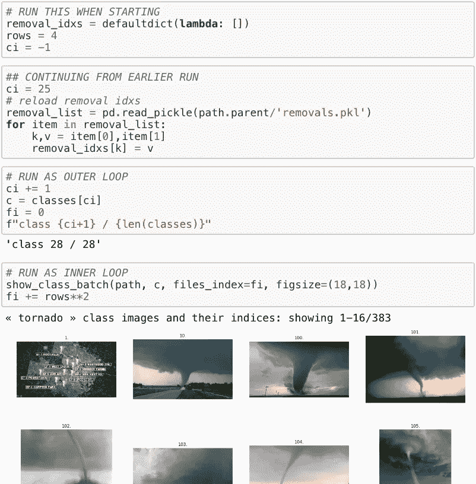
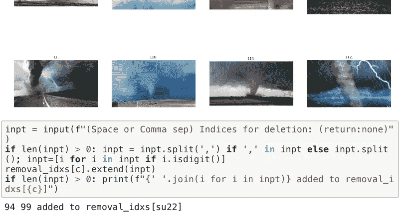
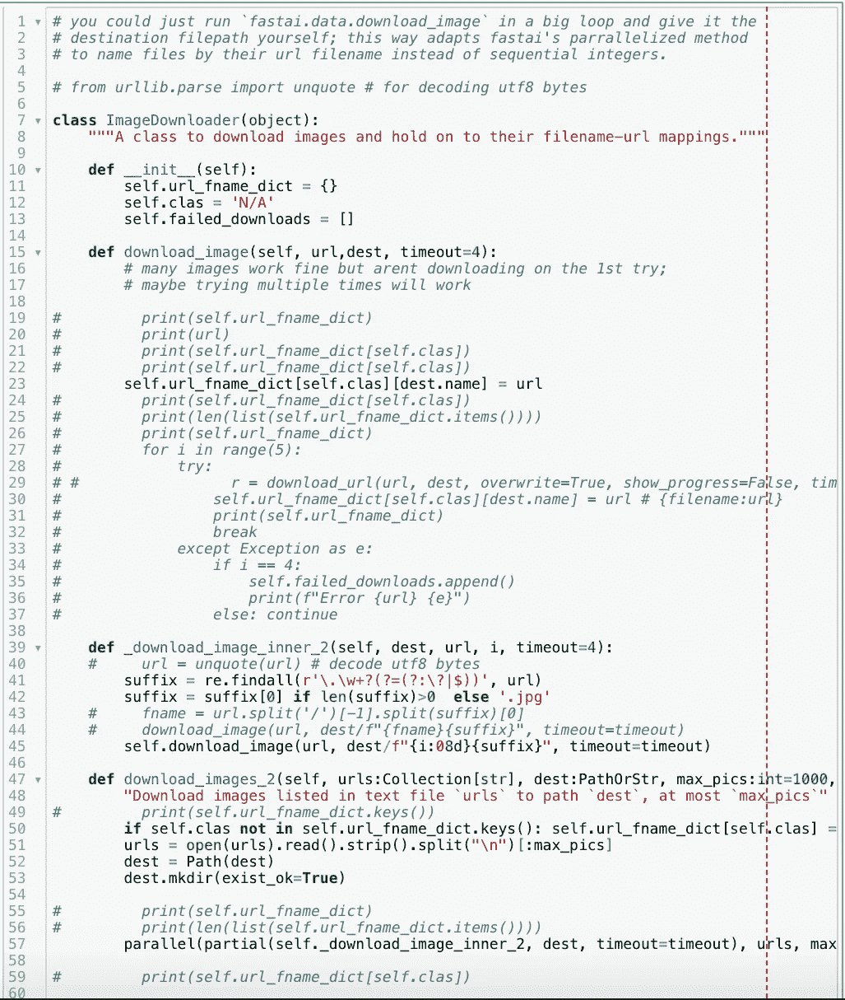
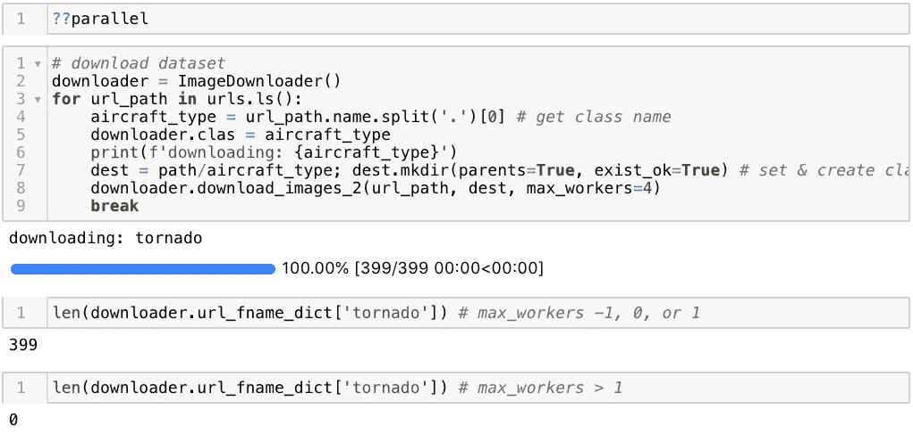
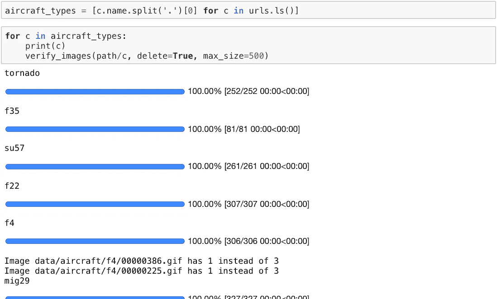
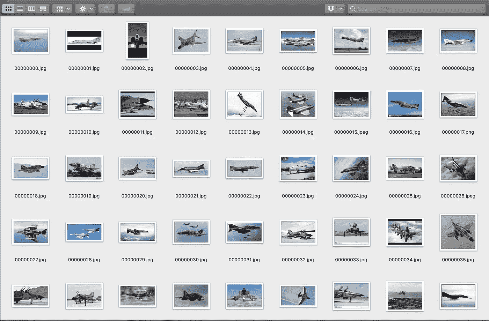
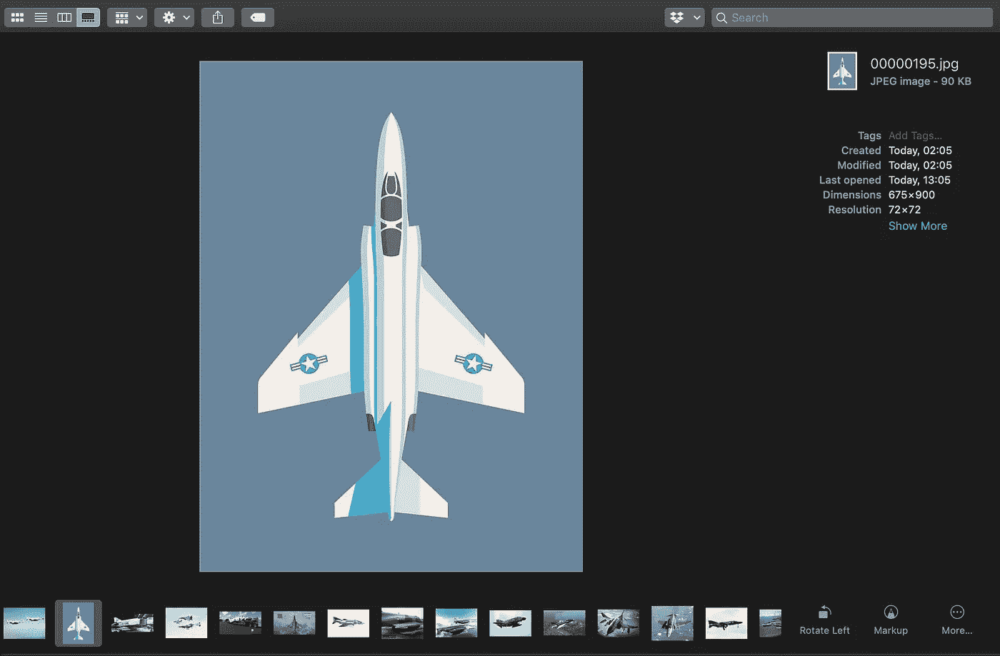
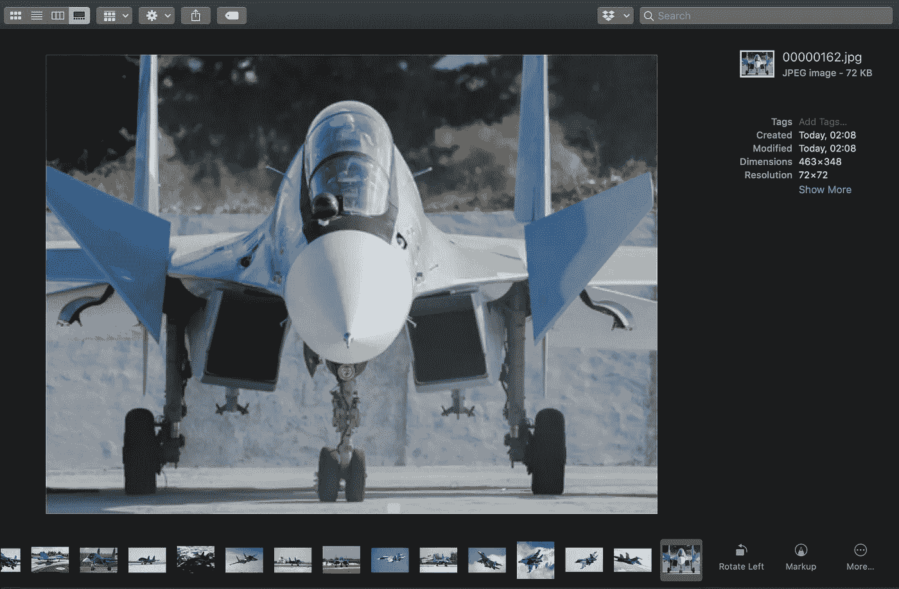
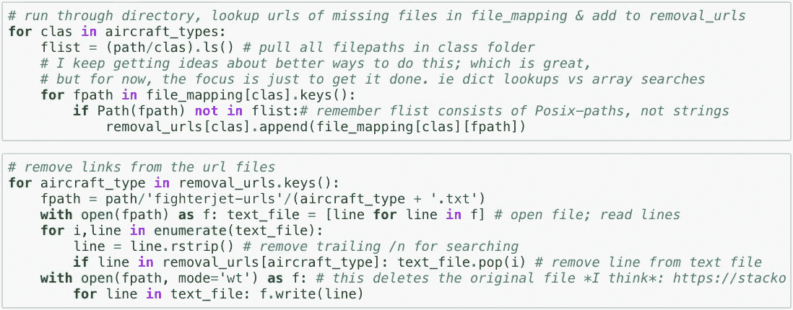

# 数据清理战斗机

> 原文：<https://towardsdatascience.com/datacleaning-fighter-jets-687919b10a7e?source=collection_archive---------17----------------------->

当我最终开始着手处理[xfiew](http://xviewdataset.org/)数据集时，我发现测试集和评估页面被锁定了……这对我的计划来说是一个小小的打击。它可以用作任何卫星图像任务的训练数据，但如果你想看看你的模型在[完成的 Kaggle 比赛](https://www.kaggle.com/c/planet-understanding-the-amazon-from-space/leaderboard)中排名如何:那现在还不太可能。

所以我回到了 fast.ai 的一个暂停的家庭作业项目:战斗机探测器。这个想法很简单:训练一个飞机分类器，然后把它变成一个探测器。为什么是战斗机？即使我不得不看着它们几个小时，我也不会发疯。

> ***注*** :你可以跟着我用的工作笔记本一起来，这里。

# 1.获取数据



[fighter-jets-datacleaning.ipynb](https://github.com/WNoxchi/course-v3/blob/master/nbs/dl1/fighter-jets-datacleaning.ipynb)

我在十月份开始这个项目，但是想给它一个新的开始。我已经下载并清理了数据，这是我不想重复的经历。主要的障碍是云机器上缺少一个 GUI。我使用 Jupyter 通过用 matplotlib 显示 16 个一批的图像来解决这个问题。有问题。如果不花时间学习[小部件](https://ipywidgets.readthedocs.io/en/stable/)，我就找不到输入的方法，所以我不得不将一个 2 层 for 循环分解成一系列必须按正确顺序运行的单元格。



This is not how you want to do things.

我给文件编号，并输入不属于它的图片的编号。这既耗时又复杂。最糟糕的是，这个过程很难重复或改变。你做了一次就再也不回来了。工作不应该是这样做的。在进行的过程中，我记下了事情可以做得更好的方法，但是已经来不及实施了。

> **先不说**:回顾你在学习期间所做的工作，有趣的是，你似乎一直在寻找完成一项任务最难的方法。我经常听到研究人员在发现一个更简单的算法优于之前更复杂的算法时表示惊讶，比如 OpenAI 的 PPO。但是我觉得复杂性通常是对理想解决方案的不完美近似的结果。

这一次我更有条理地处理事情。我在旧剧本中使用的搜索术语是“龙卷风”。猜猜当你用谷歌图片搜索时会发生什么？这一次我使用了一个 [javascript 命令](https://github.com/WNoxchi/course-v3/blob/master/nbs/dl1/fighterjet/fighter-jets-classes-to-dl.md)，它可以捕捉到你可以看到的图片的链接，而不是基于 [chromedriver](http://chromedriver.chromium.org/) 的[命令行脚本](https://github.com/hardikvasa/google-images-download)。这让我可以优化搜索。

获取数据非常容易。当您看到想要的图像时，可以通过在浏览器控制台中输入 javascript 命令(cmd-alt-i 或-j)来构建 url 文件。然后对它们运行 for 循环，调用 fastai 的`download_images`函数:

```
*# download dataset*
*for url_path in urls.ls():*
 *aircraft_type = url_path.name.split('.')[0] # get class name*
 *print(f'downloading: {aircraft_type}')*
 *dest = path/aircraft_type; dest.mkdir(parents=True, exist_ok=True) # set & create class folder*
 *download_images(url_path, dest)*
```

其中`url_path`是指向您的 url 文件(.csv 或。txt)，假设它们是按类命名的。我在打印一个 python [f 串](https://hackernoon.com/a-closer-look-at-how-python-f-strings-work-f197736b3bdb)，非常*有用。*

## 1.1 跟踪数据

现在当你这样做的时候有一个问题。我在我的 Mac 上这样做的目的是，我可以利用我的操作系统的 GUI 来快速删除我不想要的图像。为了让这个项目对我来说更专业，我不能把所有清理过的图像都复制到我的云机器上。我需要建立一个好的下载链接列表。问题是 fastai 的`download_images`将文件重命名为连续整数:`0000001.jpg`、`00000002.jpg`等。有两个解决方案:保存 url 文件名，或者存储文件名和 URL 之间的映射。

我先尝试了前者。我让它工作了，但是它并不漂亮，并且引入了两个新问题:

1.  编码为 utf8 字节的非拉丁字母
2.  使用相同文件名的链接

字符编码问题一开始非常混乱，特别是因为 URL 在地址栏中显示为解码后的，并且只有当我复制了整个地址而不是其中的一部分时才显示出来。这是[一个简单的解决方案:](https://stackoverflow.com/a/16566128)


第二期不会有任何进展。所以我决定弄清楚如何映射文件名和 URL。我在这里遇到了一系列令人困惑的问题。为了保存 url 文件名，我不得不改变 fastai 保存下载图像的方式。为了做到这一点，我必须编辑由`download_images`调用的`_download_image_inner`，全部来自 fastai.vision.data。解码 utf8 字节对此是必要的(*转念一想，我不确定它是否是*)，但从那里开始就很简单了。为了将文件名映射到 URL，我必须更深入一层，编辑由`_download_image_inner`调用的`download_image`。

我首先尝试在[全局范围](https://www.youtube.com/watch?v=GiFbdVGjF9I)(任何函数之外)定义一个字典，然后让`download_image`更新它。但是那没有用。我将字典定义为以下格式:

```
{class : {filepath : url}}
```

其中在`download_images`中指定飞机的当前等级，其值为空`dict`，在`download_image`中用`filepath:url`对填充`dict`。

顶层的 class-key 会被赋值，但是底层的`dict`都是空的。`download_image`中没有存储任何内容。我不想花时间去理解 python 的`global`关键字，我想这是因为我的`url_fname_dict`的一个副本正在低级函数中被写入。我打印了一份，事实上键:值对*被*分配到了`download_image`中，但是原来的字典最后仍然是空的。

所以我创建了一个类对象来保存字典，而不必担心范围。经过一些调试后，我让它工作了，并为我的班级感到骄傲。

> 旁白:这实际上是我第一次真正开始使用面向对象编程的方式。我从来没有真正理解过课堂上发生的事情。在 fastai 和我自己的项目的深度学习中，我遇到了不得不在一堆函数中上下传递数据的难题。你要么必须有大量的参数——这很容易导致混乱并限制了你的工作方式——要么你使用一个附加了你只能访问的数据的类对象。



ImageDownloader class at the end of a debugging session. Downloading is commented out, and I’m testing if anything gets stored in the dictionary

而新的`downloader.url_fname_dict` …仍然是空的。我在这个问题上花了几个小时，找到了十几种方法来解决这个问题，直到我有了一个想法:

> “我过去对使用多个流程的`download_images`有疑问，对吗？等等，用`max_workers=8`有 8 个进程试图同时在字典中存储数据 Python 能处理吗？我觉得它只是…不是。”

我对此进行了测试，将`max_workers`设置为-1、0 和 1(我不知道 0 和-1 是指使用每个核心和很多进程，还是只使用一个，所以我测试了它们)。它非常有效。

在[堆栈溢出](https://stackoverflow.com/questions/6832554/multiprocessing-how-do-i-share-a-dict-among-multiple-processes)上有一个线程。我不知道*本身*是否与我的问题有关，但它感觉足够正确，我不想陷入多重处理/线程。所以结果是我根本不需要上课。



399 file-url maps stored when `max_workers` ≤ 1; 0 stored when > 1

所以这奏效了。*又拿了。永远*。只有一个过程，记得吗？这意味着如果一个链接花了 10 秒钟下载…你在等待。数据集中大约有 10，500 张图片。然后我意识到一件很棒的事情。


我可以把这该死的东西打印出来。全速前进。

> **旁白**:我在努力磨练做事的方式，为我经营公司做准备。所以问题变成了:在我自己的公司里，我能接受这样做吗？有趣的是:对于强力快速“搞定”类型的交易，答案并不总是否定的。有时你可以通过牺牲一点“优雅”或自动化来获得更多的灵活性。在这种情况下，简单的解决方案要强大得多，因为它可以在命令行上运行并写入磁盘。我被卡在了 Jupyter 笔记本范式里，放手了，收获了很多。

然后复制粘贴到一个文本文件，并运行几个 [regex](https://www.youtube.com/watch?v=DRR9fOXkfRE) 过滤器来提取文件路径及其对应的 url，然后将它们放入您的字典。

我做了 4 个正则表达式过滤器:

```
fail_pat = re.compile(r'Error \S+') *# split*
clas_pat = re.compile(r'downloading: \S+') *# split*
save_pat = re.compile(r'data/\S+')
link_pat = re.compile(r'\s-\s\S+') *# split*
```

那些带有‘split’注释的需要删除部分过滤文本，因为我还不知道如何在 regex 中做到这一点。这些字典仅仅是:

```
removal_urls = defaultdict(**lambda**:[])
file_mapping = defaultdict(**lambda**:{})
```

然后构建文件-url 映射，并删除 url 的第一位:


urls that don’t download are the first additions to `remove_urls`

一切终于准备好打扫了。

# 2.数据清理

清理该数据集有 3 个部分:

1.  验证下载(删除损坏/不完整的图像)
2.  外观检验
3.  更新 URL 文件

实际上，我做了 2 的一部分。1 之前。，但结果是一样的。FastAI 有一个有用的功能来验证图像是可见的，并且有 3 个颜色通道，还可以让你调整它们的大小。原始数据集约为 2.27GB，调整到最大 500px 后，大小降至 141MB。



> 旁白:我喜欢你可以在笔记本电脑上完成许多深度学习任务。GPU 仅用于训练密集模型&数据。调整大小和扫描 6-10k 张+2GB 大小的图片只需要一两分钟。

## 2.1 目视检查

这很有趣，触及了人工智能中一个沉闷而有争议的部分。

我有意见。

很多人使用亚马逊的机械土耳其人(顺便说一下，可能是一个[可疑的](https://en.wikipedia.org/wiki/The_Turk)名字)来批量标记数据。我不喜欢为不动脑筋的工作支付报酬。想象一下约束条件:

> 你一个人，没有钱。找到一个聪明的方法来做到这一点。

现在，我不能应用资金和资源总是存在的假设来直接解决问题，因为当我看我的银行账户时，这个假设不成立。因此，与其买断这个问题，你必须考虑更多的移动部件，以及它们是如何装配在一起的。如果你是这个系统的*的一部分*，除了是这个系统的建筑师，你还适合在哪里？

就视觉而言，我们非常善于挑选出特别的一个。其他 fast.ai 学生制作了一个 Jupyter 小工具，让你可以查看、删除或重新分类图像。它会创建一个. csv 文件来反映您的更改，因此数据集不会被更改。我肯定会这么做。一个问题是:该界面是为较小的数据集设计的，如果不使用 PyTorch 数据加载器，就无法关闭训练集的混合:


A step in the right direction; but this just isn’t going to cut if for 10,000+ images.

如果我能有一整屏的图片来复习，如果我能按班级来复习，那将会是最完美的。这可能需要对 ImageCleaner 小部件进行大量的编辑，并学习如何构建 Jupyter 小部件。我不想在那上面花时间。这也可能是不切实际的，因为这很可能是图像清理器的发展方向。

但是通过放弃一点功能，我可以获得很多可用性。

事实证明，在我的操作系统上，我几乎可以得到我需要的东西，以及我想要的方式:


A bit small though. Can we get a balance between ‘batch size’ and visibility?



Perfect.

这就是将文件名映射到 URL 的工作得到回报的地方。我可以删除任何我想要的图像，并记录对数据集的更改。我开始滚动并挑出损坏的图像(没有图片的文件图标)和明显不属于它的图像。对于 27 个班级的 10，241 张图片，这需要 20 分钟。FastAI 的图像验证器只需 1/20 的时间就能处理这个问题。

我想要更好的控制，所以我使用了 macOS 的图库视图来扫描每张图片:



Do I want to recognize silhouettes? I don’t know if this would hurt or help the model so I’ll leave it in. Oh, and I think the artist is [Ivan Krpan](https://fineartamerica.com/profiles/ivan-krpan.html?tab=artworkgalleries&artworkgalleryid=762446).



That is definitely an [Su-30](https://en.wikipedia.org/wiki/Sukhoi_Su-30), not an [Su-34](https://en.wikipedia.org/wiki/Sukhoi_Su-34).

浏览每张照片花了大约 3 . 15 小时。重要的是，我可以选择我想要的细粒度控制。如果我保持图标视图，我可以在一个小时内浏览整个数据集。

## 2.2 更新数据集

我使用了一个包含文本文件的文件夹，其中包含了构成我的数据集的图像的 URL。由于之前所做的工作，这很容易更新。



a more efficient way to lookup filenames is to store in a `[dict](https://docs.python.org/3/tutorial/datastructures.html#dictionaries)` then lookup instead of searching an [array](https://docs.python.org/3/tutorial/datastructures.html#more-on-lists). This is [O(1) instead of O(n/c)](http://cooervo.github.io/Algorithms-DataStructures-BigONotation/big-O-notation.html)

这主要是重用和修改以前的代码。首先，为每个类文件夹构建一个文件路径列表。然后，对于字典中的每个 filepath 键——对应于当前的类——检查它是否在您的列表中。如果不是:将其 URL 添加到`removal_urls`字典中。

然后，对于每个类，您打开并读取 URL 文件到一个列表中— *而不是*添加存在于您的`removal_urls`字典中的 URL——然后覆盖该文件。

现在，您有了一组 URL 文件，其中包含指向属于您的数据集中的图像的链接。如果你愿意，你可以选择保存字典。 [PyTorch 对这个](https://pytorch.org/docs/stable/torch.html?#torch.save)很有用(如果你定义了一个带有`lambda`函数[的`defaultdict`，你必须把它转换成一个](https://stackoverflow.com/a/38456371) `[dict](https://stackoverflow.com/a/38456371)`):

```
torch.save(dict(file_mapping), path/'file_mapping.pkl')
torch.save(dict(removal_urls), path/'removal_urls.pkl')
```

仅此而已。你可以使用 github 或其他任何东西将 URL 文件复制到云 GPU 机器，然后在那里下载图像。我运行了最后一次检查，以查看清理后的数据集有多大:

```
tot = 0
for clas in aircraft_types: tot += len((path/clas).ls())
tot
```

是 6373。从最初的 10，241。

# 3.又来了

对于一个 10k 图像数据集的零开始，我估计粗略的视觉检查需要 1 个小时，详细的检查需要 4 个多小时。我在这里展示了很多代码，但那是发现过程。在修改下载代码以打印文件路径和 URL(并获得您的 URL)之后，再做一次，您真正需要的是:一个下载块，

```
*for url_path in urls.ls():*
 *aircraft_type = url_path.name.split('.')[0] # get class name*
 *print(f'downloading: {aircraft_type}')*
 *dest = path/aircraft_type; dest.mkdir(parents=True, exist_ok=True) # set & create class folder*
 *download_images(url_path, dest)*
```

(将打印输出保存到文本文件中)。一行用于验证，

```
**for** c **in** aircraft_types:
    verify_images(path/c, delete=**True**, max_size=500)
```

(做个目测)；然后正则表达式过滤器:

```
fail_pat = re.compile(r'Error \S+') *# split*
clas_pat = re.compile(r'downloading: \S+') *# split*
save_pat = re.compile(r'data/\S+')
link_pat = re.compile(r'\s-\s\S+') *# split*
```

这项工作由三个模块完成。一个记录断开的链接(从打印输出):

```
**with** open(download_printout_path) **as** f:
    **for** line **in** f:
        *# update class*
        aircraft_type = clas_pat.findall(line)
        clas = aircraft_type[0].split()[-1] **if** aircraft_type **else** clas
        *# search download path & url*
        save,link = save_pat.findall(line), link_pat.findall(line)
        **if** save **and** link: 
            link = link[0].split(' - ')[-1]
            file_mapping[clas][save[0]] = link
        *# search failed download url*
        fail_link = fail_pat.findall(line)
        **if** fail_link: removal_urls[clas].append(fail_link[0])
```

另一个记录清除的文件:

```
*# lookup urls of missing files in file_mapping & add to removal_urls*
**for** clas **in** aircraft_types:
    flist = (path/clas).ls() *# pull all filepaths in class folder*
    **for** fpath **in** file_mapping[clas].keys():
        **if** Path(fpath) **not** **in** flist:
            removal_urls[clas].append(file_mapping[clas][fpath])
```

以及更新 url 文件的最后一个块:

```
**for** aircraft_type **in** removal_urls.keys():
    fpath = path/'fighterjet-urls'/(aircraft_type + '.txt')
 *# open file; read lines*    **with** open(fpath) **as** f: text_file = [line **for** line **in** f]
    **for** i,line **in** enumerate(text_file):
        line = line.rstrip() *# remove trailing /n for searching
        # remove line from text file*
        **if** line **in** removal_urls[aircraft_type]: text_file.pop(i)
    # overwrite url files
    **with** open(fpath, mode='wt') **as** f: 
        **for** line **in** text_file: f.write(line)
```

整个流程是:下载&打印→验证&检查→记录断链&移除文件→更新 url 文件。

现在你知道了。是时候识别一些战斗机了。