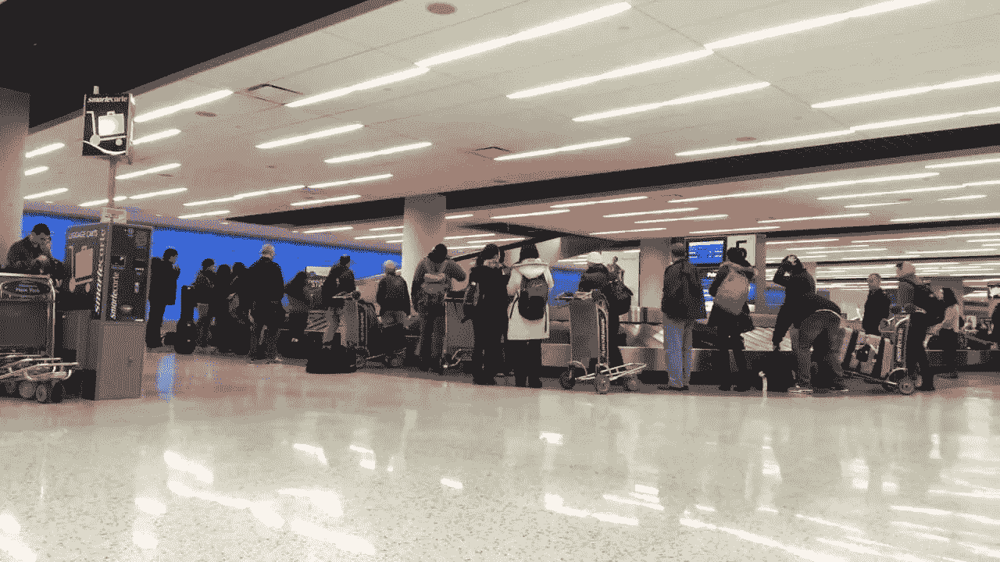
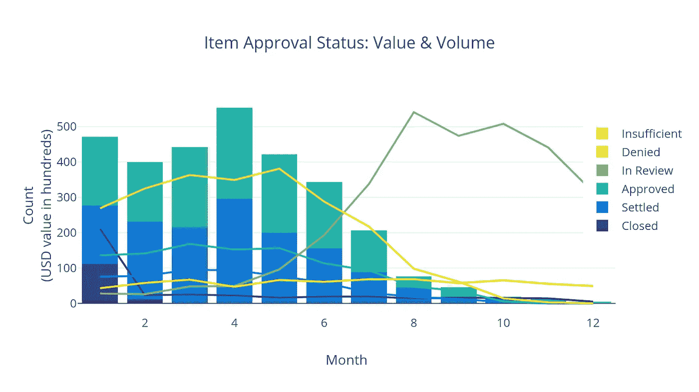
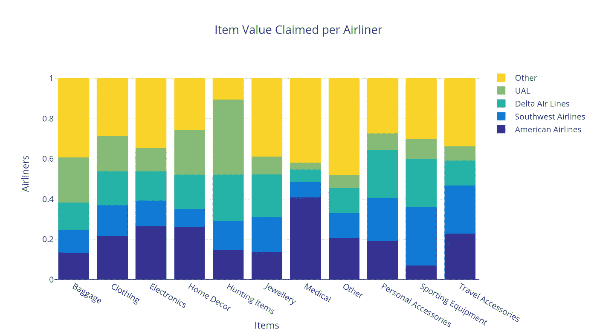
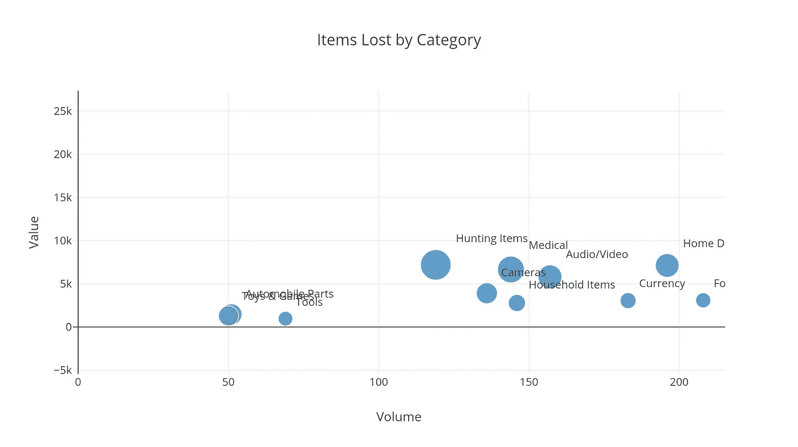

# DataViz 战斗入口:分析美国运输安全管理局的航空公司数据

> 原文：<https://towardsdatascience.com/dataviz-battle-entry-analysing-airline-data-from-the-tsa-74bfad9539e4?source=collection_archive---------13----------------------->

这是我关于数据分析的第二篇中型文章。鉴于 Reddit 竞赛的性质，下面的内容更侧重于数据的可视化，而不是探索。

首先，挑战的数据集是这个 [TSA 索赔数据](https://www.dhs.gov/tsa-claims-data)，它由一堆 PDF 文档组成。运输安全管理局是美国国土安全部的一个机构，负责美国公众旅行的安全。该数据包含关于在运输过程中丢失和索赔的物品的信息。

我用 [Tabula](https://tabula.technology/) 在线解析 pdf 文件，结果运行良好。**我只看了 2016 年的数据**。然而，这些行有点分散，这需要我使用 [OpenRefine](http://openrefine.org/) (大喊到 [@warrenski](https://twitter.com/warrenski) 获取提示)。我不能强调 OpenRefine 对我的帮助有多大！然后我用 Python 进行重组和可视化。

这是我第一次使用 [Plotly](https://plot.ly/python/) ，它真的创造了奇迹。我错过了[散景](https://bokeh.pydata.org/en/latest/)船，所以作为第一次使用 Plotly 的用户，我需要花很多时间才能跳槽。

下面所有的图形都是交互式的，但是，唉，Medium 不支持这种嵌入。无论如何，以下是我对 DataViz 之战的记录:

奇怪的是，如上所示，批准的项目在接近年底时减少了——这就引出了一个问题，如果这个部门最终耗尽了预算。你会看到曲线在四月、五月和六月上升，之后直线下降，在十二月下降到零。

我决定添加一个考虑 2016 年所有状态的堆积图，如下所示:

正如您所看到的，随着审查数量的增加，批准的项目的总价值下降了。与此同时，那些被认为不充分的申请清楚地表明，预算最终会在年底耗尽。

机场和部门并不总是因为丢失物品或批准何时支付而受到责备，所以我也分析了航班，看看在索赔的物品类型中是否有一些有趣的变化。

This is my new favourite graphic :)

有趣的是，在查看航班及其对**索赔总额的最大贡献时，** UAL 偷看狩猎项目，美国航空公司负责索赔的大多数医疗项目。UAL 的总部设在芝加哥，芝加哥因枪支管制而臭名昭著，所以也许有关联。

总的来说，进一步研究物品类别是很有趣的，从它们的总体价值和数量来看。

*This graph is best viewed as an interactive element, so please excuse the terrible hover texts*

可能不是这种表示的最佳图表，但我想在上面添加一些变化。我也很喜欢泡泡散点图。

上图显示，就申请商品的**量而言，服装、其他、行李和电子产品超受欢迎。然而，到目前为止，就物品的**价值而言，电子产品胜出。****

气泡的大小由相对于体积的平均物品价值决定——我认为这是相当必要的。正如你将在下面看到的，它有助于揭示即使狩猎物品数量相对较少，它们的价值也比医疗物品或相机要高得多。

A zoomed in version of the above

放大上图中难看的集群，在角落里你会看到狩猎物品气泡相对较大，表明它的低容量但每件物品的高价值。

*这篇文章到此为止，感谢你的阅读，希望你觉得有趣。如果你喜欢它的视觉效果，请随意鼓掌或分享。干杯！*