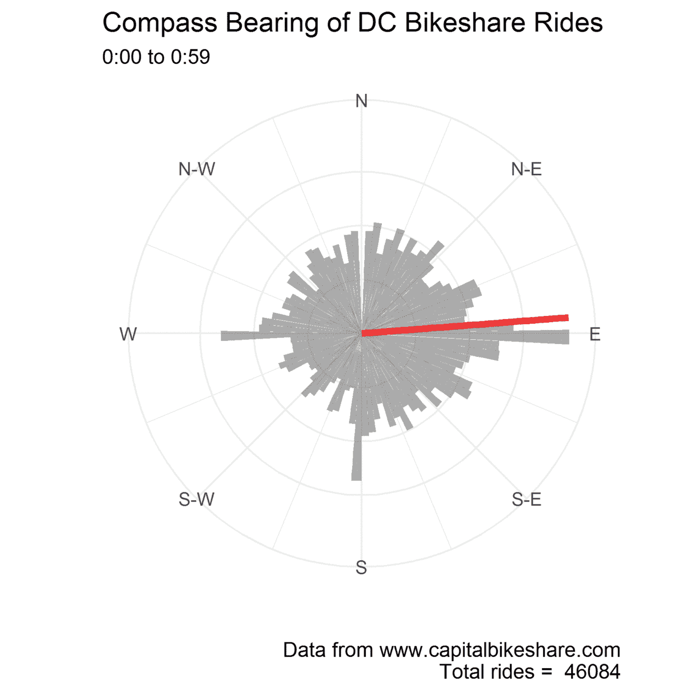
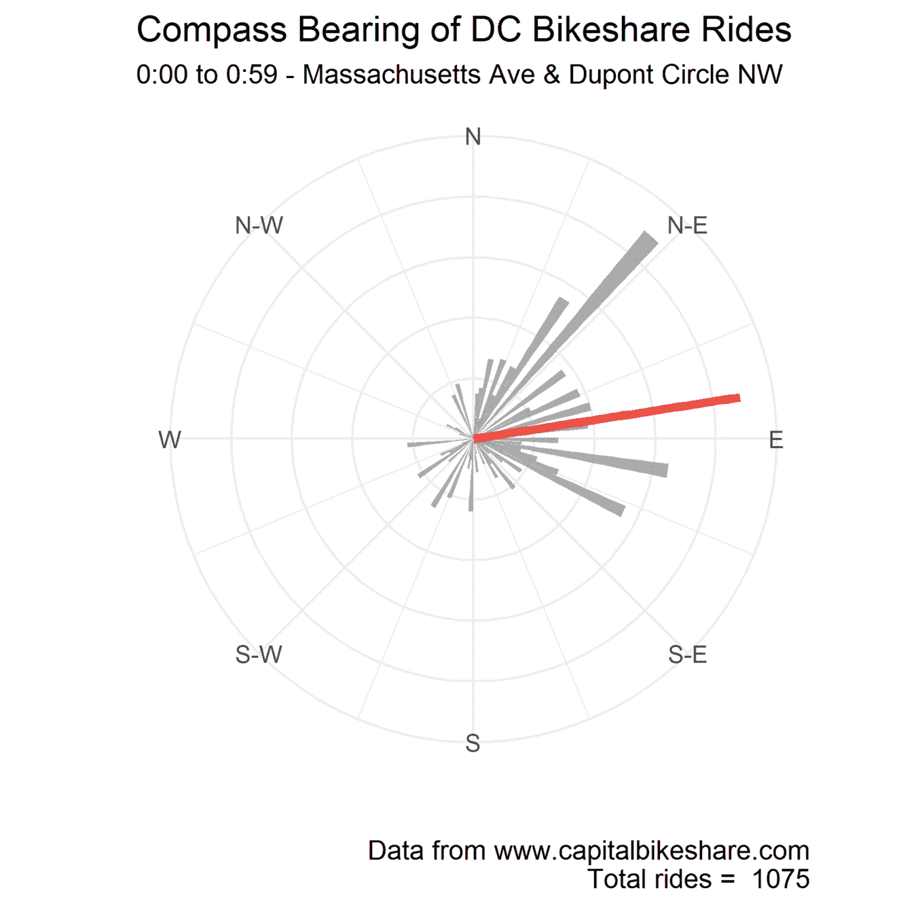
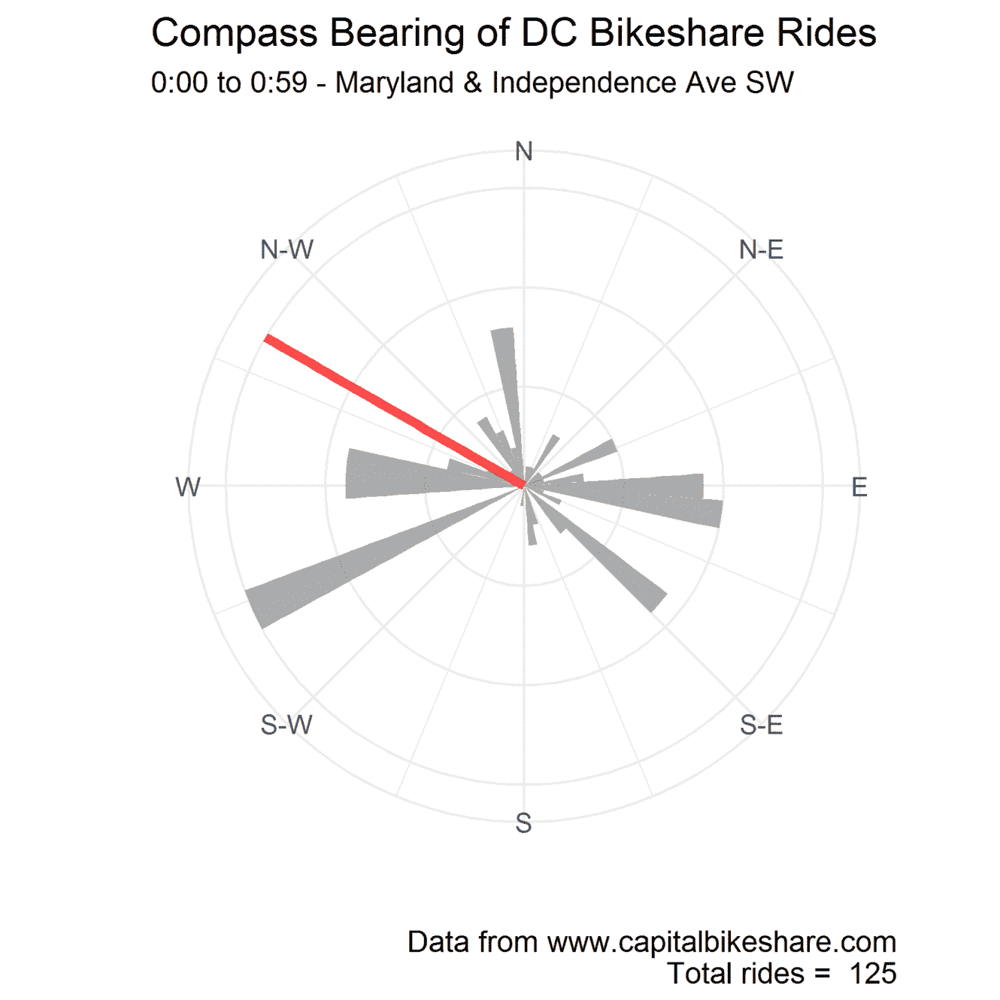
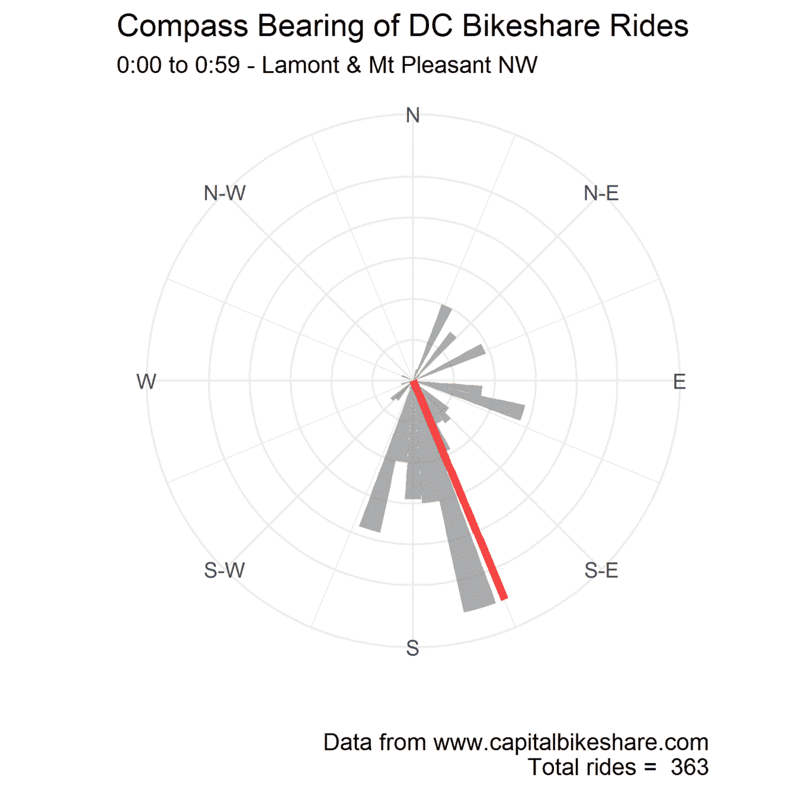
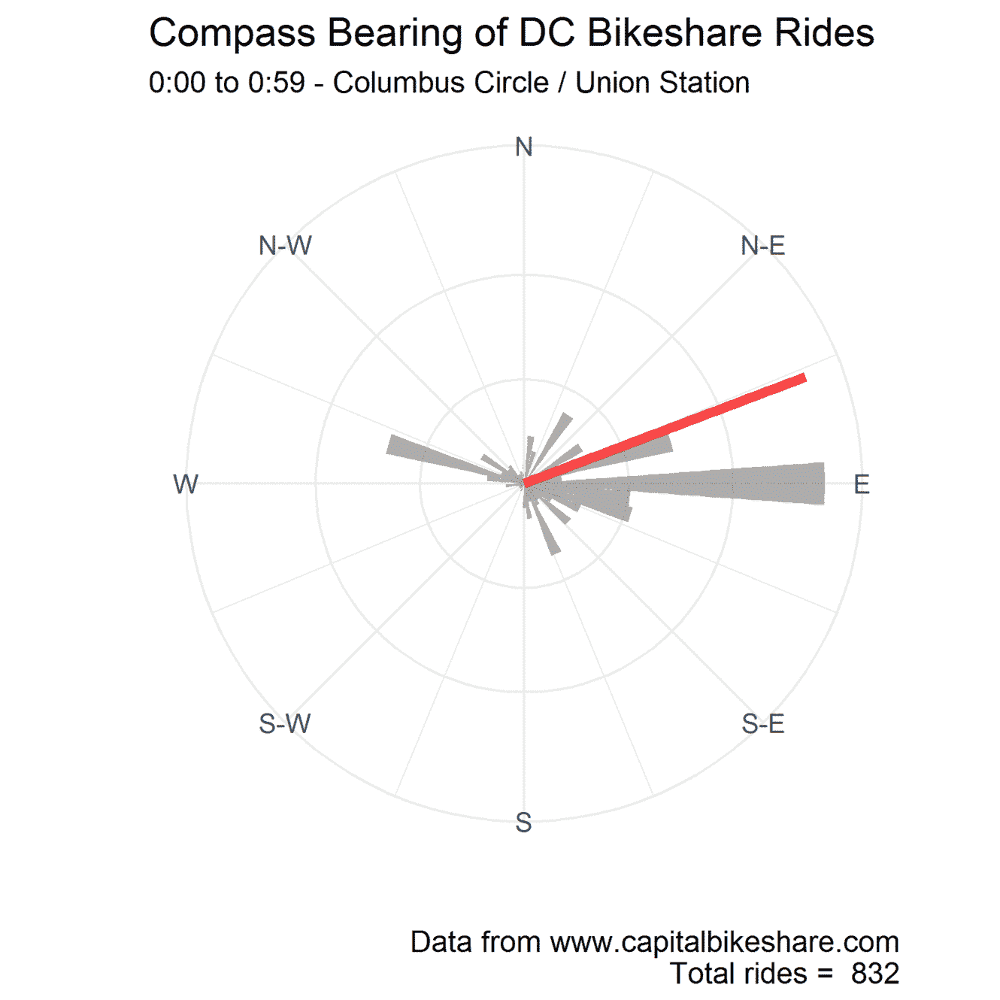

# DC:他们都去哪里了？

> 原文：<https://towardsdatascience.com/dc-bikeshare-where-do-they-all-go-41f36baabcd9?source=collection_archive---------3----------------------->

## 与 R 一起寻找 310 万次骑行的罗盘方位

几周前，我写了一篇关于人们使用 DC 自行车共享服务的文章，我仍然对这些数据感到好奇。热图的结果是显而易见的:在早上和下午的高峰时段，乘车人数激增。写完帖子后，我开始思考每一次旅行的方向，以及这些旅行在一天中的每个小时分手的方向。警告:了解 DC 的地理位置将有助于理解这篇文章。

关于自行车共享数据有无数的事情要做(并且已经被做了),但是我从来没有见过它和我想象的一样。在我的脑海中，我看到了上午前往杜邦公司办公室、法拉古广场和 K 街地区的自行车流，然后在下午前往周围的街区。

在这篇文章中，我想回答两个问题:

1.  对于一天中的每个小时，自行车共享用户的平均去向是什么？
2.  对于几个选定的站点，自行车共享用户通常每小时去哪个方向？

# **数据准备**

数据集需要一些调整才能成形。首先，我删除了在同一个车站开始和结束的乘车。有 113，167 个观察被删除，因为我不认为它们是真正的乘坐。接下来，我需要添加每次骑行的起点和终点的 GPS 坐标。最后，我需要计算从起点到终点的方位。

每个自行车共享点的纬度和经度都要感谢[区交通局](http://opendata.dc.gov/datasets/a1f7acf65795451d89f0a38565a975b3_5?uiTab=table)。然后，我总结了这个大型数据集，向我展示了每个小时的平均起点和终点。和往常一样， [dplyr 库](https://cran.rstudio.com/web/packages/dplyr/vignettes/introduction.html)在这里是个救星。为了最终得到我想要的可视化效果，我需要两个数据集(一个接一个的骑行和一个接一个的小时),就像这篇文章后面解释的那样。

有了两个数据集中的开始和结束 GPS 坐标，通过我从 [fossil 包](https://cran.r-project.org/web/packages/fossil/fossil.pdf)中提取的一个函数，计算每个观测的方位就很简单了。我不是地理空间分析方面的专家，所以这省去了我一些大麻烦。

然而，要找到所有这些乘坐的平均方位，我不能简单地取每个观察方位的平均值。罗盘方位在 0 到 359.9 度之间。想象一个指南针，其北 0 度，东 90 度，南 180 度，西 270 度。例如，假设大多数游乐设施通常是向北行驶的。轴承将是 350 至 360 度和 0 至 10 度的组合。这些乘坐的平均值将是大约 180 度(南方)，并给我们准确的错误答案(数学版本:350 度乘坐和 10 度乘坐的平均值将是(350 + 10) / 2 = 180)。因此，我必须找到每小时的平均起点坐标和平均终点坐标，然后计算这条路线的方位。

在这里的一张表格中，无聊地呈现了每小时 DC 自行车共享出行的平均方位。为了美好的事物…

# **可视化自行车方向**

是时候策划了！为了实现我想象的可视化，我需要使用两个数据集，完整的 310 万个观察数据集和逐小时数据集。第一个数据集将显示来自所有单独乘坐的方向喷雾，第二个数据集将显示该小时块中平均乘坐的方位。

在我的脑海中，我看到一个指南针，背景中所有的游乐设施都是透明的，一个箭头根据小时和平均方向从左向右摆动。 [ggplot 包](https://www.google.com/url?sa=t&rct=j&q=&esrc=s&source=web&cd=1&cad=rja&uact=8&ved=0ahUKEwjmxazN69HSAhVBvJAKHehWDMsQFggbMAA&url=http%3A%2F%2Fdocs.ggplot2.org%2F&usg=AFQjCNENXr1noqouLiE37qbZurgHz0PriA&sig2=AfEUhgwBlnJ8GxTBIsOB7Q)有一个 [coord_polar 函数](http://docs.ggplot2.org/current/coord_polar.html)将直方图转换成圆形图。在修改了主题之后，我能够让它看起来像一个指南针！

我为每张图表创建了 24 张图片，每张图片代表一天中的一个小时，然后把它们放入 GIF 制作机中，瞧！

gif 上的一些注释:

*   灰色条代表那个小时在那个方向乘坐的次数。最长长度代表该小时在该方向上的最大乘坐量。因此，您无法比较一个小时与下一个小时的条形高度。我插入了那个小时乘坐的次数来提供一些背景。
*   这张 GIF 不以任何方式代表每次乘坐的距离。只是方向。

# 车站 gif

我决定分解上面的 GIF，看看骑行一站一站地走向哪里。我选择它们是基于它们在 DC 的位置(还有一个在芒特普莱森特，因为我曾经住在那里)。

正如你所看到的，根据车站在 DC 的位置，大多数乘坐的方向可能会有很大的不同。同样，这在直觉上是有意义的。如果你从 DC 的东边开始，你可能会向西走，因为那个方向有更多的活动，有更多的车站可以停靠你的自行车。

我还注意到有很多游乐设施直接向西、向东或向南行驶。由于 DC 是一个网格城市，似乎许多自行车骑行开始和结束在同一条街上。这是有道理的。这也是有道理的，某些车站，如联合车站，主要是向西(K 街，杜邦等)的方向。).

我有几个理由来解释为什么正北不是一个常见的方位。首先，我删除了所有在同一个车站开始和结束的乘车。这些飞行会产生 0 度的方位，或者直接指向北方。然而，应该仍然有直接向北行驶的游乐设施，比如说沿第 14 街西北方向。我的理论是，你越往北走，就越容易上坡。作为重型自行车，上坡骑并不流行。

# 结论和后续步骤

看一下自行车共享站的地图(以及整个 DC 的地图)，大多数的站和人都在西北方向。从西北方向去上班，你通常会往南走。要回家，你通常会向北走。

再往深里看，另一个帖子的成因，除了方位，我还想看每一次乘坐距离每一站的距离。这将把我带到 [ggmap 包](https://cran.r-project.org/web/packages/ggmap/ggmap.pdf)，我刚刚开始修补它。

一如既往，我很想听听你的想法。如果你认为我错过了一个很棒的电视台，给我一声，我很乐意去看看。或者如果你想看看你当地的车站，我也可以帮你！

代码可在我的 [GitHub repo 这里](https://github.com/AlexJF12/DC-Bikeshare)(寻找 [dc bikeshare 方向。R](https://github.com/AlexJF12/DC-Bikeshare/blob/master/dc%20bikeshare%20direction.R) 和[站承载 gif 功能。R](https://github.com/AlexJF12/DC-Bikeshare/blob/master/station%20bearing%20gif%20function.R) )。