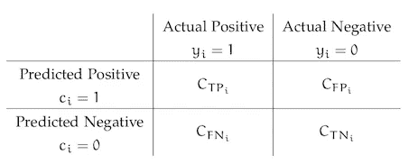
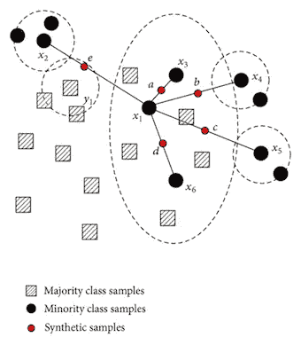
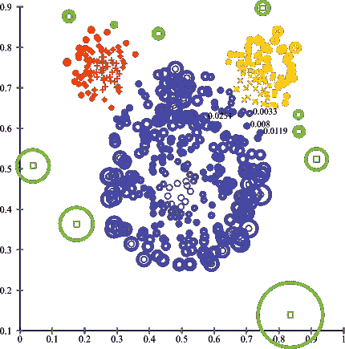

# 机器学习中不平衡类的处理

> 原文：<https://towardsdatascience.com/dealing-with-imbalanced-classes-in-machine-learning-d43d6fa19d2?source=collection_archive---------1----------------------->

## 介绍

大多数现实世界的分类问题都表现出某种程度的类别不平衡，即每个类别在数据集中所占的比例不同。适当调整你的标准和方法以适应你的目标是很重要的。如果没有做到这一点，您可能会在您的用例环境中为一个无意义的度量进行优化。

例如，假设您有两个类——A 和 B。A 类占您数据集的 90 %, B 类占另外的 10%,但是您最感兴趣的是识别 B 类的实例。通过简单地每次预测 A 类，您可以达到 90%的准确率，但是这对于您的预期用例来说提供了一个无用的分类器。相反，正确校准的方法可能会实现较低的准确性，但会有更高的真实阳性率(或召回率)，这确实是您应该优化的指标。这些场景通常发生在检测环境中，例如在线滥用内容或医疗数据中的疾病标记。

我现在将讨论几种可以用来减轻阶级不平衡的技术。一些技术适用于大多数分类问题，而其他技术可能更适合特定的不平衡水平。在本文中，我将从二元分类的角度来讨论这些问题，但是在大多数情况下，多类分类也是如此。我还假设**的目标是识别少数类**，否则，这些技术并不是真正必要的。

## 韵律学

一般来说，这个问题处理的是**召回**(被如此分类的真正肯定的实例的百分比)和**精确度**(真正肯定的肯定分类的百分比)之间的权衡。在我们想要检测少数类的实例的情况下，我们通常更关心召回率而不是精确度，因为在检测的上下文中，错过一个肯定的实例通常比错误地标记一个否定的实例代价更高。例如，如果我们试图检测滥用内容，让人工审查者发现内容实际上不是滥用的是微不足道的，但是识别从未被标记为滥用的内容要困难得多。因此，在比较不平衡分类问题的方法时，可以考虑使用准确度以外的指标，如召回率、精确度和 AUROC。在参数选择或模型选择期间切换您优化的度量可能足以提供检测少数类的理想性能。

## 成本敏感学习

在常规学习中，我们平等地对待所有错误分类，这导致不平衡分类问题，因为识别少数类而不是多数类没有额外的奖励。成本敏感学习改变了这一点，并使用函数 **C(p，t)** (通常表示为矩阵)，该函数指定将类 **t** 的实例错误分类为类 **p** 的成本。这使得我们对少数阶级的错误分类的惩罚比对多数阶级的错误分类的惩罚更重，希望这能增加真正的阳性率。为此，一个常见的方案是使成本等于该类构成的数据集比例的倒数。随着班级人数的减少，这增加了惩罚。

Sample cost function matrix

## 抽样

修复不平衡数据集的一个简单方法是简单地平衡它们，或者通过**过采样少数类的**实例或者**欠采样多数类的**实例。这只是允许我们创建一个平衡的数据集，从理论上讲，不应该导致分类器偏向一个类或另一个类。然而，在实践中，这些简单的取样方法有缺陷。对少数进行过采样会导致模型过拟合，因为它会引入重复的实例，从已经很小的实例池中提取。类似地，对大多数进行欠采样可能会遗漏提供两个类之间重要差异的重要实例。

除了简单的过采样或欠采样之外，还有更强大的采样方法。最著名的例子是 **SMOTE** ，它通过形成相邻实例的凸组合来创建少数类的新实例。如下图所示，它可以有效地在特征空间中的少数点之间绘制直线，并沿着这些直线进行采样。这使我们能够平衡数据集，而不会过度拟合，因为我们创建了新的合成示例，而不是使用副本。然而，这并不能防止所有的过度拟合，因为这些仍然是从现有的数据点创建的。

Visualization of SMOTE

## 异常检测

在更极端的情况下，在异常检测的上下文中考虑分类可能更好。在异常检测中，我们假设存在数据点的“正态”分布，任何充分偏离该分布的都是异常。当我们将分类问题重新构建为异常检测问题时，我们将多数类视为点的“正常”分布，将少数类视为异常。有许多异常检测算法，如聚类方法、单类支持向量机和隔离森林。

Visualization of clustering method for anomaly detection

## 结论

希望这些方法的某种组合将允许您创建一个更好的分类器。就像我之前说的，这些技术中的一些更适合不同程度的不平衡。例如，简单的采样技术可以让您克服轻微的不平衡，而异常检测方法可能需要极端的不平衡。最终，对于这个问题，没有一个放之四海而皆准的方法，您只需要尝试每种方法，看看它们如何应用于您的特定用例以及成功的衡量标准。