# 通过数据可视化解读印度:印度教育系统

> 原文：<https://towardsdatascience.com/deciphering-india-through-data-visualization-indian-education-system-f4f50f37bc04?source=collection_archive---------8----------------------->

## **tldr；我为什么这么做，我发现了什么？**

当我开始我的数据科学之旅时，我一直知道我想研究具有社会影响的数据。为了给我的第一个项目寻找主题，我开始阅读大量的研究论文、项目、报纸文章并搜索相关数据。这就是我如何阅读 ASER 教育报告并了解 DISE 出版物的。当我调查这些数据时，各种各样的问题突然出现在我的脑海里，“学习水平如何？”、“有百分之多少的孩子不去上学？”、“私立学校的入学率是多少”、“女孩的入学率如何？”、‘学校基础设施的状况如何？’，‘参数是如何随时间变化的？’、'各州之间相比如何？'等等。所以，我决定用它来进行分析，并通过 4d 可视化来探索数据。为什么是 4d 可视化？因为它实现了多维度的探索和比较。

我的发现总结如下:

***如果你觉得这个有趣就继续读下去……***

## 阿塞尔和 DISE 前来救援

年度教育状况报告(ASER)是一项年度调查，自 2005 年以来报告了儿童的学校教育状况以及他们完成基本阅读和算术任务的能力。在非政府组织 Pratham 的协助下，这项调查由来自印度几乎所有农村地区的当地伙伴组织的志愿者进行。

地区教育信息系统(DISE)收集全国所有学校的入学率、基础设施、教师和其他可用设施的信息。该数据库由[国立教育规划和管理大学](https://en.wikipedia.org/wiki/National_University_for_Educational_Planning_and_Administration)开发和维护。自 2002 年以来，DISE 报告每年出版一次。

## **准备破译**

**数据分析参数有哪些？**我选择了 2007 年到 2016 年间的 DISE 和 ASER 数据。DISE 提供了有关入学率、基础设施、学生教师比率和学生教室比率的信息。学习水平、学校类型和校外信息来自 ASER。基于与研究的相关性和随时间的一致性来选择参数。与教学语言和教师有关的参数可以在今后的研究中加以考虑。

R，d3 和酒窝太棒了！使用 R 编程语言进行数据探索和准备，R 编程语言是一种用于统计计算和图形的开源软件。用于 4d 可视化的气泡图是使用 d3 和 dimple javascript 库开发的。事实证明，它们与分析非常相关，非常有用

**解冻数据到合适的级别:** State 这里是分析的单位。汇总函数用于检测异常值和缺失值。认为没有必要进行异常值处理，并且删除具有缺失值的行。ASER 为新成立的特伦甘纳邦和安得拉邦提供综合信息，而 DISE 则提供单独的数据。这两个州的 DISE 数据已经使用平均值合并。

**数据结构:**在本研究使用的变量中，除总入学人数、家长教师比例和学校教室比例外，所有值均为百分比。每个州的区域是通过将州到区域映射文件与包含 DISE 和激光数据的文件合并而得到的。

## 可视化效果如何？

为动态 4d 可视化提供了选择下拉框。气泡图中的每个维度都有一个选择下拉框。

更改“选择”下拉列表中的选项会更新相应的轴。x 轴、y 轴和大小下拉框具有与入学、基础设施和学习水平信息相关的相同选项。颜色下拉菜单有两个选项“州”和“地区”。“州”选项为每个州显示不同的颜色,“地区”选项为该州所属的每个地区显示一种颜色。这有助于按州和地区分析信息。故事板设置为“年”。随着一年中的每一个分笔成交点，图表都会更新以显示该年的信息。播放\暂停按钮控制动画。

## 我发现了什么？

**私立学校招生人数大增**

尽管大多数儿童(5-16 岁)继续在公立学校接受教育，但近年来私立学校的入学率也在上升，尽管它们的学费很高。即使在像 Uttara Pradesh 这样人口众多且落后的邦，2016 年私立学校的入学率也在 50%左右。这是什么原因呢？是因为设施和老师比官校好吗？

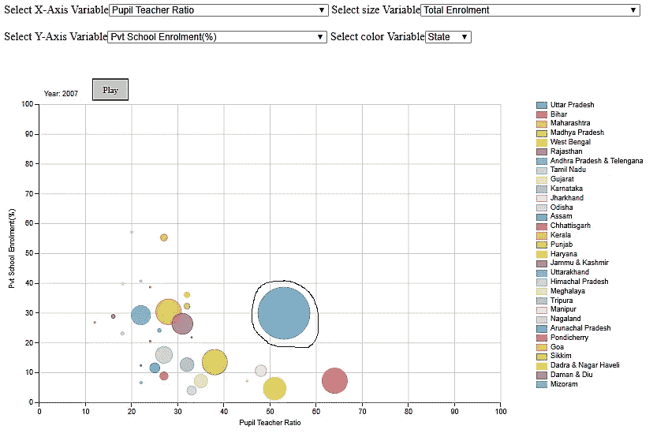

**学生教师比率和学生课堂比率正在下降**

每名教师的学生人数(PTR)和一个教室的学生人数(SCR)正在下降。这是否意味着学校的数量在增加？私立学校有助于降低比率吗？

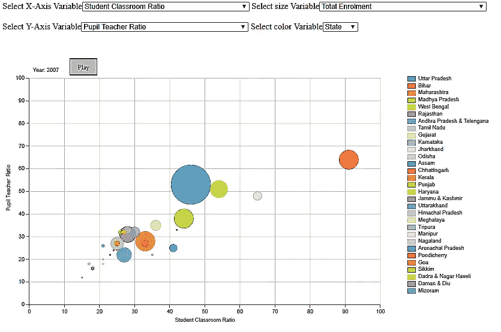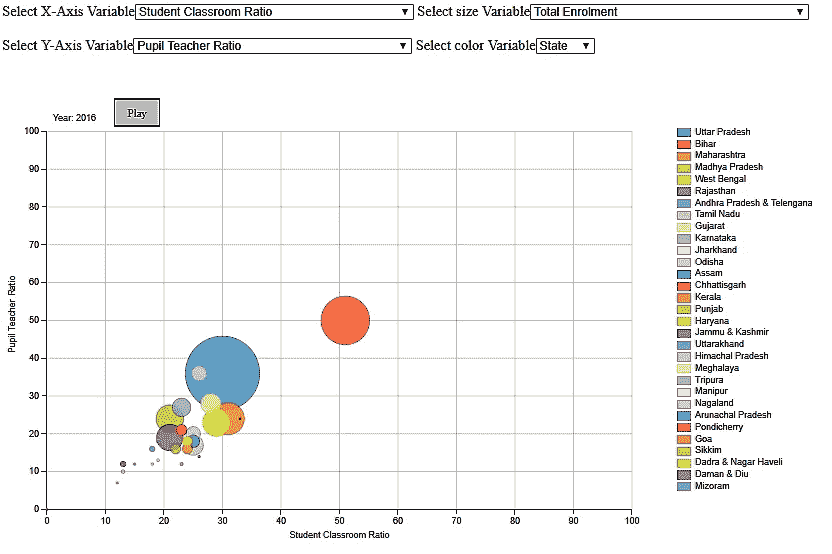

**厕所、饮水设施等学校基础设施正在改善**

大多数州在提供这些设施方面达到了 100%,尽管这些设施的状况可以作为另一项研究的主题。值得注意的是，2009 年生效的《实时教育法》所产生的补助金在改善这些设施方面发挥了作用。

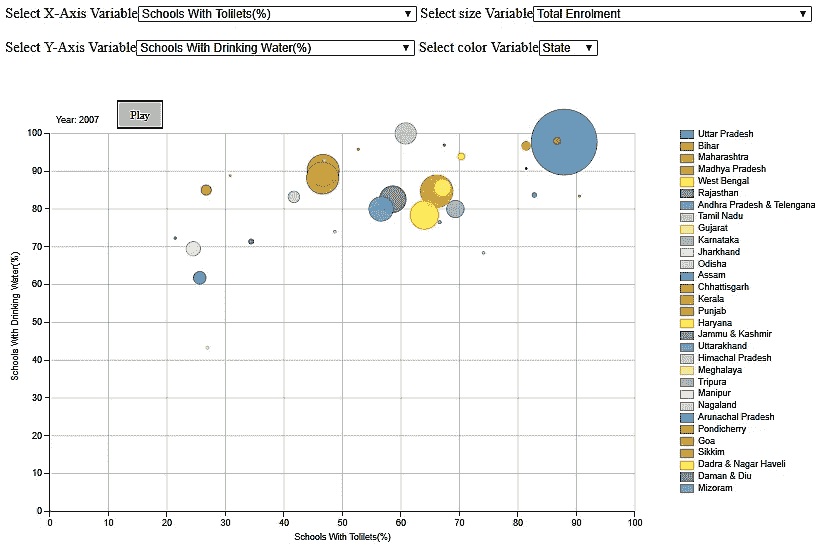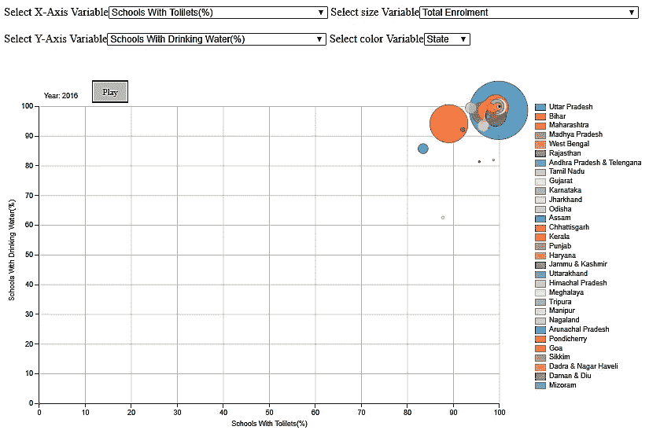

**那么，学习水平一点点提高了？**

绝对不行！典型的例子是相邻的北方邦和比哈尔邦，这两个地方人口众多，社会经济落后。虽然 Uttara Pradesh 的私立学校入学率接近 50%,但比哈尔邦远远落后，只有 10%左右。但就学习水平而言，两者的表现同样糟糕，2016 年约有 20%的儿童(5-16 岁)无法阅读，类似数量的儿童无法识别数字。那么，影响学习水平的其他因素是什么呢？

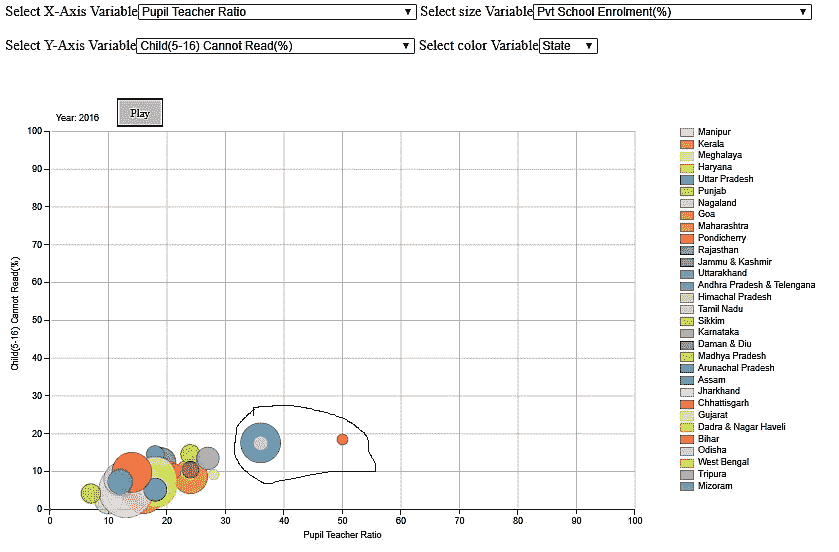

**自 2012 年以来学习水平急剧下降**

自 2012 年以来，大多数州都显示出不能阅读和做数学的儿童(5-16 岁)的比例显著增加。与此同时，能够做除法(最高水平的数学测试)和阅读 std 2 文本(最高水平的阅读测试)的儿童(5-16 岁)的百分比也有所下降。是什么引发了 2012 年以来的这种下跌？

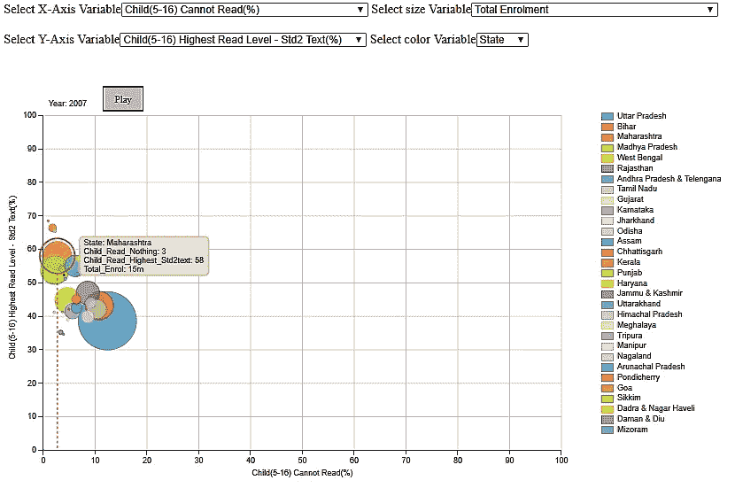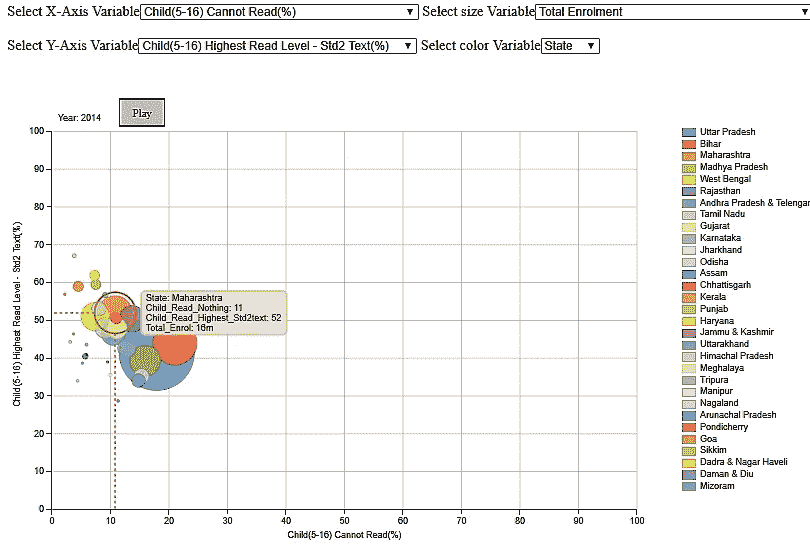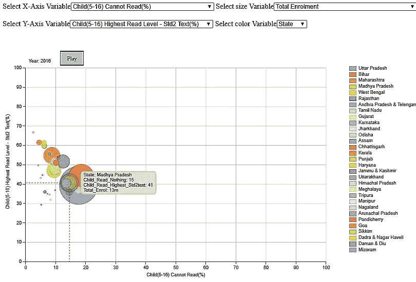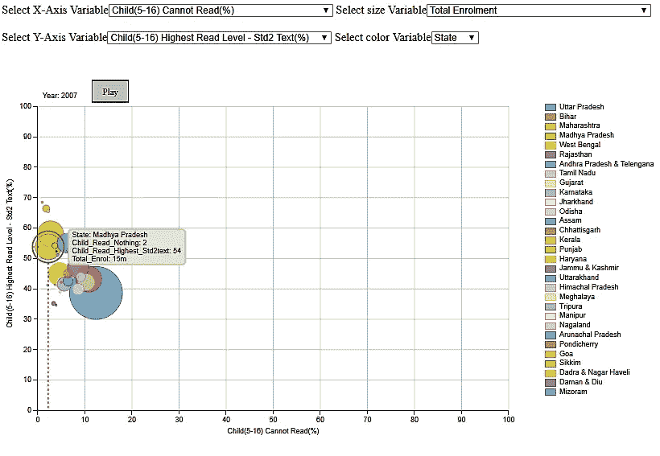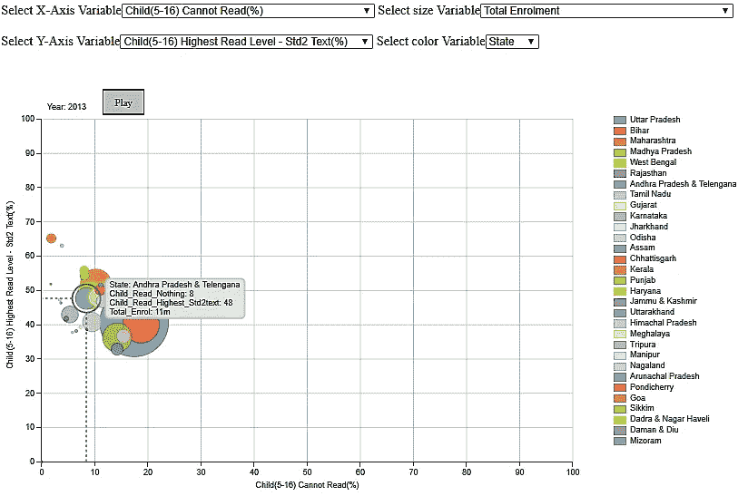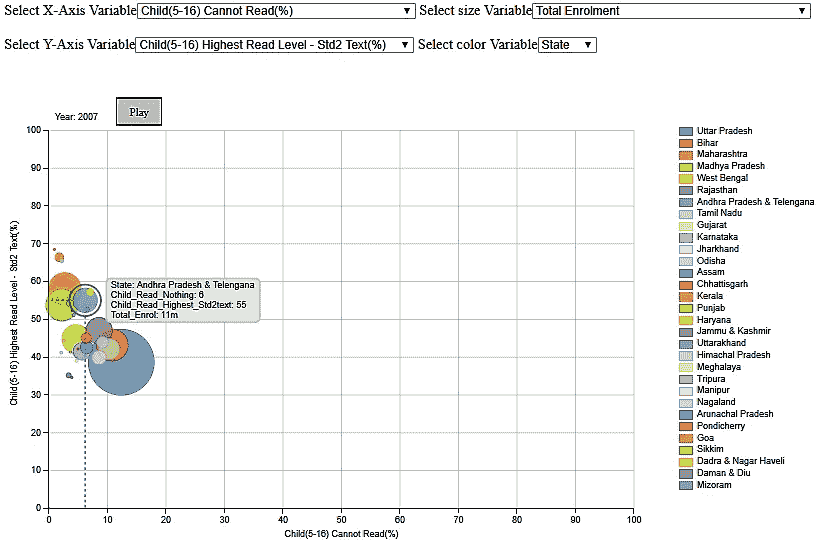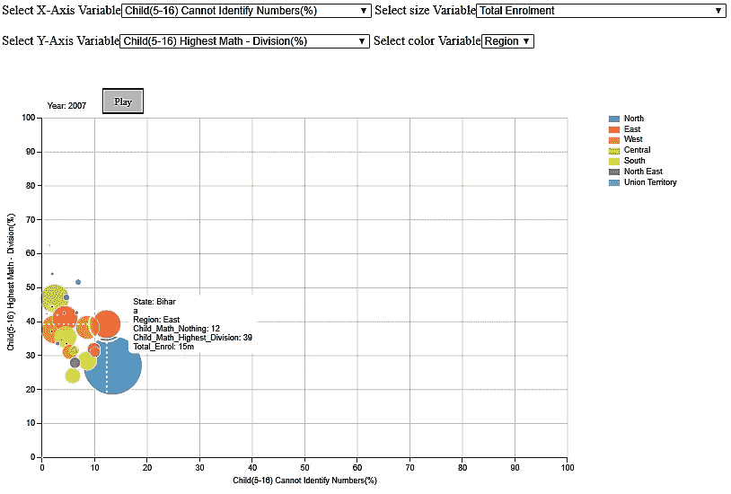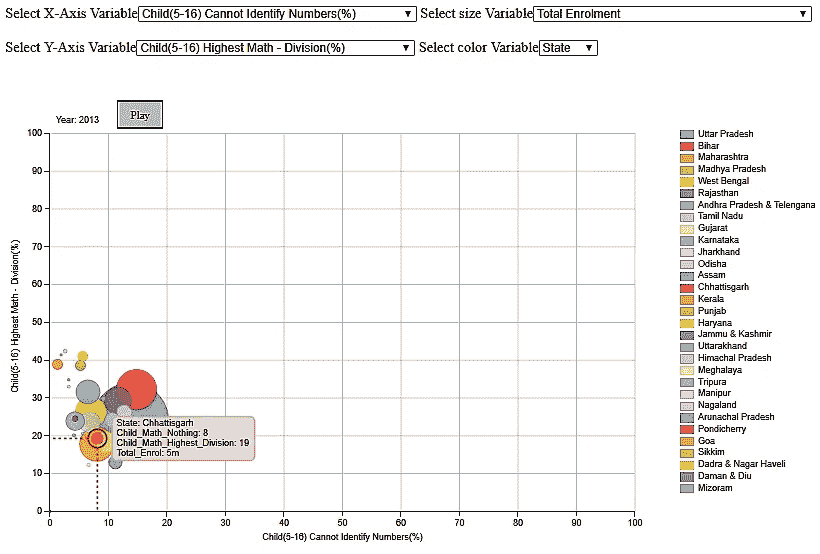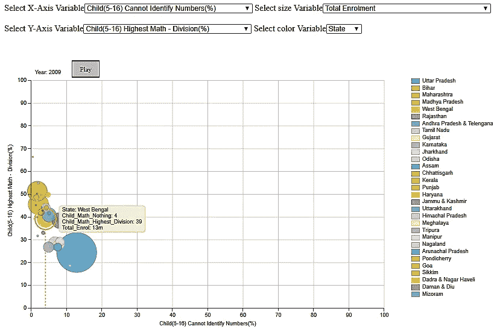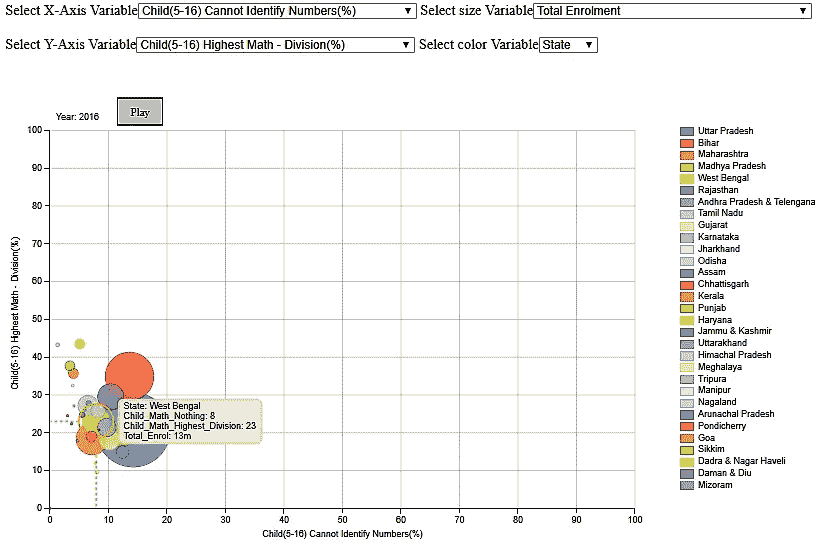

**私立学校招生是唯一的地区性趋势**

有趣的是，在数据分析参数中没有区域趋势。唯一的例外是私立学校的入学人数。在东部的比哈尔邦、恰尔肯德邦、奥里萨邦和西孟加拉邦，私立学校的入学率很低。私立学校入学率最高的是北部的北方邦、旁遮普邦和哈里亚纳邦。

**女孩入学率保持稳定，没有区域障碍**

另一个有趣的方面是女孩的入学率自 2007 年以来一直保持稳定。大多数州的女生入学率在总入学率的 45%到 48%之间。一个国家在经济和社会方面的落后并没有影响这个百分比。即使是女生比例较低的邦，如哈里亚纳邦和拉贾斯坦邦，女生入学率也超过了总入学率的 45%。

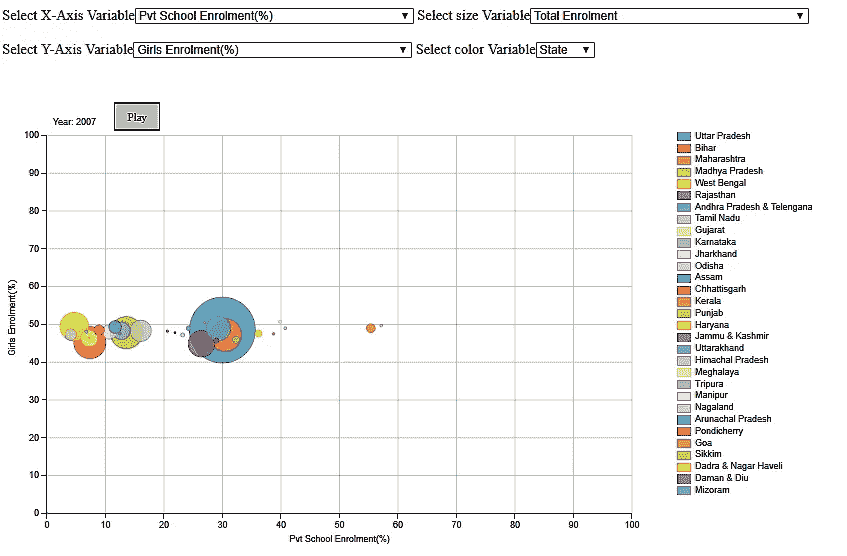

**5%的儿童(5-16 岁)失学**

大约 5%的儿童(5-16 岁)没有上学。自 2007 年以来一直保持稳定。他们根本没去上学吗？如果他们以前在学校，是在哪个阶段辍学的？如果不在学校，他们做什么？

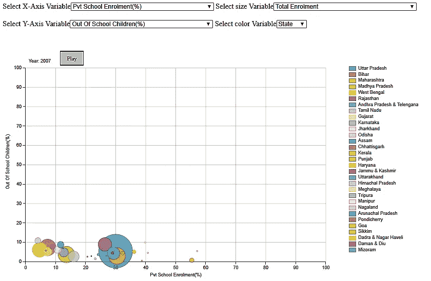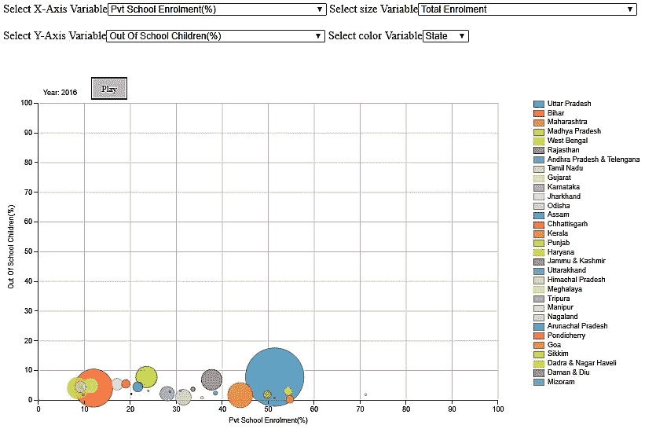

## **结论**

我列出了一些我觉得有趣的观察结果。你能找到更多吗？请访问我的 [*github*](https://mrinalini1977.github.io/MyWebsite/research/education_data_4d_visualiser/4d_visualiser.html) 页面进行可视化。

总之，学习水平是衡量一个国家教育系统健康状况的最重要的标准。从数据来看，很明显印度做得不是特别好。尽管 2009 年实施了《实时教育法》,中产阶级不断壮大，补助金和其他资源也有所增加。这是什么原因呢？教师的质量影响结果吗？社会经济因素在起作用吗？成人识字和城市化怎么样？

我一定会带着进一步的更新回来..继续检查。