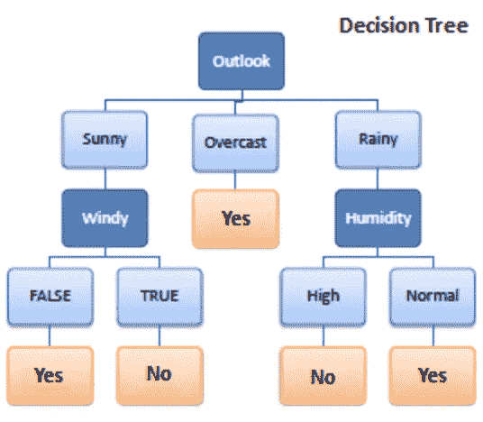

# 决策树和随机森林

> 原文：<https://towardsdatascience.com/decision-trees-and-random-forests-df0c3123f991?source=collection_archive---------0----------------------->

决策树是一种用于分类和回归的模型。树回答连续的问题，这些问题把我们沿着给出答案的树的特定路线送下去。该模型以“如果这个比那个”的条件运行，最终产生特定的结果。这一点很容易看出，下图显示了是否要打高尔夫球。

这棵树的流程是从顶部开始向下的。前景有三种选择:晴天、阴天或雨天。如果天气晴朗，我们就去下一层。会有风吗？真的还是假的？如果是真的，我们那天选择不打高尔夫。如果错误，我们选择玩。如果天气转阴，我们将在那里结束比赛。如果天气预报是多雨的，我们将会关注湿度。如果湿度高，我们就不玩，如果湿度正常，我们就玩。

树的深度是一个重要的概念。这表示在我们达到预测的分类之前有多少问题被询问。我们可以看到，在上面的例子中，树的最深处是 2。晴天和雨天的路线都有两个深度。虽然整个树的深度是由它最长的路线来表示的，但是阴路线只有一个深度。因此，这棵树的深度为 2。

**使用决策树的优势**:

1.易于解释和直观化。

2.内部工作能够被观察到，从而使复制工作成为可能。

3.可以处理数字和分类数据。

4.在大型数据集上表现出色

5.速度极快

**决策树的缺点**:

1.构建决策树需要能够在每个节点确定最优选择的算法。一种流行的算法是亨特算法。这是一个贪婪模型，这意味着它在每一步都做出最优决策，但没有考虑全局最优。这是什么意思？在每一步，算法都会选择最佳结果。然而，在给定的步骤中选择最佳结果并不能确保当您到达树的最后一个节点(称为叶节点)时，您将沿着通向最佳决策的路线前进。

2.决策树容易过度拟合，尤其是当一棵树特别深的时候。这是由于我们所观察的特异性的数量导致了满足先前假设的事件的较小样本。这个小样本可能导致不可靠的结论。这方面的一个例子是预测波士顿凯尔特人队是否会在今晚的篮球赛中击败迈阿密热火队。该树的第一层可以询问凯尔特人是主场还是客场比赛。第二层可能会问凯尔特人是否比他们的对手，在这种情况下是热火，有更高的胜率。第三关问凯尔特人的头号得分手是否上场？第四关问凯尔特人第二得分手是否上场。第五层询问凯尔特人是否从西海岸连续 3 场或更多的客场比赛回到东海岸。虽然所有这些问题可能都是相关的，但可能只有前两个游戏符合今晚游戏的条件。仅使用两种游戏作为我们分类的基础不足以做出明智的决定。解决这个问题的一个方法是设置最大深度。这将限制我们过度拟合的风险；但与往常一样，这将以偏差导致的误差为代价。因此，如果我们设置最大深度为 3，我们只会问比赛是主场还是客场，凯尔特人是否比他们的对手有更高的胜率，以及他们的头号得分手是否在比赛。这是一个更简单的模型，样本之间的差异更小，但最终不会是一个强预测模型。

理想情况下，我们希望将偏差引起的误差和方差引起的误差都最小化。进入随机森林。随机森林很好地缓解了这个问题。随机森林只是决策树的集合，其结果被聚合成一个最终结果。它们限制过度拟合而不会因偏差而大幅增加误差的能力是它们成为如此强大的模型的原因。

随机森林减少方差的一种方法是对不同的数据样本进行训练。第二种方法是使用随机的特征子集。这意味着如果我们有 30 个特征，随机森林将只在每个模型中使用一定数量的特征，比如 5 个。不幸的是，我们忽略了 25 个可能有用的特性。但是如上所述，随机森林是决策树的集合。因此，在每棵树中，我们可以利用五个随机特征。如果我们在森林中使用许多树木，最终我们的许多或所有特征都将被包括在内。这种包含许多特征的方法将有助于限制由偏差引起的误差和由方差引起的误差。如果特征不是随机选择的，我们森林中的基础树可能会变得高度相关。这是因为一些特征可能是特别具有预测性的，因此，相同的特征将在许多基础树中被选择。如果这些树中有许多包含相同的特征，我们就不会因为差异而产生错误。

也就是说，随机森林是一种强大的建模技术，比单一的决策树更加健壮。他们聚集了许多决策树来限制过度拟合以及由于偏差而产生的错误，从而产生有用的结果。

对于视频格式的教程，请访问我的数据科学课程，网址为[https://www.youtube.com/watch?v=v32aJe9Hnag&list = plr CB-x 3137 c 09 bpxjdetzvbygg-hnwz 86&index = 1](https://www.youtube.com/watch?v=v32aJe9Hnag&list=PLrcb-x3137c09bpxJDetZvbyGg-hnwz86&index=1)