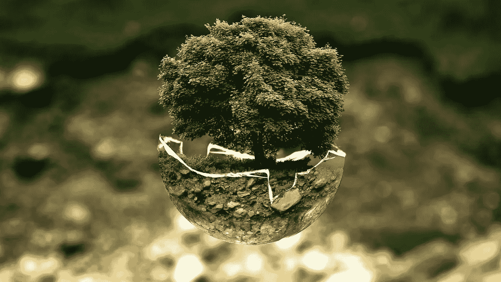

# 机器学习中的决策树

> 原文：<https://towardsdatascience.com/decision-trees-in-machine-learning-641b9c4e8052?source=collection_archive---------1----------------------->

一棵树在现实生活中有很多类比，事实证明它影响了**机器学习**的广泛领域，既包括**分类，也包括回归**。在决策分析中，决策树可用于直观、明确地表示决策和决策制定。顾名思义，它使用树状决策模型。虽然在数据挖掘中它是一个常用的工具，用来导出一个策略以达到一个特定的目标，但它也广泛地用于机器学习，这将是本文的主要焦点。

## 一个算法如何用树来表示？

为此，让我们考虑一个非常基本的例子，使用泰坦尼克号的数据集来预测一名乘客是否会幸存。以下模型使用数据集中的 3 个特征/属性/列，即性别、年龄和 sibsp(配偶或子女数量)。

Image taken from wikipedia

*一棵决策树被倒过来画，它的根在顶部。*在左边的图片中，黑色的粗体文本代表一个条件/ **内部节点**，基于该条件树分裂成分支/ **边**。不再分裂的分支的末端是 decision/ **leaf** ，在本例中，乘客是死是活，分别用红色和绿色文本表示。

虽然，一个真正的数据集将有更多的功能，这只是一个更大的树的一个分支，但你不能忽视这种算法的简单性。**特征的重要性是清楚的**并且可以容易地查看关系。这种方法通常被称为从数据中学习决策树**，上述树被称为分类树**因为目标是将乘客分类为幸存或死亡。**回归树**以同样的方式表示，只是它们预测连续的值，比如房子的价格。一般来说，决策树算法被称为 CART 或分类和回归树。****

**那么，后台到底是怎么回事呢？**种一棵树包括决定**选择哪些特征**和**使用什么条件**进行分裂，以及知道何时停止。因为一棵树通常是任意生长的，所以你需要修剪它，让它看起来更漂亮。让我们从一种常用的分割技术开始。

## **递归二进制分裂**

*在该程序中，考虑了所有特征，并使用成本函数尝试和测试了不同的分割点。选择具有最佳成本(或最低成本)的分割。*

考虑从 titanic 数据集学习的树的早期例子。在第一次分裂或根中，考虑所有属性/特征，并且基于该分裂将训练数据分成组。我们有 3 个特征，所以将有 3 个候选分裂。现在我们将 ***计算出*** [***准确度***](https://medium.com/towards-data-science/balancing-bias-and-variance-to-control-errors-in-machine-learning-16ced95724db) ***每拆分一次将花费我们多少，使用函数*** 。 ***选择成本最低的拆分*** ，在我们的例子中是乘客的性别。该 ***算法本质上是递归的*** ，因为形成的组可以使用相同的策略细分。由于这个过程，这个算法也被称为**贪婪算法**，因为我们有降低成本的过度欲望。**这使得根节点成为最佳预测器/分类器。**

## 拆分的成本

让我们仔细看看用于分类和回归的**成本函数**。在这两种情况下，成本函数试图**找到最相似的分支，或者具有相似响应的组的分支**。这使得我们可以更确定一个测试数据的输入会遵循一定的路径。

> 回归:总和(y-预测)

比方说，我们正在预测房价。现在，决策树将通过考虑训练数据中的每个特征来开始分裂。特定组的训练数据输入的响应的平均值被认为是对该组的预测。上述函数应用于所有数据点，并计算所有候选分割的成本。*再次选择最低成本的分割*。另一个成本函数涉及标准偏差的减少，更多信息可在[这里](http://www.saedsayad.com/decision_tree_reg.htm)找到。

> 分类:G =总和(PK *(1-PK))

基尼系数通过分裂产生的群体中反应类别的混合程度，给出了分裂有多好的概念。这里，pk 是特定组中同类输入的比例。当一个组包含来自同一类的所有输入时，出现完美的类纯度，在这种情况下，pk 为 1 或 0，G = 0，其中一个组中具有 50-50 个类的节点具有最差的纯度，因此对于二进制分类，它将具有 pk = 0.5 和 G = 0.5。

## 什么时候停止分裂？

你可能会问 ***什么时候停止种一棵树？*** 作为一个问题通常有一个大的特征集，它导致大量的分裂，进而产生一棵巨大的树。这样的树*很复杂，会导致过度拟合。*所以，我们需要知道什么时候停止？一种方法是**设置在每片叶子上使用的最小数量的训练输入。**例如，我们可以使用最少 10 名乘客来做出决定(死亡或幸存)，并忽略任何少于 10 名乘客的叶子。另一种方法是设置模型的最大深度。**最大深度是指从根到叶子的最长路径的长度。**

## 修剪

一棵树的性能可以通过 ***修剪*** 进一步提升。*它包括* ***去除利用低重要性特征的分支*** 。这样，我们降低了树的复杂性，从而通过减少过度拟合来提高其预测能力。

修剪可以从根部开始，也可以从叶子开始。最简单的修剪方法是从叶子开始，删除叶子中最受欢迎的类的每个节点，如果这种改变不会降低精确度，则保留这种改变。它也被称为**减少错误修剪**。可以使用更复杂的修剪方法，例如**成本复杂性修剪**，其中使用学习参数(α)来衡量是否可以基于子树的大小移除节点。这也被称为**最弱链接修剪。**

## 手推车的优势

*   易于理解、解释和形象化。
*   决策树*隐含地执行变量筛选或特征选择。*
*   *能处理数字和分类数据吗*。也可以*处理多输出问题。*
*   决策树需要用户相对较少的努力来准备数据。
*   *参数之间的非线性关系不影响采油树性能。*

## **推车的缺点**

*   决策树学习者*可以创建不能很好概括数据的过于复杂的树*。这叫做*过拟合*。
*   决策树可能不稳定，因为数据的微小变化可能导致生成完全不同的树。这就是所谓的 [*方差*](https://medium.com/towards-data-science/balancing-bias-and-variance-to-control-errors-in-machine-learning-16ced95724db) ，需要通过 *套袋、* [***升压***](/boosting-the-accuracy-of-your-machine-learning-models-f878d6a2d185) 等方法降低*。*
*   贪婪算法不能保证返回全局最优的决策树。这可以通过训练多个树来减轻，其中特征和样本通过替换被随机采样。
*   决策树学习者创建[*偏向*](https://medium.com/towards-data-science/balancing-bias-and-variance-to-control-errors-in-machine-learning-16ced95724db) *的树如果某些职业支配*。因此，建议在拟合决策树之前平衡数据集。

这都是基本的，让你和决策树学习一样。使用**提升** 的[技术对决策树学习进行了改进。实现这些算法的一个流行库是](/boosting-the-accuracy-of-your-machine-learning-models-f878d6a2d185) [**Scikit-Learn**](https://becominghuman.ai/implementing-decision-trees-using-scikit-learn-5057b27221ec) 。它有一个很棒的 api，只需几行 python 代码就能让你的模型运行起来。

如果你喜欢这篇文章，一定要点击下面的❤推荐它，如果你有任何问题，**留下评论**，我会尽力回答。

为了更加了解机器学习的世界，**跟我来**。这是最好的办法，等我多写点这样的文章就知道了。

也可以在 [**推特**](https://twitter.com/Prashant_1722) ， [**直接发邮件给我**](mailto:pr.span24@gmail.com) 或者 [**在 linkedin**](https://www.linkedin.com/in/prashantgupta17/) 上找我。我很乐意收到你的来信。

乡亲们，祝你们有美好的一天:)