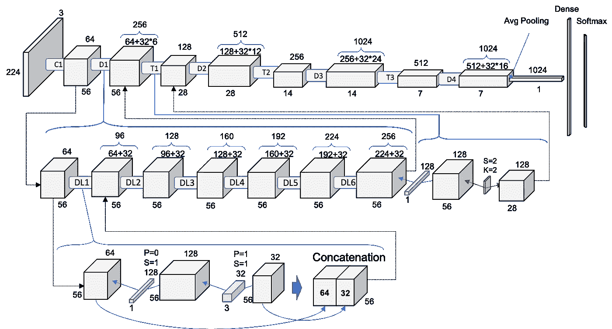

# 深度卷积神经网络

> 原文：<https://towardsdatascience.com/deep-convolutional-neural-networks-ccf96f830178?source=collection_archive---------14----------------------->

这篇文章的目的是在深入阅读描述深层架构的原始出版物之前，作为对深层架构的一个很好的介绍。

我觉得研究界缺乏帮助。一个研究人员花一点点时间制作漂亮的可视化效果、仪表盘、演示甚至视频，可以节省所有跟在他/她后面的研究人员的时间，创新会发展得更快。

我的贡献是通过直觉理解如此使用的**深度卷积神经网络**作为计算机视觉问题的默认选项的演变。

DenseNet — Example of how networks will be demystified

**指数**

0.1: [**卷积运算**](http://www.pabloruizruiz10.com/resources/CNNs/Convolution_Pooling.pdf)

0.2: [**1x1 卷积**](http://www.pabloruizruiz10.com/resources/CNNs/1x1Convolutions.pdf)

(1): LeNet — LeCun 1998 — [论文](http://yann.lecun.com/exdb/publis/pdf/lecun-98.pdf) …………(TBI)

(2)[**Alex net**](http://www.pabloruizruiz10.com/resources/CNNs/AlexNet.pdf)**—krijevsky 2012—[论文](http://papers.nips.cc/paper/4824-imagenet-classification-with-deep-convolutional-neural-networks.pdf)**

**(3):Google net/Inception—Szegedy 2014—[Pape](https://arxiv.org/pdf/1409.4842.pdf)r……(TBI)**

**(4): VGG —西蒙扬/齐塞曼 2014 — [论文](https://arxiv.org/pdf/1409.1556v6.pdf) …………(TBI)**

**(5)[**ResNets for ImageNet**](https://medium.com/p/442284831be8?source=your_stories_page---------------------------)—何 2015 — [论文](https://arxiv.org/pdf/1512.03385.pdf)**

*   *** [**为 CIFAR10**](https://medium.com/p/e63e900524e0?source=your_stories_page---------------------------) 保留**

**(6)[**dense nets for ImageNet**](https://medium.com/p/7f688092391a?source=your_stories_page---------------------------)**

*   **[**dense nets for cifar 10**](https://medium.com/p/d5651294a1a8?source=your_stories_page---------------------------)**—黄 2016 — [论文](https://arxiv.org/pdf/1608.06993.pdf)****

****(7):fractal nets—Larsson—2016—[论文](https://arxiv.org/pdf/1605.07648) …………..(TBI)****

****(8):**—胡— 2018 — [论文](https://arxiv.org/pdf/1709.01507.pdf)******

******(9): MobileNets — Howard — 2016 — [论文](https://arxiv.org/pdf/1704.04861.pdf) ………………。(TBI)******