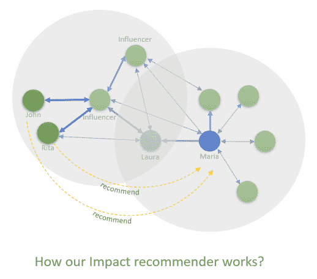
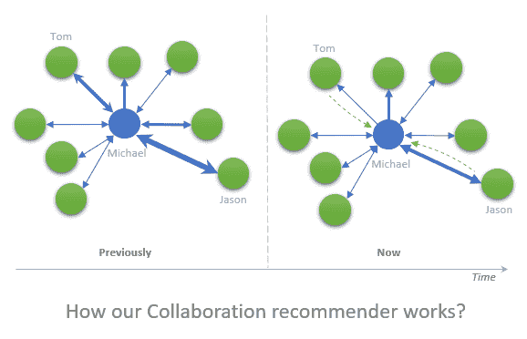

# 深入探讨基于电子邮件网络的推荐

> 原文：<https://towardsdatascience.com/deep-dive-on-e-mail-network-based-recommendations-6666c46a8f4f?source=collection_archive---------19----------------------->

source: [unsplash.com](https://unsplash.com/photos/UrcuFgKfSS4)

## *组织网络分析和沟通内容分析系列文章*

遵循[第 1 部分](https://medium.com/@agronfazliu/how-to-use-corporate-e-mail-analysis-to-reveal-hidden-stars-and-ensure-equal-opportunities-90bb77d61a7f):我们综合了各种措施，以建议的形式向员工推断进一步的见解，告诉他们如何改善沟通，以及向谁寻求建议和支持。此外，通过这些建议，员工能够接触到影响者和顾问，从而对组织产生影响。

这些建议是模块化的，由于其 API 服务实现，可以集成到任何系统中。在本文中，我们只关注两个例子:

1.为了增加你对公司的影响，请联系<user>。</user>

2.改善与<user>的沟通和协作。</user>

假设<user>已经同意被推荐。</user>

以下是这些建议的样子:

source: own

**1。增加你对组织的影响**

每个人都想在他们的组织中有更大的影响力，但有时很难知道怎么做。在一个大型复杂的组织中很难驾驭，甚至很难知道下一步该做什么来增加自己的影响力，也很难让别人听到你的声音。出于各种原因，员工需要被赋予能力、联系、支持和培训。我们专注于社交方面和沟通流程优化。

我们的影响力推荐器是如何工作的？

想象一下这样一种情况:员工 Maria 负责、透明、守时，并让她的经理 Laura 随时了解情况。Maria 始终如一，并在与其他相关同事的沟通中应用相同的原则。像 Maria 这样的员工是影响组织的第一要素。想象一下，Maria 与组织中合适的人的联系仍然不够紧密。下一步是确认 Maria 的人脉还不够广(否则推荐就没什么意义了，她认识合适的人)。一旦我们筛选出关键影响者，并且我们知道 Maria 不在其中，我们将继续找出 Maria 是否已经与公司中的任何高层影响者有联系——Maria 应该与至少几个影响者有松散的联系。

下一步，我们要确保这些影响者(潜在的直线经理)不在 Maria 的实际近距离沟通范围内(如果在内，可能是她的直线经理或特定的组织沟通环境已经使她能够接触到)。我们确定了影响者的交流群，Maria 与这些影响者有合理的交流，但交流不多。从这些聚类中，我们识别出属于同一聚类的其他员工 John 和 Rita(不是识别出的影响者),并且具有与实际影响者的高边介数中心性(这意味着影响者与 John 和 Rita 有良好的沟通，因此可以提供关于 Maria 的支持的参考)。

一旦我们确定了约翰和丽塔，我们继续向玛丽亚推荐他们——通常，我们推荐三个人。现在，由 Maria 和 John 或 Rita 进行交流并安排他们的合作。下面，您将看到该用例的简单图表形式:

source: own

**2。改善您与同事的协作**

对于依赖沟通的员工来说，能够有效地进行沟通是非常重要的。这对大多数办公室职员来说是真实的，而对蓝领工人、外勤人员等来说就不那么真实了。我们将沟通作为一种工具，用于识别需要改进沟通和协作的对手。

我们的协作推荐器是如何工作的？

想象一下，迈克尔是一名高度参与的员工，沟通是他的主要工具之一。我们关注电子邮件，但这也可以是任何有来源和目的地的书面交流，无论是即时聊天、评论还是反馈。随着迈克尔交流或交换电子邮件，将会出现交流模式、衰减和高峰——这取决于工作如何发展、关系如何变化以及公司结构如何改变整体交流。我们分析了迈克尔的交际群(他经常与之交流的人)，同时也包括时间方面。我们得出的结论是，迈克尔的沟通率相对较高，这意味着他是很多话题的关键联系人。

接下来，在我们确定了与迈克尔关系密切的人之后，我们应用时间序列分析来理解交流模式是如何演变的。我们专注于容易衰退的交流模式——无论出于什么原因。一旦我们确定了几个与 Michael 沟通最多的员工，我们就应用边缘中间性来了解它是如何随时间变化的。我们终于找到了汤姆和杰森，迈克尔与他们的交流发生了变化。这种沟通的变化可能是由于任何人的角色、位置或组织的变化，然而这些都没有改变——然而，沟通模式确实发生了变化。

最后，通过我们的推荐器实现，我们建议 Michael 与 Tom 和 Jason 会面，讨论可能的改进选项。很明显，还有其他原因超出了我们的概念范围，但这需要由上述员工来判断情况并根据建议采取行动。这个概念的主要价值是我们的推荐者引入的机会，以改善员工之间重要的缺乏沟通。

下图以简化的形式展示了这一概念:

source: own

产品定义的概念超出了本文的范围。作为一个提示，产品经理会将这些产品定义为用户友好且在隐私范围内。虽然一些措施已经到位，但我们不会透露用于确定推荐同事的影响者的姓名。此外，我们假设被推荐的员工或教练已经同意被推荐，并愿意支持其他员工。

我们的推荐人可以作为开始谈话和改善合作的“借口”。通常情况下，员工只有在没有其他选择的情况下才能交流和合作，这往往只是由于历史、背景，甚至可能是由于个人的不兼容。我们的推荐者支持组织打破僵局，将人们聚集在一起，最终提高沟通效率和生产力。

我们结合和加权各种算法，类似于集成方法。我们使用的一些度量标准是[中枢](https://en.wikipedia.org/wiki/HITS_algorithm)、[特征向量中心性](https://en.wikipedia.org/wiki/Eigenvector_centrality)、[卢万模块性](https://en.wikipedia.org/wiki/Louvain_Modularity)、[边缘中间性中心性](https://reference.wolfram.com/language/ref/EdgeBetweennessCentrality.html)。我们还利用位置和角色等上下文数据。在未来，我们计划添加业务逻辑和贡献或已经与直线经理达成一致的目标。

# 本文是 ONA @豪夫系列文章的一部分

________________________________________________________________

1.  如何使用企业电子邮件分析来揭示隐藏的明星并确保机会均等( [Part 1](https://medium.com/@agronfazliu/how-to-use-corporate-e-mail-analysis-to-reveal-hidden-stars-and-ensure-equal-opportunities-90bb77d61a7f) )
2.  基于电子邮件网络的见解的技术概述([第 2 部分](https://medium.com/@agronfazliu/technical-overview-of-e-mail-network-based-insights-376a2ef73c1c)
3.  **深潜电子邮件网游推荐(** [**第三部**](https://medium.com/@agronfazliu/deep-dive-on-e-mail-network-based-recommendations-6666c46a8f4f) **)**
4.  如何利用趋势发现隐藏的明星，并致力于一个完美的项目？人物分析会让你成为明星
5.  如何实现基于电子邮件内容的分析([第 5 部分](https://www.linkedin.com/pulse/how-implement-email-content-based-analysis-alex-filip))

________________________________________________________________