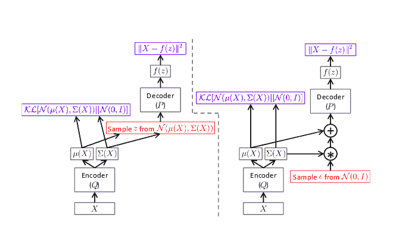
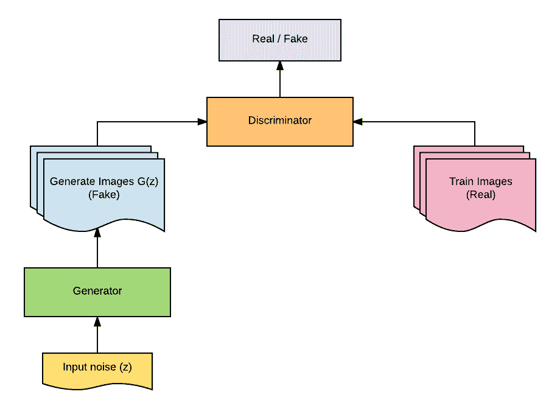
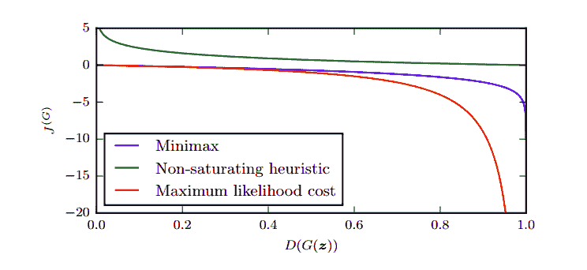
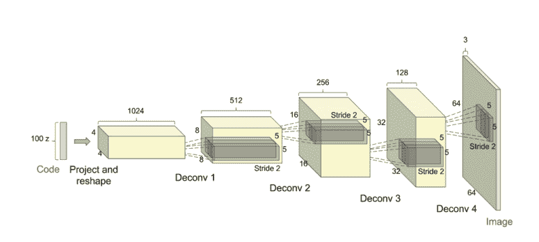
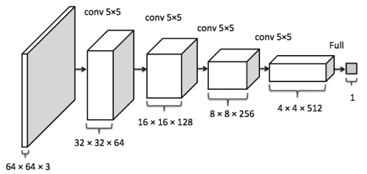
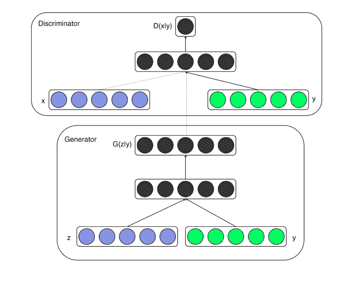

# 深度生成模型

> 原文：<https://towardsdatascience.com/deep-generative-models-25ab2821afd3?source=collection_archive---------2----------------------->

生成模型是一种使用无监督学习来学习任何类型的数据分布的强大方法，并且在短短几年内取得了巨大的成功。所有类型的生成模型都旨在学习训练集的真实数据分布，以便生成具有一些变化的新数据点。但是，无论是隐式还是显式地了解我们数据的准确分布并不总是可能的，因此我们试图建立一个尽可能与真实数据分布相似的分布模型。为此，我们可以利用神经网络的能力来学习一个函数，该函数可以将模型分布近似为真实分布。

两种最常用和最有效的方法是变分自动编码器(VAE)和生成对抗网络(GAN)。VAE 旨在最大化数据对数似然的下限，而甘旨在实现生成器和鉴别器之间的平衡。在这篇博文中，我将解释 VAE 和甘斯的工作以及他们背后的直觉。

**变型自动编码器**

我假设读者已经熟悉了普通自动编码器的工作原理。我们知道，我们可以使用自动编码器将输入图像编码为更小的维度表示，这可以存储关于输入数据分布的潜在信息。但是在普通的自动编码器中，编码向量只能通过解码器映射到相应的输入。它当然不能用于生成具有一些可变性的相似图像。

为了实现这一点，模型需要学习训练数据的概率分布。VAE 是以无监督方式使用神经网络来学习复杂数据分布(例如图像)的最流行的方法之一。它是一种基于贝叶斯推理的概率图形模型，即，该模型旨在学习训练数据的潜在概率分布，以便它可以容易地从学习到的分布中采样新数据。想法是学习训练数据的低维潜在表示，称为潜在变量(不是直接观察到的变量，而是通过数学模型推断的变量)，我们假设这些变量已经生成了我们的实际训练数据。这些潜在变量可以存储关于模型需要生成的输出类型的有用信息。潜在变量 z 的概率分布用 P(z)表示。选择高斯分布作为先验来学习分布 P(z ),以便在推断时间期间容易地采样新的数据点。

现在，主要目标是用一些参数对数据建模，这些参数使训练数据 X 的可能性最大化。简而言之，我们假设一个低维潜在向量已经生成了我们的数据 x (x ∈ X ),并且我们可以使用确定性函数 f(z；θ)由我们需要评估的θ参数化(见图 1[1])。在这种生成过程下，我们的目标是最大化 X 中每个数据的概率，

Pө(X) = ∫Pө(X，z)dz = ∫Pө(X|z)Pө(z)dz (1)

这里，f(z；θ)已被分布 Pө(X|z).取代

Fig. 1\. Latent vector mapped to data distribution using parameter ө [1]

这种最大似然估计背后的直觉是，如果模型可以从这些潜在变量中生成训练样本，那么它也可以生成具有一些变化的类似样本。换句话说，如果我们从 P(z)中抽取大量潜在变量，并从这些变量中生成 x，那么生成的 x 应该与数据分布 Pdata(x)相匹配。现在我们有两个问题需要回答。如何捕捉潜变量的分布，如何在 z 的所有维度上积分方程 1？

显然，手动指定我们想要在潜在向量中编码以生成输出图像的相关信息是一项繁琐的任务。相反，我们依靠神经网络来计算 z，只是假设这个潜在向量可以很好地近似为正态分布，以便在推断时容易采样。如果我们在 n 维空间中有一个 z 的正态分布，那么使用一个足够复杂的函数来生成任何类型的分布总是可能的，并且这个函数的逆函数可以用来学习潜在变量本身。

在等式 1 中，积分在 z 的所有维度上进行，因此很难处理。然而，它可以使用蒙特卡罗积分方法来计算，这是不容易实现的。因此，我们遵循另一种方法来近似最大化等式 1 中的 Pө(X。VAE 的想法是用我们不知道的 P(z|X)来推断 P(z)。我们使用一种称为变分推断的方法来推断 P(z|X ),这基本上是贝叶斯统计中的一个优化问题。我们首先使用容易找到的更简单的分布 Q(z|X)对 P(z|X)建模，并且我们尝试使用 KL-散度度量方法最小化 P(z|X)和 Q(z|X)之间的差异，以便我们的假设接近真实分布。接下来是很多数学方程，我不会在这里解释，但你可以在原始论文中找到。但是我必须说，一旦你有了 VAE 背后的直觉，这些方程并不难理解。

VAE 的最终目标函数是:-

上面的等式有一个非常好的解释。Q(z|X)项基本上是我们的编码器网络，z 是数据 x(x ∈ X)的编码表示，P(X|z)是我们的解码器网络。所以在上面的等式中，我们的目标是在 D_KL[Q(z|X) || P(z|X)]给定的误差下最大化我们的数据分布的对数似然。很容易看出，VAE 试图最小化 log(P(X))的下限，因为 P(z|X)不容易处理，但是 KL 散度项> =0。这与最大化 E[logP(X|z)]和最小化 D_KL[Q(z|X) || P(z|X)]相同。我们知道，最大化 E[logP(X|z)]是最大似然估计，并使用解码器网络建模。正如我前面说过的，我们希望我们的潜在表示接近高斯，因此我们假设 P(z)为 N(0，1)。按照这个假设，Q(z|X)也应该接近这个分布。如果我们假设它是具有参数μ(X)和ʃ(x 的高斯分布，则由 KL-divergence 给出的这两个分布(即 P(z)和 Q(z|X ))之间的差异引起的误差导致下面给出的封闭形式的解。

考虑到我们正在优化较低的变分界限，我们的优化函数是:

log(P(X | z))—D _ KL[Q(z | X)‖P(z)]，其中第二个的解如上图所示。

因此，我们的损失函数将包含两项。第一个是输入到输出的重建损失，第二个损失是 KL-散度项。现在我们可以使用反向传播算法来训练网络。但是有一个问题，那就是第一项不仅仅依赖于 P 的参数，也依赖于 Q 的参数，但是这种依赖性没有出现在上面的等式中。因此，如何通过我们从分布 Q(z|X)或 N[μ(X)，ʃ(x]随机采样 z 的层反向传播，以便 p 可以解码。渐变不能流过随机节点。我们使用重新参数化技巧(见图 1)使网络可区分。我们从 N(μ(X)，σ(X))开始采样，首先采样ε∾N(0，I)，然后计算 z =μ(X)+σ1/2(X)∑ε。

这已经非常漂亮地显示在图 2[1]中了？。应当注意，前馈步骤对于这两个网络(左和右)是相同的，但是梯度只能通过右网络反向传播。

Fig.2\. Reparameterization trick used to backpropagate through random nodes [1]

在推理时，我们可以简单地从 N(0，1)中采样 z，并将其馈送到解码器网络以生成新的数据点。因为我们正在优化较低的变分界限，所以与像生成对抗网络这样的最新技术相比，生成的图像的质量有些差。

VAE 最好的一点是，它学习生成模型和推理模型。虽然 VAE 和甘斯都是使用无监督学习来学习底层数据分布的非常令人兴奋的方法，但是甘斯比 VAE 产生更好的结果。在中，我们优化了变分下限，而在 GAN 中，没有这样的假设。事实上，GANs 不处理任何显式的概率密度估计。VAE 在生成清晰图像方面的失败意味着该模型不能学习真实的后验分布。和甘的主要区别在于训练的方式。现在让我们深入到生成性对抗网络。

**生成性对抗网络**

Yann LeCun 说对抗训练是自切片面包以来最酷的事情。看到生成性敌对网络的流行及其产生的结果的质量，我想我们大多数人都会同意他的观点。对抗性训练完全改变了我们教神经网络完成特定任务的方式。生成敌对网络不像变分自动编码器那样与任何显式密度估计一起工作。相反，它是基于博弈论的方法，目标是找到两个网络之间的纳什均衡，发电机和鉴别器。其思想是从高斯这样的简单分布中采样，然后学习使用通用函数逼近器(如神经网络)将这种噪声转换为数据分布。

这是通过这两个网络的对抗训练来实现的。生成器模型 G 学习捕获数据分布，鉴别器模型 D 估计样本来自数据分布而不是模型分布的概率。基本上，生成器的任务是生成看起来自然的图像，而鉴别器的任务是判断图像是假的还是真的。这可以被认为是一个迷你-最大双人游戏，其中两个网络的性能都随着时间的推移而提高。在这个游戏中，生成器通过尽可能生成真实图像来欺骗鉴别器，而鉴别器通过提高其鉴别能力来试图不被生成器欺骗。下图显示了 GAN 的基本架构。

Fig.3\. Building block of Generative Adversarial Network

我们定义输入噪声变量 P(z)的先验，然后发生器使用参数为өg.的复可微函数将其映射到数据分布。除此之外，我们还有另一个称为鉴别器的网络，它接收输入 x，并使用另一个参数为өd 的可微函数输出单个标量值，表示 x 来自真实数据分布 Pdata(x)的概率。GAN 的目标函数定义为

在上述等式中，如果鉴别器的输入来自真实数据分布，则 D(x)应输出 1 以最大化上述目标函数 w . r . t . D，而如果图像是从生成器生成的，则 D(G(z))应输出 1 以最小化目标函数 w . r . t . G。后者基本上意味着 G 应生成可以欺骗 D 的这种真实图像。但是在优化发电机目标方面存在一个问题。在游戏开始时，当生成器没有学习到任何东西时，梯度通常很小，当它做得很好时，梯度很高(见图 4)。但是我们想要相反的行为。因此，我们最大化 E[log(D(G(z))]而不是最小化 E[log(1-D(G(z))]

Fig.4\. Cost for the Generator as a function of Discriminator response on the generated image

训练过程包括在鉴别器和发生器上同时应用随机梯度下降。训练时，我们在小批量优化 D 的 k 个步骤和优化 G 的一个步骤之间交替。当鉴别器不能区分ρg 和ρ数据即D(x，өd) =或ρg =ρ数据时，训练过程停止。

采用卷积神经网络的 GAN 的最早模型之一是代表深度卷积生成对抗网络的 **DCGAN** 。该网络将从均匀分布中抽取的 100 个随机数作为输入，并输出所需形状的图像。网络由许多卷积层、反卷积层和全连接层组成。该网络使用许多反卷积层将输入噪声映射到所需的输出图像。批量归一化用于稳定网络的训练。ReLU 激活用于发生器中除输出层之外的所有层，输出层使用 tanh 层，泄漏 ReLU 用于鉴别器中的所有层。使用小批量随机梯度下降来训练该网络，并且使用 Adam 优化器来通过调整的超参数来加速训练。论文的结果相当有趣。作者表明，生成器具有有趣的矢量算术属性，利用这些属性，我们可以按我们想要的方式操纵图像。

Fig.5\. Generator of DCGAN

Fig.6\. Discriminator of DCGAN

最广泛使用的 GAN 变体之一是条件 GAN，它是通过简单地将条件向量与噪声向量相加而构建的(见图 7)。在 cGAN 之前，我们从噪声 z 的随机样本中随机生成图像。如果我们想要生成具有一些所需特征的图像，该怎么办？有什么方法可以向模型提供额外的信息，告诉我们想要生成什么类型的图像？答案是肯定的，有条件的 GAN 是实现这一目标的方法。通过根据提供给生成器和鉴别器的附加信息来调节模型，可以指导数据生成过程。条件甘用于各种任务，例如文本到图像生成、图像到图像翻译、自动图像标记等。下图显示了两个网络的统一结构。

Fig. 7\. A basic example of cGAN with y as the conditioning vector

GANs 的一个很酷的地方是，即使只有很少的训练数据，它们也可以被训练。实际上，GANs 的结果是有希望的，但是训练过程并不简单，尤其是建立网络的超参数。此外，gan 难以优化，因为它们不容易收敛。当然，这里有一些破解 GANs 的技巧和窍门，但它们可能并不总是有用。你可以在这里找到一些建议。此外，除了检查生成的图像在感知上是否真实之外，我们没有任何对结果进行定量评估的标准。

**结论**

深度学习模型在监督学习中确实达到了人类水平的性能，但在无监督学习中却并非如此。尽管如此，深度学习科学家正在努力提高无监督模型的性能。在这篇博文中，我们看到了两个最著名的生成模型的无监督学习框架实际上是如何工作的。我们知道了可变自动编码器中的问题，以及为什么敌对网络更擅长产生真实的图像。但是 GANs 也有一些问题，比如稳定他们的训练，这仍然是一个活跃的研究领域。然而，GANs 非常强大，目前它们正被用于各种任务，如高质量图像(参见此 [**视频**](https://youtu.be/XOxxPcy5Gr4) )和视频生成、文本到图像的翻译、图像增强、从图像重建物体的 3D 模型、音乐生成、癌症药物发现等。除此之外，许多深度学习研究人员也在努力统一这两种模型，并获得这两种模型的最佳效果。看到深度学习的推进速度越来越快，相信 GANs 会打开半监督学习、强化学习等人工智能的很多紧闭的大门。在接下来的几年里，生成模型将会对图形设计、有吸引力的用户界面设计等非常有帮助。使用生成对抗网络来生成自然语言文本也是可能的。

**参考文献:-**

[【1】。https://arxiv.org/pdf/1606.05908.pdf](https://arxiv.org/pdf/1606.05908.pdf)

[2].[https://arxiv.org/pdf/1406.2661.pdf](https://arxiv.org/pdf/1406.2661.pdf)

[3].[https://wise odd . github . io/tech blog/2016/12/10/variation-auto encoder/](https://wiseodd.github.io/techblog/2016/12/10/variational-autoencoder/)